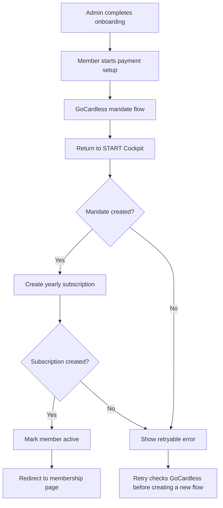

# GoCardless Membership Reconciliation Cleanup

## Problem Frame

The first GoCardless membership implementation proved the core flow, but the
state model and reconciliation path are heavier than the product needs. START
Cockpit currently stores more webhook and session data than is necessary, and
the member-facing flow depends on webhook timing enough that the UI needs
polling and intermediate processing states.

The cleanup should make the payment activation model simpler and more
deterministic: once a member returns from GoCardless, START Cockpit should
verify that a mandate was created, create the yearly subscription immediately,
update local membership state, and only then send the user back to the
membership page. Webhooks can remain as a backup/reconciliation mechanism, but
the happy path should not require the user to wait for them.

---

## Key Flow

---

## Actors

- A1. Member: Completes the GoCardless mandate setup and expects the START
  Cockpit page to reflect the result immediately.
- A2. Admin or department lead: Completes onboarding and thereby unlocks payment
  setup for the member.
- A3. START Cockpit: Starts the GoCardless mandate flow, verifies the return,
  creates the subscription, and stores only the local state needed for future
  decisions.
- A4. GoCardless: Owns customer, mandate, and subscription state and remains the
  source of truth for payment-provider details.

---

## Requirements

**State and persistence**
- R1. START Cockpit should store only the GoCardless identifiers and local state
  required to decide whether a member can start payment, whether a mandate exists,
  and whether membership has been activated.
- R2. START Cockpit should not persist full webhook payloads or broad webhook
  audit rows unless a concrete operational need is identified.
- R3. Local state should be recoverable from GoCardless identifiers whenever
  possible rather than duplicating GoCardless metadata in the database.
- R4. Admin approval remains the gate that makes payment setup available to a
  member; profile completion alone must not enable GoCardless setup.

**Return-driven reconciliation**
- R5. After GoCardless redirects the member back to START Cockpit, the return
  page should verify the associated Billing Request or Flow with GoCardless.
- R6. If GoCardless shows that a mandate was successfully created, START Cockpit
  should create the yearly 40 EUR membership subscription immediately.
- R7. If subscription creation succeeds, START Cockpit should update the local
  membership state and then redirect the member to `/membership`, where the
  correct full-member state is shown.
- R8. If mandate verification or subscription creation fails, START Cockpit
  should show a clear error on the return page and leave the original local state
  unchanged.

**Retry and recovery**
- R9. When a member clicks setup payment again after a failed or interrupted
  attempt, START Cockpit should first check GoCardless for existing customer,
  Billing Request, mandate, and subscription state before creating a new hosted
  flow.
- R10. If a GoCardless customer and active mandate already exist, START Cockpit
  should retry subscription creation without sending the member through
  GoCardless again.
- R11. If the existing mandate is not active or no usable mandate exists, START
  Cockpit should start a new GoCardless mandate flow and link it to the existing
  GoCardless customer where possible.
- R12. Repeated clicks, retries, redirects, and duplicate provider signals must
  not create duplicate GoCardless subscriptions.

**Provider integration**
- R13. START Cockpit should evaluate replacing the custom `fetch` wrapper with
  the official GoCardless Node SDK if it reduces custom request/response and
  error-handling code without hiding important behavior.
- R14. START Cockpit should evaluate the GoCardless React Drop-in as a UX
  alternative, but only adopt it if it materially simplifies the completion and
  retry flow; Drop-in success alone must not be treated as payment activation
  without server-side GoCardless verification.
- R15. Webhooks, if kept, should be secondary reconciliation or repair signals,
  not the primary path required for the member-facing success experience.

---

## Acceptance Examples

- AE1. **Covers R5, R6, R7.** Given a member completes GoCardless mandate setup,
  when they return to START Cockpit, START Cockpit verifies the mandate, creates
  the subscription, marks the member active, and redirects them to `/membership`
  without showing the payment setup prompt again.
- AE2. **Covers R8.** Given a member returns from GoCardless but START Cockpit
  cannot verify a created mandate or cannot create the subscription, when the
  return page loads, the user sees an error on that page and the local membership
  state remains eligible to retry.
- AE3. **Covers R9, R10.** Given GoCardless created a customer and active mandate
  but local subscription creation failed, when the member clicks setup payment
  again, START Cockpit detects the existing mandate and retries subscription
  creation instead of redirecting to GoCardless again.
- AE4. **Covers R11, R12.** Given a member retries after an incomplete or inactive
  mandate, START Cockpit reuses the existing GoCardless customer where possible,
  starts a new mandate flow, and does not create a duplicate subscription.

---

## Success Criteria

- Members do not see a stale payment prompt immediately after successfully
  completing GoCardless mandate setup.
- The database schema for GoCardless membership state is small enough that each
  persisted field has a clear product or recovery purpose.
- Webhook timing no longer determines the happy-path member experience.
- Retry behavior is safe after partial success: existing GoCardless customer or
  mandate state is reused, and duplicate subscriptions are avoided.
- A planner can proceed without inventing the authority model for redirect,
  verification, retry, webhook backup, or database minimization.

---

## Scope Boundaries

- Do not redesign the wider membership page or admin onboarding flow beyond what
  is needed for the cleaner payment completion model.
- Do not build renewal, cancellation, refund, pause, failed payment, or alumni
  workflows as part of this cleanup.
- Do not persist broad webhook audit data unless planning identifies a concrete
  operational or compliance requirement.
- Do not treat frontend redirect or Drop-in success as authoritative without a
  server-side GoCardless verification.
- Do not require the user to wait for webhook delivery on the happy path.

---

## Key Decisions

- Redirect return is the primary reconciliation point: This removes the current
  race where the member reaches `/membership` before the webhook updates local
  state.
- Mandate creation is the user-facing completion condition: Once the mandate is
  verified, START Cockpit can create the subscription server-side without asking
  the member to repeat GoCardless checkout.
- Subscription creation happens immediately after mandate verification: This
  keeps the member experience deterministic while still leaving room for webhook
  backup.
- Webhooks are secondary: They may remain useful for repair or reconciliation,
  but the main product flow should not depend on them.
- Database state should be minimal: Store only what START Cockpit needs to gate,
  retry, reconcile, and activate membership.

---

## Dependencies / Assumptions

- GoCardless exposes enough Billing Request or Billing Request Flow state on
  return for START Cockpit to verify that the mandate was created.
- The existing GoCardless identifiers stored during the start-payment flow are
  sufficient to look up the customer, Billing Request, mandate, and subscription
  state during retries.
- The GoCardless API supports creating the yearly EUR subscription from an active
  mandate without additional user interaction.
- The official GoCardless Node SDK and React Drop-in are available options, but
  the cleanup should choose them only if they reduce complexity in this app.

---

## Outstanding Questions

### Deferred to Planning

- [Affects R1, R2, R3][Technical] Decide the minimal exact set of fields needed
  for local membership payment state after removing webhook audit persistence.
- [Affects R5, R6][Needs research] Verify the exact GoCardless API response and
  status fields that prove mandate creation on return.
- [Affects R9, R10, R11][Technical] Define the exact retry lookup order across
  local IDs, Billing Request ID, customer ID, mandate ID, and subscription ID.
- [Affects R13][Needs research] Validate whether the official GoCardless Node SDK
  supports the required Billing Request, Flow, mandate lookup, subscription
  creation, idempotency, and error reporting paths cleanly.
- [Affects R14][Needs research] Prototype or inspect the React Drop-in enough to
  decide whether it reduces UX and state complexity compared with redirect.

---

## Next Steps

-> /ce-plan for structured implementation planning
