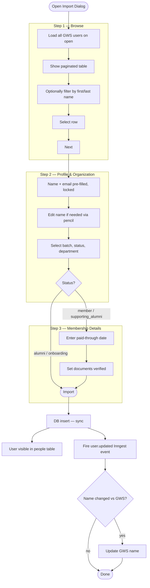

# Import from Google Workspace — Wizard Redesign

## Summary

Replace the current flat import dialog with a 3-step wizard inside the existing modal. Step 1 loads all GWS users on open and lets the admin browse and filter by first/last name — no explicit search button required. Step 2 captures profile and org details with the GWS-sourced name locked behind a pencil-unlock. Step 3 captures membership timing and document status, shown only for member and supporting_alumni. The dialog header is revamped to use the onboarding-style breadcrumb stepper with generous whitespace. Onboarding is added as a new importable status. Name edits during import are synced back to Google Workspace via a reusable Inngest workflow.

---

## Problem Frame

Admins who import an existing Google Workspace user into START Cockpit currently face a single long form where the GWS user selection (a free-text search) is mixed in with all the profile and membership fields. The selection result is indicated only by an alert message and a read-only name field — there is no clear visual separation between "which GWS account am I linking?" and "what membership details am I entering?" This makes it easy to overlook whether the right user was selected, and the single-query GWS search misses partial-token matches (e.g., searching "Peter Part" does not find a user named "Peter Partnerships").

There is also no path to import someone currently in onboarding — only fully active statuses can be imported — which means admins must use the full create-user flow even for people who already have a Workspace account and just need to be entered into START Cockpit in a provisional state.

Finally, if an admin needs to correct a first or last name at import time (e.g., the name in Google Workspace is wrong), there is currently no path to update Workspace to match. The corrected name would drift from GWS silently.

---

## Key Flows

- F1. Admin browses and selects a GWS user
  - **Trigger:** Admin opens the Import from Google Workspace dialog.
  - **Actors:** Admin
  - **Steps:** Dialog opens and immediately loads all GWS users (skeleton shown during fetch). Admin sees a paginated table of all Workspace accounts. Admin optionally types in the First name or Last name filter inputs; the table filters automatically with debounce. Already-linked or suspended users appear as non-selectable rows with a status badge. Admin clicks a row (or the radio button) to select the correct user and clicks Next.
  - **Outcome:** The selected GWS user is locked in for Step 2.
  - **Covered by:** R1, R2, R3, R4, R5

- F2. Admin completes profile and org details (Step 2)
  - **Trigger:** Admin advances from Step 1.
  - **Actors:** Admin
  - **Steps:** Admin sees first name, last name, and email pre-filled from GWS — all locked with the InputGroup + LockIcon pattern. Admin may click the pencil icon on first or last name to unlock and correct them. Admin selects batch, status, and (if member) department.
  - **Outcome:** For alumni or onboarding status, the wizard submits. For member or supporting_alumni, the wizard advances to Step 3.
  - **Covered by:** R6, R7, R8, R9, R10, R11, R12

- F3. Admin enters membership details (Step 3 — member / supporting_alumni only)
  - **Trigger:** Admin advances from Step 2 with status = member or supporting_alumni.
  - **Actors:** Admin
  - **Steps:** Admin optionally enters a paid-through date and sets the documents verified checkbox.
  - **Outcome:** Admin clicks Import; the user is created in the DB synchronously and appears in the people table immediately.
  - **Covered by:** R13, R14, R15

- F4. GWS name is synced after import
  - **Trigger:** Import action completes successfully.
  - **Actors:** Inngest workflow, GWS Admin API
  - **Steps:** The import action fires a `user.updated` Inngest event. The workflow fetches the DB record and the GWS record, compares first and last name. If they differ, it updates GWS.
  - **Outcome:** GWS first and last name match the imported values.
  - **Covered by:** R19, R20, R21

---

## Wizard Flow

---

## Requirements

**Step 1 — Browse GWS Users**

- R1. On dialog open, a `listAllWorkspaceUsersAction` server action fetches all GWS users by collecting every page via `pageToken` before returning. The result is cross-referenced with the local DB to mark already-linked users.
- R2. While the user list is loading, the table area shows a skeleton placeholder. If the fetch fails, an error alert is shown with a retry option.
- R3. Two vertically-stacked filter inputs (First name, Last name) sit above the table. Typing in either input triggers client-side filtering via TanStack Table's `getFilteredRowModel` after a 300 ms debounce. There is no Search button and no email filter field.
- R4. The table uses TanStack Table with client-side pagination (10 rows per page) and prev/next controls. Columns: Name, Email, Status badge (Importable / Linked / Suspended). Already-linked and suspended rows appear at 60% opacity and are not selectable. Clicking any selectable row (or its radio button) selects that user.
- R5. The "Next" button is enabled only after a selectable (importable) user row is selected.

**Dialog header (all steps)**

- R6. The dialog header is revamped to match the onboarding flow's visual rhythm: the step indicator uses the existing `Breadcrumb` / `BreadcrumbList` / `BreadcrumbItem` components (matching `src/app/(authenticated)/(onboarding)/onboarding/[step]/onboarding-breadcrumbs.tsx`) and sits above the title area with clear separation.
- R7. `DialogTitle` reads "Import from Google Workspace". `DialogDescription` is shortened to one line (e.g. "Link a Workspace account to START Cockpit without creating a new account."). Title and description are spaced with `gap-4` so neither element feels cramped.

**Step 2 — Profile & Organization**

- R8. First name, last name, and email are pre-filled from the selected GWS user and displayed using the InputGroup + LockIcon pattern (matching the onboarding flow in `src/app/(authenticated)/(onboarding)/onboarding/[step]/(steps)/step-master-data.tsx`).
- R9. First name and last name each have a pencil icon that unlocks the field for editing. Email remains locked with no unlock path.
- R10. Batch, status, and department (member status only) are collected in Step 2, as in the current form.
- R11. Back navigation is supported between steps (Step 2 → Step 1, Step 3 → Step 2).

**Step 2 — Status-driven branching**

- R12. When status is set to alumni or onboarding, Step 2 shows an "Import" button (no Step 3). When status is member or supporting_alumni, Step 2 shows a "Next" button that advances to Step 3.

**Step 3 — Membership Details**

- R13. Step 3 presents the paid-through date input and the documents verified checkbox. These fields are unchanged from the current form except for the copy revision in R16.
- R14. Step 3 has an "Import" button that submits the form.

**DB insert and table appearance**

- R15. The DB insert is performed synchronously in the server action (as today). The imported user appears in the people table immediately after the action completes.

**Copy — documents verified**

- R16. The documents verified checkbox helper text is revised to align with admin tone-of-voice. Replace the current text with: "Check this if you've received and verified the person's membership documents. Leave unchecked if documents are missing or you're unsure — the board will be asked to vote on formal admission."

**Onboarding status**

- R17. "Onboarding" is added to the list of importable statuses alongside member, supporting_alumni, and alumni.
- R18. An onboarding import creates a user record in `onboarding` state with no legal membership records and no payment setup. The user is expected to complete the standard member onboarding flow after import.

**GWS name synchronisation**

- R19. After every successful import, the server action fires a `user.updated` Inngest event (reusing or extending the existing `cockpit/user.updated` event) carrying at minimum the user's internal ID.
- R20. A new Inngest workflow listens to `user.updated` events. It fetches the DB record and the corresponding GWS record, compares first and last name, and updates GWS if they differ.
- R21. The GWS name-sync workflow is not import-specific. It fires for any `user.updated` event, enabling future name-editing surfaces (e.g., a people profile edit form) to trigger the same sync without additional wiring.

---

## Acceptance Examples

- AE1. **Covers R12.** Given an admin reaches Step 2 and selects "Alumni" as status, when they read the step footer, they see an "Import" button and no "Next" button. Clicking Import submits the form and skips Step 3.

- AE2. **Covers R12.** Given an admin reaches Step 2 and selects "Member" as status, when they read the step footer, they see a "Next" button. Clicking Next advances to Step 3.

- AE3. **Covers R17, R18.** Given an admin selects a GWS user and sets status to "Onboarding" in Step 2, when they click Import, a user record is created with `status = onboarding`, no legal membership row, and no payment row. The onboarding flow is available to that user.

- AE4. **Covers R19, R20.** Given an admin corrects a first name from "Pater" to "Peter" via the pencil icon in Step 2 and imports the user, when the Inngest workflow runs, it detects the GWS givenName still reads "Pater", updates GWS to "Peter", and the GWS record matches the DB record afterward.

- AE5. **Covers R20, R21.** Given a future name-edit screen fires a `user.updated` event for a user whose last name was changed from "Müller" to "Mueller", when the Inngest workflow runs, it detects the mismatch and updates GWS — with no code change needed in the workflow.

- AE6. **Covers R3, R4.** Given an admin opens the import dialog and types "Peter" in the First name filter, the table narrows within 300 ms to show only users whose given name starts with or contains "Peter". No Search button click is required.

- AE7. **Covers R1, R2.** Given the admin opens the dialog on a slow connection, a skeleton row placeholder is visible in the table area until the GWS user list resolves. If the fetch fails, an error alert with a retry option is shown.

---

## Success Criteria

- An admin can open the dialog and immediately see all GWS users — no search step required.
- Filtering by first or last name narrows the list instantly without a button click.
- The wizard makes it visually unambiguous which GWS account has been selected before any membership fields are filled in.
- The dialog header reads cleanly at a glance: title, short description, and step indicator each have breathing room.
- Importing a user with an onboarding status is possible without falling back to the full create-user flow.
- When a name is corrected at import time, GWS reflects the correction without manual follow-up.
- The GWS name-sync mechanism is usable by future screens without duplicating logic.

---

## Scope Boundaries

- Editable fields beyond first name and last name after GWS selection (email, department, etc. remain locked or follow their normal field rules).
- Syncing any field other than first and last name to GWS (email, status, etc. are out of scope for the sync workflow).
- URL-based step persistence — wizard state lives only in the dialog session.
- Server-side GWS filtering / debounced API calls — filtering is client-side on the preloaded list.
- Email filter field — dropped in favour of first name / last name only.
- Adding a "Back" button that re-fetches GWS users (Back navigates between already-loaded steps; the user list is cached in dialog state).

---

## Key Decisions

- **Browse-all over search-first.** Loading all GWS users on open removes the "what do I search for?" friction for admins who don't know the exact spelling. Client-side filtering (TanStack Table `getFilteredRowModel`) is sufficient because the org's GWS headcount is small enough to fit in one payload. Server-side filtering would add round-trip latency and complexity for no benefit at this scale.
- **Onboarding-style breadcrumb header.** The existing `Breadcrumb` component (already used in onboarding) gives the step indicator a familiar visual language and enforces the spacing discipline the wizard header currently lacks. No new component is needed.
- **First name + last name filter only; email dropped.** GWS user lists are typically browsed by name. Email filter is redundant when the full list is visible and name filtering narrows it adequately.
- **GWS name sync via a generic `user.updated` event, not an import-specific hook.** This avoids duplicating sync logic when name editing is added to other surfaces later. The Inngest workflow is the single owner of GWS name sync regardless of what triggered the name change.
- **DB insert stays synchronous.** Keeping the user record creation in the server action (not in an Inngest step) ensures the user is visible in the people table immediately and keeps the import failure surface simple.
- **Status-driven step count.** Alumni and onboarding imports are simpler cases that genuinely do not need paid-through date or document fields; ending the wizard at Step 2 for those statuses reduces form length without hiding fields behind conditional visibility.

---

## Dependencies / Assumptions

- The existing `cockpit/user.updated` Inngest event (currently carries only `{ id: string }`) is sufficient for the sync workflow to fetch both DB and GWS records by user ID. No additional payload is required.
- The Admin SDK service account already has permission to update GWS user records (`admin.directory.user` scope covers both reads and name updates).
- The `onboarding` status path in the import server action needs to be carved out cleanly from the existing branch logic so no payment or legal membership records are created.
