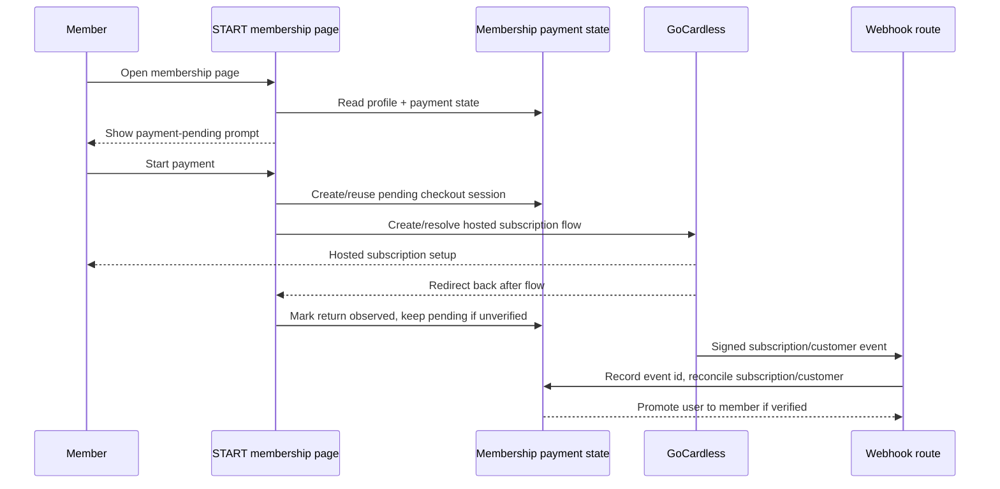
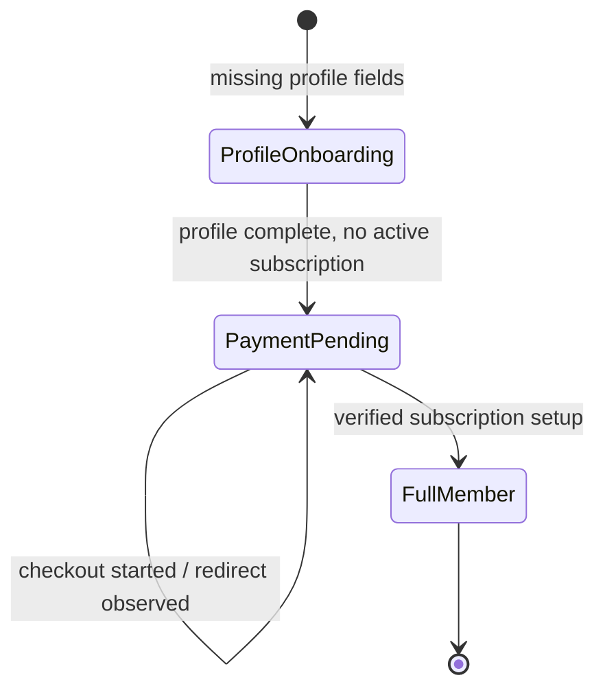

# feat: Add GoCardless membership payment activation

## Overview

Add a payment activation layer between completed onboarding profile details and full membership. Members who have finished profile onboarding but have not completed GoCardless subscription setup should continue to see an onboarding-style payment prompt. Admins should see that profile onboarding is complete but membership payment is pending. GoCardless webhook and redirect handling should reconcile the subscription setup idempotently before promoting the user to full member.

The plan intentionally keeps payment state separate from the existing broad `user.status` lifecycle and isolates GoCardless API/link details behind a small adapter boundary. That boundary matters because the provided identifier, `PL01KF12SSWH7XMHG49RY0RF8KYZ`, appears to be a dashboard payment/subscription link identifier rather than a Billing Request Template (`BRT...`) identifier in the public GoCardless API docs.

---

## Problem Frame

START Cockpit currently treats profile onboarding completion and member access as separate concepts in practice: app layout redirects users to `/onboarding` until required profile fields are complete, while the membership page still checks `user.status === "onboarding"` to show the onboarding card. The new payment step needs to preserve that split deliberately: a person can be done with profile onboarding from the admin perspective while still needing a member-facing payment activation step.

The origin requirements define v1 as a 40 EUR yearly GoCardless subscription using subscription template/payment link `PL01KF12SSWH7XMHG49RY0RF8KYZ`, with no separate instant first-year payment (see origin: `docs/brainstorms/2026-04-26-gocardless-membership-payment-requirements.md`).

---

## Requirements Trace

- R1. Distinguish profile onboarding completion from paid membership activation.
- R2. Show an onboarding-style payment screen to users who completed profile onboarding but have not completed payment.
- R3. Model payment/membership state separately from `user.status`.
- R4. Update membership onboarding copy for payment-pending users.
- R5. Use GoCardless subscription template/payment link `PL01KF12SSWH7XMHG49RY0RF8KYZ`.
- R6. Treat the membership subscription as 40 EUR yearly.
- R7. Prefill known user details where the chosen GoCardless flow supports it.
- R8. Correlate GoCardless customers/flows/subscriptions with local identifiers such as `start_cockpit_user_id` and `start_cockpit_user_email` where metadata/custom fields support it.
- R9. Avoid duplicate GoCardless customers/subscriptions and duplicate local activation on repeat attempts.
- R10. Promote a user to full member only after confirmed successful GoCardless subscription setup.
- R11. Process webhooks/callbacks idempotently.
- R12. Make payment-pending users visibly distinct in admin views.
- R13. Do not offer "Complete onboarding" once profile onboarding is complete, even when payment remains pending.

**Origin actors:** A1 Member, A2 Admin, A3 GoCardless, A4 START Cockpit
**Origin flows:** F1 Payment-pending member sees final onboarding step, F2 Member starts GoCardless subscription setup, F3 GoCardless confirms subscription setup, F4 Admin views completed onboarding
**Origin acceptance examples:** AE1 payment-pending membership page, AE2 success activation, AE3 duplicate webhook idempotency, AE4 admin payment-pending state

---

## Scope Boundaries

- Do not collect a separate instant first-year payment in v1.
- Do not add a new broad `user.status` solely for payment-pending membership.
- Do not build custom GoCardless payment pages in v1.
- Do not solve alumni, cancellation, failed renewal, refund, subscription pause, or failed renewal workflows.
- Do not redesign the membership page beyond the payment-pending prompt and GoCardless entry point.

---

## Context & Research

### Relevant Code and Patterns

- `src/db/schema/auth.ts` owns the current `user` table and `userStatus` enum. It should not absorb payment-pending status; add separate payment/membership tables instead.
- `src/schema/onboarding-progress.ts` derives profile onboarding completion from required user fields and should remain the source for profile onboarding completion.
- `src/app/(authenticated)/(app)/layout.tsx` gates app access by profile onboarding completion, not by `user.status`.
- `src/app/(authenticated)/(app)/membership/page.tsx` currently shows `MembershipOnboarding` only for `user.status === "onboarding"`; this should move to a membership/payment-state decision.
- `src/app/(authenticated)/(app)/membership/onboarding.tsx` is the existing UI surface for the payment-pending prompt and should be extended rather than replaced.
- `src/components/people-table.tsx` currently shows "Complete onboarding" purely when `user.status === "onboarding"`; the admin action visibility should be based on profile completion plus payment state.
- `src/app/api/slack/events/route.ts` and `src/lib/verify-request.ts` provide the local pattern for raw-body webhook verification, schema validation, and early unauthorized responses.
- `src/env.ts` already has optional `GOCARDLESS_API_KEY` and `GOCARDLESS_BASE_URL`, but `.env.example` does not expose GoCardless configuration.
- No test files or test runner are currently present, so this plan includes a focused Vitest setup for domain, webhook, and server helper coverage.

### Institutional Learnings

- No `docs/solutions/` directory exists in this repo, so there were no local institutional learnings to apply.

### External References

- GoCardless API usage requires bearer authentication and a `GoCardless-Version` header; the current public API version is `2015-07-06`.
- GoCardless Billing Request Templates are reusable multi-user payment links and have IDs beginning with `BRT`; each opened template URL creates a new Billing Request.
- GoCardless customer, mandate, payment, and subscription request metadata support a small key-value store, commonly limited to three keys with 50-character key names and 500-character values.
- GoCardless customer prefill can happen through Billing Request Flow values, existing customer records, or Collect Customer Details; Collect Customer Details is restricted to Pro/Enterprise accounts with custom payment pages.
- GoCardless webhook requests include a `Webhook-Signature` header; docs recommend checking signatures against the raw posted JSON and recording processed event IDs to avoid double-processing.
- Subscription-related webhook event actions include `created`, `customer_approval_granted`, `customer_approval_denied`, `payment_created`, `cancelled`, `finished`, `paused`, and `resumed`. The plan treats `subscriptions.customer_approval_granted` or a verified active/created subscription fetched from GoCardless as the authoritative activation path, rather than trusting redirect alone.

---

## Key Technical Decisions

- Add separate membership payment persistence instead of extending `user.status`: This satisfies the admin/member perspective split while avoiding lifecycle enum churn.
- Keep `user.status` as the final human lifecycle marker: Payment-pending users may remain `onboarding` for compatibility, admin payment-pending display comes from derived profile/payment state, and verified subscription activation sets `user.status` to `member`.
- Introduce a GoCardless adapter module before UI/API routes call GoCardless: This keeps the `PL...` versus API-backed template uncertainty contained and makes the implementation testable.
- Treat redirect as advisory and webhook/API verification as authoritative: Redirect improves UX, but only signed webhook events or verified GoCardless API reads should promote a user to full member.
- Store processed GoCardless event IDs with unique constraints: This makes duplicate webhook deliveries safe and gives operators an audit trail.
- Prefer idempotent local checkout sessions keyed by user: Repeat clicks should reuse or supersede a pending local session instead of creating uncontrolled GoCardless resources.
- Add focused Vitest coverage as part of this feature: The repo has no tests yet, but payments and webhook idempotency need regression coverage.

---

## Open Questions

### Resolved During Planning

- Should payment-pending be a new `user.status` value? No. The origin requirement chose separate payment/membership state.
- Should v1 take an instant first payment plus a subscription? No. The origin requirement chose subscription template only.
- Can redirect alone activate membership? No. Redirect can update UI/pending state, but activation needs webhook or verified API reconciliation.
- What should the admin label be? Use `Payment pending` as the v1 label; it is clear, short, and maps directly to the member-facing action.

### Deferred to Implementation

- Whether `PL01KF12SSWH7XMHG49RY0RF8KYZ` can accept per-user metadata, prefill values, and redirect state: Verify with sandbox/dashboard/API during U1 before building the final adapter path. If it cannot satisfy R7-R9, use the adapter fallback described in U1 rather than weakening the requirements silently.
- Exact GoCardless SDK versus direct `fetch` implementation: Prefer the official `gocardless-nodejs` client if it supports the required template/link flow and webhook parsing cleanly; otherwise use a typed local `fetch` wrapper with the documented headers.
- Exact GoCardless event payload shape for the configured subscription template/link: Capture sandbox payloads while implementing U4 and finalize schemas against observed events plus docs.

---

## High-Level Technical Design

> *This illustrates the intended approach and is directional guidance for review, not implementation specification. The implementing agent should treat it as context, not code to reproduce.*

---

## Implementation Units

- U1. **Validate GoCardless subscription-link capability and add adapter boundary**

**Goal:** Resolve the `PL...` integration shape enough for implementation, then introduce a local adapter contract that the rest of the app can call without knowing whether the flow is dashboard-link-based or API-created.

**Requirements:** R5, R7, R8, R9; supports F2

**Dependencies:** None

**Files:**
- Create: `src/lib/gocardless/client.ts`
- Create: `src/lib/gocardless/membership-flow.ts`
- Create: `src/lib/gocardless/types.ts`
- Create: `src/lib/gocardless/membership-flow.test.ts`
- Modify: `src/env.ts`
- Modify: `.env.example`
- Modify: `package.json`
- Modify: `package-lock.json`

**Approach:**
- Add required server env for `GOCARDLESS_API_KEY`, `GOCARDLESS_BASE_URL`, `GOCARDLESS_WEBHOOK_SECRET`, and `GOCARDLESS_MEMBERSHIP_TEMPLATE_ID`, keeping sandbox/live base URL environment-driven.
- Validate whether `PL01KF12SSWH7XMHG49RY0RF8KYZ` is a dashboard payment/subscription link that can receive per-user redirect state, customer prefill, or metadata. If it can, the adapter should produce a hosted URL from the local session and the configured link/template.
- If the `PL...` link cannot support R7-R9, keep the product requirement intact by making the adapter use an API-backed flow that creates a mandate/subscription equivalent to the template, or stop with a clear implementation blocker requiring a `BRT...` Billing Request Template or supported GoCardless template API identifier.
- Keep GoCardless request construction and response normalization in this module. UI/server actions should receive a local result such as `hostedUrl`, `providerSessionId`, and `providerMode`, not raw GoCardless response shapes.
- Use idempotency keys for GoCardless create calls when the chosen API supports them, derived from the local session or user ID plus purpose.

**Execution note:** Start with adapter tests for repeat attempts and missing configuration before wiring UI.

**Patterns to follow:**
- `src/lib/slack.ts` for external API client centralization.
- `src/env.ts` for typed env additions.
- `bruno/GoCardless/*` for sandbox request examples, but do not copy secrets into code or docs.

**Test scenarios:**
- Happy path: configured template/link plus eligible onboarded user -> adapter returns a hosted URL and provider identifiers without exposing raw secrets.
- Edge case: repeat call with the same pending local session -> adapter returns/reuses the same pending provider state or idempotency key rather than creating a second local session.
- Error path: missing `GOCARDLESS_API_KEY` or `GOCARDLESS_MEMBERSHIP_TEMPLATE_ID` -> adapter fails with a typed server error before any remote request.
- Error path: GoCardless rejects or cannot support the `PL...` link metadata/prefill requirement -> adapter reports a capability error that prevents silent requirement degradation.

**Verification:**
- Implementer can run the adapter tests and inspect one sandbox request/response path showing the selected hosted-flow strategy.

---

- U2. **Add membership payment persistence and domain state helpers**

**Goal:** Persist local payment/subscription state separately from `user.status`, with enough uniqueness and audit data to prevent duplicate billing and duplicate activation.

**Requirements:** R1, R3, R8, R9, R10, R11; supports F1, F2, F3, F4, AE3

**Dependencies:** U1 for provider concepts, though schema can be drafted in parallel once fields are agreed.

**Files:**
- Modify: `src/db/schema/index.ts`
- Modify: `src/db/schema/auth.ts`
- Create: `src/db/schema/membership.ts`
- Create: `src/db/membership.ts`
- Create: `src/db/membership.test.ts`
- Create: `src/lib/membership-status.ts`
- Create: `src/lib/membership-status.test.ts`
- Create: `drizzle/0006_membership_payment.sql`
- Create: `drizzle/meta/0006_snapshot.json`
- Modify: `drizzle/meta/_journal.json`

**Approach:**
- Add a membership/payment table keyed by local `user.id` with provider fields for GoCardless customer, subscription, mandate, active checkout/session, and status.
- Use status values that express local payment activation, such as `pending`, `checkout_started`, `active`, `failed`, and `cancelled`, without changing `userStatus`.
- Add unique constraints on local user ID and provider identifiers that must not map to more than one user.
- Add a processed webhook/event table with unique GoCardless event IDs and enough payload metadata for audit/debugging.
- Add domain helpers that compute member-facing state from profile onboarding completion plus membership payment state: profile onboarding incomplete, payment pending, or full member.
- Keep payment-pending users out of a new `user.status` value. Admin payment-pending display should come from derived profile/payment state, while verified subscription activation should set `user.status = "member"` in the same transaction as payment activation.

**Execution note:** Add domain helper tests before updating UI or webhooks.

**Patterns to follow:**
- `src/db/schema/auth.ts` and `src/db/schema/group.ts` for Drizzle enum/table style.
- `src/schema/onboarding-progress.ts` for derived onboarding state helpers.
- Existing `drizzle/0005_noisy_tinkerer.sql` migration format, generated via Drizzle rather than hand-crafted if possible.

**Test scenarios:**
- Covers AE1. Happy path: profile fields complete and no active membership payment -> computed state is payment pending.
- Covers AE2. Happy path: profile fields complete and payment status active -> computed state is full member.
- Edge case: profile fields incomplete but payment status active due to inconsistent data -> computed state should not bypass profile onboarding in app-level gates.
- Edge case: user has pending checkout identifiers but no subscription -> computed state remains payment pending.
- Integration: inserting the same GoCardless event ID twice is rejected or treated as already processed.
- Integration: provider subscription/customer IDs cannot be assigned to two different users.

**Verification:**
- Database schema exports include the new tables and relations.
- Domain helper tests prove profile onboarding and payment activation are distinct.

---

- U3. **Start membership payment from the membership page**

**Goal:** Let a payment-pending member create or reuse a local checkout session and redirect to the GoCardless hosted subscription setup flow.

**Requirements:** R2, R4, R5, R6, R7, R9; supports F1, F2, AE1

**Dependencies:** U1, U2

**Files:**
- Modify: `src/app/(authenticated)/(app)/membership/page.tsx`
- Modify: `src/app/(authenticated)/(app)/membership/onboarding.tsx`
- Create: `src/app/(authenticated)/(app)/membership/start-payment-action.ts`
- Create: `src/app/(authenticated)/(app)/membership/payment-button.tsx`
- Create: `src/app/(authenticated)/(app)/membership/payment-return/page.tsx`
- Create: `src/app/(authenticated)/(app)/membership/start-payment-action.test.ts`
- Create: `src/app/(authenticated)/(app)/membership/onboarding.test.tsx`

**Approach:**
- Update membership page selection to use computed membership state, not only `user.status`.
- Pass the relevant state into `MembershipOnboarding` so it can show either the original onboarding copy or payment-specific copy.
- Add a client button component that invokes a server action and redirects the browser to the returned GoCardless hosted URL.
- Server action must require an authenticated user, verify profile onboarding is complete, create/reuse local pending payment state, call the GoCardless adapter, and return a redirect URL.
- Add a return page that shows "setup received / confirming" style feedback and refreshes membership state. It should not promote the user by itself unless it performs a verified GoCardless API reconciliation.
- Prevent duplicate rapid clicks through local pending session reuse plus UI loading state.

**Patterns to follow:**
- `src/app/(authenticated)/(app)/membership/get-slack-status-action.ts` for authenticated server action shape.
- Existing shadcn-style buttons/cards in `src/components/ui/*`.
- `src/app/(authenticated)/(app)/membership/slack-dialog.tsx` and `notion-dialog.tsx` for membership card interaction patterns, while keeping this payment flow as a direct button/redirect rather than a dialog if hosted flow is external.

**Test scenarios:**
- Covers AE1. Happy path: profile complete and payment pending -> payment-specific card copy and payment button render.
- Happy path: server action for eligible user -> returns a GoCardless hosted URL and records/reuses a pending local session.
- Edge case: user profile onboarding incomplete -> start action refuses to create a GoCardless flow and keeps user in profile onboarding.
- Edge case: user already active/full member -> start action returns a no-op or safe redirect back to membership, not a new checkout.
- Error path: GoCardless adapter error -> UI shows a recoverable error toast/message and does not mark membership active.
- Integration: rapid repeat action calls for the same user -> only one active local pending session is used.

**Verification:**
- A payment-pending member sees the new copy and can start the hosted GoCardless flow in sandbox.
- Existing onboarding users with missing profile fields still follow the current onboarding route behavior.

---

- U4. **Handle GoCardless webhooks and reconcile activation**

**Goal:** Add a signed webhook endpoint that records GoCardless events exactly once, reconciles subscription/customer identifiers to local users, and activates membership only from authoritative signals.

**Requirements:** R8, R9, R10, R11; supports F3, AE2, AE3

**Dependencies:** U1, U2

**Files:**
- Create: `src/app/api/gocardless/webhooks/route.ts`
- Create: `src/lib/gocardless/webhook.ts`
- Create: `src/lib/gocardless/webhook.test.ts`
- Create: `src/db/gocardless-events.ts`
- Create: `src/db/gocardless-events.test.ts`
- Modify: `src/lib/verify-request.ts`
- Modify: `src/env.ts`
- Modify: `.env.example`

**Approach:**
- Verify `Webhook-Signature` against the raw request body and `GOCARDLESS_WEBHOOK_SECRET`, mirroring the raw-body pattern from the Slack webhook.
- Parse batched GoCardless events and record each event ID before or within the same transaction as processing so duplicate deliveries are harmless.
- Treat subscription setup success as authoritative when the event is a subscription success event and it can be matched to a local user by metadata, local pending session, provider customer/subscription ID, or a verified fallback such as unique user email.
- On success, store GoCardless customer/subscription/mandate IDs, set local payment state to active, and set `user.status = "member"` in the same transaction.
- For unrecognized events, record them and return success without changing membership state.
- For denied/cancelled/failure events tied to a pending session, mark local state as failed/cancelled but keep scope limited to initial setup, not renewal lifecycle management.

**Execution note:** Implement webhook signature, schema, and idempotency tests before processing membership transitions.

**Patterns to follow:**
- `src/app/api/slack/events/route.ts` for raw body handling and early auth failure.
- `src/lib/verify-request.ts` for constant-time signature comparison style.
- GoCardless docs recommend storing processed event IDs to prevent double processing.

**Test scenarios:**
- Happy path: valid signed `subscriptions.customer_approval_granted` event linked to a pending user -> event is recorded, payment state becomes active, provider IDs are persisted, and user becomes full member.
- Happy path: valid signed `subscriptions.created` event with verified active subscription from API -> activation happens only after verification succeeds.
- Covers AE3. Edge case: same GoCardless event ID delivered twice -> second delivery is accepted/idempotently ignored without changing state twice.
- Edge case: one webhook request contains multiple events -> each event is processed independently and failures do not duplicate already-processed events.
- Error path: missing or invalid `Webhook-Signature` -> route returns unauthorized and no event is recorded.
- Error path: valid event cannot be correlated to any local user -> event is recorded as unhandled/unmatched, no user is promoted.
- Error path: denied/cancelled setup event for a pending user -> local payment state reflects non-active setup and user remains payment pending.

**Verification:**
- Sandbox webhook tests with GoCardless dashboard or CLI can hit the endpoint and produce processed event records.
- Duplicate webhook deliveries are demonstrably safe.

---

- U5. **Update admin people/member views for payment-pending state**

**Goal:** Show admins that profile onboarding is complete while membership payment remains pending, and remove the duplicate "Complete onboarding" action once profile data is done.

**Requirements:** R1, R12, R13; supports F4, AE4

**Dependencies:** U2

**Files:**
- Modify: `src/db/people.ts`
- Modify: `src/components/people-table.tsx`
- Modify: `src/app/(authenticated)/(app)/people/[id]/page.tsx`
- Modify: `src/app/(authenticated)/(app)/people/[id]/profile-card.tsx`
- Modify: `src/lib/user-status.ts`
- Create: `src/components/people-table.test.tsx`
- Create: `src/db/people.test.ts`

**Approach:**
- Extend public/admin user data with derived onboarding/payment display fields, such as profile onboarding completion and membership payment status.
- Show `Payment pending` for users who completed profile onboarding but do not have active payment state.
- Keep existing lifecycle status display available, but avoid using `user.status` alone to imply paid membership.
- Hide "Complete onboarding" when profile onboarding completion is true, even if payment is pending.
- On member detail/profile card, expose enough state for admins to understand why the user is not full member yet.

**Patterns to follow:**
- `src/lib/user-status.ts` for tooltip/label metadata.
- `src/components/people-table.tsx` for status badge rendering and row actions.
- `src/db/people.ts` for shaping admin-facing user data.

**Test scenarios:**
- Covers AE4. Happy path: profile complete, payment pending -> table shows `Payment pending` and does not show "Complete onboarding".
- Happy path: profile incomplete -> table still allows the existing onboarding completion action where appropriate.
- Happy path: active paid member -> table shows full member state and no payment-pending label.
- Edge case: payment state missing for an old user with `status = "member"` -> display should not regress unexpectedly; either treat as legacy full member or surface a clear migration-defined state from U2.
- Error path: people query includes user without membership row -> admin display falls back to derived pending/legacy state without crashing.

**Verification:**
- Admin people table and member detail pages clearly distinguish profile onboarding, payment pending, and full member.

---

- U6. **Add configuration, operational notes, and migration/verification polish**

**Goal:** Make the integration deployable and supportable: env docs, migration safety, local sandbox setup notes, and a focused verification path.

**Requirements:** Supports all requirements, especially R9-R11

**Dependencies:** U1-U5

**Files:**
- Modify: `.env.example`
- Create: `docs/gocardless-membership-setup.md`
- Modify: `bruno/GoCardless/Create Billing Request.bru`
- Modify: `bruno/GoCardless/Create Billing Request Flow.bru`
- Create: `bruno/GoCardless/Membership Webhook Example.bru`
- Modify: `package.json`

**Approach:**
- Document required GoCardless dashboard setup: sandbox/live base URL, API token, webhook secret, hosted link/template ID, redirect URI, exit URI, and webhook endpoint URL.
- Add a short note that the `PL...` capability check must be completed before live rollout, including whether metadata/prefill is supported.
- Update Bruno examples to remove hardcoded tokens from request files and use environment variables instead.
- Add or document the test script introduced with Vitest.
- Include a sandbox verification checklist covering start payment, return handling, webhook success, duplicate webhook delivery, and admin display.

**Patterns to follow:**
- Existing `bruno/GoCardless` request organization.

**Test scenarios:**
- Test expectation: none -- this unit is documentation/configuration polish; behavioral coverage lives in U1-U5.

**Verification:**
- A developer can configure sandbox credentials from docs without reading source code.
- No Bruno request file contains a committed GoCardless token.

---

## System-Wide Impact

- **Interaction graph:** Membership page server action starts hosted payment; GoCardless redirects back to the app; GoCardless webhook route performs authoritative activation; people table reads derived admin state.
- **Error propagation:** GoCardless start-flow errors should be user-recoverable on the membership page. Webhook verification errors should fail closed. Unmatched valid events should be recorded for investigation without promoting users.
- **State lifecycle risks:** Partial checkout creation, duplicate button clicks, repeated webhooks, out-of-order redirect/webhook arrival, and legacy users without payment rows are the main risks.
- **API surface parity:** The member-facing page, admin people table, member detail page, and webhook endpoint all need the same derived membership-state rules.
- **Integration coverage:** Unit tests should cover domain state and webhook idempotency; manual sandbox verification should cover GoCardless hosted flow and real webhook delivery.
- **Unchanged invariants:** Profile onboarding remains derived from required profile fields in `src/schema/onboarding-progress.ts`; broad `user.status` remains a human lifecycle field and should not gain a payment-pending enum value.

---

## Risks & Dependencies

| Risk | Mitigation |
|------|------------|
| `PL01KF12SSWH7XMHG49RY0RF8KYZ` cannot support per-user metadata/prefill/idempotency | U1 validates capability first and isolates the fallback behind the adapter; do not weaken R7-R9 silently. |
| Duplicate GoCardless webhooks activate or bill twice | Unique processed event IDs, unique provider IDs, and transaction-scoped reconciliation in U2/U4. |
| Redirect arrives before webhook | Return page remains pending unless it can verify GoCardless state server-side. |
| Legacy members lack payment rows | U2/U5 define legacy fallback behavior so existing members do not become payment-pending unexpectedly. |
| No existing test harness | Add focused Vitest setup as part of U1/U2 and keep tests close to domain/webhook helpers. |
| Secrets leak through Bruno files | U6 moves Bruno requests to environment variables and removes hardcoded tokens. |

---

## Documentation / Operational Notes

- Add GoCardless env vars to `.env.example` and setup docs.
- Configure GoCardless webhook endpoint in sandbox/live dashboards to point at `api/gocardless/webhooks`.
- Configure GoCardless redirect/exit URIs to route back to the membership return page.
- Use GoCardless sandbox dashboard or CLI to test webhooks before live rollout.
- Treat the first live rollout as operationally sensitive: inspect event records after the first few real subscriptions.

---

## Sources & References

- **Origin document:** [docs/brainstorms/2026-04-26-gocardless-membership-payment-requirements.md](../brainstorms/2026-04-26-gocardless-membership-payment-requirements.md)
- Related code: `src/db/schema/auth.ts`
- Related code: `src/schema/onboarding-progress.ts`
- Related code: `src/app/(authenticated)/(app)/membership/page.tsx`
- Related code: `src/app/(authenticated)/(app)/membership/onboarding.tsx`
- Related code: `src/components/people-table.tsx`
- Related code: `src/app/api/slack/events/route.ts`
- Related code: `src/lib/verify-request.ts`
- External docs: [GoCardless API reference](https://developer.gocardless.com/api-reference)
- External docs: [GoCardless prefilling customer details](https://developer.gocardless.com/billing-requests/prefilling-customer-details)
- External docs: [GoCardless webhooks guide](https://developer.gocardless.com/getting-started/stay-up-to-date-with-webhooks-v2)
- External docs: [GoCardless subscriptions guide](https://developer.gocardless.com/recurring-payments/subscriptions/)
- External docs: [GoCardless subscription template support](https://support.gocardless.com/hc/en-nz/articles/115002286345-Creating-a-subscription-template)
