# refactor: Simplify GoCardless membership reconciliation

## Overview

Refactor the GoCardless membership flow so webhook timing no longer drives the
happy-path member experience. The new flow should use the GoCardless return to
verify that a mandate was created, create the yearly 40 EUR subscription
immediately, update local membership state, and only then redirect the member to
`/membership`.

The plan also reduces persisted GoCardless state to the fields START Cockpit
actually needs for gating, retry, and reconciliation, and removes broad webhook
event persistence unless implementation reveals a concrete operational need.

---

## Problem Frame

The current implementation proved the end-to-end GoCardless flow, but it spread
payment state across a large `membership_payment` row, a `gocardless_event`
audit table, webhook processing, a redirect spinner, and membership-page polling.
That makes the system harder to reason about and creates a user-visible race:
after successful GoCardless setup, a member can return before the webhook has
activated them locally.

The origin document chooses a cleaner authority model: the return page performs
server-side GoCardless verification and subscription creation, while webhooks
become optional backup/reconciliation signals rather than the product's primary
completion path (see origin:
`docs/brainstorms/2026-04-27-gocardless-membership-reconciliation-cleanup-requirements.md`).

---

## Requirements Trace

- R1. Persist only GoCardless identifiers and local state needed for gating,
  mandate detection, retry, and activation.
- R2. Stop persisting full webhook payloads or broad webhook audit rows unless a
  concrete operational need is identified.
- R3. Prefer recovering provider details from GoCardless over duplicating
  metadata locally.
- R4. Preserve admin approval as the payment setup gate.
- R5. Verify the Billing Request or Flow with GoCardless after redirect return.
- R6. Create the yearly 40 EUR membership subscription immediately after
  verified mandate creation.
- R7. On subscription success, update local membership state before redirecting
  to `/membership`.
- R8. On mandate verification or subscription creation failure, show an error on
  the return page and leave retry possible.
- R9. Before starting payment again, inspect existing GoCardless state instead
  of blindly creating a new hosted flow.
- R10. If an active mandate already exists, retry subscription creation without
  another GoCardless redirect.
- R11. If no usable mandate exists, start a new GoCardless mandate flow linked to
  the existing customer where possible.
- R12. Make repeated clicks, retries, redirects, and duplicate provider signals
  safe against duplicate subscriptions.
- R13. Evaluate the official GoCardless Node SDK.
- R14. Evaluate React Drop-in, but do not treat frontend success as authoritative
  without server verification.
- R15. Treat webhooks as secondary reconciliation/repair, not the happy-path
  success mechanism.

**Origin actors:** A1 Member, A2 Admin or department lead, A3 START Cockpit, A4 GoCardless
**Origin flow:** Return-driven mandate verification, subscription creation, activation, retry on failure
**Origin acceptance examples:** AE1 return verifies mandate and activates, AE2 return failure shows error, AE3 retry reuses active mandate, AE4 retry reuses customer without duplicate subscription

---

## Scope Boundaries

- Do not redesign the wider membership page or admin onboarding flow.
- Do not build renewal, cancellation, refund, pause, failed payment, or alumni
  workflows.
- Do not persist broad webhook audit data unless a concrete operational or
  compliance requirement appears during implementation.
- Do not treat frontend redirect or Drop-in success as authoritative without
  server-side GoCardless verification.
- Do not require the user to wait for webhook delivery on the happy path.

### Deferred to Follow-Up Work

- React Drop-in adoption: evaluate in this plan, but only implement in this
  refactor if it removes more complexity than it adds. Otherwise capture it as a
  follow-up UI enhancement after return-driven reconciliation is stable.

---

## Context & Research

### Relevant Code and Patterns

- `src/db/schema/membership.ts` currently defines both `membership_payment` and
  `gocardless_event`; `gocardless_event` stores every webhook payload and is the
  main candidate for removal.
- `src/db/membership.ts` owns local membership payment creation and checkout
  status mutation. It currently stores provider mode, template id, session id,
  hosted URL, metadata, and provider IDs.
- `src/db/gocardless-events.ts` currently processes webhooks, creates
  subscriptions from fulfilled Billing Request events, and activates users.
  Its core reconciliation logic should move into a provider-agnostic
  finalization service that can be called from the return page and optionally
  from webhooks.
- `src/lib/gocardless/membership-flow.ts` currently creates Billing Requests,
  Billing Request Flows, and subscriptions with a custom `fetch` wrapper.
- `src/app/(authenticated)/(redirect)/membership/payment-return/page.tsx` and
  `payment-return-redirect.tsx` currently show a spinner and redirect to
  `/membership` after a timeout; this should become the completion screen that
  calls finalization and only redirects on success.
- `src/app/(authenticated)/(app)/membership/start-payment-action.ts` currently
  creates a new GoCardless flow from local state, then stores flow identifiers in
  a JSON metadata blob. Retry logic should become explicit and not depend on
  arbitrary metadata.
- `src/lib/membership-status.ts` currently has `payment_processing` to hide the
  race from users. Once return finalization is authoritative, that state should
  either disappear or be limited to the return page, not the normal membership
  page.
- Tests currently use Node's built-in test runner via `npm run test`, with
  focused tests in `src/lib/gocardless/*.test.ts` and
  `src/lib/membership-status.test.ts`.

### Institutional Learnings

- No `docs/solutions/` directory exists in this repo, so there were no local
  institutional learnings to apply.

### External References

- GoCardless Billing Requests expose statuses including `pending`,
  `ready_to_fulfil`, `fulfilled`, and `cancelled`; fulfilled requests indicate
  that resources have been created. Source: [GoCardless API reference](https://developer.gocardless.com/api-reference).
- GoCardless appends the Billing Request Flow ID to the redirect URI as
  `id=BRF123`, which can be used to correlate the return page with local state.
  Source: [GoCardless API reference](https://developer.gocardless.com/api-reference).
- Billing Request Flows can be created against Billing Requests and return an
  `authorisation_url`; they default to `auto_fulfil: true`. Source:
  [GoCardless API reference](https://developer.gocardless.com/api-reference).
- Billing Request events link relevant resources, including
  `mandate_request_mandate` for the mandate created by a fulfilled Billing
  Request. Source: [Responding to Billing Request events](https://developer.gocardless.com/billing-requests/responding-to-billing-request-events).
- The React Drop-in keeps users on-site and provides `onSuccess` / `onExit`, but
  GoCardless notes that success means the flow exited successfully and the
  Billing Request status still needs checking before assuming fulfilment. Source:
  [GoCardless Drop-in guide](https://developer.gocardless.com/billing-requests/setting-up-a-dd-mandate/using-dropin) and [react-dropin README](https://github.com/gocardless/react-dropin).
- The official GoCardless Node SDK supports Billing Request Flow operations such
  as `billingRequestFlows.initialise`, but planning should verify coverage for
  every needed endpoint before replacing the custom wrapper. Source:
  [GoCardless API reference](https://developer.gocardless.com/api-reference) and [gocardless-nodejs](https://github.com/gocardless/gocardless-nodejs).

---

## Key Technical Decisions

- Make return-page finalization the primary activation path: This directly fixes
  the stale membership page race and removes the need for normal `/membership`
  polling.
- Keep redirect flow for this refactor, defer Drop-in adoption unless proven
  simpler: Drop-in improves UX, but it still requires server-side verification,
  so it is not required to solve the current state/reconciliation problem.
- Move reconciliation into one service module: Both return-page finalization and
  optional webhook backup should call the same code path so activation rules are
  not split across routes and database helpers.
- Replace JSON metadata with explicit columns: Billing Request ID, Billing
  Request Flow ID, customer ID, mandate ID, and subscription ID are real state;
  generic metadata should not carry core logic.
- Remove `gocardless_event` persistence by default: Duplicate safety should come
  from local state checks, unique provider IDs, and GoCardless idempotency keys.
  Webhook event IDs do not need storage if webhooks no longer create the primary
  user-facing transition.
- Preserve idempotency at provider boundaries: Subscription creation should use a
  stable idempotency key based on local user ID and mandate ID so return retries
  cannot create duplicate subscriptions.
- Do not hold database transactions open across GoCardless calls: Finalization
  should perform provider reads/creates first, then persist the resulting local
  state in a short transaction. If the provider call succeeds and the local write
  fails, retry must detect the already-created provider subscription and repair
  local state.
- Treat GoCardless as source of truth for retry: If local state is ambiguous,
  fetch Billing Request, mandate, customer, or subscription state from
  GoCardless before creating a new flow.
- Prefer additive migration before destructive cleanup: Backfill explicit
  provider ID columns and run the app against them before dropping metadata and
  webhook event persistence. This reduces risk for in-flight checkout rows and
  gives implementation a rollback point.

---

## State Invariants

- A user can have at most one local membership payment row.
- A local membership row is the START-side gate; GoCardless is the source of
  truth for customer, mandate, Billing Request, Flow, and subscription state.
- `pending` means admin approval exists, but no usable GoCardless checkout or
  mandate has been confirmed locally.
- `checkout_started` means a Billing Request or Billing Request Flow exists and
  should be inspected before creating anything new.
- A mandate ID without a subscription ID is a retryable state; the next action is
  subscription creation, not another hosted mandate flow.
- A subscription ID plus successful local activation means the member is full;
  repeated return/webhook/retry signals should become no-ops.
- Local activation requires both provider subscription creation or verification
  and a successful local update that sets the membership row active and promotes
  `user.status` to `member`.

---

## Open Questions

### Resolved During Planning

- Should the cleanup wait for webhooks to activate membership? No. The return
  page should verify mandate creation and create the subscription immediately.
- Should the React Drop-in be required for this cleanup? No. It is worth
  evaluating, but redirect return finalization solves the actual race without a
  new frontend dependency.
- Is full webhook payload persistence required? No concrete need has been
  identified. Remove broad webhook persistence unless implementation uncovers an
  operational requirement.
- What is the minimal local provider state? Store user-linked membership status,
  Billing Request ID, Billing Request Flow ID, GoCardless customer ID, mandate
  ID, subscription ID, and timestamps needed for activation/retry. Avoid storing
  hosted URL, provider mode, provider template ID, and generic metadata.

### Deferred to Implementation

- Exact SDK replacement decision: Make a short spike in U1. If the SDK covers
  all required methods and improves error/idempotency handling, adopt it. If it
  adds awkward wrappers or weak types, keep the local HTTP adapter but rename and
  harden it.
- Exact fulfilled Billing Request response shape in sandbox: Normalize both the
  documented `mandate_request.links.mandate` shape and the observed
  `links.mandate_request_mandate` event shape when extracting mandate IDs.
- Exact migration SQL: Generate with Drizzle and review manually, especially
  because SQL files are currently ignored by `*.sql` and must be intentionally
  force-added when committing.
- Exact treatment of historical local test rows: During implementation, inspect
  existing non-production rows and decide whether to migrate, reset, or delete
  them before validating the new flow.

---

## High-Level Technical Design

> *This illustrates the intended approach and is directional guidance for review, not implementation specification. The implementing agent should treat it as context, not code to reproduce.*

```mermaid
sequenceDiagram
    participant Member
    participant Start as START Cockpit
    participant GC as GoCardless
    participant DB as Local DB

    Member->>Start: Click setup payment
    Start->>DB: Read membership payment row
    Start->>GC: Check existing BR/customer/mandate/subscription state
    alt Active mandate without subscription
        Start->>GC: Create yearly subscription
        Start->>DB: Mark active
        Start-->>Member: Redirect /membership
    else No usable mandate
        Start->>GC: Create or reuse customer + Billing Request Flow
        Start->>DB: Store explicit BR/BRF/customer identifiers
        Start-->>Member: Redirect to GoCardless
    end

    GC-->>Start: Redirect /membership/payment-return?id=BRF...
    Start->>DB: Find payment by BRF or current user
    Start->>GC: Fetch Billing Request / Flow state
    alt Mandate fulfilled
        Start->>GC: Create subscription with idempotency key
        Start->>DB: Store mandate/subscription/customer, mark user member
        Start-->>Member: Redirect /membership
    else Not fulfilled or subscription failed
        Start-->>Member: Show retryable error
    end
```



---

## Implementation Units

- U1. **Spike GoCardless SDK and define provider adapter contract**

**Goal:** Decide whether to use `gocardless-nodejs` or keep a hardened local
HTTP adapter, then define the single provider contract the rest of the app uses.

**Requirements:** R5, R6, R9, R10, R11, R12, R13, R14

**Dependencies:** None

**Files:**
- Modify: `package.json`
- Modify: `package-lock.json`
- Modify: `src/lib/gocardless/client.ts`
- Modify: `src/lib/gocardless/membership-flow.ts`
- Modify: `src/lib/gocardless/types.ts`
- Test: `src/lib/gocardless/membership-flow.test.ts`

**Approach:**
- Add a short SDK spike before broad refactoring. Confirm support for creating
  Billing Requests, creating Billing Request Flows, fetching Billing Requests or
  Flows, creating subscriptions, passing idempotency keys, and surfacing useful
  error bodies.
- If the SDK materially reduces boilerplate without obscuring idempotency or
  response shapes, replace the custom request wrapper. If not, keep the custom
  wrapper but rename the module around provider actions rather than raw HTTP.
- Define a provider contract with operations such as create mandate flow, inspect
  billing request or flow, extract mandate/customer IDs, create subscription,
  and inspect existing mandate/subscription state.
- Keep React Drop-in out of the core unit unless the spike proves it eliminates
  meaningful state. The provider contract should work for both redirect and
  Drop-in because both need server-side verification.

**Execution note:** Characterize the current adapter behavior before replacing
request mechanics.

**Patterns to follow:**
- `src/lib/gocardless/membership-flow.ts` for current GoCardless request shape.
- `src/lib/slack.ts` for external integration centralization.
- `src/env.ts` for environment-driven sandbox/live configuration.

**Test scenarios:**
- Happy path: provider creates a mandate flow and returns normalized Billing
  Request ID, Flow ID, customer ID if known, and authorisation URL.
- Happy path: provider inspects a fulfilled Billing Request and normalizes the
  mandate ID regardless of whether GoCardless returns it under documented
  Billing Request links or event-style links.
- Error path: provider surfaces GoCardless 4xx responses with enough context for
  the return page to show a useful generic error and logs/debugging to preserve
  the provider request ID.
- Decision scenario: SDK cannot pass or expose a required idempotency/error
  behavior cleanly -> plan implementation keeps the custom adapter.

**Verification:**
- The codebase has one GoCardless provider boundary and no UI/database module
  constructs raw GoCardless paths or response shapes directly.

---

- U2. **Reduce membership payment schema to explicit minimal state**

**Goal:** Replace broad provider/session/metadata storage and webhook audit
storage with explicit fields required for gating, retry, and activation.

**Requirements:** R1, R2, R3, R4, R9, R10, R11, R12, R15

**Dependencies:** U1 provider contract should define exact identifiers needed.

**Files:**
- Modify: `src/db/schema/membership.ts`
- Modify: `src/db/schema/index.ts`
- Modify: `src/db/membership.ts`
- Modify: `drizzle/meta/_journal.json`
- Create: `drizzle/meta/0007_snapshot.json`
- Create: `drizzle/0007_simplify_gocardless_membership.sql`
- Test: `src/lib/membership-status.test.ts`
- Test: `src/lib/gocardless/membership-flow.test.ts`

**Approach:**
- Keep one user-linked membership payment row with local status and explicit
  provider identifiers:
  - local user ID
  - local status such as pending, checkout started, active, failed/cancelled
  - GoCardless customer ID
  - Billing Request ID
  - Billing Request Flow ID
  - mandate ID
  - subscription ID
  - created/updated/activated timestamps
- Remove columns that only duplicate transient request details: provider mode,
  provider template ID, hosted URL, and generic metadata.
- Drop `gocardless_event` and `gocardless_event_status` unless the implementer
  discovers a concrete operational need to retain a tiny processed-event table.
  If retention is needed, store only event ID, action, and processed timestamp,
  not full payloads.
- Preserve unique constraints on local user ID and provider identifiers that must
  not map to multiple users.
- Include a safe data migration path from existing JSON metadata to explicit
  Billing Request / Flow columns before dropping metadata.
- Prefer a two-step migration sequence when possible:
  1. Add explicit nullable columns and backfill them from existing metadata /
     provider-session fields.
  2. Update application reads/writes to use explicit columns.
  3. Drop generic metadata and webhook event persistence only after the app no
     longer depends on them.
- Preserve enough information for rollback during the migration window. If the
  implementation combines add/backfill/drop in one migration, it should first
  prove that no production rows depend on metadata-only Billing Request or Flow
  identifiers.

**Execution note:** Migration should be reviewed manually before applying
because this branch already generated ignored SQL files earlier.

**Patterns to follow:**
- `src/db/schema/auth.ts` for Drizzle table and enum style.
- Current `src/db/schema/membership.ts` for relation shape.
- Drizzle-generated migration snapshots in `drizzle/meta/`.

**Test scenarios:**
- Happy path: a row with explicit Billing Request Flow ID can be found from the
  return query `id=BRF...`.
- Edge case: a row with existing mandate ID but no subscription ID is considered
  retryable without a new GoCardless redirect.
- Edge case: a row with active subscription ID is treated as full member.
- Migration scenario: existing `metadata.billingRequestId`,
  `metadata.billingRequestFlowId`, and provider session ID are copied into
  explicit columns.
- Migration scenario: a row with only `providerSessionId = BRF...` and no
  metadata still backfills Billing Request Flow ID or is explicitly flagged for
  manual repair.
- Rollback scenario: after the additive migration but before destructive cleanup,
  old code can still read enough state to avoid blocking payment retries.
- Schema scenario: inserting two rows with the same subscription ID or mandate ID
  fails via uniqueness.

**Verification:**
- The schema no longer has broad webhook payload storage or generic metadata
  driving core payment behavior.
- A reviewer can inspect the generated SQL and see explicit backfill statements
  for every currently used metadata/provider-session field before any drop.

---

- U3. **Centralize membership reconciliation and activation**

**Goal:** Move activation logic into one service that can be called by the return
page, retry flow, and optional webhook backup.

**Requirements:** R5, R6, R7, R8, R10, R12, R15; covers AE1, AE2, AE3

**Dependencies:** U1, U2

**Files:**
- Create: `src/lib/gocardless/membership-reconciliation.ts`
- Modify: `src/lib/gocardless/membership-flow.ts`
- Modify: `src/db/membership.ts`
- Modify: `src/db/gocardless-events.ts`
- Test: `src/lib/gocardless/membership-reconciliation.test.ts`
- Test: `src/lib/gocardless/webhook.test.ts`

**Approach:**
- Add a reconciliation function that takes a local payment row or Billing Request
  Flow ID, fetches GoCardless state, and returns one normalized outcome:
  activated, retryable failure, terminal failure, or already active.
- For fulfilled Billing Requests with a mandate ID, create the subscription with
  an idempotency key derived from local user ID and mandate ID.
- Do not wrap GoCardless API calls in a database transaction. First inspect
  provider state and create or verify the subscription with idempotency. Then
  update local membership state and `user.status = "member"` in one short
  transaction.
- Before creating a subscription, check both local subscription ID and
  GoCardless subscription state available from the mandate/customer path. If a
  subscription already exists, persist it locally instead of creating another.
- If subscription creation fails, do not mark local status active. Preserve the
  mandate ID and customer ID if known so retry can create the subscription
  without another hosted flow.
- If subscription creation succeeds but the local DB update fails, the next retry
  must use the same idempotency key and/or provider lookup to discover the
  existing subscription and repair local state.
- Make webhook handling call this service only as a best-effort backup. Webhook
  duplicate safety should come from existing active/subscription state and
  GoCardless idempotency rather than from full event persistence.

**Technical design:**

> *Directional guidance only.*

```text
finalizeMembershipPayment(payment or flowId):
  load local payment row
  if local subscription is active -> alreadyActive
  providerState = inspect GoCardless BR/BRF/customer/mandate
  if no fulfilled mandate -> retryableFailure
  if provider subscription exists -> persist and promote user to member
  if mandate exists and no subscription -> create subscription idempotently
  persist customer/mandate/subscription in one short DB transaction
  return activated
```

**Patterns to follow:**
- `src/db/gocardless-events.ts` for current activation behavior, but consolidate
  its side effects into the new service.
- `src/app/(authenticated)/(app)/people/complete-onboarding-action.ts` for
  action-style permission and state transition boundaries.

**Test scenarios:**
- Covers AE1. Fulfilled Billing Request with mandate -> subscription created,
  membership row active, user status member.
- Covers AE2. Billing Request not fulfilled -> no subscription created, user
  remains onboarding/payment eligible, retryable outcome returned.
- Covers AE2. Subscription creation fails -> local state is not marked active,
  mandate/customer IDs are preserved if known, retryable error returned.
- Covers AE3. Local mandate exists without subscription -> reconciliation creates
  subscription without creating a new Billing Request Flow.
- Idempotency: local active subscription -> reconciliation returns already active
  without calling create subscription again.
- Duplicate provider callback: two finalization calls for the same mandate use
  the same idempotency key and do not create duplicate local activation.
- Partial failure: GoCardless subscription creation succeeds but local DB update
  throws -> the next reconciliation finds or idempotently receives the same
  subscription and repairs local membership state.
- Concurrency: return page finalization and webhook backup run at the same time
  -> one local activation is persisted and neither path creates a duplicate
  provider subscription.

**Verification:**
- Return finalization, retry, and webhook backup all use the same activation
  rules and tests prove partial failures leave retryable state.
- Tests prove no database transaction spans provider network calls.

---

- U4. **Replace redirect spinner with return-page finalization**

**Goal:** Make `/membership/payment-return` complete the membership setup before
returning the member to `/membership`, with clear error handling on failure.

**Requirements:** R5, R6, R7, R8; covers AE1, AE2

**Dependencies:** U3

**Files:**
- Modify: `src/app/(authenticated)/(redirect)/membership/payment-return/page.tsx`
- Modify: `src/app/(authenticated)/(redirect)/membership/payment-return/payment-return-redirect.tsx`
- Create: `src/app/(authenticated)/(redirect)/membership/payment-return/finalize-payment-action.ts`
- Modify: `src/app/(authenticated)/(app)/membership/onboarding.tsx`
- Modify: `src/app/(authenticated)/(app)/membership/payment-processing-refresh.tsx`
- Test: `src/lib/gocardless/membership-reconciliation.test.ts`

**Approach:**
- Read the GoCardless return query parameter `id=BRF...` on the return page and
  use it to identify the local membership payment row. Fall back to the current
  user only when the flow ID is missing, and treat mismatches between current
  user and stored flow owner as a hard error.
- Replace the fixed timeout redirect with a client component that invokes a
  server action to finalize payment setup. The action calls the centralized
  reconciliation service from U3.
- On success, redirect to `/membership` only after local membership state has
  been updated.
- On retryable failure, show a compact error on the return page with a retry
  button and a link back to membership. Do not immediately send users to the old
  payment prompt.
- Remove normal membership-page polling once return finalization is in place. If
  a `payment_processing` UI state remains, limit it to explicit retryable cases
  and avoid an indefinite polling loop.
- Use a short bounded retry window on the return page only if GoCardless may need
  a moment to move a returned flow from fulfilling to fulfilled. After the
  bounded window, show the retryable error.
- Error copy should be calm and actionable: explain that payment setup could not
  be confirmed, no duplicate payment has been created, and the member can retry.
  Avoid exposing raw GoCardless errors to members; retain provider request IDs in
  logs or diagnostic state for operators.

**Patterns to follow:**
- `src/app/(authenticated)/(redirect)/membership/payment-return/*` for the
  current minimal screen.
- `src/app/(authenticated)/(app)/membership/payment-button.tsx` for safe-action
  client behavior and toast/error handling style.

**Test scenarios:**
- Covers AE1. Return with valid BRF ID and fulfilled mandate -> action activates
  membership and redirects to `/membership`.
- Covers AE2. Return with unknown BRF ID -> error shown, no local activation.
- Covers AE2. Return with BRF ID that belongs to a different user -> error
  shown, no provider mutation and no local activation.
- Covers AE2. Return with known BRF ID but unfulfilled Billing Request -> bounded
  retry then error shown, no local activation.
- Covers AE2. Subscription creation error -> error shown, local state remains
  retryable.
- Error path: return finalization receives a GoCardless timeout or 5xx -> bounded
  retry then retryable error, no local activation.
- UI scenario: while finalization is running, the page shows only a simple
  spinner/progress state and not the full membership app shell.

**Verification:**
- A sandbox user completing GoCardless setup reaches `/membership` only after
  the local DB already shows active membership.

---

- U5. **Make start-payment retry GoCardless-aware**

**Goal:** Ensure repeat setup attempts inspect existing GoCardless state before
creating another hosted flow.

**Requirements:** R9, R10, R11, R12; covers AE3, AE4

**Dependencies:** U1, U2, U3

**Files:**
- Modify: `src/app/(authenticated)/(app)/membership/start-payment-action.ts`
- Modify: `src/db/membership.ts`
- Modify: `src/lib/gocardless/membership-flow.ts`
- Test: `src/lib/gocardless/membership-reconciliation.test.ts`
- Test: `src/lib/gocardless/membership-flow.test.ts`

**Approach:**
- Before creating a new Billing Request Flow, load the local membership payment
  row and inspect any stored GoCardless identifiers.
- Retry order:
  1. If local membership is active, return `/membership`.
  2. If a subscription ID exists, verify it with GoCardless and activate locally
     if appropriate.
  3. If an active mandate ID exists and no subscription exists, call the
     reconciliation/subscription creation path and return `/membership` on
     success.
  4. If a Billing Request ID or Flow ID exists, fetch it. If fulfilled and it has
     a mandate, finalize without redirect. If still usable but incomplete, create
     or reuse a flow for the same Billing Request.
  5. If only a customer ID exists, create a new mandate Billing Request linked to
     that customer.
  6. If no usable provider state exists, create a new customer/Billing Request
     Flow as today.
- Store explicit customer, Billing Request, Billing Request Flow, and mandate IDs
  as soon as they are known.
- Do not create a second subscription for a user with active local or provider
  subscription state.
- Treat "failed" local state as retryable only when provider state is safe:
  inspect GoCardless first, then either repair from existing mandate/subscription
  or create a new mandate flow. Do not let a failed local state bypass admin
  approval or create a new customer blindly.
- If GoCardless returns a customer ID on Billing Request creation before the
  user completes the flow, persist it early so future retries can link new
  Billing Requests to the same customer where supported.

**Patterns to follow:**
- Current `startMembershipPaymentAction` for admin-gated access.
- New U3 reconciliation service for "mandate exists, subscription missing"
  handling.

**Test scenarios:**
- Covers AE3. Existing active mandate without subscription -> click setup creates
  subscription and returns `/membership`, no GoCardless redirect.
- Covers AE4. Existing customer but inactive/no mandate -> click setup creates a
  new flow linked to the customer.
- Covers AE4. Existing pending Billing Request -> click setup reuses or renews a
  flow rather than creating an unrelated customer.
- Edge case: local row has stale Billing Request ID that GoCardless says
  cancelled -> new Billing Request is created for existing customer if possible.
- Edge case: local row has `failed` status plus active mandate -> retry creates
  subscription rather than showing the first-time payment prompt.
- Error path: GoCardless lookup fails while starting payment -> no new local
  provider IDs are written and the user sees a retryable error.
- Duplicate click: two start calls with the same local state do not create two
  subscriptions and do not leave conflicting Billing Request IDs.

**Verification:**
- Manual sandbox retries after interrupted, failed subscription creation, and
  already-active states follow the intended branch without duplicate
  subscriptions.

---

- U6. **Demote or remove webhook processing**

**Goal:** Keep webhooks safe and useful without making them part of the normal
member-facing completion path or storing unnecessary payloads.

**Requirements:** R2, R12, R15

**Dependencies:** U2, U3

**Files:**
- Modify: `src/app/api/gocardless/webhooks/route.ts`
- Modify: `src/lib/gocardless/webhook.ts`
- Modify: `src/db/gocardless-events.ts`
- Test: `src/lib/gocardless/webhook.test.ts`
- Test: `src/lib/gocardless/membership-reconciliation.test.ts`

**Approach:**
- Keep signature verification and schema validation for incoming webhooks if the
  endpoint remains configured.
- Stop inserting every webhook into a database table.
- For relevant events only, call the centralized reconciliation service as
  best-effort backup. If local state is already active, return OK without side
  effects.
- For irrelevant events, return OK after verification without persistence.
- If implementation uncovers a real need for duplicate-event storage, use a tiny
  processed-event table with event ID and timestamp only. Do not store full
  payloads.
- Ensure webhook failures do not break the user-facing return path. They should
  be observable via logs/errors, not required for activation.
- Return `200 OK` for verified webhook events that cannot be reconciled locally
  after logging enough provider IDs to investigate. Do not make GoCardless retry
  indefinitely for events that are no longer authoritative for the user-facing
  flow.
- Keep `401` for invalid signatures and `400` for structurally invalid payloads
  so misconfiguration remains visible during setup.

**Patterns to follow:**
- `src/app/api/slack/events/route.ts` and `src/lib/verify-request.ts` for raw
  body signature verification style.
- U3 reconciliation service for all membership activation side effects.

**Test scenarios:**
- Valid relevant webhook for already-active membership -> returns OK and does not
  create another subscription.
- Valid fulfilled Billing Request webhook for retryable local state -> calls
  reconciliation and can repair local state.
- Duplicate webhook -> returns OK and creates no duplicate subscription.
- Verified webhook for unknown local Billing Request/customer -> returns OK,
  logs provider identifiers, and does not create local rows from untrusted email
  guesses.
- Invalid signature -> returns 401.
- Invalid payload -> returns 400.
- Irrelevant event -> returns OK without DB writes.

**Verification:**
- Webhook endpoint can remain configured in GoCardless without reintroducing
  payload persistence or user-facing dependence on webhook timing.

---

- U7. **Update member/admin UI states and documentation**

**Goal:** Align UI labels and setup docs with return-driven finalization and
minimal persisted state.

**Requirements:** R4, R7, R8, R15

**Dependencies:** U3, U4, U5, U6

**Files:**
- Modify: `src/lib/membership-status.ts`
- Modify: `src/components/people-table.tsx`
- Modify: `src/app/(authenticated)/(app)/people/[id]/profile-card.tsx`
- Modify: `src/app/(authenticated)/(app)/membership/page.tsx`
- Modify: `src/app/(authenticated)/(app)/membership/onboarding.tsx`
- Modify: `docs/gocardless-membership-setup.md`
- Test: `src/lib/membership-status.test.ts`

**Approach:**
- Remove or narrow the normal `/membership` `payment_processing` state once the
  return page owns finalization. The membership page should show:
  - profile onboarding / waiting for admin approval
  - payment pending with setup button
  - full member
  - explicit retryable failure only if useful
- Ensure admin status labels describe persistent states, not transient return
  finalization. "Payment processing" should not become a long-lived normal state.
- Update docs to say the return page is the authoritative happy-path completion
  point and webhooks are backup.
- Document manual sandbox cases: normal completion, subscription creation
  failure, retry with active mandate, interrupted flow, and duplicate webhook.

**Patterns to follow:**
- Current `src/lib/membership-status.ts` derived state helper style.
- Current simple return screen requested by the user.

**Test scenarios:**
- Profile-complete but not admin-approved user -> no payment button.
- Admin-approved pending user -> payment button visible.
- Active local membership -> full member state visible.
- Checkout-started with no finalization result -> membership page does not show
  an indefinite polling state once return finalization is implemented.
- Admin table labels match durable payment states.

**Verification:**
- The UI no longer masks the webhook race with membership-page polling because
  the race has moved to deterministic return finalization.

---

## System-Wide Impact

- **Members:** The member-facing success path becomes deterministic; users do
  not land on a stale payment prompt after completing GoCardless setup.
- **Admins and department leads:** Admin approval remains the payment gate, and
  durable admin labels should become easier to understand.
- **Operations:** Less webhook payload storage means fewer local audit details,
  so operational debugging relies more on GoCardless IDs, GoCardless dashboard,
  provider request IDs, and application logs.
- **Developers:** GoCardless interaction moves toward one provider boundary and
  one reconciliation service, reducing split behavior across server actions,
  return pages, and webhooks.

---

## Phased Delivery

### Phase 1: Provider and persistence foundation

- Complete U1 and the additive portion of U2.
- Keep existing webhook and membership-page behavior working while explicit
  Billing Request / Flow / customer / mandate / subscription columns are added
  and backfilled.
- Exit criterion: existing payment setup still works, and new code can read
  explicit provider IDs without depending on metadata.

### Phase 2: Return-driven finalization

- Complete U3, U4, and U5 while the old webhook backup remains configured.
- The return page becomes the happy-path activation surface; start-payment retry
  becomes provider-state-aware.
- Exit criterion: sandbox completion activates membership before redirecting to
  `/membership`, and retry after a simulated subscription failure repairs from
  existing mandate state.

### Phase 3: Cleanup and demotion

- Complete U6 and U7, then remove broad webhook persistence and normal
  membership-page polling.
- Exit criterion: webhook delivery after local activation is a no-op, admin and
  member UI show only durable states, and setup docs describe the new authority
  model.

---

## Success Metrics

- A successful sandbox GoCardless mandate return creates or verifies the
  subscription and redirects to `/membership` with no visible stale payment
  prompt.
- Re-running return finalization for the same Billing Request Flow produces no
  duplicate subscription and leaves local state active.
- Retrying after a subscription-creation failure with an active mandate creates
  the subscription without sending the member through GoCardless again.
- The database no longer contains full webhook payload persistence after cleanup.
- Manual webhook replay after local activation produces no duplicate provider or
  local state changes.

---

## Risk Analysis & Mitigation

| Risk | Likelihood | Impact | Mitigation |
|---|---|---|---|
| Return page verifies too early while GoCardless is still fulfilling | Medium | Medium | Use a short bounded retry loop on the return page before showing a retryable error. |
| Subscription creation succeeds but local DB update fails | Low | High | Use stable GoCardless idempotency keys and retry logic that detects existing subscription/mandate state before creating another subscription. |
| Dropping webhook payloads removes useful debugging context | Medium | Medium | Keep provider IDs and request/error summaries in local state or logs; use GoCardless dashboard/events as source of truth. Add a tiny event-id table only if a concrete need appears. |
| SDK adoption introduces friction or weak types | Medium | Medium | Treat SDK evaluation as U1 spike; keep custom adapter if it remains clearer. |
| Migration loses existing in-flight payment state | Low | High | Backfill explicit columns from current metadata/provider-session fields before dropping metadata and event tables. Test with real local rows. |
| Duplicate user clicks create duplicate provider resources | Medium | High | Start-payment retry checks provider state first and uses GoCardless idempotency keys for create calls. |
| Return URL is opened by a different authenticated user | Low | High | Match Billing Request Flow ownership to the current user before provider mutation; mismatch is a hard error. |
| Verified webhook for unknown provider state creates incorrect local association | Low | High | Do not create local rows from webhook-only email guesses; only reconcile webhooks to existing local provider IDs. |

---

## Operational / Rollout Notes

- Apply the migration in a controlled environment after backing up existing
  `membership_payment` and `gocardless_event` rows, especially because current
  local test data may include in-flight checkout rows.
- Force-add generated SQL migrations if the repo's `*.sql` ignore rule still
  hides new Drizzle files.
- Test with GoCardless sandbox cases before live rollout:
  - normal mandate completion and immediate subscription creation
  - return before Billing Request is visibly fulfilled
  - subscription creation failure after mandate creation
  - retry after failure with existing active mandate
  - duplicate webhook delivery after local activation
- Keep GoCardless webhook endpoint configured during rollout as backup, but do
  not depend on it for the success UX.

---

## Future Considerations

- React Drop-in can be reconsidered after the provider boundary exists. At that
  point it should be a UI swap: create Billing Request Flow server-side, open the
  Drop-in client-side, then call the same finalization service on success.
- If renewal/failure/cancellation workflows become product requirements, model
  them separately from this first membership activation cleanup.

---

## Sources & References

- Origin document: [docs/brainstorms/2026-04-27-gocardless-membership-reconciliation-cleanup-requirements.md](../brainstorms/2026-04-27-gocardless-membership-reconciliation-cleanup-requirements.md)
- Prior implementation plan: [docs/plans/2026-04-26-001-feat-gocardless-membership-payment-plan.md](2026-04-26-001-feat-gocardless-membership-payment-plan.md)
- Current schema: `src/db/schema/membership.ts`
- Current provider adapter: `src/lib/gocardless/membership-flow.ts`
- Current webhook route: `src/app/api/gocardless/webhooks/route.ts`
- External docs: [GoCardless API reference](https://developer.gocardless.com/api-reference)
- External docs: [Responding to Billing Request events](https://developer.gocardless.com/billing-requests/responding-to-billing-request-events)
- External docs: [GoCardless Drop-in guide](https://developer.gocardless.com/billing-requests/setting-up-a-dd-mandate/using-dropin)
- External docs: [GoCardless React Drop-in](https://github.com/gocardless/react-dropin)
- External docs: [GoCardless Node SDK](https://github.com/gocardless/gocardless-nodejs)
