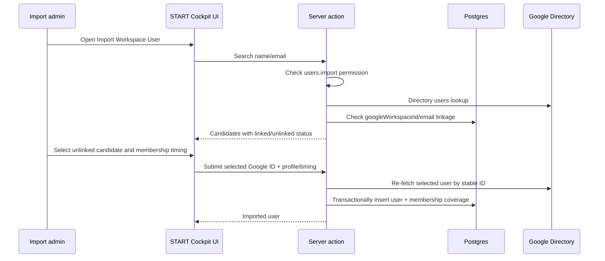

# feat: Add Google Workspace User Import

## Overview

Add a distinct, permission-gated import flow for people who already exist in Google Workspace but not in START Cockpit. Keep the normal create-user flow focused on new users: it should show the calculated START email and block exact Workspace email conflicts, then direct admins to import instead of attempting duplicate Google account creation.

The import flow will search Google Workspace, import one selected unlinked Workspace identity into START Cockpit, persist a durable Workspace identity link, and capture membership coverage timing so imported members are not asked to start a new GoCardless subscription until payment is due.

---

## Problem Frame

START Cockpit currently treats user creation as "create local user plus create Google Workspace account" through `src/inngest/new-user-workflow.ts`. That is correct for new members, but wrong for existing members whose Workspace account already exists. Those members need a local START Cockpit account linked to their existing Workspace identity, and they may already be paid through a future date.

Planning follows the revised requirements in `docs/brainstorms/2026-04-28-google-workspace-existing-user-linking-requirements.md`: separate import from create, protect the create flow with exact email conflict detection, and add enough membership timing state to delay subscription setup for imported paid-through members.

---

## Requirements Trace

- R1. Provide a distinct import flow for existing Google Workspace users.
- R2. Gate import with a deliberate admin permission.
- R3-R4. Search Google Workspace and show enough candidate details for disambiguation.
- R5, R10. Show already-linked Workspace users and prevent duplicate imports.
- R6-R9. Lock, import, persist, and display the selected Workspace identity without changing the Google account.
- R11-R14. Keep normal create-user focused on new accounts, show calculated START email, and block exact conflicts.
- R15-R18. Capture imported membership coverage timing while preserving immediate payment setup for newly onboarded users.
- R19-R21. Keep Workspace lookup/import server-side, minimum-disclosure, and verified by stable identity at submit time.

**Origin actors:** A1 Import admin, A2 User admin, A3 Existing Workspace user, A4 New START user, A5 START Cockpit, A6 Google Workspace Directory
**Origin flows:** F1 Import an existing Google Workspace user, F2 Create a new user, F3 Imported user reaches membership payment
**Origin acceptance examples:** AE1 import existing Workspace user, AE2 already-linked result disabled, AE3 create flow exact conflict blocks, AE4 imported paid-through member is covered, AE5 new onboarding still starts payment immediately

---

## Scope Boundaries

- No fuzzy matching in the normal create-user flow; exact Workspace email conflict detection is enough there.
- No bulk importer in v1. The plan builds one-user-at-a-time import.
- No Google Workspace account mutation during import: no create, rename, password reset, or recovery-email changes.
- No duplicate START Cockpit user merge flow.
- No full billing-history model. The plan adds the minimum coverage/next-due state needed to decide whether payment setup should be shown.
- No replacement of the existing onboarding path for users who need new Workspace accounts.

---

## Context & Research

### Relevant Code and Patterns

- `src/inngest/new-user-workflow.ts` currently owns Google Workspace account creation and contains the START email generation logic that should be extracted and reused.
- `src/lib/google-auth.ts` already creates domain-wide delegated Google auth for Admin SDK calls.
- `src/app/(authenticated)/(app)/people/create-user-dialog.tsx` and `create-user-action.ts` are the current user creation surface.
- `src/lib/permissions/index.ts` defines action-level role gates; import should add a distinct permission key instead of overloading `users.create`.
- `src/db/schema/auth.ts` has no durable Google Directory identity field beyond `user.email`.
- `src/db/schema/membership.ts` and `src/db/membership.ts` have active/pending/checkout state but no explicit paid-through/next-due date.
- `src/lib/membership-status.ts` gates membership page state and already has focused tests in `src/lib/membership-status.test.ts`.
- `src/db/people.ts`, `src/components/people-table.tsx`, and `src/app/(authenticated)/(app)/people/[id]/profile-card.tsx` shape the people list and profile display where imported identity should become visible.

### Institutional Learnings

- No `docs/solutions/` entries were present for this area.

### External References

- Google Workspace Admin Directory users search supports query-based user lookup; planning should use it for import search and exact email checks.
- Google Directory user resources include stable identifiers such as `id` and primary email fields; submit-time import should rely on a durable Google identifier, not client-submitted display data.

---

## Key Technical Decisions

- **Separate import and create surfaces:** Build a dedicated import dialog or route on the people page for rare, high-trust imports; keep `CreateUserDialog` small and focused.
- **Store a durable Google Workspace identity on `user`:** Add a unique nullable `googleWorkspaceId` and a display email field or verified use of `email` for the Workspace primary email. Use the stable ID for duplicate import prevention and submit-time verification.
- **Extract START email generation:** Move the slug/transliteration logic out of `src/inngest/new-user-workflow.ts` into a shared utility so the create dialog, create action, and workflow use the same rules.
- **Use paid-through membership coverage for imports:** Add a nullable `paidThroughAt`-style field to membership payment state. For GoCardless active subscriptions, null paid-through can continue to mean open-ended active provider coverage; for imported manual coverage, the date controls when payment setup becomes due.
- **Use server actions for import operations:** Match existing `next-safe-action` mutation patterns, keep Google Directory access server-side, and enforce `users.import` before search and import.
- **Defensive submit-time verification:** Search suggestions are advisory. Import submission must re-fetch or verify the selected Google user server-side, check local uniqueness, and insert/link transactionally.

---

## Open Questions

### Resolved During Planning

- **Should import have a separate permission?** Yes. Add a distinct `users.import` action, initially admin-only, because import links external identity and can set membership timing.
- **Which membership timing representation should v1 use?** Use a paid-through/covered-through date. It directly answers "when should payment next be requested" and avoids modelling full historical billing.
- **Where should fuzzy lookup live?** Only in the import flow. Normal create uses calculated-email exact conflict detection.
- **Should import create or mutate Google Workspace accounts?** No. Import is read/link only.

### Deferred to Implementation

- **Exact Google Directory fields shown in results:** Choose the minimum practical set after inspecting Admin SDK response shape in implementation, likely full name, primary email, and stable ID kept hidden from display.
- **Final schema field names:** Use names consistent with Drizzle conventions during implementation; the plan cares about durable identity and paid-through semantics, not exact identifiers.
- **Whether import is a dialog or dedicated page:** Prefer a dialog from the people page if it remains compact; switch to a dedicated route if the form becomes too dense after implementation starts.

---

## High-Level Technical Design

> *This illustrates the intended approach and is directional guidance for review, not implementation specification. The implementing agent should treat it as context, not code to reproduce.*

---

## Implementation Units

- U1. **Extract Workspace utilities**

**Goal:** Create shared Google Workspace utilities for START email generation, Directory lookup, and exact conflict checks.

**Requirements:** R3, R4, R12, R13, R19, R21; supports F1, F2, AE1, AE3

**Dependencies:** None

**Files:**
- Create: `src/lib/google-workspace/email.ts`
- Create: `src/lib/google-workspace/directory.ts`
- Create: `src/lib/google-workspace/email.test.ts`
- Modify: `src/inngest/new-user-workflow.ts`

**Approach:**
- Move `generateCompanyEmail` and custom replacements out of `src/inngest/new-user-workflow.ts`.
- Keep the email utility free of server-only Google dependencies so client and server code can share the deterministic calculation if needed.
- Add a server-only Directory wrapper that creates the Admin SDK client via `src/lib/google-auth.ts`, performs exact primary-email lookups, searches by query for import, and fetches by stable Google user ID.
- Return a narrow internal candidate shape with stable Google ID, primary email, display name, given/family names, and enough raw status to decide whether the account is usable.
- Do not expose service-account details, credentials, or full Google payloads outside the wrapper.

**Patterns to follow:**
- `src/lib/google-auth.ts` for domain-wide delegation.
- `src/inngest/new-user-workflow.ts` for current Admin SDK usage.
- `src/lib/gocardless/*` for provider-specific logic living behind a local library boundary.

**Test scenarios:**
- Happy path: names with spaces and umlauts produce the same START email currently generated by the workflow.
- Edge case: mixed-case German characters transliterate deterministically.
- Edge case: multi-part first or last names produce hyphenated local parts before the dot.
- Error path: Directory lookup wrapper returns a typed unavailable/error result rather than leaking raw provider errors to UI callers.

**Verification:**
- New workflow creation and create-user checks use one shared START email generator.
- Directory access is isolated to `src/lib/google-workspace/directory.ts`.

---

- U2. **Persist Workspace identity and membership coverage**

**Goal:** Add database state for imported Workspace identity links and paid-through membership coverage.

**Requirements:** R5, R7, R9, R10, R15, R16, R17, R21; supports F1, F3, AE2, AE4

**Dependencies:** U1 for identity semantics

**Files:**
- Modify: `src/db/schema/auth.ts`
- Modify: `src/db/schema/membership.ts`
- Modify: `src/db/schema/index.ts`
- Create: `drizzle/0008_google_workspace_user_import.sql`
- Modify: `drizzle/meta/_journal.json`
- Create/modify: `drizzle/meta/0008_snapshot.json`

**Approach:**
- Add nullable Workspace identity fields to the user table, with a unique constraint on the stable Google Workspace ID when present.
- Keep `user.email` as the START/Workspace login email; imported users should use the selected Google user's primary email.
- Add a nullable paid-through/covered-through timestamp to membership payment state.
- Preserve existing GoCardless active behavior: provider-backed active memberships remain full members even without a paid-through date.
- For imported manually covered members, use the paid-through date to decide when payment setup becomes due.
- Generate the migration with Drizzle tooling during implementation, then review the SQL for nullable additions and uniqueness semantics.

**Patterns to follow:**
- `src/db/schema/auth.ts` for user table column style.
- `src/db/schema/membership.ts` for membership payment state.
- Existing `drizzle/0007_harmonize_gocardless_membership_payment.sql` and meta files for migration shape.

**Test scenarios:**
- Migration expectation: existing users without Google Workspace ID remain valid.
- Migration expectation: two users cannot share the same non-null Google Workspace ID.
- Migration expectation: existing membership rows remain valid when paid-through is null.

**Verification:**
- Schema exposes durable Workspace identity and paid-through coverage state.
- Migration is additive and safe for existing production data.

---

- U3. **Update membership state semantics**

**Goal:** Teach START Cockpit when imported manually covered members are full members and when they become payment pending.

**Requirements:** R15, R16, R17, R18; supports F3, AE4, AE5

**Dependencies:** U2

**Files:**
- Modify: `src/lib/membership-status.ts`
- Modify: `src/lib/membership-status.test.ts`
- Modify: `src/db/membership.ts`
- Modify: `src/app/(authenticated)/(app)/people/complete-onboarding-action.ts`
- Modify: `src/app/(authenticated)/(app)/membership/page.tsx`
- Modify: `src/app/(authenticated)/(app)/membership/onboarding.tsx`

**Approach:**
- Extend the membership state input to include paid-through/covered-through date.
- Keep the current profile-first gate: users with incomplete profile data remain in profile onboarding, even if imported coverage exists.
- Treat an active provider-backed payment with no paid-through date as full member, preserving current GoCardless subscription behavior.
- Treat active manual/import coverage with a future paid-through date as full member.
- Treat expired manual/import coverage as payment pending once the profile is complete, allowing normal payment setup.
- Add a helper in `src/db/membership.ts` for creating imported/manual membership coverage rows so import code does not hand-build membership state.
- Ensure `completeUserOnboardingAction` still creates pending payment setup immediately for normal newly onboarded users without active coverage.

**Patterns to follow:**
- Existing `getMembershipViewState` ordering in `src/lib/membership-status.ts`.
- Existing tests in `src/lib/membership-status.test.ts`.
- `createOrReuseMembershipPayment` and `activateMembershipPayment` patterns in `src/db/membership.ts`.

**Test scenarios:**
- Covers AE4. Imported profile-complete user with active manual coverage and future paid-through date sees `full_member`.
- Covers AE4. Imported profile-complete user with expired manual coverage sees `payment_pending`.
- Covers AE4. Imported user with incomplete profile stays in `profile_onboarding` even when paid-through is future.
- Covers AE5. Normal onboarded user without payment row still requires admin completion before payment setup becomes available.
- Regression: GoCardless active membership with no paid-through date remains `full_member`.
- Regression: checkout-started membership remains `payment_processing`.

**Verification:**
- Membership page and people status reflect imported coverage without disrupting existing GoCardless flows.

---

- U4. **Add create-flow exact conflict protection**

**Goal:** Show the calculated START email in the normal create-user flow and block exact Google Workspace email conflicts.

**Requirements:** R11, R12, R13, R14, R19; supports F2, AE3

**Dependencies:** U1

**Files:**
- Modify: `src/app/(authenticated)/(app)/people/create-user-dialog.tsx`
- Modify: `src/app/(authenticated)/(app)/people/create-user-action.ts`
- Modify: `src/app/(authenticated)/(app)/people/create-user-schema.ts`
- Create: `src/app/(authenticated)/(app)/people/check-workspace-email-action.ts`
- Test: `src/lib/google-workspace/email.test.ts`

**Approach:**
- Display the intended START email as soon as first and last name can produce one.
- Use the shared email generator from U1.
- Add a server-side exact conflict check action gated by `users.create` or a stricter admin permission.
- In the dialog, show checking, available, conflict, and unavailable states without adding fuzzy candidate suggestions.
- On conflict, block submit and direct the admin to the import flow.
- In `createUserAction`, repeat the exact conflict check server-side before sending the Inngest event. The UI check improves feedback; the action check enforces correctness.
- While touching `createUserAction`, keep the permission check explicitly awaited so the server-side gate is authoritative before any Google or Inngest work starts.
- Adjust the existing workflow's "Entity already exists" behavior after U4: duplicate creation should be prevented before workflow dispatch, so any remaining provider conflict should be treated as an exceptional race/repair path rather than a normal import substitute.

**Patterns to follow:**
- `CreateUserDialog` React Hook Form + `useHookFormAction` pattern.
- `src/lib/utils` error handling via `handleError`.
- Existing action permission checks in `create-user-action.ts` and `complete-onboarding-action.ts`.

**Test scenarios:**
- Covers AE3. First/last name displays the expected START email before submit.
- Covers AE3. Exact existing Google Workspace email disables or blocks create submission and points to import.
- Happy path: no exact conflict allows normal create action to dispatch.
- Error path: Google Directory conflict check failure produces a retryable unavailable state and does not silently create a user.
- Race path: server action blocks when the email becomes taken after the UI last checked.

**Verification:**
- The common create flow remains visually simple and does not show fuzzy import candidates.
- Duplicate Workspace account creation is blocked before Inngest user creation starts.

---

- U5. **Build import backend actions**

**Goal:** Implement server-side search and import actions for one existing Google Workspace user at a time.

**Requirements:** R1, R2, R3, R4, R5, R6, R7, R8, R10, R15, R16, R19, R20, R21; supports F1, F3, AE1, AE2, AE4

**Dependencies:** U1, U2, U3

**Files:**
- Create: `src/app/(authenticated)/(app)/people/import-google-user-action.ts`
- Create: `src/app/(authenticated)/(app)/people/import-google-user-schema.ts`
- Modify: `src/lib/permissions/index.ts`
- Modify: `src/db/people.ts`
- Test: `src/lib/membership-status.test.ts`

**Approach:**
- Add `users.import` to `PERMISSIONS`, initially admin-only.
- Search action:
  - Require `users.import`.
  - Accept a bounded name/email query.
  - Call the Directory wrapper from U1.
  - Check local users by `googleWorkspaceId` and primary email.
  - Return narrow candidates with linked/unlinked status and only fields needed for disambiguation.
- Import action:
  - Require `users.import`.
  - Accept selected Google Workspace ID, admin-confirmed profile/org fields, personal email if needed, and membership coverage inputs.
  - Re-fetch the selected Google user server-side by stable ID.
  - Verify it is still unlinked locally.
  - Create the local `user` and optional/manual membership coverage in one database transaction.
  - Do not call Google insert/update APIs.
  - Use unique constraints and transaction errors to handle concurrent imports safely.
- Prefer explicit error messages for already linked, no longer found, invalid coverage date, and permission denied.

**Patterns to follow:**
- `src/app/(authenticated)/(app)/people/create-user-action.ts` for safe-action mutation shape.
- `src/db/membership.ts` for membership helpers.
- `src/db/people.ts` for user-facing read models.

**Test scenarios:**
- Covers AE1. Search returns an unlinked Workspace user and import creates a local user with no Google account creation.
- Covers AE2. Search returns an already-linked Workspace user as disabled/non-importable.
- Covers AE2. Import submit fails if another admin imported the same Google ID after search.
- Covers AE4. Import with future paid-through date creates membership coverage that delays payment setup.
- Error path: import rejects a selected Google ID that cannot be re-fetched.
- Error path: import rejects client-submitted email/name that does not match the re-fetched Google identity.
- Permission path: non-import admins cannot search or import.

**Verification:**
- Import can be completed end-to-end without touching `onboardNewUserWorkflow`.
- Duplicate imports are prevented by both server checks and database uniqueness.

---

- U6. **Build import admin UI**

**Goal:** Add the import surface to the people area without overloading the normal create-user dialog.

**Requirements:** R1, R2, R3, R4, R5, R6, R9, R15, R16, R20; supports F1, F3, AE1, AE2, AE4

**Dependencies:** U5

**Files:**
- Modify: `src/app/(authenticated)/(app)/people/page-client.tsx`
- Modify: `src/components/people-table.tsx`
- Create: `src/app/(authenticated)/(app)/people/import-google-user-dialog.tsx`
- Modify: `src/components/can.tsx` or related permission UI if needed

**Approach:**
- Add a secondary "Import Google user" action near the existing create-user action, visible only to `users.import`.
- Keep the import UI oriented around search/select/confirm/import:
  - Search input for name or Workspace email.
  - Result list with primary email, display name, and linked status.
  - Disabled state for already-linked users.
  - Selected identity panel that locks the Workspace user being imported.
  - Profile/org fields required for local START Cockpit user creation.
  - Membership coverage control: not already paid, or paid through a selected date.
- Use clear copy to distinguish import from creating a new Google account.
- After import success, refresh the people list and show a toast that the existing Workspace user was imported.

**Patterns to follow:**
- `CreateUserDialog` for form structure and shadcn field components.
- `PeoplePageClient` for dialog state and `router.refresh`.
- `Can` permission wrapper in `src/components/people-table.tsx`.

**Test scenarios:**
- Covers AE1. Admin searches, selects an unlinked user, enters required local fields and coverage, then imports successfully.
- Covers AE2. Already-linked result is visible but disabled and cannot be selected.
- Error path: search failure shows retryable error without clearing typed query.
- Error path: import failure due to concurrent import keeps the admin in the dialog and explains the identity was already imported.
- Accessibility: result list is keyboard navigable, disabled reasons are exposed, selected identity lock is announced as read-only context, and import errors are associated with the relevant controls.

**Verification:**
- Normal create and import are visibly separate actions.
- Import UI does not expose unnecessary Google Directory data.

---

- U7. **Display imported identity and coverage**

**Goal:** Make imported Workspace identity and membership coverage visible after import.

**Requirements:** R9, R15, R16, R17, R20; supports F3, AE4

**Dependencies:** U2, U3, U5

**Files:**
- Modify: `src/db/people.ts`
- Modify: `src/app/(authenticated)/(app)/people/[id]/profile-card.tsx`
- Modify: `src/app/(authenticated)/(app)/people/[id]/contact-card.tsx`
- Modify: `src/components/people-table.tsx`
- Modify: `src/app/(authenticated)/(app)/membership/onboarding.tsx`

**Approach:**
- Extend people read models with safe Workspace identity display fields and paid-through date.
- On the user detail page, show linked Google Workspace identity in profile/contact context.
- In people list status, optionally distinguish imported covered members where useful without turning the table into a billing dashboard.
- On membership surfaces, make the covered-until state understandable when the imported user is still paid through a future date.
- Keep fields minimum-disclosure: show what admins/users need, avoid stable Google IDs in UI.

**Patterns to follow:**
- `ProfileCard` status display.
- `PeopleTable` status badge and tooltip pattern.
- `ContactCard` for email/contact grouping.

**Test scenarios:**
- Covers AE4. Imported covered member sees membership state indicating they are covered rather than payment pending.
- Happy path: admin profile view shows linked Workspace email after import.
- Edge case: user with no imported Workspace identity does not show empty identity chrome.
- Edge case: expired paid-through date shows payment-pending state after profile completion.

**Verification:**
- Linked identity is visible after import.
- Membership timing is visible enough for admins and users to understand why payment is or is not due.

---

- U8. **Add integration-oriented coverage and hardening**

**Goal:** Cover the cross-layer behavior that unit tests alone may miss: create conflict, import idempotency, and membership timing.

**Requirements:** All, especially R10, R14, R17, R19, R21; supports AE1-AE5

**Dependencies:** U1-U7

**Files:**
- Create: `src/app/(authenticated)/(app)/people/import-google-user-action.test.ts`
- Create: `src/app/(authenticated)/(app)/people/create-user-action.test.ts`
- Modify: `src/lib/membership-status.test.ts`
- Create/modify: local test helpers as needed under `src/test` if the repo introduces test utilities during implementation

**Approach:**
- If action-level tests are cumbersome with the current app harness, isolate core import/create decision logic into testable functions and keep server actions as thin adapters.
- Mock Google Directory wrapper responses rather than calling Google in tests.
- Test database-facing behavior with the lightest existing project-compatible pattern. If no DB test harness exists, document the limitation and prioritize pure decision tests plus one manual verification checklist.
- Ensure tests cover permission denial, exact conflict, already-linked import, concurrent duplicate handling, and paid-through membership behavior.

**Patterns to follow:**
- Existing `node:test` style in `src/lib/membership-status.test.ts` and `src/lib/gocardless/*.test.ts`.
- Provider-boundary tests in `src/lib/gocardless/membership-flow.test.ts`.

**Test scenarios:**
- Covers AE1. Import action maps a Google candidate into a local user without invoking Google account creation.
- Covers AE2. Already-linked Workspace identity cannot be imported twice.
- Covers AE3. Create action blocks exact Workspace email conflict even if UI skipped the check.
- Covers AE4. Future paid-through date suppresses payment setup until expiry.
- Covers AE5. Normal complete-onboarding path still creates pending payment setup for new users.
- Security: search/import actions deny users without `users.import`.
- Error path: Google Directory unavailable blocks conflict-sensitive operations rather than silently proceeding.

**Verification:**
- Critical identity and membership branches have automated coverage or explicit manual verification notes where the repo lacks a test harness.

---

## System-Wide Impact

- **Interaction graph:** People page gains a second admin flow; create-user action gains a preflight exact conflict check; import action creates local users and optional membership coverage without Inngest Google creation.
- **Error propagation:** Google Directory failures should surface as retryable unavailable states in UI and block conflict-sensitive create/import submissions.
- **State lifecycle risks:** Duplicate import prevention depends on a stable Google Workspace ID, a database uniqueness constraint, and submit-time revalidation.
- **API surface parity:** Server actions and UI permission wrappers must both respect `users.import`; server action authorization is authoritative.
- **Integration coverage:** The create/import split needs cross-layer tests or testable domain helpers for Google lookup, database duplicate detection, and membership state.
- **Unchanged invariants:** New-user onboarding still creates Google Workspace accounts and starts membership payment immediately after onboarding completion. GoCardless active subscriptions remain full memberships.

---

## Risks & Dependencies

| Risk | Mitigation |
|------|------------|
| Import links the wrong Google Workspace identity | Lock selected candidate, display disambiguating fields, re-fetch by stable Google ID at submit, and avoid trusting client display fields |
| Normal create flow still creates duplicates during races | Check exact conflict in UI and server action; treat workflow-level provider conflict as exceptional |
| Imported paid-through members become stuck as full members forever | Use paid-through date semantics for manual/imported coverage and tests for expiry |
| Google Directory search exposes too much PII | Return narrow candidate objects, permission-gate search, avoid logging raw payloads |
| Database migration breaks existing users or memberships | Add nullable fields and unique constraints on nullable Workspace identity; keep existing GoCardless active semantics |
| Lack of existing action/DB test harness slows coverage | Extract core decision logic into testable helpers and keep server actions thin |

---

## Documentation / Operational Notes

- Update any admin-facing setup notes to explain when to use "Create user" versus "Import Google user".
- Record required Google Directory permission scope and delegated subject assumptions near `src/lib/google-auth.ts` or operational docs.
- During rollout, admins should import known pre-existing Workspace users before inviting new users with matching START emails.

---

## Sources & References

- **Origin document:** [docs/brainstorms/2026-04-28-google-workspace-existing-user-linking-requirements.md](docs/brainstorms/2026-04-28-google-workspace-existing-user-linking-requirements.md)
- Related code: `src/inngest/new-user-workflow.ts`
- Related code: `src/app/(authenticated)/(app)/people/create-user-dialog.tsx`
- Related code: `src/db/schema/auth.ts`
- Related code: `src/db/schema/membership.ts`
- Related code: `src/lib/membership-status.ts`
- Related code: `src/lib/google-auth.ts`
- External docs: [Google Workspace Directory API user search](https://developers.google.com/workspace/admin/directory/v1/guides/search-users)
- External docs: [Google Workspace Directory API users resource](https://developers.google.com/workspace/admin/directory/reference/rest/v1/users)
