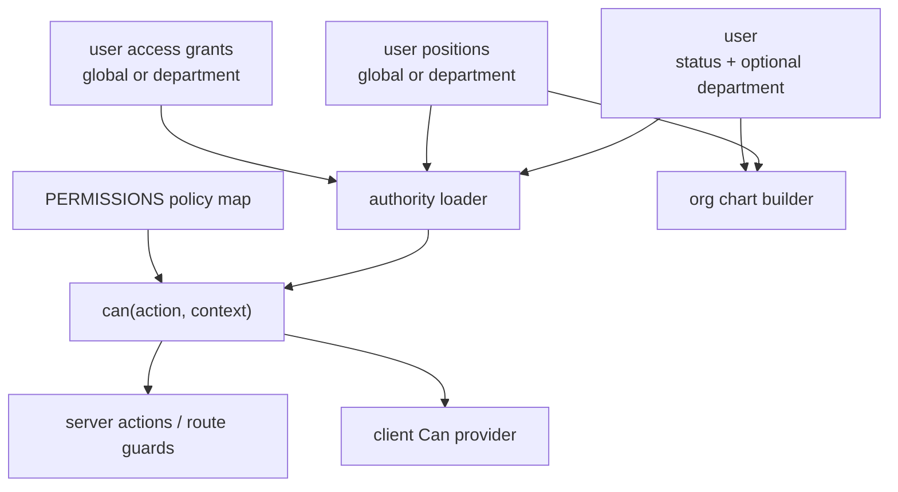

# User Authority and Organization Model

## Overview

Replace the current overloaded `roles` model with separate organization positions, explicit access grants, and a centralized permission policy that can evaluate both global and department-scoped access. This creates the foundation for scoped department-head permissions, admin-managed authority data on member detail pages, and an org chart driven by organization facts rather than auth roles.

This is a cross-cutting authorization and data migration change. Implementation should favor small, verified slices: model first, policy engine second, callers third, admin UI fourth, org chart last.

---

## Problem Frame

The current app stores `member`, `board`, `department_lead`, and `admin` in a single `roles` array on `user`. Those values currently drive both permission checks and organizational meaning. That makes it hard to answer future questions like "is this user board-level?" or "can this department head edit this target member?" without further overloading the same field.

The origin document defines a new model: lifecycle `status` stays separate, `department` remains optional and max one per user, organization positions describe real START structure, access grants describe app-specific permission exceptions, and effective permissions are computed by policy from those facts plus request context.

---

## Requirements Trace

- R1. Keep lifecycle status separate from organization structure and permissions.
- R2. Represent global and department-scoped organizational positions.
- R3. Represent explicit app access grants separately from positions.
- R4. Compute effective permissions from policy rules over positions, grants, status where relevant, and request context.
- R5. Allow multiple organizational positions per user.
- R6. Preserve optional max-one department membership.
- R7. Support global and department scopes for positions and grants.
- R8. Derive board-level membership from specific positions rather than duplicate assignments.
- R9. Keep a central readable permission map.
- R10. Do not let board-level status grant permissions by itself.
- R11. Keep `admin` as a global superuser grant.
- R12. Support department-scoped narrower grants such as people admin.
- R13. Require scoped permission checks to receive target context.
- R14-R16. Add admin-only member detail UI for positions and grants.
- R17-R19. Drive the org chart from positions, allowing global board positions at the top and excluding departmentless users from department membership.
- R20-R24. Migrate existing role data into the new model and stop using overloaded role semantics.

**Origin actors:** A1 Admin, A2 Board-level member, A3 Department head, A4 Access-granted user, A5 START Cockpit

**Origin flows:** F1 Admin maintains a member's authority data, F2 START Cockpit checks a scoped permission, F3 People page renders the org chart

**Origin acceptance examples:** AE1 department head is board-level without duplicate board member assignment, AE2 department-scoped people admin, AE3 global admin, AE4 non-admin cannot see edit controls, AE5 global officer without department appears in org chart, AE6 legacy roles migrate into new model

---

## Scope Boundaries

- The first version supports only global and department scopes.
- Department membership remains optional and max one per user.
- The first admin editing UI lives on member detail pages only.
- No dedicated access audit page is included.
- No bulk position or grant editor is included.
- No group-scoped, batch-scoped, or arbitrary resource-scoped permissions are included.
- Board-level remains a derived organizational category, not a permission tier.

### Deferred to Follow-Up Work

- Dedicated access audit page: build after the member-detail editing flow proves the model.
- Bulk authority editing: add only after real admin workflows demand it.
- Broader group criteria redesign: this plan removes legacy role-based criteria dependency, but a richer "positions/grants criteria" product surface can follow separately if groups need it. Existing department/status/batch criteria should remain intact.

---

## Context & Research

### Relevant Code and Patterns

- `src/db/schema/auth.ts` currently defines `userStatus`, `department`, `role`, and `user.roles`.
- `src/db/schema/index.ts` centralizes relations and exported Drizzle schema.
- `src/lib/permissions/index.ts` currently maps permission actions to allowed roles.
- `src/lib/permissions/server.ts` currently evaluates `can(action)` from `getCurrentUser().roles`.
- `src/lib/permissions/roles-context.tsx` and `src/components/can.tsx` currently provide client-side permission gating from roles.
- `src/app/(authenticated)/(app)/layout.tsx` currently passes `user.roles` into the client permission provider.
- `src/app/(authenticated)/(app)/people/[id]/page.tsx` gates member detail pages with `can("users.manage")`.
- `src/app/(authenticated)/(app)/people/[id]/profile-card.tsx` displays current roles on the member profile.
- `src/db/people.ts` returns public and detail user shapes; detail currently includes `roles`.
- `src/db/groups.ts`, `src/components/group-criteria-manager.tsx`, `src/components/bulk-add-users-dialog.tsx`, and `src/app/api/users/search-by-criteria/route.ts` currently use role-based criteria.
- `src/app/(authenticated)/(app)/people/create-user-schema.ts` currently requires department, which conflicts with the requirement that president, vice president, head of finance, and alumni may have no department.
- `src/app/(authenticated)/(app)/people/create-user-action.ts` calls `can("users.create")` without `await`; the permission overhaul should fix this while touching the action.
- Existing tests use Node's built-in test runner with `node:test` and `assert`, for example `src/lib/membership-status.test.ts`.

### Institutional Learnings

- No relevant `docs/solutions/` learnings exist in the repo at planning time.

### External References

- No external research is required for the product model. This plan follows existing local Drizzle, Next.js App Router, next-safe-action, and Node test patterns already present in the repo.

---

## Key Technical Decisions

- Create separate persisted assignment tables for positions and access grants: this keeps organization facts and app access facts independent while allowing both to feed policy decisions.
- Keep legacy `user.roles` only as migration input during rollout, then remove it from permission evaluation: this satisfies the origin's "migrate immediately" requirement without depending on old semantics long-term.
- Model scope explicitly as global or department: department-head and people-admin behavior need scoped checks from the first version.
- Keep permission policy centralized, but change entries from role arrays to grant and position rules: this preserves the current readable policy-map pattern while supporting multiple authority sources.
- Add a richer current-user authority payload for server and client checks: `Can` should no longer consume raw roles, and server `can` needs optional target context.
- Require target context for scoped actions: permissions such as editing or completing onboarding for a target user should compare department scope against the target user's department.
- Treat group membership role separately from user authority: `users_to_groups.role` remains a group-local membership/admin setting and is not part of this overhaul.
- Make create-user department optional: the new organization model explicitly allows users without a department.
- Build org chart after authority foundation: the chart should consume positions and derived board-level state, not drive the model.
- Split coarse user permissions where needed: keep `users.manage_authority` admin-only, introduce scoped member-detail/user-edit permissions for department heads and people admins, and avoid using one broad `users.manage` action for unrelated capabilities.

---

## Open Questions

### Resolved During Planning

- Where should admin editing UI live? On the member detail page only for v1, visible only to admins.
- Should admin remain special? Yes, as a global superuser access grant.
- Should board-level grant baseline permissions? No; permissions must explicitly list positions or grants.
- Should legacy roles remain as fallback? No long-term fallback; migrate existing data into positions and grants and update callers.

### Deferred to Implementation

- Exact mutation form layout for multiple positions and grants: final component shape may depend on available shadcn primitives and ergonomics once implemented.
- Exact generated migration filenames and SQL: use Drizzle generation where possible, then review and supplement with explicit backfill SQL or script logic.
- How to present removed role criteria to admins in existing groups: implementation should preserve existing records safely and stop creating/evaluating new legacy-role criteria. A richer replacement with position/grant criteria is deferred unless a safe conversion is obvious during implementation.

---

## Output Structure

```text
src/db/schema/
  authority.ts
src/db/
  authority.ts
src/lib/permissions/
  index.ts
  server.ts
  authority-context.tsx
  permissions.test.ts
src/components/
  can.tsx
  authority-editor.tsx
  people-org-chart.tsx
  people-org-chart-data.ts
  people-org-chart-data.test.ts
src/app/(authenticated)/(app)/people/[id]/
  authority-card.tsx
  update-authority-action.ts
```

The tree shows the intended shape. Existing files listed in implementation units remain authoritative, and implementation may adjust file names if a clearer local convention emerges.

---

## High-Level Technical Design

> *This illustrates the intended approach and is directional guidance for review, not implementation specification. The implementing agent should treat it as context, not code to reproduce.*



Permission checks should evaluate explicit policy rules. A simplified directional shape:

```text
permission rule =
  allowed global grants
  + allowed department-scoped grants
  + allowed global positions
  + allowed department-scoped positions

can(userAuthority, action, context) =
  true if admin grant is allowed for action
  true if any allowed global position/grant matches
  true if any department-scoped position/grant matches context.department
  false otherwise
```

Board-level helpers should be derived from position definitions and should not participate in permission checks unless a permission explicitly names those positions.

---

## Initial Permission Policy

This table is the intended first-pass policy. Names may be adjusted during implementation to match local naming conventions, but the capability boundaries should remain.

| Permission | Global grants | Department-scoped grants | Global positions | Department-scoped positions | Context required |
|------------|---------------|--------------------------|------------------|-----------------------------|------------------|
| `users.create` | `admin` | None | None | None | No |
| `users.view_details` | `admin` | `people_admin` | None | `department_head` | Yes, target user department unless global admin |
| `users.edit` | `admin` | `people_admin` | None | `department_head` | Yes, target user department unless global admin |
| `users.complete_onboarding` | `admin` | `people_admin` | None | `department_head` | Yes, target user department unless global admin |
| `users.manage_authority` | `admin` | None | None | None | No |
| `groups.view_all` | `admin` | None | `president`, `vice_president`, `head_of_finance`, `board_member` | `department_head` | No for global positions; department context only if later narrowed |
| `groups.create` | `admin` | None | None | None | No |
| `groups.manage_members` | `admin` | None | None | None | No |

Important implications:

- `board_member` and officer positions do not receive broad user-management permissions by default.
- `department_head` gets scoped people-facing permissions, not global user management.
- `people_admin` is the explicit app-access path for non-position users who need scoped people access.
- Authority editing is admin-only even if someone can view or edit ordinary member details.

---

## Implementation Units

- U1. **Add Authority Schema and Migration**

**Goal:** Persist organization positions and access grants separately from legacy user roles, with global and department scopes.

**Requirements:** R1-R8, R11, R12, R20-R24, AE1, AE2, AE3, AE6

**Dependencies:** None

**Files:**
- Create: `src/db/schema/authority.ts`
- Modify: `src/db/schema/index.ts`
- Modify: `src/db/schema/auth.ts`
- Create or generate: `drizzle/*`
- Test: `src/lib/permissions/permissions.test.ts`

**Approach:**
- Add position enum values for `president`, `vice_president`, `head_of_finance`, `board_member`, and `department_head`.
- Add access-grant enum values for at least `admin` and `people_admin`.
- Add a shared scope concept at the data level: global rows have no department; department-scoped rows store a department.
- Add `userPosition` and `userAccessGrant` tables referencing `user.id`, with timestamps and enough uniqueness to prevent duplicate active assignments.
- Keep `user.department` as the optional home/member department.
- Make `user.department` optional in creation and validation flows in later units; do not repurpose it as a leadership field.
- Keep `user.roles` only long enough for data migration and compatibility cleanup. The target permission engine must not depend on it.

**Execution note:** Treat this as migration-first work. Review generated SQL before applying it and add explicit backfill logic where generation cannot express data movement.

**Patterns to follow:**
- `src/db/schema/membership.ts` for a separate domain schema file and relation pattern.
- `src/db/schema/index.ts` for central relation exports.
- Existing Drizzle enum definitions in `src/db/schema/auth.ts`.

**Test scenarios:**
- Happy path: authority fixture with a global `admin` grant is representable without a department.
- Happy path: authority fixture with `department_head` scoped to Events is representable with a department scope.
- Edge case: duplicate identical position assignments should be prevented by schema constraints or by mutation-layer validation specified for U5.
- Edge case: `department_head` without a department scope should be rejected by validation in U2 or U5 even if the database cannot express the conditional rule directly.
- Covers AE6. Migration/backfill maps `admin` role to global admin grant, `department_lead` plus user department to department-head position, `board` to board-member position, and `member` to no authority assignment.

**Verification:**
- Schema exports include position and grant relations.
- Existing user lifecycle fields remain intact.
- Legacy role migration rules are documented in the generated migration or companion backfill.

---

- U2. **Build Authority Domain Helpers**

**Goal:** Provide a typed domain layer for position/grant definitions, scope matching, board-level derivation, and migration mapping.

**Requirements:** R2-R8, R10-R13, R17-R19, AE1, AE2, AE5, AE6

**Dependencies:** U1

**Files:**
- Create: `src/db/authority.ts`
- Modify: `src/db/people.ts`
- Test: `src/lib/permissions/permissions.test.ts`
- Test: `src/components/people-org-chart-data.test.ts`

**Approach:**
- Define canonical metadata for positions and grants in TypeScript constants: label, scope type, whether it is board-level, and whether it is global-only or department-scoped.
- Add query helpers to load a user's positions and grants, plus a helper to load the current user's authority payload.
- Extend `PublicUser` and `UserDetail` with position and access-grant data needed by permissions, admin UI, and org chart.
- Add helper behavior for "is board-level" that derives from positions only.
- Add migration mapping helpers for old role values so backfill logic and tests share the same decisions.

**Patterns to follow:**
- `src/db/people.ts` for mapping database rows into UI-facing objects.
- `src/lib/membership-status.ts` for pure domain helper style.
- `src/lib/membership-status.test.ts` for focused `node:test` coverage.

**Test scenarios:**
- Covers AE1. A user with `department_head` scoped to Events is board-level without a separate `board_member` position.
- Covers AE5. A user with `president` and no department is eligible as a top-level org-chart node, while a user with no department and no global board position is not.
- Happy path: multiple positions on one user are preserved and sorted deterministically for display.
- Edge case: a department-scoped grant with no department is treated as invalid input by helper validation.
- Edge case: a user with department membership but no positions is not board-level.
- Covers AE6. Legacy `member` maps to no position or grant.

**Verification:**
- Authority helpers expose a single vocabulary for positions, grants, scopes, labels, and board-level derivation.
- `PublicUser` and `UserDetail` can support both old table views and new authority consumers.

---

- U3. **Replace Role-Based Permission Engine**

**Goal:** Change permission checks from role arrays to explicit policy rules over access grants, positions, and optional department context.

**Requirements:** R3, R4, R7, R9-R13, AE2, AE3

**Dependencies:** U1, U2

**Files:**
- Modify: `src/lib/permissions/index.ts`
- Modify: `src/lib/permissions/server.ts`
- Rename or replace: `src/lib/permissions/roles-context.tsx`
- Modify: `src/components/can.tsx`
- Modify: `src/app/(authenticated)/(app)/layout.tsx`
- Test: `src/lib/permissions/permissions.test.ts`

**Approach:**
- Change `PERMISSIONS` from `Record<Action, Role[]>` to a policy object that can list grants and positions, each with global or department matching semantics.
- Keep `admin` explicit in each permission that should allow superuser access; do not make admin an implicit bypass outside the policy map.
- Replace coarse `users.manage` usage with narrower actions from the Initial Permission Policy section.
- Add `can(action, context?)` for server checks where context can include a target department or target user.
- Add a client authority provider that receives the current user's positions/grants instead of raw roles.
- Update `Can` to evaluate the same policy shape for UI gating. For scoped UI actions, allow passing context where available; otherwise scoped-only permissions should fail closed or be hidden until context is supplied.
- Fix existing missing `await` in `createUserAction` while updating permission calls.

**Technical design:** Directional policy shape:

```text
PERMISSIONS[action] =
  grants: global grants + scoped grants
  positions: global positions + scoped positions

context =
  optional target department for department-scoped checks
```

**Patterns to follow:**
- Existing `src/lib/permissions/index.ts` for central policy-map readability.
- Existing `src/lib/permissions/server.ts` for server-only permission boundary.
- Existing `src/components/can.tsx` for client-side visibility gating.

**Test scenarios:**
- Covers AE2. `people_admin` scoped to Growth allows a Growth target and denies an Events target.
- Covers AE3. Global `admin` allows actions where the policy includes admin.
- Happy path: `department_head` scoped to Events allows an Events-scoped permission when the policy lists department head.
- Edge case: `department_head` scoped to Events denies the same permission for a Growth target.
- Edge case: `board_member` can satisfy `groups.view_all` but cannot satisfy `users.edit` unless the policy explicitly adds it later.
- Edge case: `users.manage_authority` is allowed for global admin and denied for department head and people admin.
- Edge case: board-level positions grant nothing when the specific permission does not list those positions.
- Error path: scoped permission without required context denies by default.
- Regression: `users.create` server action awaits permission evaluation and denies users without the required grant.

**Verification:**
- All existing permission checks compile against the new API.
- No application permission path reads `user.roles` directly.
- Client and server permission checks share the same policy vocabulary.

---

- U4. **Migrate Existing Permission Callers and Group Criteria**

**Goal:** Update every existing role-dependent route, action, component, and group criteria flow to use the new authority model or an explicit non-role alternative.

**Requirements:** R4, R9, R13, R20-R24, AE2, AE3, AE6

**Dependencies:** U2, U3

**Files:**
- Modify: `src/app/(authenticated)/(app)/people/create-user-action.ts`
- Modify: `src/app/(authenticated)/(app)/people/complete-onboarding-action.ts`
- Modify: `src/app/(authenticated)/(app)/people/[id]/page.tsx`
- Modify: `src/app/(authenticated)/(app)/groups/page.tsx`
- Modify: `src/app/(authenticated)/(app)/groups/create-group-action.ts`
- Modify: `src/app/(authenticated)/(app)/groups/[id]/page-client.tsx`
- Modify: `src/app/(authenticated)/(app)/groups/[id]/actions.ts`
- Modify: `src/db/groups.ts`
- Modify: `src/db/schema/group.ts`
- Modify: `src/components/group-criteria-manager.tsx`
- Modify: `src/components/bulk-add-users-dialog.tsx`
- Modify: `src/app/api/users/search-by-criteria/route.ts`
- Modify: `src/app/api/groups/criteria/route.ts`
- Test: `src/lib/permissions/permissions.test.ts`

**Approach:**
- Replace role-based permissions in server actions and page guards with new `can` calls.
- For actions targeting a user, load target user department before checking department-scoped permissions where the policy requires it.
- Update group criteria to avoid filtering by old auth roles. Stop creating and evaluating legacy-role criteria while keeping department/status/batch criteria intact, unless implementation can safely convert existing role criteria to position criteria without broadening scope.
- Update bulk-add search criteria similarly so it does not query `user.roles`.
- Existing group criteria records with role filters should not break the page. Either display them as legacy/ignored criteria or migrate them deliberately; do not silently keep applying old role semantics.
- Keep `users_to_groups.role` as group-local membership role; rename UI copy only if needed to avoid confusing it with authority roles.

**Execution note:** Add characterization tests around permission policy before changing callers.

**Patterns to follow:**
- Existing server action guard style in `src/app/(authenticated)/(app)/groups/create-group-action.ts`.
- Existing group criteria data flow in `src/db/groups.ts` and `src/app/api/groups/criteria/route.ts`.

**Test scenarios:**
- Happy path: user with global admin grant can create users and groups.
- Happy path: department head can complete onboarding for a target user in their department when the policy allows it.
- Edge case: department head cannot complete onboarding for a target user in another department.
- Edge case: user with no relevant grant or position cannot view member detail pages.
- Covers AE6. No caller still grants permissions from legacy `board` or `department_lead` role values after migration.
- Integration: group criteria creation with department/status/batch still adds matching users.
- Regression: bulk user search by department/status/batch still returns users not already in the group.
- Edge case: existing group criteria containing legacy roles does not crash group pages and no longer grants role-based auto-add behavior.

**Verification:**
- `rg` finds no app permission checks depending on `user.roles`, `useRoles`, `RoleList`, or `hasAnyRequiredRole`.
- Group criteria and bulk-add flows remain usable without role filters.

---

- U5. **Add Admin Authority Editing on Member Detail**

**Goal:** Let admins maintain a member's positions and access grants from the member detail page, hidden from non-admin users.

**Requirements:** R2, R3, R5-R7, R12-R16, F1, AE4

**Dependencies:** U1, U2, U3

**Files:**
- Create: `src/app/(authenticated)/(app)/people/[id]/authority-card.tsx`
- Create: `src/app/(authenticated)/(app)/people/[id]/update-authority-action.ts`
- Create: `src/components/authority-editor.tsx`
- Modify: `src/app/(authenticated)/(app)/people/[id]/page.tsx`
- Modify: `src/app/(authenticated)/(app)/people/[id]/profile-card.tsx`
- Modify: `src/db/people.ts`
- Test: `src/lib/permissions/permissions.test.ts`

**Approach:**
- Add an admin-only card to member detail pages showing current positions and grants.
- Provide controls for adding/removing multiple positions and grants.
- Position controls should enforce scope rules: global positions do not ask for department scope; `department_head` requires department scope.
- Grant controls should support global admin and department-scoped/global people admin as defined in metadata.
- Server action must re-check admin permission and validate all submitted assignments server-side.
- Non-admin users should not see the card or receive privileged assignment data in UI props.

**Patterns to follow:**
- `src/app/(authenticated)/(app)/people/[id]/profile-card.tsx` for member detail card composition.
- `src/app/(authenticated)/(app)/people/complete-onboarding-action.ts` for next-safe-action server mutation pattern.
- Existing shadcn form/select/dialog components in `src/app/(authenticated)/(app)/people/create-user-dialog.tsx`.

**Test scenarios:**
- Covers AE4. Non-admin member detail render excludes authority edit card and controls.
- Happy path: admin adds `department_head` scoped to Events to a user and the detail page refresh shows the new assignment.
- Happy path: admin adds `people_admin` scoped to Growth to a user.
- Edge case: submitting `department_head` without a department scope returns validation error.
- Edge case: submitting duplicate assignments returns validation error or is idempotently ignored.
- Error path: non-admin direct server action call is denied.
- Error path: invalid position/grant value is rejected server-side even if the client is manipulated.

**Verification:**
- Admins can manage positions and grants from `/people/[id]`.
- Non-admin users cannot see or mutate authority data.
- Profile display no longer presents legacy auth roles as organization facts.

---

- U6. **Relax Department Requirement Where Needed**

**Goal:** Align user creation and display with the requirement that some members, officers, and alumni may have no department.

**Requirements:** R1, R6, R18, R19, AE5

**Dependencies:** U1, U2

**Files:**
- Modify: `src/app/(authenticated)/(app)/people/create-user-schema.ts`
- Modify: `src/app/(authenticated)/(app)/people/create-user-dialog.tsx`
- Modify: `src/app/(authenticated)/(app)/people/create-user-action.ts`
- Modify: `src/inngest/new-user-workflow.ts`
- Modify: `src/db/people.ts`
- Test: `src/components/people-org-chart-data.test.ts`

**Approach:**
- Make department optional in create-user validation and form defaults.
- Preserve existing department display behavior in table/profile cards where null already renders as absent or an em dash.
- Ensure background user creation accepts and persists null department.
- Keep lifecycle status unchanged; do not infer department from status or position.

**Patterns to follow:**
- Existing null department handling in `src/components/people-table.tsx` and `src/app/(authenticated)/(app)/people/[id]/profile-card.tsx`.
- Existing workflow persistence in `src/inngest/new-user-workflow.ts`.

**Test scenarios:**
- Happy path: create-user input with no department validates.
- Happy path: new-user workflow persists null department.
- Edge case: org chart builder excludes departmentless users without global board positions from department membership.
- Covers AE5. Departmentless president remains eligible for top-level org chart placement.

**Verification:**
- User creation no longer forces a department.
- Existing people table and detail display still handle departmentless users cleanly.

---

- U7. **Build Position-Driven Org Chart View**

**Goal:** Add the requested people org chart view using positions as the source of truth.

**Requirements:** R2, R5, R8, R17-R19, F3, AE1, AE5

**Dependencies:** U2, U3, U6

**Files:**
- Create: `src/components/people-org-chart-data.ts`
- Create: `src/components/people-org-chart-data.test.ts`
- Create: `src/components/people-org-chart.tsx`
- Modify: `src/app/(authenticated)/(app)/people/page-client.tsx`
- Modify: `src/components/people-table.tsx`
- Modify: `package.json`
- Modify: lockfile

**Approach:**
- Add a table/org-chart view switcher to the people page while keeping the table as the default operational view.
- Use organizational positions to produce top-layer nodes for president, vice president, head of finance, board member, and department head.
- Place department members under their scoped department head when one exists.
- Allow global board positions to appear at the top even without department.
- Exclude users without departments from department-member placement.
- Use a React/Next-compatible layout library such as `@xyflow/react` with `@dagrejs/dagre` for layout; do not hand-position the chart.
- Keep node cards compact and clickable to `/people/:id`.

**Patterns to follow:**
- Existing `src/components/people-table.tsx` row navigation and status display.
- Existing `src/app/(authenticated)/(app)/people/page-client.tsx` client state pattern.

**Test scenarios:**
- Covers AE1. Department head appears top-level and parent for their department without duplicate board-member assignment.
- Covers AE5. Departmentless president appears top-level; departmentless alumnus is omitted.
- Happy path: president, vice president, head of finance, board members, and department heads sort deterministically in the top layer.
- Happy path: department members appear below their department head.
- Edge case: department with members and no head uses a deterministic fallback department node or documented empty grouping behavior.
- Edge case: users with multiple positions are not duplicated.
- Integration: switching between table and org chart keeps people data and create-user dialog behavior intact.

**Verification:**
- People page offers table and org chart views.
- The chart renders from position data and never reads legacy roles.
- Browser verification confirms the chart is nonblank, navigable, and usable at desktop and mobile widths.

---

- U8. **Clean Up Legacy Roles and Documentation**

**Goal:** Remove or quarantine old role semantics after migration so future work uses positions, grants, and policies consistently.

**Requirements:** R1, R3, R4, R9, R20-R24, AE6

**Dependencies:** U1, U2, U3, U4, U5

**Files:**
- Modify: `src/db/schema/auth.ts`
- Modify: `src/lib/auth.ts`
- Modify: `src/app/(authenticated)/(app)/people/[id]/profile-card.tsx`
- Modify: `src/components/group-criteria-manager.tsx`
- Modify: `src/components/bulk-add-users-dialog.tsx`
- Modify: `docs/brainstorms/2026-04-28-user-authority-organization-model-requirements.md` only if implementation discovers a product decision that must be recorded
- Create or modify: project documentation if a lightweight authority-model note is useful
- Test: `src/lib/permissions/permissions.test.ts`

**Approach:**
- Remove legacy role display from profile UI once positions and grants are visible in the authority card.
- Remove Better Auth additional-field reliance on `roles` where safe after migration.
- If the physical `roles` column cannot be dropped in the first migration safely, leave it deprecated and unused with a clear follow-up note; do not keep it in permission evaluation.
- Update labels in group UI so group-local `users_to_groups.role` is not confused with user authority.
- Add a short developer note if the final code needs one to explain status vs department vs positions vs grants vs permissions.

**Patterns to follow:**
- Existing docs style in `docs/gocardless-membership-setup.md` if adding a brief operational note.

**Test scenarios:**
- Covers AE6. Permission tests prove old `board` and `department_lead` role values alone do not grant permissions.
- Regression: member profile still shows lifecycle status, department, and groups after role display removal.
- Regression: group-local member/admin role behavior still works for group membership.
- Edge case: current user session without roles still loads app authority from new sources.

**Verification:**
- Legacy roles are absent from permission policy, client authority context, and org chart logic.
- Remaining references to `roles` are either removed or explicitly group-local/non-authority.

---

## System-Wide Impact

- **Interaction graph:** User schema, Better Auth user fields, server actions, client permission provider, member detail pages, group criteria, and people page all touch the current role model.
- **Error propagation:** Permission denials should remain user-friendly in server actions and hidden in client UI. Scoped checks should fail closed when context is missing.
- **State lifecycle risks:** Migration can create partial authority data if roles are backfilled incorrectly. Backfill should be idempotent and reviewed before removing legacy reads.
- **API surface parity:** Server `can`, client `Can`, route handlers, and action guards must share the same policy semantics.
- **Integration coverage:** Unit tests cover policy behavior; manual/browser verification should cover admin authority editing and org chart rendering.
- **Unchanged invariants:** Lifecycle status remains separate; group-local `users_to_groups.role` remains a group membership concept; membership payment state remains unchanged.

---

## Risks & Dependencies

| Risk | Mitigation |
|------|------------|
| Authorization regression grants too much access | Implement policy tests before migrating callers; make scoped checks fail closed without context. |
| Migration loses existing admin access | Backfill `admin` roles to global admin grants first and verify at least one admin exists after migration. |
| Department-lead legacy users without department cannot be migrated cleanly | Map only users with departments; report or document skipped users for manual correction. |
| Group criteria still depends on old roles | Remove role criteria from first-version criteria flows or explicitly convert to position criteria with tests. |
| Client `Can` and server `can` drift | Make both consume the same policy definitions and shared evaluator helpers. |
| Better Auth session shape no longer contains authority data | Load authority from the app database rather than relying on Better Auth additional fields for permissions. |
| Org chart becomes too dense | Keep compact nodes and pan/zoom; defer filtering/collapse controls until needed. |

---

## Documentation / Operational Notes

- Before rollout, verify migrated authority assignments for current admins, board members, department heads, president, vice president, and head of finance.
- After rollout, admins should use member detail pages to correct named officer positions and scoped grants.
- If the `roles` column is left physically present as deprecated data, document that it is no longer an authorization source.

---

## Sources & References

- **Origin document:** `docs/brainstorms/2026-04-28-user-authority-organization-model-requirements.md`
- Related plan superseded for org-chart-only work: `docs/plans/2026-04-28-001-feat-people-org-chart-view-plan.md`
- Related code: `src/db/schema/auth.ts`
- Related code: `src/lib/permissions/index.ts`
- Related code: `src/lib/permissions/server.ts`
- Related code: `src/components/can.tsx`
- Related code: `src/app/(authenticated)/(app)/people/[id]/page.tsx`
