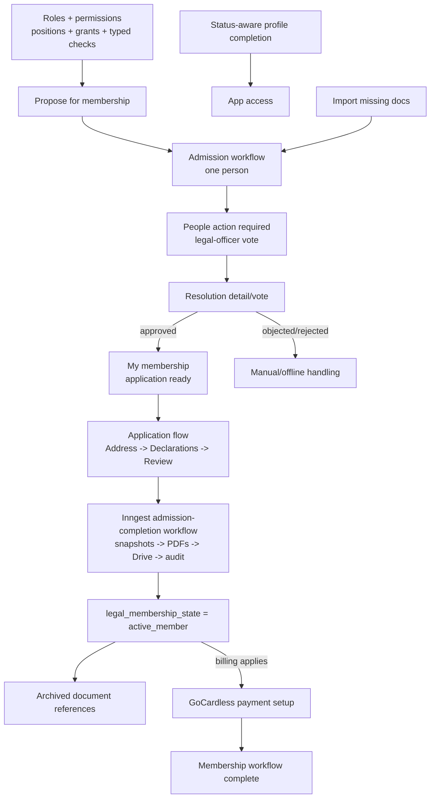
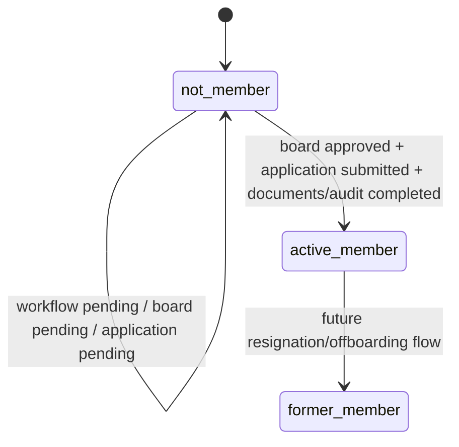
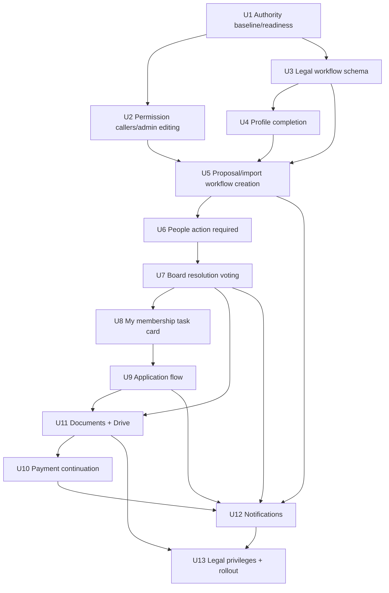
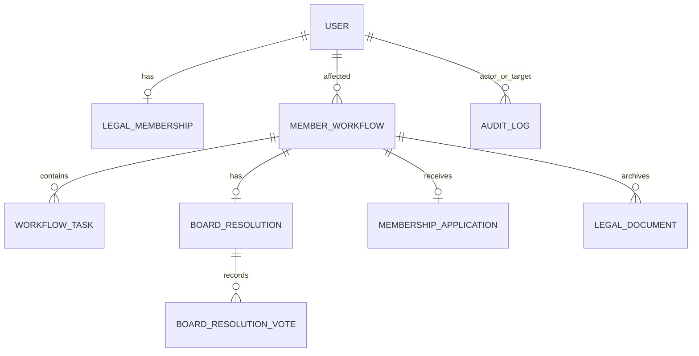

# Membership Lifecycle Workflows

## Overview

Build the new START Berlin membership lifecycle in staged slices: first replace the overloaded role model with a roles-and-permissions foundation, then add legal membership state, admission workflows, People action-required work, legal-officer voting, member application, payment continuation, document archival, and notifications.

This is intentionally staged because the workflow depends on reliable answers to "who is president/vice president/head of finance?", "who is a department head?", and "who may propose or vote?". Those questions are solved through the completed Stage 1 authority foundation and the follow-up hardening/refactor plans before building board resolutions.

---

## Problem Frame

START Cockpit currently treats operational status, profile completion, payment setup, and legal membership evidence as one blended concept. The membership lifecycle requirements separate these concerns: `user.status` remains operational, legal membership becomes durable state, and workflow/task records carry transient progress such as board voting, application submission, payment setup, document generation, and notifications.

The current "Complete onboarding" path creates a membership payment prompt directly. The new product shape replaces that with "Propose for membership", creates an individual board admission workflow, routes the three legal officers through People action required, lets the affected person complete a profile-completion-like legal application flow, activates legal membership after board approval plus application, and only then continues to payment setup where billing applies.

---

## Requirements Trace

- R1-R7. Separate operational status, legal membership state, workflow progress, and status-aware profile completion.
- R8-R18. Replace "Complete onboarding" with "Propose for membership"; keep task interaction contextual; put member-facing tasks in My membership and board/admin member-scoped work in People action required.
- R19-R27. Create board-resolution tasks, dedicated resolution voting, visible vote status, vote rules, post-vote return behavior, resolution finalization, and admission invitation.
- R28-R39. Build a guided member-facing finalize-membership flow with My membership card, application steps, fee acknowledgement, legal activation before payment, and payment continuation.
- R40-R43. Base legal privileges on legal membership state and create durable audit/document records.
- R44-R47. Notify legal officers and affected people at assignment, application readiness, admission confirmation, and completion points.

**Origin actors:** A1 Onboarding user, A2 Existing operational Member or Supporting Alumni, A3 Legal Member or Supporting Alumni, A4 Alumni user, A5 Department Head, A6 Legal officer, A7 Admin, A8 START Cockpit

**Origin flows:** F1 Status-aware profile completion, F2 Propose onboarding user for legal membership, F3 Import existing operational member with missing documents, F4 Finalize membership

**Origin acceptance examples:** AE1 legal state remains `not_member` while workflow is pending, AE2 onboarding address not required, AE3 active legal member address required, AE4 proposal creates People action-required work, AE5 missing-document import starts board task, AE6 resolution detail/vote screen behavior, AE7 board vote threshold/objection behavior, AE8 member waiting card, AE9 application flow and fee acknowledgement, AE10 application then payment continuation, AE11 application-ready email and card

---

## Scope Boundaries

- V1 does not support batch membership-admission resolutions.
- V1 does not introduce a universal top-level Tasks page or inbox.
- V1 does not implement digital resignation, exclusion workflows, or former-member reactivation workflows.
- V1 does not create separate operational access levels for onboarding users versus active Members.
- V1 does not make payment setup the legal admission trigger.
- V1 does not require a full future task taxonomy for IT/offboarding work.
- V1 does not require a separate member-data editing/audit portal beyond profile completion and legal admission needs.
- V1 does not resolve final legal wording, BGB/Satzung compliance, electronic-signature requirements, or final Finanzordnung wording without legal review.
- The org chart from `docs/plans/2026-04-28-002-feat-user-authority-organization-model-plan.md` is not on the critical path for this membership lifecycle plan. The authority foundation is required; the org chart UI can remain follow-up work unless the team wants to ship it at the same time.

### Deferred to Follow-Up Work

- Batch resolutions: add once individual admission workflows are proven.
- Digital resignation and former-member workflows: reuse the legal-document, audit, and workflow foundations later.
- Full IT/offboarding task center taxonomy: keep the data model adaptable, but do not design a generic inbox in v1.
- Org chart UI: can continue from the existing authority plan after the position/grant foundation is in place.

---

## Context & Research

### Relevant Code and Patterns

- `src/db/schema/auth.ts` still stores operational `status`, address/contact fields, `department`, and legacy `roles`; `roles` is compatibility data, not an authorization source for new workflow code.
- `src/lib/authority/model.ts`, `src/lib/authority/assignments.ts`, and `src/lib/authority/board-roster.ts` define the authority domain vocabulary, valid assignment matrix, and strict legal-officer roster setup.
- `src/lib/permissions/evaluate.ts`, `src/lib/permissions/server.ts`, `src/lib/permissions/authority-context.tsx`, and `src/components/can.tsx` provide the current permission architecture: server enforcement uses typed `can()`, client affordances use `<Can>`/`useCan()`, and the shared pure evaluator is plumbing underneath those APIs.
- `docs/plans/2026-05-02-002-fix-stage-one-authority-hardening-plan.md`, `docs/plans/2026-05-02-003-refactor-permission-policy-api-plan.md`, and `docs/plans/2026-05-03-001-refactor-auth-permission-architecture-plan.md` are completed Stage 1 follow-up plans and supersede earlier raw-role and generic-board-seat assumptions.
- `src/schema/onboarding-progress.ts` currently treats address as part of profile onboarding; this must become status/legal-state-aware.
- `src/app/(authenticated)/(onboarding)/onboarding/[step]/` already has a focused multi-step profile completion shell that the membership application flow should mirror.
- `src/components/people-table.tsx` currently hosts the "Invite to finalize membership" action and is the natural place to add People action required.
- `src/app/(authenticated)/(app)/people/complete-onboarding-action.ts` currently creates membership payment setup directly; this becomes proposal workflow creation.
- `src/app/(authenticated)/(app)/membership/page.tsx`, `src/app/(authenticated)/(app)/membership/onboarding.tsx`, and `src/app/(authenticated)/(app)/membership/billing-copy.ts` already split membership section and tools section and should become the My membership task card surface.
- `src/db/schema/membership.ts`, `src/db/membership.ts`, `src/lib/membership-status.ts`, and `src/lib/gocardless/` contain current payment state and GoCardless subscription creation.
- `src/app/(authenticated)/(app)/people/import-google-user-action.ts` imports existing Workspace users and currently creates payment rows for Members/Supporting Alumni; this must ask for document evidence and start legal admission when documents are missing.
- `src/emails/membership-payment-ready.tsx` and `src/emails/start-cockpit-enabled.tsx` show current React Email patterns.
- `src/lib/google-auth.ts` and Google Workspace code provide the existing service-account auth pattern; Drive archival can reuse that credential style with Drive scopes.
- Existing tests use Node's built-in `node:test` runner, as seen in `src/lib/membership-status.test.ts`, `src/app/(authenticated)/(app)/membership/billing-copy.test.ts`, and people import tests.

### Institutional Learnings

- `docs/solutions/conventions/reusable-tone-of-voice-and-wording-decisions-2026-05-02.md` is the source for wording decisions. New copy should be warm/direct, explain user-visible outcomes before system mechanics, avoid provider/internal-status emphasis, use member-centered labels, and follow the retry/support error pattern.
- For membership payment copy, keep cost/cadence/purpose concrete. For admin actions, name the operational outcome, not the mechanism.
- Exact new legal wording should preserve the tone conventions but be validated separately against the Satzung and Finanzordnung.

### External References

- Local patterns cover Next.js App Router, Drizzle schema, next-safe-action, Inngest, React Email, Resend, Google service-account auth, and GoCardless reconciliation.
- React-PDF v4 docs are the external reference for the v1 PDF renderer: the Node API supports rendering to `Buffer`, advanced features cover page wrapping/fixed footers/dynamic page numbers, and component docs cover PDF primitives and document metadata.
- Legal and financial wording require human legal/Satzung/Finanzordnung review rather than web-derived implementation assumptions.

---

## Key Technical Decisions

- Build on the completed roles-and-permissions foundation: officer lookup, proposal permissions, and voting eligibility should use authority positions/grants plus typed permission checks, not legacy `roles`.
- Snapshot the eligible legal-officer roster when a resolution is created: a resolution should preserve each voter's board function and eligibility from the moment the board task is assigned, so later authority changes do not rewrite legal history.
- Block v1 resolution creation unless `getBoardRosterSetup()` can identify exactly three distinct legal officers: president, vice president, and head of finance. The board-vote rule is explicitly two of three, so a two-person, four-person, missing-officer, duplicate-officer, or overlapping-officer setup should be an admin setup error, not a silently different legal process.
- Keep authorization API boundaries explicit: server actions/routes/pages enforce with `can()`, client UI hides or enables affordances with `<Can>`/`useCan()`, and new workflow code should only call `evaluateAuth()` inside permission infrastructure or tests.
- Keep legal membership state intentionally small: `not_member`, `active_member`, and `former_member`.
- Store admission workflow progress separately from legal state: proposal, board vote, application, document, and payment task states belong to workflow/task tables.
- Keep tasks contextual: My membership owns member-facing task cards; People owns board/admin member-scoped action required.
- Use individual workflows only: one affected person per admission workflow in v1.
- Treat legal activation and payment activation separately: application confirmation sets legal membership active, and payment setup remains a required next workflow step when billing applies.
- Preserve operational status intentionally: onboarding users should become operational `member` when admission is confirmed; imported Supporting Alumni should keep `supporting_alumni`.
- Use document snapshots as durable source for PDFs: generated PDFs and Drive IDs are archived outputs, while database snapshots/audit records remain authoritative for workflow state.
- Use wording solution docs as copy guidance: do not invent a new tone for legal/task copy during implementation.

---

## Open Questions

### Resolved During Planning

- How should current legal board voters and officer functions be determined? Use the completed authority model: president, vice president, and head of finance are the three eligible legal officers, while permissions remain explicit policy rules.
- Should the authority plan be folded into this plan? Yes, the authority foundation is the first stage. Org-chart-specific work from that plan is not required for this membership lifecycle path.
- Where should board/admin task work live? In People action required, not a universal top-level Tasks inbox.
- Where should member task work live? In a single prominent My membership task card.
- When does legal membership become active? After board approval, complete application, and admission confirmation; before payment setup completes.

### Deferred to Implementation

- Exact Drizzle migration filenames and generated SQL details for Stage 2+ schema work. Stage 1 authority constraints already exist in the completed hardening migrations.
- Exact route segment names for resolution and application pages, as long as the user-facing surfaces match the plan.
- Exact PDF layout details. The renderer choice is resolved for v1: use `@react-pdf/renderer` behind the server-side document rendering adapter, rendering only from immutable snapshots.
- Exact final legal copy for resolution text, membership declarations, and fee acknowledgement after legal/Satzung/Finanzordnung review.
- Whether Google Drive folder IDs are configured as separate env vars or through one root folder plus deterministic subfolders.
- Exact Google Drive group/folder ownership details, while preserving the v1 security requirement that generated legal documents are not public, not anyone-with-link, and visible only to the configured administrative/legal operators.

---

## Phased Delivery

### Stage 1: Authority Foundation

Land enough of the authority/org model to determine named legal officers, scoped Department Heads, and admins without relying on legacy `roles`.

Stage 1 has been completed through the authority hardening and permission architecture refactors listed in Context & Research. Board-resolution workflows can now depend on server-enforced group/admin authority, valid authority assignment combinations, singleton officer constraints, strict legal-officer roster validation, typed `can()` checks, and client-only `<Can>`/`useCan()` affordances. The remaining P2 gap is boundary-test coverage for the group API/server-action authorization paths and the authority update denial path; Stage 2 implementation should add those tests before or alongside the first workflow code that depends on those boundaries.

### Stage 2: Legal Membership And Workflow Core

Add legal membership state, admission workflow/task/resolution/application/document/audit schemas, and domain services.

### Stage 3: Profile Completion And Imports

Make profile completion status/legal-state-aware and change imports/proposals to create admission workflows instead of payment prompts.

### Stage 4: People Action Required And Board Voting

Add the People action-required view, resolution detail/vote screen, vote recording, finalization, and board notifications.

### Stage 5: Member Application And Payment Continuation

Add the My membership task card, dedicated application flow, fee acknowledgement, and submit-to-processing transition. The user-facing submit action records the immutable application snapshot and enqueues the durable admission-completion workflow; it does not directly mark legal membership active.

### Stage 6: Documents, Drive, Audit, And Rollout Hardening

Generate legal PDFs, archive them in Drive, store hashes/references, complete legal activation through Inngest, create payment-required tasks, tighten legal privilege checks, and add operational verification.

---

## High-Level Technical Design

> *This illustrates the intended approach and is directional guidance for review, not implementation specification. The implementing agent should treat it as context, not code to reproduce.*

---

## Implementation Units

- U1. **Authority Baseline And Workflow Readiness**

**Goal:** Treat the completed Stage 1 authority and permission implementation as the baseline, verify it against the membership workflow needs, and add any remaining membership-specific helpers without rebuilding existing authority files.

**Requirements:** Membership requirements supported: R8-R9, R19, R27, R40; authority plan R1-R13, R20-R24

**Dependencies:** None

**Files:**
- Existing baseline: `src/db/schema/authority.ts`
- Existing baseline: `src/db/authority.ts`
- Existing baseline: `src/lib/authority/model.ts`
- Existing baseline: `src/lib/authority/assignments.ts`
- Existing baseline: `src/lib/authority/board-roster.ts`
- Modify: `src/db/schema/index.ts`
- Modify: `src/db/schema/auth.ts`
- Modify: `src/db/people.ts`
- Existing baseline: `src/lib/permissions/evaluate.ts`
- Existing baseline: `src/lib/permissions/index.ts`
- Modify: `src/lib/permissions/server.ts`
- Existing baseline replacement: `src/lib/permissions/authority-context.tsx`
- Modify: `src/components/can.tsx`
- Modify: `src/app/(authenticated)/(app)/layout.tsx`
- Existing generated baseline: `drizzle/0010_careless_jack_murdock.sql`
- Existing generated baseline: `drizzle/0011_yummy_rhino.sql`
- Test: `src/lib/permissions/permissions.test.ts`
- Test: `src/lib/authority/assignments.test.ts`
- Test: `src/lib/permissions/permissions.typecheck.ts`

**Approach:**
- Use the Stage 1 authority model from `src/lib/authority/*`: persisted global officer positions are `president`, `vice_president`, and `head_of_finance`; persisted department position is `department_head`; persisted access grant is global `admin`.
- Support global and department scope only where the shared assignment schema and database constraints allow them.
- Keep legacy role-array permission checks out of workflow code. Permission checks go through server `can()` or client `<Can>`/`useCan()`; `evaluateAuth()` remains shared evaluator plumbing.
- Keep admin explicit in permission policies rather than as an invisible bypass.
- Add helpers for current legal officers and board functions. These helpers are used later by board resolution creation/finalization.
- Add the membership-specific permission vocabulary needed by later units, such as `membership.propose`, `membership.vote_resolution`, `membership.view_resolution`, and `membership.manage_workflows`.
- Allow Department Heads to propose only within their scoped department context, while legal officers and Admins can propose according to explicit policy.
- Use `getBoardRosterSetup()` as the workflow preflight. It returns the three eligible legal officer IDs plus officer functions, or a typed setup error when the authority data is incomplete, duplicated, overlapping, or over-complete for the v1 two-of-three procedure.
- Backfill legacy `roles` only where there is a valid one-to-one mapping: legacy `admin` becomes global admin grant, legacy `department_lead` with department becomes scoped department-head position, and legacy `member` creates no authority assignment. Legacy generic `board` must not create a generic board seat; admins should assign president, vice president, or head of finance explicitly.

**Execution note:** The authority foundation, hardening, predicate policy API, and module split have been implemented first. Future work should verify the existing schema/API/migration names and add only missing membership-specific helpers rather than creating parallel authority tables or a second migration path.

**Patterns to follow:**
- `docs/plans/2026-05-02-002-fix-stage-one-authority-hardening-plan.md`, `docs/plans/2026-05-02-003-refactor-permission-policy-api-plan.md`, and `docs/plans/2026-05-03-001-refactor-auth-permission-architecture-plan.md` for the current authority model and permission API.
- `src/db/schema/membership.ts` for separate domain schema structure.
- `src/lib/membership-status.ts` and `src/lib/membership-status.test.ts` for focused pure-helper style.

**Test scenarios:**
- Happy path: global admin grant allows actions where the policy lists admin.
- Happy path: department-head position scoped to Events grants a scoped action for an Events target.
- Edge case: department-head position scoped to Events denies the same action for a Growth target.
- Edge case: legal officer positions grant only the permissions explicitly listed in policy and do not imply admin/user-management access.
- Edge case: scoped permission without target department fails closed.
- Migration: legacy `admin` becomes global admin grant, `department_lead` with department becomes scoped department-head position, generic `board` creates no authority assignment, and `member` creates no authority assignment.
- Edge case: board roster validation fails when there are fewer than three or more than three eligible legal officers.
- Edge case: board roster validation fails when required officer functions for resolution documentation cannot be determined.
- Integration: server `can()`, client `<Can>`, and client `useCan()` consume the same typed policy vocabulary.

**Verification:**
- Current app permission callers compile against the new authority API.
- Legal-officer lookup can return current president, vice president, head of finance, and legal-officer participant IDs.
- `user.roles` is no longer an authorization source.

---

- U2. **Permission Caller Migration And Admin Editing**

**Goal:** Treat the Stage 1 caller migration and admin authority editor as the baseline, then close any remaining membership-specific gaps before workflows depend on them.

**Requirements:** Origin R8-R9, R15-R19; authority plan R14-R24

**Dependencies:** U1

**Files:**
- Modify: `src/app/(authenticated)/(app)/people/create-user-action.ts`
- Modify: `src/app/(authenticated)/(app)/people/complete-onboarding-action.ts`
- Modify: `src/app/(authenticated)/(app)/people/[id]/page.tsx`
- Modify: `src/app/(authenticated)/(app)/people/[id]/profile-card.tsx`
- Existing baseline: `src/app/(authenticated)/(app)/people/[id]/authority-card.tsx`
- Existing baseline: `src/app/(authenticated)/(app)/people/[id]/update-authority-action.ts`
- Existing baseline: `src/components/authority-editor.tsx`
- Modify: `src/db/groups.ts`
- Modify: `src/db/schema/group.ts`
- Modify: `src/components/group-criteria-manager.tsx`
- Modify: `src/components/bulk-add-users-dialog.tsx`
- Modify: `src/app/api/users/search-by-criteria/route.ts`
- Test: `src/lib/permissions/permissions.test.ts`

**Approach:**
- Verify existing server actions and route/page guards use the new typed `can(action, context?)` shape, including department context for target-scoped actions.
- Verify the admin-only member-detail UI can edit positions and grants needed by membership workflows.
- Keep group-local `users_to_groups.role` separate from authority positions/grants.
- Stop creating/evaluating legacy auth-role group criteria or convert them deliberately if implementation finds a safe one-to-one path.
- Make create-user department optional where needed by the authority model.
- Keep client components on `<Can>` or `useCan()` for affordance checks. Do not import the low-level evaluator into feature components.

**Patterns to follow:**
- `src/app/(authenticated)/(app)/people/[id]/profile-card.tsx` for detail-page card composition.
- `src/app/(authenticated)/(app)/people/create-user-dialog.tsx` for form/select ergonomics.
- Existing permission gate patterns, but with the new authority context.

**Test scenarios:**
- Happy path: admin can add president, vice president, head of finance, department-head, and admin assignments where valid.
- Error path: non-admin direct authority update action is denied.
- Edge case: department-scoped assignment without department is rejected.
- Regression: group membership admin/member role still works as a group-local concept.
- Regression: user creation no longer depends on `roles` for permissions and still checks exact Google Workspace email conflicts.
- Regression: group API/server-action authorization boundaries deny unauthorized callers before data access or mutation.

**Verification:**
- Admins can maintain legal-officer assignments before creating membership resolutions.
- Existing people/groups permissions still behave through the new authority model.

---

- U3. **Legal Membership, Workflow, And Audit Schema**

**Goal:** Add the persistent data model for legal membership state, individual admission workflows, tasks, board resolutions, votes, applications, legal documents, and audit records.

**Requirements:** R1-R5, R10-R12, R18-R19, R23-R25, R27, R37, R40-R43; AE1, AE5, AE7

**Dependencies:** U1

**Files:**
- Create: `src/db/schema/legal-membership.ts`
- Create: `src/db/schema/member-workflow.ts`
- Create: `src/db/legal-membership.ts`
- Create: `src/db/member-workflows.ts`
- Create: `src/db/audit-log.ts`
- Create: `src/inngest/membership-lifecycle-workflow.ts`
- Modify: `src/db/schema/index.ts`
- Modify: `src/lib/id.ts`
- Create or generate: `drizzle/*`
- Test: `src/db/member-workflows.test.ts`

**Approach:**
- Add durable legal membership state with `not_member`, `active_member`, and `former_member`.
- Store legal membership state separately from `user.status`.
- Use an explicit migration/import classification instead of deriving legal membership from `user.status` alone:
  - Operational `onboarding` users start as `not_member`.
  - Operational `alumni` users start as `former_member`.
  - Operational `member` and `supporting_alumni` users become `active_member` when an authorized admin import/backfill decision says sufficient existing membership documents are available.
  - Operational `member` and `supporting_alumni` users with missing or unknown documents remain `not_member`; admins can create or import them into the same admission workflow used for onboarding users.
  - Unknown document state must never silently grant `active_member`.
- Add an individual admission workflow record tied to exactly one affected user in v1, and allow a lightweight payment-setup workflow/task for legal members who do not need an admission workflow but still need billing setup.
- Add workflow tasks with concrete assignee user IDs where a task is tied to a snapshot participant, kind, status, action target, and completion data. Keep task vocabulary adaptable but only implement proposal/board/application/payment-related task kinds needed for v1.
- Add board resolution roster snapshot records plus vote records with voter user ID, board function snapshot, vote value, timestamp, and displayed-text hash or version reference.
- Add application snapshot records with address, declarations, fee acknowledgement, version labels, submitted timestamp, related workflow/resolution, and status.
- Add legal document references and audit log tables for immutable history and document/hash tracking.
- Add workflow event/side-effect records or status fields that let Inngest steps run idempotently and retry safely without duplicating tasks, documents, legal-state transitions, or emails.
- The Inngest lifecycle workflow should own durable transitions that cross side-effect boundaries: board-resolution assignment notifications, resolution approval follow-up, application submission processing, legal-document rendering/Drive archival, legal activation, payment-task creation, and lifecycle notification sends.
- Extend `src/lib/id.ts` with prefixes for workflow, task, resolution, vote, application, document, and audit records.

**Technical design:** Directional entity relationship:

**Patterns to follow:**
- `src/db/schema/membership.ts` for membership-adjacent domain tables.
- `src/db/membership.ts` for small domain service helpers.
- Existing Drizzle relations in `src/db/schema/index.ts`.

**Test scenarios:**
- Covers AE1. An affected user with a pending workflow remains legally `not_member`.
- Happy path: creating an admission workflow creates a taskable workflow tied to one affected user.
- Happy path: a document-verified imported Member or Supporting Alumni becomes `active_member` through an authorized admin import decision and receives a payment setup task when billing applies.
- Happy path: application snapshot can be tied to its workflow and board resolution.
- Edge case: v1 rejects or prevents workflows with more than one affected user.
- Edge case: finalized legal document records are append-only through domain helpers.
- Edge case: operational `member` or `supporting_alumni` without document classification does not become `active_member`.
- Edge case: repeating the same Inngest event does not duplicate tasks, documents, legal-state transitions, or notification records.
- Error path: duplicate active admission workflow for the same affected user is rejected or safely reused according to the selected service behavior.

**Verification:**
- The schema can represent every origin workflow state without using legal membership state as workflow progress.
- Migration path exists for existing users to receive legal membership state from explicit document classification, not operational status alone.

---

- U4. **Status-Aware Profile Completion**

**Goal:** Change profile completion so all users must provide personal email and phone, while address is required only for active legal Members and Supporting Alumni.

**Requirements:** R4, R6-R7, R29; AE2, AE3

**Dependencies:** U3

**Files:**
- Modify: `src/schema/onboarding-progress.ts`
- Modify: `src/app/(authenticated)/(app)/layout.tsx`
- Modify: `src/app/(authenticated)/(onboarding)/onboarding/[step]/layout.tsx`
- Modify: `src/app/(authenticated)/(onboarding)/onboarding/[step]/page.tsx`
- Modify: `src/app/(authenticated)/(onboarding)/onboarding/[step]/(steps)/index.tsx`
- Modify: `src/app/(authenticated)/(onboarding)/onboarding/[step]/(steps)/step-master-data.tsx`
- Modify: `src/app/(authenticated)/(onboarding)/onboarding/[step]/(steps)/step-address.tsx`
- Modify: `src/app/(authenticated)/(onboarding)/onboarding/[step]/(steps)/step-address-action.ts`
- Test: `src/schema/onboarding-progress.test.ts`

**Approach:**
- Replace current fixed `master-data -> address -> completed` logic with a requirement-aware profile completion helper.
- Load legal membership state where app layout decides whether to redirect into profile completion.
- Keep the current focused profile completion experience, but include/exclude address step based on legal/operational requirements.
- Onboarding users, Alumni, and operational Members/Supporting Alumni whose legal state is `not_member` require personal email and phone only.
- Active legal Members and Supporting Alumni require address and remain blocked until it is complete.
- Follow copy guidance from `docs/solutions/conventions/reusable-tone-of-voice-and-wording-decisions-2026-05-02.md` for any changed helper text.

**Patterns to follow:**
- Current `src/schema/onboarding-progress.ts` pure helper style.
- Current onboarding step layout under `src/app/(authenticated)/(onboarding)/onboarding/[step]/`.

**Test scenarios:**
- Covers AE2. Onboarding user with personal email and phone but no address is profile-complete.
- Covers AE3. Active legal Member with personal email and phone but no address is redirected to address completion.
- Happy path: active legal Supporting Alumni with full address is profile-complete.
- Happy path: Alumni with personal email and phone but no address is profile-complete.
- Edge case: operational Member with legal state `not_member` and no address is profile-complete but still has membership workflow tasks.
- Error path: missing phone or personal email blocks every status/legal-state combination.

**Verification:**
- Address is no longer required for onboarding users.
- Active legal Members/Supporting Alumni cannot use the app without address.

---

- U5. **Admission Workflow Creation From People And Imports**

**Goal:** Replace direct payment invitation with legal admission workflow creation for onboarding users, and start the same workflow immediately for imports with missing documents.

**Requirements:** R8-R12, R15-R19; AE4, partial AE5. R44 email delivery is completed in U12.

**Dependencies:** U1, U3, U4

**Files:**
- Modify: `src/components/people-table.tsx`
- Modify: `src/app/(authenticated)/(app)/people/complete-onboarding-action.ts`
- Create: `src/app/(authenticated)/(app)/people/propose-membership-action.ts`
- Modify: `src/app/(authenticated)/(app)/people/import-google-user-schema.ts`
- Modify: `src/app/(authenticated)/(app)/people/import-google-user-dialog.tsx`
- Modify: `src/app/(authenticated)/(app)/people/import-google-user-action.ts`
- Test: `src/app/(authenticated)/(app)/people/import-google-user-schema.test.ts`
- Test: `src/app/(authenticated)/(app)/people/import-google-user-action.test.ts`
- Test: `src/db/member-workflows.test.ts`

**Approach:**
- Rename/reframe "Complete onboarding" to "Propose for membership".
- The action should call `can("membership.propose", { targetDepartment })` so Department Heads can propose only within their scoped department, while legal officers and Admins can propose according to explicit policy.
- Proposal creates an individual admission workflow and board-resolution task for all current eligible legal officers.
- Proposal/import workflow creation must validate and snapshot exactly three eligible legal officers before tasks are assigned. If authority data is missing, duplicated, overlapping, or over-complete, return an admin-facing setup error and do not create a partial resolution.
- Proposal must not create a membership payment row or send payment-ready email.
- Proposal/import transitions should enqueue durable Inngest events for notification/task side effects. React Email templates and exact copy land in U12, but the workflow/event boundary should be introduced with the domain transition so retries are available from the start.
- Importing Members or Supporting Alumni as already documented legal members must be limited to explicit authority policy, e.g. global Admins. This is a trusted administrative decision in v1, not a document-upload or attestation workflow.
- Import flow must ask whether sufficient membership documents exist for imported Members and Supporting Alumni with a required "Membership documents" control:
  - `Documents verified`: authorized admin confirms START Berlin has sufficient existing membership documents for this person.
  - `Documents missing or unsure`: treat as missing documents; do not grant legal membership from operational status.
- If documents exist, set legal membership state to `active_member`, require address through profile completion, create or reuse the current `membership_payment` record, and create a payment-required workflow/task when billing applies. This path skips board/application admission workflow because legal membership already exists.
- If documents are missing, set legal state to `not_member`, keep operational status, and immediately create the same board admission workflow and legal-officer tasks.
- Alumni imports stay out of active membership/legal admission unless a separate future product decision changes that.
- Use the wording solution doc for action labels, descriptions, errors, and email tone.

**Patterns to follow:**
- Existing next-safe-action style in `complete-onboarding-action.ts`.
- Existing import search/submit flow in `import-google-user-action.ts` and `import-google-user-dialog.tsx`.
- Existing email build pattern in `src/app/(authenticated)/(app)/people/import-google-user-email.ts`.

**Test scenarios:**
- Covers AE4. Department Head proposes an onboarding user and one individual board-resolution workflow appears in legal officers' action-required state.
- Covers AE5 except email delivery, which is completed in U12. Importing Supporting Alumni with missing documents preserves operational status, sets legal state `not_member`, and creates admission workflow plus legal-officer tasks.
- Happy path: importing Member with documents sets legal state `active_member` and does not create admission workflow.
- Happy path: importing Member or Supporting Alumni with documents and billing requirements creates the payment setup state/task without requiring a board/application workflow.
- Edge case: choosing "documents missing or unsure" is treated as missing documents and cannot activate legal membership.
- Edge case: proposing the same user twice reuses or blocks duplicate active workflow.
- Edge case: proposal fails without creating workflow rows when board roster validation fails.
- Error path: unauthorized user cannot propose membership.
- Error path: import submit is rejected when Member/Supporting Alumni document status is missing or the actor lacks admin authority.
- Regression: payment row is not created by proposal.
- Regression: imported Alumni still does not require membership billing.

**Verification:**
- The old direct "complete onboarding -> payment" path is gone.
- All admission paths enter the same workflow foundation.

---

- U6. **People Action Required View**

**Goal:** Add the member-scoped Action required tab in People for board/admin workflows requiring the current user's attention.

**Requirements:** R13-R18, R19-R20, R26; AE4, AE6

**Dependencies:** U1, U3, U5

**Files:**
- Modify: `src/app/(authenticated)/(app)/people/page.tsx`
- Modify: `src/app/(authenticated)/(app)/people/page-client.tsx`
- Modify: `src/components/people-table.tsx`
- Modify: `src/db/people.ts`
- Create: `src/db/people-actions.ts`
- Test: `src/db/people-actions.test.ts`

**Approach:**
- Add Action required as a first-class tab on the People page, not a top-level Tasks page.
- Use the existing shadcn/Radix `Tabs`, `TabsList`, `TabsTrigger`, and `TabsContent` components with two tabs:
  - `Directory`: the existing People table and existing create/import actions.
  - `Action required`: member-scoped workflow tasks assigned to or actionable by the current user.
- Default to `Action required` when the current user has open actions; otherwise default to `Directory`. Support `?view=actions` and `?view=directory` so vote completion can redirect back predictably.
- Show an action count in the `Action required` tab using `Badge`. Keep the badge hidden or zero-muted when no actions exist.
- The Action required tab should reuse the existing table pattern (`Table`, `TableHeader`, `TableBody`, `TableRow`, `TableCell`) rather than cards. Columns should be: member, operational/legal status summary, workflow/task, due/created date if available, and primary action.
- Use `Button` for primary row actions such as "Vote" or "Review"; row click can also navigate to the dedicated screen, but the button must remain keyboard accessible.
- Use the existing `Empty` component for the no-actions state and `Alert` for admin-facing setup errors such as incomplete legal-officer authority data.
- Query member-scoped workflow tasks assigned to the current user and return person rows with task summary and primary action. Board vote tasks should be assigned to the concrete legal-officer roster snapshot participants, not inferred from live authority positions on every page load.
- Keep the existing People directory view intact.
- Each action row should include person name, operational status/legal state summary where useful, workflow type, current task summary, and a primary action such as "Vote".
- Action row click/primary action should route to the appropriate dedicated screen, starting with resolution detail/vote.
- Users who are neither snapshotted legal officers nor assigned admins should not see board/admin-only tasks.

**Patterns to follow:**
- Existing `src/components/people-table.tsx` table shape and row navigation.
- Existing `src/db/people.ts` mapping style.
- Existing copy conventions from `docs/solutions/conventions/reusable-tone-of-voice-and-wording-decisions-2026-05-02.md`.

**Test scenarios:**
- Covers AE4. Legal officer sees a proposed onboarding user in Action required with board vote needed.
- Happy path: Admin sees relevant member-scoped admin tasks if assigned/eligible.
- Edge case: legal officer who already voted no longer sees that row if no further action is needed from them.
- Edge case: regular member sees no board/admin action-required rows.
- Edge case: `?view=actions` with zero actions shows the empty state and keeps Directory one click away.
- Error path: stale task for deleted/missing user does not crash People page and is omitted or marked unavailable.

**Verification:**
- People has a clear Action required view/filter.
- Board/admin work remains contextual to People rather than creating a top-level task inbox.

---

- U7. **Board Resolution Detail, Voting, And Finalization**

**Goal:** Build the dedicated resolution detail/vote screen, vote recording behavior, 2-of-3 approval rule, procedure objection handling, and finalization role assignment.

**Requirements:** R19-R27, R41; AE6, AE7. R44/R45 notification delivery is completed in U12.

**Dependencies:** U1, U3, U5, U6

**Files:**
- Create: `src/app/(authenticated)/(app)/people/resolutions/[id]/page.tsx`
- Create: `src/app/(authenticated)/(app)/people/resolutions/[id]/resolution-vote-client.tsx`
- Create: `src/app/(authenticated)/(app)/people/resolutions/[id]/vote-action.ts`
- Create: `src/db/board-resolutions.ts`
- Create: `src/lib/board-resolution-rules.ts`
- Test: `src/lib/board-resolution-rules.test.ts`
- Test: `src/db/member-workflows.test.ts`

**Approach:**
- The detail screen shows affected person context, resolution text, status, all legal-officer vote states, legal/confirmation copy, and vote actions: yes, no, abstain, procedure objection.
- Snapshotted legal officers see current vote status by person/function/timestamp before finalization.
- The resolution record uses the board roster/function snapshot created when the resolution was assigned; each vote records the voter, vote value, timestamp, and displayed text/version.
- Resolution view/vote access must bind to the resolution's roster snapshot, not only to live authority state. Only the user IDs snapshotted as eligible voters for that resolution, with an open vote task for that resolution, may vote. A person who becomes a legal officer after the resolution was created, or who is a legal officer in live authority data but absent from that resolution snapshot, cannot vote on that resolution. Admins may view/admin-handle according to explicit policy but must not be counted as voters unless they are in the snapshot.
- Board votes are immutable in v1. A snapshotted legal officer can cast exactly one vote; duplicate vote submissions are rejected and the UI shows the submitted vote state instead of active vote buttons.
- After a vote, redirect back to People action required and show confirmation toast.
- Resolution passes only when at least two of three snapshotted legal officers vote yes and nobody has objected to the electronic procedure.
- Procedure objection stops electronic finalization and leaves workflow in manual/offline handling state.
- On approval, determine chair/procedure-lead and minute-taker from officer functions according to the requirements/spec logic and persist the final assignment.
- On approval, create/advance the member application task and record or enqueue the application-ready notification transition. The actual email template/send wiring lands in U12.
- U7 may create structured document/audit records needed for the workflow transition; readable PDF rendering, Drive archival, and hash storage are completed in U11 before production rollout.

**Patterns to follow:**
- Existing server action style in `src/app/(authenticated)/(app)/groups/[id]/actions.ts`.
- Existing `sonner` toast pattern in `src/components/people-table.tsx`.
- Authority helper from U1 for current legal-officer lookup.

**Test scenarios:**
- Covers AE6. Legal officer opens resolution detail and sees person, resolution text, status, all legal-officer vote states, legal copy, and four vote options.
- Covers AE6. After voting, legal officer returns to People action required and receives a confirmation toast.
- Covers AE7. Two yes votes and no objection approves the resolution.
- Covers AE7. Any procedure objection stops electronic finalization.
- Edge case: one yes plus one abstain plus one no does not approve.
- Edge case: silence never counts as yes.
- Edge case: same legal officer changing/revoting is rejected because v1 votes are immutable.
- Edge case: a current legal officer who is not part of this resolution's roster snapshot cannot vote on that resolution.
- Error path: non-legal-officer cannot access or vote on the resolution.
- Error path: voting on finalized resolution is rejected.

**Verification:**
- Board resolutions can move from pending to approved, rejected/manual, or procedure-objected according to the product rules.
- Vote records include the audit-critical snapshots needed for documentation.

---

- U8. **My Membership Task Card And Application Shell**

**Goal:** Replace the current payment-first membership section with a single task card that shows board-pending, application-required, payment-required, or all-done states and opens a dedicated application flow when ready.

**Requirements:** R14, R28-R34, R45; AE8, AE9, AE11

**Dependencies:** U3, U4, U5, U7

**Files:**
- Modify: `src/app/(authenticated)/(app)/membership/page.tsx`
- Modify: `src/app/(authenticated)/(app)/membership/onboarding.tsx`
- Modify: `src/app/(authenticated)/(app)/membership/billing-copy.ts`
- Create: `src/app/(authenticated)/(app)/membership/task-card.tsx`
- Create: `src/app/(authenticated)/(app)/membership/application/[step]/layout.tsx`
- Create: `src/app/(authenticated)/(app)/membership/application/[step]/page.tsx`
- Create: `src/app/(authenticated)/(app)/membership/application/[step]/(steps)/index.tsx`
- Test: `src/app/(authenticated)/(app)/membership/billing-copy.test.ts`

**Approach:**
- Create a membership task view-state helper that considers legal membership, workflow/application task state, and payment state.
- Preserve the tools section behavior independently from membership task state.
- Board-pending members see a waiting state only: no vote details, no legal-officer names, no vote progress.
- Procedure-objected, rejected, or manual/offline workflows should show a calm waiting/manual-handling state for the affected member and an admin-facing follow-up state in People. Member-facing copy must not expose individual vote details.
- Application-ready state links to the dedicated application flow.
- Submitted-processing state tells the user the application is being completed and hides payment/all-done until the Inngest admission-completion workflow finishes.
- Payment-required state uses existing payment setup copy conventions and payment button.
- All-done state reassures the user that membership/payment setup is complete.
- Copy must follow `docs/solutions/conventions/reusable-tone-of-voice-and-wording-decisions-2026-05-02.md`.

**Patterns to follow:**
- Current `MembershipPageContent` split between membership section and tools section.
- Existing `billing-copy.ts` pure helper and tests.
- Existing profile completion layout for focused step pages.

**Test scenarios:**
- Covers AE8. Missing-document operational Member with pending admission sees waiting task card and no vote details.
- Covers AE11. Board-approved member sees application-required card.
- Happy path: payment-required user sees payment setup card after the admission-completion workflow finishes.
- Happy path: complete user sees all-done card.
- Edge case: user with no active workflow and legal state `not_member` receives a safe waiting/contact-admin state rather than payment prompt.
- Edge case: procedure-objected/manual workflow does not show application or payment setup to the affected member.
- Regression: Slack/Notion tools visibility remains driven by operational status.

**Verification:**
- My membership communicates exactly one next membership task.
- Payment setup is no longer shown before legal application is ready/complete.

---

- U9. **Membership Application Flow**

**Goal:** Build the dedicated application flow with Address, Declarations, and Review & submit steps, including explicit fee acknowledgement.

**Requirements:** R29, R32-R38, R41-R43, R45-R46; AE9, AE10

**Dependencies:** U3, U4, U8

**Files:**
- Create: `src/app/(authenticated)/(app)/membership/application/[step]/(steps)/step-address.tsx`
- Create: `src/app/(authenticated)/(app)/membership/application/[step]/(steps)/step-declarations.tsx`
- Create: `src/app/(authenticated)/(app)/membership/application/[step]/(steps)/step-review.tsx`
- Create: `src/app/(authenticated)/(app)/membership/application/[step]/application-validation.ts`
- Create: `src/app/(authenticated)/(app)/membership/application/[step]/submit-application-action.ts`
- Create: `src/db/membership-applications.ts`
- Test: `src/db/member-workflows.test.ts`
- Test: `src/app/(authenticated)/(app)/membership/application/application-validation.test.ts`

**Approach:**
- Reuse the focused profile completion feel: clear steps, blocking progression, completion redirect.
- Application pages and submit actions must load the active application task for the current authenticated user as the affected user. They must reject workflow/application IDs that do not belong to `ctx.user.id` and must never accept a client-supplied affected-user ID for legal activation.
- Step 1 collects address/contact address and can prefill from existing user address when available.
- Step 2 collects legal declarations, including natural person/legal capacity, support for START Berlin's purpose, bylaws acceptance, privacy notice acknowledgement, and explicit membership-fee acknowledgement.
- The fee acknowledgement field should use the origin wording unless legal review replaces it: "I understand that, according to §2 of the Financial Regulations of START Berlin e.V., a membership fee of €20 per semester applies. Upon becoming a member, €40 are due for the first year, and subsequent annual payments of €40 are due every 12 months. I understand that the membership fee is non-refundable if I leave the association early."
- Fee acknowledgement text direction comes from the origin requirements and must be validated against the Finanzordnung before production.
- Step 3 shows a review summary and final submit action.
- Submit creates the immutable application snapshot, updates user address if needed, marks the workflow/application task as submitted-processing, and enqueues the Inngest admission-completion workflow.
- The Inngest admission-completion workflow renders/stores the required legal document records, archives them in Drive with hashes, writes audit records, then sets legal state `active_member`, transitions onboarding operational status to `member`, preserves `supporting_alumni` where applicable, and creates the payment-required task if billing applies.
- While the Inngest workflow is running or retrying, My membership shows a processing state rather than payment setup or all-done.

**Patterns to follow:**
- Existing onboarding step component/action structure under `src/app/(authenticated)/(onboarding)/onboarding/[step]/`.
- Existing Zod validation style in onboarding and people import schemas.
- Wording principles from `docs/solutions/conventions/reusable-tone-of-voice-and-wording-decisions-2026-05-02.md`.

**Test scenarios:**
- Covers AE9. Application-ready user can progress through Address, Declarations, and Review & submit.
- Covers AE9. Submit is blocked unless fee acknowledgement is checked.
- Happy path: application submit stores address and declaration snapshot, then Inngest completes document/audit records, legal state `active_member`, and workflow progress.
- Covers AE10. Billing-applicable user is routed into payment setup after the admission-completion workflow finishes.
- Edge case: user whose board resolution is not approved cannot access application submit.
- Edge case: authenticated user cannot view or submit another person's application by manipulating route params or action payload.
- Edge case: user who already submitted application cannot submit a duplicate.
- Error path: missing address field returns validation error.
- Error path: manipulated declaration payload missing required confirmation is rejected server-side.

**Verification:**
- Application flow is serious and focused without being embedded in My membership.
- Legal membership activation happens after document/audit completion and before payment setup.

---

- U10. **Payment Continuation And Membership State Integration**

**Goal:** Compose existing GoCardless setup with the new admission workflow so billing follows application without becoming the legal membership trigger.

**Requirements:** R28, R37-R39, R46; AE10

**Dependencies:** U3, U8, U9, U11

**Files:**
- Modify: `src/lib/membership-status.ts`
- Modify: `src/db/membership.ts`
- Modify: `src/app/(authenticated)/(app)/membership/start-payment-action.ts`
- Modify: `src/app/(authenticated)/(redirect)/membership/payment-return/finalize-payment-action.ts`
- Modify: `src/lib/gocardless/membership-reconciliation.ts`
- Modify: `src/app/(authenticated)/(app)/membership/payment-button.tsx`
- Test: `src/lib/membership-status.test.ts`
- Test: `src/app/(authenticated)/(app)/membership/billing-copy.test.ts`

**Approach:**
- Adjust membership view-state logic so payment setup depends on legal/application workflow readiness, not profile onboarding alone.
- Ensure payment activation does not set legal membership state. Legal membership is already active after application confirmation.
- Revisit `activateMembershipPayment`, which currently sets `user.status = "member"`. Preserve operational status intentionally: onboarding users should already become member at legal admission; Supporting Alumni should not be overwritten to `member`.
- Keep delayed GoCardless subscription start behavior for imported paid-through users where it remains relevant.
- Payment setup should only start when billing applies and the user is already an active legal member with a payment-required task/state. That task can come from the admission-completion Inngest workflow or from the document-verified import path for users who skip admission workflow.
- Payment return/reconciliation should complete the payment task/workflow, not legal admission.

**Patterns to follow:**
- Existing GoCardless reconciliation split in `src/lib/gocardless/membership-reconciliation.ts`.
- Existing paid-through handling in `src/lib/gocardless/membership-flow-helpers.ts`.
- Existing membership-status tests.

**Test scenarios:**
- Covers AE10. After the admission-completion workflow finishes, billing-applicable user sees/starts payment setup while legal state is already active.
- Happy path: successful GoCardless reconciliation completes payment task and leaves legal state unchanged.
- Edge case: Supporting Alumni payment activation does not overwrite operational status to `member`.
- Edge case: document-verified imported paid-through Member or Supporting Alumni can set up subscription now with delayed first charge, even without an admission workflow.
- Error path: user without active legal membership and payment-required task/state cannot start payment.
- Regression: existing payment return retry/not-ready behavior still works.

**Verification:**
- Payment state no longer controls legal membership.
- Existing GoCardless setup remains the payment provider path.

---

- U11. **Legal Document Rendering, Drive Archival, And Hashes**

**Goal:** Generate and archive board resolution, membership application, and admission confirmation documents with database references and hashes.

**Requirements:** R27, R41-R43; related R35-R37

**Dependencies:** U3, U7, U9

**Files:**
- Create: `src/lib/legal-documents/document-renderer.ts`
- Create: `src/lib/legal-documents/document-hash.ts`
- Create: `src/lib/legal-documents/drive-archive.ts`
- Create: `src/lib/legal-documents/templates/brand.tsx`
- Create: `src/lib/legal-documents/templates/legal-document-layout.tsx`
- Create: `src/lib/legal-documents/templates/board-resolution.tsx`
- Create: `src/lib/legal-documents/templates/membership-application.tsx`
- Create: `src/lib/legal-documents/templates/admission-confirmation.tsx`
- Modify: `package.json`
- Modify: `package-lock.json`
- Modify: `src/env.ts`
- Modify: `src/db/member-workflows.ts`
- Modify: `src/inngest/membership-lifecycle-workflow.ts`
- Test: `src/lib/legal-documents/document-hash.test.ts`
- Test: `src/db/member-workflows.test.ts`

**Approach:**
- Introduce a server-only legal-document service with a renderer adapter backed by `@react-pdf/renderer` for v1.
- The adapter should expose a single rendering entry point that returns the generated PDF bytes, the SHA-256 hash of those exact bytes, renderer metadata, and rendered timestamp.
- Render templates as server-only TSX components using React-PDF primitives such as `Document`, `Page`, `View`, `Text`, and `Image`; do not reuse regular app UI components.
- Use `renderToBuffer` for the archival flow and keep the affected route/action in the Node.js runtime.
- Set stable React-PDF document metadata where possible: title, author, creator, creation date, modification date, and language.
- Use A4 pages with lightweight START Berlin branding, a text-based wordmark, one subtle brand accent, document metadata, fixed footer, generated date, document ID/hash reference, and page numbering.
- Generate PDFs from database snapshots, not live mutable user fields.
- Compute and store a hash for the exact generated PDF bytes uploaded to Drive. The hash identifies the archived artifact; it does not replace the immutable database snapshot.
- Add Drive archival using the existing Google service-account auth pattern with the required Drive scope and configurable archive destination.
- Keep Drive access private by default: no public sharing, no anyone-with-link URLs, and no member-facing Drive links in v1 unless a later legal/product decision explicitly allows that.
- Avoid logging full legal-document snapshots, addresses, vote details, or generated PDF bytes. Logs should use IDs, document types, and error categories.
- Store Drive file ID/URL, document type, related workflow/resolution/application/user, hash, and share/created timestamps.
- Document generation should happen through Inngest steps at resolution finalization, application submission, and admission confirmation.
- The admission-completion workflow should not mark legal membership active until the required application/admission document records, hashes, audit entries, and Drive archival have completed successfully.
- If Drive upload fails, the Inngest step retries. The workflow remains in submitted-processing/document-archival-pending state and My membership shows processing/admin-follow-up copy rather than legal active/payment-ready copy.
- Each Inngest step must be idempotent using workflow/application/document IDs so retries do not create duplicate legal documents or duplicate legal-state transitions.

**Patterns to follow:**
- `src/lib/google-auth.ts` for Google service-account auth.
- `src/inngest/create-group.ts` for Google API usage style.
- Existing env validation in `src/env.ts`.
- React-PDF's Node API and component model for server-side PDF rendering.

**Test scenarios:**
- Happy path: generated document render returns a Node `Buffer`, `sha256`, renderer value `@react-pdf/renderer`, and rendered timestamp.
- Happy path: document templates render from frozen workflow/application/resolution snapshots, including board vote snapshots, fee acknowledgement text, dates, and document IDs.
- Happy path: legal document record stores type, related IDs, Drive ID/URL, hash, and created timestamp.
- Happy path: application submission Inngest workflow archives required documents before setting legal state `active_member`.
- Edge case: changing mutable user address after application does not alter the stored application snapshot used for document generation.
- Edge case: the same snapshot can be re-rendered for preview/recovery, but workflow integrity relies on the stored snapshot and archived artifact hash rather than assuming byte-identical re-renders.
- Error path: attempting to render without required snapshot fields fails before Drive upload.
- Error path: Drive upload failure retries through Inngest, records retryable archival failure state, and does not show payment setup until the admission-completion workflow reaches the legal-active transition.
- Error path: Drive archival rejects or flags a file that would be created with public/anyone-with-link visibility.
- Error path: document generation cannot overwrite an already-finalized document record.

**Verification:**
- Board resolution, application, and admission confirmation can be archived with references.
- Database records remain authoritative for workflow and legal state.

---

- U12. **Notifications And Email Templates**

**Goal:** Add the workflow emails and completion notifications required for board tasks, application readiness, admission/payment continuation, and board completion awareness.

**Requirements:** R44-R47; AE5, AE10, AE11

**Dependencies:** U5, U7, U9, U10, U11

**Files:**
- Create: `src/emails/board-resolution-task-assigned.tsx`
- Create: `src/emails/membership-application-ready.tsx`
- Create: `src/emails/membership-admission-confirmed.tsx`
- Create: `src/emails/membership-admission-completed-board.tsx`
- Modify: `src/app/(authenticated)/(app)/people/propose-membership-action.ts`
- Modify: `src/app/(authenticated)/(app)/people/import-google-user-action.ts`
- Modify: `src/app/(authenticated)/(app)/membership/application/[step]/submit-application-action.ts`
- Modify: `src/inngest/membership-lifecycle-workflow.ts`
- Test: `src/emails/membership-admission-confirmed.test.tsx`
- Test: `src/app/(authenticated)/(app)/people/import-google-user-action.test.ts`

**Approach:**
- Board task email includes affected person context and direct link to the resolution detail/vote screen.
- Application-ready email tells the affected person that the board approved admission and the application is ready, linking to My membership or the application flow.
- Admission-confirmed email tells the person legal membership is active and, when applicable, payment setup is the next required step.
- Board completion notification tells legal officers that the person completed the application and legal membership is active.
- Email sends should be Inngest steps triggered by durable lifecycle events, not best-effort sends directly inside server actions. Use idempotency keys based on workflow/task/notification type so retries do not send duplicate emails.
- Follow tone and support-path guidance from `docs/solutions/conventions/reusable-tone-of-voice-and-wording-decisions-2026-05-02.md`.
- Do not put sensitive vote details in member-facing emails.

**Patterns to follow:**
- `src/emails/membership-payment-ready.tsx` for React Email layout.
- `src/app/(authenticated)/(app)/people/import-google-user-email.ts` for email builder functions.
- Existing email render tests.

**Test scenarios:**
- Covers AE5. Missing-document import sends board task email to eligible legal officers.
- Covers AE11. Approved resolution sends application-ready email with correct link.
- Covers AE10. Application submission with billing required sends confirmation that payment setup remains required.
- Happy path: board completion email renders affected person and completed workflow context.
- Edge case: member-facing email never includes individual board vote details.
- Error path: email send failure retries through Inngest and is logged/recorded without corrupting workflow state.

**Verification:**
- Each required lifecycle notification has a template and is triggered by the correct transition.

---

- U13. **Legal Privileges, Audit Surfaces, And Rollout Hardening**

**Goal:** Tie legal privileges to legal membership state, add operational verification/reporting hooks, and prepare rollout/data migration.

**Requirements:** R40-R43; AE1, AE3, AE8

**Dependencies:** U1, U3, U4, U7, U9, U11

**Files:**
- Create: `src/lib/legal-membership/legal-privileges.ts`
- Modify: `src/db/people.ts`
- Modify: `src/app/(authenticated)/(app)/people/[id]/profile-card.tsx`
- Modify: `src/app/(authenticated)/(app)/people/page.tsx`
- Create: `docs/membership-lifecycle-setup.md`
- Test: `src/lib/legal-membership/legal-privileges.test.ts`
- Test: `src/db/member-workflows.test.ts`

**Approach:**
- Add helpers for legal-member eligibility, voting/election eligibility, and formal legal member lists based on `legal_membership_state = active_member`.
- Show legal membership state and relevant workflow/document status to admins where useful, without exposing unnecessary legal internals to members.
- Add migration/backfill notes for classifying existing Members and Supporting Alumni as `active_member` only when documents exist, or `not_member` with admission workflow when documents are missing.
- Add a setup/operations doc covering authority prerequisites, legal-officer assignments, legal review, Drive configuration, import decisions, and rollout order.
- Keep legal/Satzung review as a launch prerequisite, not a code-level assumption.

**Patterns to follow:**
- Existing docs style in `docs/gocardless-membership-setup.md`.
- Existing member profile cards for admin-facing summary display.

**Test scenarios:**
- Covers AE1. Pending admission workflow does not grant legal voting eligibility.
- Covers AE3. Active legal member with missing address is profile-blocked until address is complete.
- Covers AE8. Operational Member with missing documents is excluded from legal voting/election eligibility until legal state becomes active.
- Happy path: active legal Supporting Alumni is legal-member eligible.
- Edge case: former member is excluded from legal privileges even if operational status is stale.
- Integration: admin People/detail surfaces can distinguish operational status, legal state, and workflow attention needed.

**Verification:**
- Legal privileges never depend on `user.status` alone.
- Rollout document gives admins a concrete checklist before production use.

---

## System-Wide Impact

- **Interaction graph:** Authority assignments feed typed permission checks, proposal eligibility, legal-officer lookup, People action required, and resolution finalization. Legal membership state feeds profile completion, member task state, legal privileges, and import cleanup. Workflow state feeds People action required, My membership, notifications, documents, and payment continuation.
- **Error propagation:** Permission denials should fail closed. Workflow transition failures should not partially mark legal membership active without application/audit/document records. Inngest should own retryable Drive/email/document/payment-task side effects with idempotent steps and durable status updates.
- **State lifecycle risks:** Duplicate workflows, stale legal-officer roster snapshots, revotes, failed document uploads, and payment return retries all need explicit domain handling.
- **API surface parity:** Server `can()`, client `<Can>`/`useCan()`, People action queries, import actions, proposal actions, application submit, and payment actions must share authority/legal/workflow semantics. Client checks remain UI affordances only; every mutation and sensitive read needs a server-side guard.
- **Integration coverage:** Unit tests cover pure rules; cross-layer tests should cover proposal -> board task, vote -> application task, application -> legal active -> payment, and import missing docs -> board task.
- **Unchanged invariants:** Operational status remains separate from legal membership; tools access remains operational-status driven; payment remains GoCardless-based; batch admission remains out of scope.

---

## Risks & Dependencies

| Risk | Mitigation |
|------|------------|
| Authority migration accidentally grants or removes access | Keep authority policy/type tests green, backfill carefully, verify current admins/legal officers before workflow rollout, and add the remaining boundary tests for protected group and authority-update paths. |
| Board resolution legal assumptions do not match Satzung | Treat legal/Satzung review as a launch prerequisite and keep final legal wording configurable/versioned. |
| Payment activation overwrites operational Supporting Alumni status | Explicitly update payment reconciliation so payment completion does not change legal state and does not blindly set `user.status = "member"`. |
| Members see board vote details they should not see | Keep board progress only on board/admin resolution screens; My membership board-pending card is a waiting state only. |
| Document generation or Drive upload fails during admission completion | Run admission completion through Inngest; keep the workflow in processing/archival-pending state until required document/audit work is complete or retryable admin follow-up is recorded. |
| Import cleanup creates too much board noise | V1 intentionally creates individual workflows; admins should batch operational cleanup outside the app until batch resolutions are added. |
| Plan becomes too large for one PR | Deliver by the staged units above. Authority foundation and legal workflow core can land before UI/payment/document stages. |

---

## Documentation / Operational Notes

- Update or create `docs/membership-lifecycle-setup.md` before production rollout.
- Document the required authority assignments: president, vice president, head of finance, department heads, and admins.
- Document the preflight check for exactly three eligible legal officers and required officer functions before admission workflows can be created.
- Document how admins decide whether imported Members/Supporting Alumni have sufficient membership documents.
- Document required Google Drive configuration, private legal archive folder ownership, allowed operator access, and how to verify generated files are not public or anyone-with-link.
- Document legal review checkpoints for resolution text, application declarations, fee acknowledgement, electronic procedure wording, and generated PDFs.
- Use `docs/solutions/conventions/reusable-tone-of-voice-and-wording-decisions-2026-05-02.md` whenever copy is touched.

---

## Sources & References

- **Origin document:** `docs/brainstorms/2026-05-02-membership-lifecycle-workflows-requirements.md`
- Authority foundation plan: `docs/plans/2026-04-28-002-feat-user-authority-organization-model-plan.md`
- Stage 1 authority hardening: `docs/plans/2026-05-02-002-fix-stage-one-authority-hardening-plan.md`
- Permission policy API refactor: `docs/plans/2026-05-02-003-refactor-permission-policy-api-plan.md`
- Auth permission architecture refactor: `docs/plans/2026-05-03-001-refactor-auth-permission-architecture-plan.md`
- Wording conventions: `docs/solutions/conventions/reusable-tone-of-voice-and-wording-decisions-2026-05-02.md`
- React-PDF Node API: `https://react-pdf.org/node`
- React-PDF advanced features: `https://react-pdf.org/advanced`
- React-PDF components and metadata: `https://react-pdf.org/components`
- Related code: `src/db/schema/auth.ts`
- Related code: `src/lib/authority/model.ts`
- Related code: `src/lib/authority/board-roster.ts`
- Related code: `src/lib/permissions/evaluate.ts`
- Related code: `src/lib/permissions/server.ts`
- Related code: `src/schema/onboarding-progress.ts`
- Related code: `src/components/people-table.tsx`
- Related code: `src/app/(authenticated)/(app)/membership/page.tsx`
- Related code: `src/db/schema/membership.ts`
- Related code: `src/lib/gocardless/membership-reconciliation.ts`
