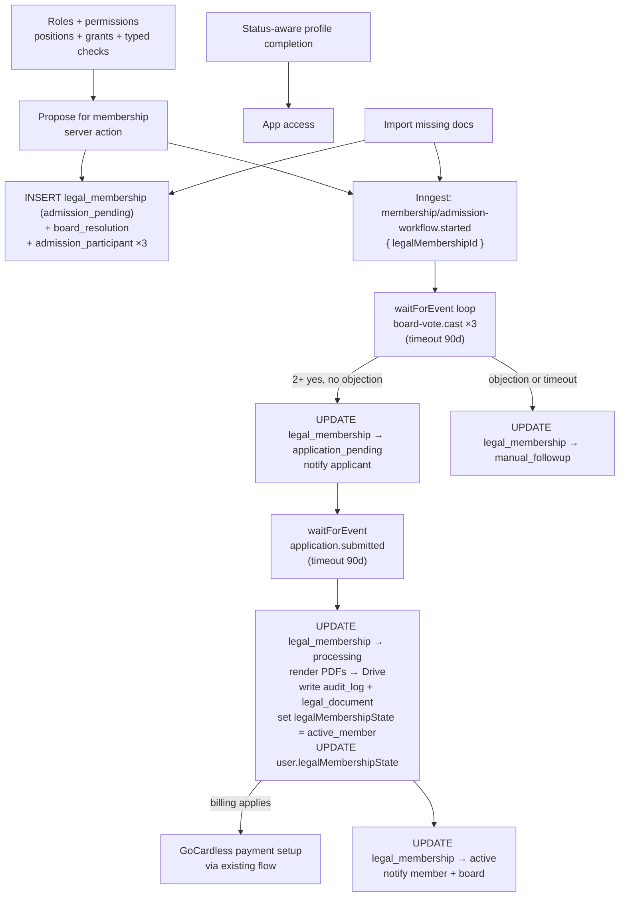
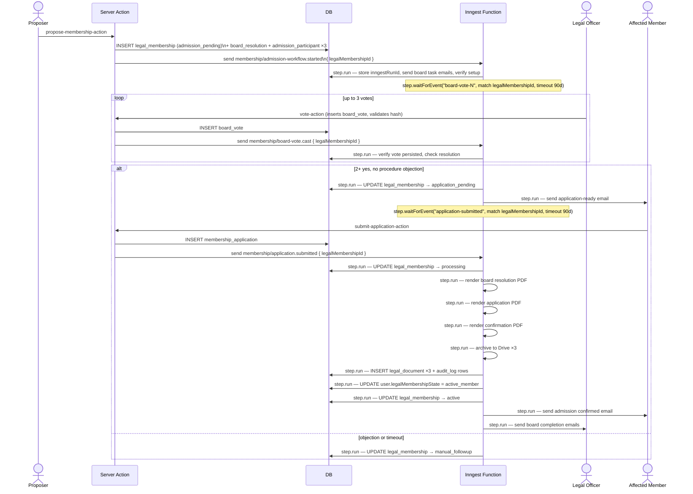
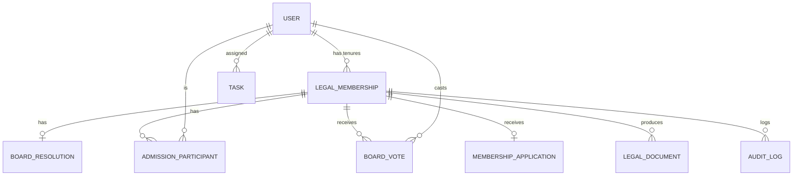
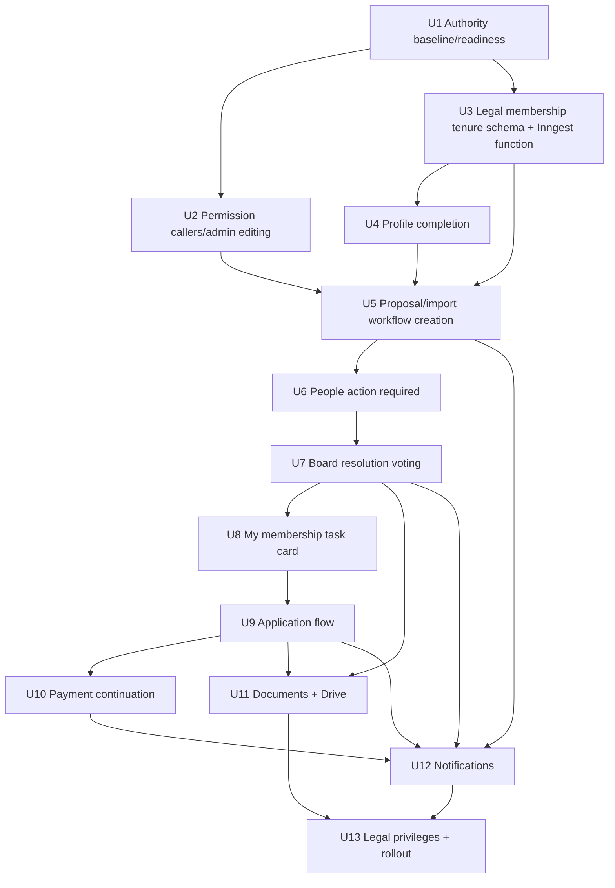

# Membership Lifecycle Workflows

## Overview

Build the new START Berlin membership lifecycle in staged slices: first replace the overloaded role model with the authority foundation, then add board admission workflows, People action-required work, legal-officer voting, member application, payment continuation, document archival, and notifications.

Orchestration uses Inngest durable functions with `step.waitForEvent()` as the pause-and-resume mechanism for long-running workflows (board voting, application submission). The database holds the queryable facts each UI surface needs; Inngest owns the execution state and side-effect retry.

Two distinct classes of background work exist: **complex workflows** (admission, future resignation/exclusion) that produce votes, audit logs, legal documents, and state transitions — these use a `legal_membership` tenure record as the relational hub for all kind-specific tables; and **simple task-generating workflows** (IT scans, etc.) that only produce tasks — these use an Inngest function plus a `task` table with no complex metadata. There is no generic `workflow` hub table.

---

## Problem Frame

START Cockpit currently treats operational status, profile completion, payment setup, and legal membership evidence as one blended concept. The membership lifecycle requirements separate these concerns: `user.status` remains operational, legal membership state is a column on `user`, and admission workflows carry transient progress such as board voting, application submission, document generation, and notifications in kind-specific Inngest durable functions.

The current "Complete onboarding" path creates a membership payment prompt directly. The new product shape replaces that with "Propose for membership", creates an individual board admission workflow coordinated entirely through an Inngest durable function, routes the three legal officers through People action required, lets the affected person complete a profile-completion-like legal application flow, activates legal membership after board approval plus application, and only then continues to payment setup where billing applies.

---

## Requirements Trace

- R1-R7. Separate operational status, legal membership state, workflow progress, and status-aware profile completion.
- R8-R18. Replace "Complete onboarding" with "Propose for membership"; keep task interaction contextual; put member-facing tasks in My membership and board/admin member-scoped work in People action required.
- R19-R27. Create board-resolution tasks, dedicated resolution voting, visible vote status, vote rules, post-vote return behavior, resolution finalization, and admission invitation.
- R28-R39. Build a guided member-facing finalize-membership flow with My membership card, application steps, fee acknowledgement, legal activation before payment, and payment continuation.
- R40-R43. Base legal privileges on legal membership state and create durable audit/document records.
- R44-R47. Notify legal officers and affected people at assignment, application readiness, admission confirmation, and completion points.

**Origin actors:** A1 Onboarding user, A2 Existing operational Member or Supporting Alumni, A3 Legal Member or Supporting Alumni, A4 Alumni user, A5 Department Lead, A6 Legal officer (president, VP, head of finance — the trio who vote on admissions; replaces origin's broader "Board Member" framing), A7 Admin, A8 START Cockpit

**Origin flows:** F1 Status-aware profile completion, F2 Propose onboarding user for legal membership, F3 Import existing operational member with missing documents, F4 Finalize membership

**Origin acceptance examples:** AE1 legal state remains `not_member` while workflow is pending, AE2 onboarding address not required, AE3 active legal member address required, AE4 proposal creates People action-required work, AE5 missing-document import starts board task, AE6 resolution detail/vote screen behavior, AE7 board vote threshold/objection behavior, AE8 member waiting card, AE9 application flow and fee acknowledgement, AE10 application then payment continuation, AE11 application-ready email and card

---

## Scope Boundaries

- V1 does not support batch membership-admission resolutions.
- V1 does not introduce a universal top-level Tasks page or inbox.
- V1 does not implement digital resignation, exclusion workflows, or former-member reactivation workflows.
- V1 does not create separate operational access levels for onboarding users versus active Members.
- V1 does not make payment setup the legal admission trigger.
- V1 does not require a full future task taxonomy for IT/offboarding work, but the task center should avoid being named or shaped only around membership.
- V1 does not require a separate member-data editing/audit portal beyond profile completion and legal admission needs.
- V1 does not resolve final legal wording, BGB/Satzung compliance, electronic-signature requirements, or final Finanzordnung wording without legal review.
- The org chart from `docs/plans/2026-04-28-002-feat-user-authority-organization-model-plan.md` is not on the critical path for this membership lifecycle plan.
- `membership_payment_setup` as a distinct Inngest workflow kind is out of scope for V1. Payment for import-with-documents users is handled synchronously (create payment row, send email, GoCardless webhook reconciliation handles the rest).
- The `task` table introduced in U3 is the foundation for simple task-generating workflows. V1 does not build task-completion UI; task rows are created by Inngest and serve as audit/monitoring records.

### Deferred to Follow-Up Work

- Digital resignation and exclusion workflows: reuse the `legal_membership` tenure hub and `legal_document` tables added in V1.
- Batch resolutions: add once individual admission workflows are proven.
- Full IT/offboarding task center taxonomy: the `task` table is the durable foundation; task management UI is a follow-up.
- Org chart UI: can continue from the existing authority plan after the position/grant foundation is in place.

---

## Context & Research

### Relevant Code and Patterns

- `src/db/schema/auth.ts` stores operational `status`, address/contact fields, `department`, and `legalMembershipState` (column on user, not a separate table; values `not_member`, `active_member`, `former_member`).
- `src/db/schema/workflow.ts` exists and will be **deleted** in U3. The `legal_membership` table replaces it as the tenure hub for complex workflows. There is no generic workflow hub.
- `src/lib/authority/model.ts`, `src/lib/authority/assignments.ts`, and `src/lib/authority/board-roster.ts` define the authority domain vocabulary, valid assignment matrix, and strict legal-officer roster setup.
- `src/lib/permissions/evaluate.ts`, `src/lib/permissions/server.ts`, `src/lib/permissions/authority-context.tsx`, and `src/components/can.tsx` provide the permission architecture.
- `src/db/schema/audit-log.ts` exists with `audit_log` table.
- `src/schema/onboarding-progress.ts` currently treats address as part of profile onboarding; this must become status/legal-state-aware.
- `src/app/(authenticated)/(onboarding)/onboarding/[step]/` has a focused multi-step profile completion shell that the membership application flow should mirror.
- `src/components/people-table.tsx` is the natural place to add People action required.
- `src/app/(authenticated)/(app)/people/complete-onboarding-action.ts` currently creates membership payment setup directly; this becomes proposal workflow creation.
- `src/app/(authenticated)/(app)/membership/page.tsx` and related files are the My membership task card surface.
- `src/db/schema/membership.ts`, `src/db/membership.ts`, `src/lib/membership-status.ts`, and `src/lib/gocardless/` contain current payment state and GoCardless subscription creation.
- `src/lib/gocardless/membership-reconciliation.ts` — `activateMembershipPayment` currently sets `user.status = "member"` unconditionally; U10 adds a conditional so only `onboarding` users advance to `member`. Supporting Alumni remain `supporting_alumni`.
- `src/inngest/new-user-workflow.ts` shows the established `step.run()` pattern; `src/inngest/create-group.ts` shows Google API usage style.
- `src/emails/membership-payment-ready.tsx` shows current React Email patterns.
- `src/lib/google-auth.ts` provides service-account auth for Drive archival.

### Institutional Learnings

- `docs/solutions/conventions/reusable-tone-of-voice-and-wording-decisions-2026-05-02.md` is the source for wording decisions. New copy should be warm/direct, explain user-visible outcomes before system mechanics, avoid provider/internal-status emphasis, and follow the retry/support error pattern.

### External References

- Inngest TypeScript SDK v3 (`inngest@^3.52.0`): `step.waitForEvent(id, { event, if, timeout })` returns `null` on timeout; step IDs can be reused in loops (Inngest auto-handles counters); events must arrive _after_ `waitForEvent` executes; `match` is deprecated in v3.52, use `if` with CEL syntax.
- React-PDF v4 docs for the PDF renderer: Node API `renderToBuffer`, advanced features for page wrapping/fixed footers, component docs for PDF primitives.

---

## Key Technical Decisions

- Build on the completed roles-and-permissions foundation: officer lookup, proposal permissions, and voting eligibility use authority positions/grants plus typed permission checks, not legacy `roles`.
- Snapshot the eligible legal-officer roster when a resolution is created: each admission workflow records the president, vice president, and head of finance at the moment of proposal so later authority changes do not rewrite legal history.
- Block resolution creation unless `getBoardRosterSetup()` identifies exactly three distinct legal officers. A two-person, four-person, missing-officer, duplicate-officer, or overlapping-officer setup is an admin setup error.
- Keep authorization API boundaries explicit: server actions/routes/pages enforce with `can()`, client UI uses `<Can>`/`useCan()`.
- Keep legal membership state small and on the user: `user.legalMembershipState` column (`not_member`, `active_member`, `former_member`), not a separate table. All users start as `not_member`; legal activation writes directly to the column.
- **Two-tier workflow distinction.** Complex workflows (admission, future resignation/exclusion) produce votes, audit logs, legal documents, and legal state transitions — they use the `legal_membership` tenure record as the relational hub and kind-specific explicit tables. Simple task-generating workflows (IT scans, etc.) use an Inngest function plus the `task` table with no complex metadata. There is no generic `workflow` DB table.
- **Introduce `legal_membership` as the tenure hub for complex workflows.** Each admission (and future resignation/exclusion) creates one `legal_membership` record for that tenure. `board_resolution`, `admission_participant`, `board_vote`, `membership_application`, and `legal_document` all FK to `legal_membership.id`. A user can have multiple `legal_membership` records over time (supports resignation then rejoin). A partial unique index on PostgreSQL enforces at most one record per user where `status IN ('admission_pending', 'application_pending', 'processing', 'active')`.
- **`user.legalMembershipState` is the denormalized fast-query cache.** The authoritative source is `legal_membership.status`; the column on `user` exists for queries that need legal state without joining. The Inngest admission-completion steps update both atomically. Any code that changes legal state must do so inside an Inngest `step.run`, not via direct column writes outside of Inngest.
- **Use Inngest durable functions with `step.waitForEvent()` as the orchestration layer for admission workflows.** The Inngest function body IS the workflow logic. It pauses at each decision point (votes, application submission), coordinates retryable side effects (emails, PDFs, Drive, legal activation), and advances `legal_membership.status` in the DB on each transition. The Inngest run ID is stored on the `legal_membership` record (`inngestRunId` column) as the bridge between the two layers.
- **Delete `src/lib/workflows/`** — the Zod metadata state machine (core.ts, membership-admission.ts, membership-payment-setup.ts, validation.test.ts) is superseded by Inngest's durable execution plus explicit DB tables. There is no JSONB blob to validate; workflow state is the Inngest function's own execution position plus DB rows.
- **Delete `src/db/schema/workflow.ts`** — the generic `workflow` table is removed. `legal_membership` is the domain-specific hub. `admission_participant` replaces `workflow_participant`.
- **`activateMembershipPayment` must not unconditionally set `user.status = "member"`.** Only advance operational status when the current status is `"onboarding"`. Supporting Alumni must remain `"supporting_alumni"` through payment activation. (see U10)
- Treat legal activation and payment activation separately: the Inngest admission-completion steps set `legalMembershipState = active_member`, then create the payment task if billing applies; payment setup and GoCardless reconciliation continue through the existing payment flow.
- Preserve operational status intentionally: onboarding users become operational `member` at legal admission via Inngest; imported Supporting Alumni keep `supporting_alumni`.
- Use document snapshots as durable source for PDFs: generated PDFs and Drive IDs are archived outputs; DB snapshots and audit records remain authoritative.

---

## Open Questions

### Resolved During Planning

- How should current legal board voters and officer functions be determined? Use the completed authority model: president, vice president, and head of finance are the three eligible legal officers.
- Should the authority plan be folded into this plan? Yes; the authority foundation is the first stage.
- Where should board/admin task work live? In People action required, not a universal top-level Tasks inbox.
- Where should member task work live? In a single prominent My membership task card.
- When does legal membership become active? After board approval, complete application, and admission confirmation; before payment setup completes.
- **Should Inngest or the DB be the source of truth for workflow progress?** Inngest owns execution state (what step the function is on, what it is waiting for). DB owns the queryable facts each UI surface needs (vote records, application submissions, `legal_membership.status`). DB status is updated by the Inngest function via `step.run` transitions so UI queries never need to call the Inngest API.
- **Should `legal_membership` remain a separate table?** In migration 0013, the old `legal_membership` table (which tracked state with classifiedBy, documentStatus, and timestamps) was removed and replaced by a `legalMembershipState` column on `user`. U3 introduces a new, leaner `legal_membership` record (id, userId, status, inngestRunId, startedAt, activatedAt, endedAt) that serves as the relational hub for complex workflows. The `user.legalMembershipState` column from 0013 is kept as the denormalized fast-query cache. These serve different purposes.
- **Should we use a generic `workflow` table or a domain-specific hub?** No generic hub. The naming overlap between a DB "workflow" record and an Inngest "function run" caused conceptual confusion. `legal_membership` is the correct domain name for the complex workflow hub; it represents a membership tenure and can exist multiple times per user (e.g., resign then rejoin). A user can have at most one active or admission-pending record at a time (enforced by partial unique index).
- **How do complex and simple workflows differ?** Complex workflows (admission, future resignation) need relational tables for votes, documents, audit, and legal state. Simple workflows (IT scans) only need tasks created for humans to complete. The two tiers use different infrastructure: `legal_membership` hub + explicit tables + Inngest function for complex; `task` table + Inngest function for simple.
- **Does `activateMembershipPayment` correctly handle Supporting Alumni?** No — it currently sets `user.status = "member"` unconditionally. U10 fixes this with a conditional: only advance to `member` when `user.status === "onboarding"`.

### Deferred to Implementation

- **`task` table V1 usage:** The table is introduced in U3 but no V1 unit currently writes to it. Open question: should V1 use the task table for payment-setup tasks or vote-submission reminders, or should those rely on the domain-specific tables (`legal_membership`, `board_resolution`, `membership_application`) which already hold enough state for UI queries? An alternative future approach is per-domain task tables (e.g., `it_task`) rather than a single generic table. Consider: (1) use `task` rows for payment-setup and vote-reminder tracking with Inngest notifications on insert; (2) keep `task` infrastructure-only in V1 and write nothing to it; (3) remove `task` from V1 scope entirely and reintroduce when IT/offboarding tasks are built.
- Exact Drizzle migration filenames and generated SQL details.
- Exact route segment names for resolution and application pages.
- Exact PDF layout details. Renderer choice resolved for v1: `@react-pdf/renderer` via `renderToBuffer`.
- Exact final legal copy for resolution text, membership declarations, and fee acknowledgement after legal/Satzung/Finanzordnung review.
- Whether Google Drive folder IDs are separate env vars or one root folder plus deterministic subfolders.
- Exact Inngest timeout values for board vote and application submission waits (90d used as a working assumption; validate against product requirements).

---

## Phased Delivery

### Stage 1: Authority Foundation

Land enough of the authority/org model to determine named legal officers, scoped Department Heads, and admins without relying on legacy `roles`.

**Stage 1 is complete.** The authority hardening and permission architecture refactors are done. Board-resolution workflows can now depend on server-enforced group/admin authority, valid authority assignment combinations, singleton officer constraints, strict legal-officer roster validation, typed `can()` checks, and client-only `<Can>`/`useCan()` affordances.

### Stage 2: Legal Membership Tenure Schema And Inngest Admission Function

Delete the `workflow` table and `lib/workflows/` Zod machinery. Introduce the `legal_membership` tenure record as the relational hub, add the explicit board/vote/application/document tables, add the `task` table for simple workflows, and build the Inngest durable admission function. This unit establishes the data model and orchestration core all downstream units depend on.

### Stage 3: Profile Completion And Imports

Make profile completion legal-state-aware and change imports/proposals to create `legal_membership` records and send the Inngest trigger event instead of direct payment prompts.

### Stage 4: People Action Required And Board Voting

Add the People action-required view, resolution detail/vote screen, vote recording (`board_vote` row + Inngest event), finalization, and board notifications.

### Stage 5: Member Application And Payment Continuation

Add the My membership task card, dedicated application flow, fee acknowledgement, and submit-to-processing transition (`membership_application` row + Inngest event). Fix `activateMembershipPayment` to guard Supporting Alumni status (U10 — production bug, no U11 dependency). Inngest handles the rest.

### Stage 6: Documents, Drive, Audit, And Rollout Hardening

Generate legal PDFs, archive in Drive, store hashes/references as `legal_document` rows, complete legal activation through Inngest steps, create payment-required tasks, tighten legal privilege checks, and add operational verification.

---

## High-Level Technical Design

> *This illustrates the intended approach and is directional guidance for review, not implementation specification. The implementing agent should treat it as context, not code to reproduce.*

### Lifecycle State Flow



### Inngest Durable Function Sequence



### Entity Relationships



---

## Implementation Units



---

### U1. Authority Baseline And Workflow Readiness

**Goal:** Treat the completed Stage 1 authority and permission implementation as the baseline, verify it against the membership workflow needs, and add any remaining membership-specific helpers without rebuilding existing authority files.

**Requirements:** Membership requirements supported: R8-R9, R19, R27, R40; authority plan R1-R13, R20-R24

**Dependencies:** None

**Files:**
- Existing baseline: `src/db/schema/authority.ts`
- Existing baseline: `src/db/authority.ts`
- Existing baseline: `src/lib/authority/model.ts`
- Existing baseline: `src/lib/authority/assignments.ts`
- Existing baseline: `src/lib/authority/board-roster.ts`
- Modify: `src/db/schema/index.ts`
- Modify: `src/db/schema/auth.ts`
- Existing baseline: `src/lib/permissions/evaluate.ts`
- Existing baseline: `src/lib/permissions/index.ts`
- Modify: `src/lib/permissions/server.ts`
- Existing baseline: `src/lib/permissions/authority-context.tsx`
- Modify: `src/components/can.tsx`
- Modify: `src/app/(authenticated)/(app)/layout.tsx`
- Test: `src/lib/permissions/permissions.test.ts`
- Test: `src/lib/authority/assignments.test.ts`
- Test: `src/lib/permissions/permissions.typecheck.ts`

**Approach:**
- Use the Stage 1 authority model: persisted global officer positions are `president`, `vice_president`, and `head_of_finance`; persisted department position is `department_head`; persisted access grant is global `admin`.
- Keep legacy role-array permission checks out of workflow code.
- Add the membership-specific permission vocabulary needed by later units: `membership.propose`, `membership.vote_resolution`, `membership.view_resolution`, and `membership.manage_workflows`.
- Allow Department Heads to propose only within their scoped department context.
- Use `getBoardRosterSetup()` as the workflow preflight.

**Execution note:** The authority foundation is implemented. Future work should verify the existing schema/API/migration names and add only missing membership-specific helpers.

**Test scenarios:**
- Happy path: global admin grant allows actions where the policy lists admin.
- Happy path: department-head position scoped to Events grants a scoped action for an Events target.
- Edge case: department-head position scoped to Events denies the same action for a Growth target.
- Edge case: legal officer positions grant only explicitly listed permissions.
- Edge case: board roster validation fails when there are fewer or more than three eligible legal officers.
- Integration: server `can()`, client `<Can>`, and client `useCan()` consume the same typed policy vocabulary.

**Verification:**
- Current app permission callers compile against the authority API.
- Legal-officer lookup returns current president, vice president, head of finance.
- Legacy `user.roles` is not part of the active schema or authorization model.

---

### U2. Permission Caller Migration And Admin Editing

**Goal:** Close any remaining membership-specific permission gaps before workflows depend on them.

**Requirements:** Origin R8-R9, R15-R19; authority plan R14-R24

**Dependencies:** U1

**Files:**
- Modify: `src/app/(authenticated)/(app)/people/create-user-action.ts`
- Modify: `src/app/(authenticated)/(app)/people/complete-onboarding-action.ts`
- Modify: `src/app/(authenticated)/(app)/people/[id]/page.tsx`
- Modify: `src/app/(authenticated)/(app)/people/[id]/profile-card.tsx`
- Existing baseline: `src/app/(authenticated)/(app)/people/[id]/authority-card.tsx`
- Existing baseline: `src/app/(authenticated)/(app)/people/[id]/update-authority-action.ts`
- Existing baseline: `src/components/authority-editor.tsx`
- Modify: `src/db/groups.ts`
- Modify: `src/components/group-criteria-manager.tsx`
- Modify: `src/components/bulk-add-users-dialog.tsx`
- Modify: `src/app/api/users/search-by-criteria/route.ts`
- Test: `src/lib/permissions/permissions.test.ts`

**Approach:**
- Verify existing server actions and route/page guards use the new typed `can(action, context?)` shape.
- Verify the admin-only member-detail UI can edit positions and grants needed by membership workflows.
- Keep group-local `users_to_groups.role` separate from authority positions/grants.
- Keep client components on `<Can>` or `useCan()` for affordance checks.

**Test scenarios:**
- Happy path: admin can add president, vice president, head of finance, department-head, and admin assignments where valid.
- Error path: non-admin direct authority update action is denied.
- Edge case: department-scoped assignment without department is rejected.
- Regression: group membership admin/member role still works as a group-local concept.
- Regression: group API/server-action authorization boundaries deny unauthorized callers.

**Verification:**
- Admins can maintain legal-officer assignments before creating membership resolutions.
- Existing people/groups permissions still behave through the new authority model.

---

### U3. Legal Membership Tenure Schema, Task Table, And Inngest Durable Admission Function

**Goal:** Delete the existing `workflow` table and `lib/workflows/` Zod machinery. Introduce the `legal_membership` tenure record as the relational hub for complex workflows. Add the `task` table for simple task-generating workflows. Add all explicit board/vote/application/document tables. Create the Inngest durable admission function that orchestrates the entire admission lifecycle.

**Requirements:** R1-R5, R10-R12, R18-R19, R23-R25, R27, R37, R40-R43; AE1, AE5, AE7

**Dependencies:** U1

**Files:**
- Delete: `src/db/schema/workflow.ts`
- Create: `src/db/schema/legal-membership.ts` — `legal_membership` tenure record
- Create: `src/db/schema/board-admission.ts` — `board_resolution`, `admission_participant`, `board_vote` tables
- Create: `src/db/schema/membership-application.ts` — `membership_application` table
- Create: `src/db/schema/legal-document.ts` — `legal_document` table
- Create: `src/db/schema/task.ts` — `task` table for simple workflows
- Modify: `src/db/schema/index.ts` — remove workflow exports, add new schema exports and relations
- Modify: `src/lib/id.ts` — remove `workflow` prefix; add `legalMembership`, `boardResolution`, `admissionParticipant`, `boardVote`, `membershipApplication`, `legalDocument`, `task` prefixes
- Delete: `src/lib/workflows/core.ts`
- Delete: `src/lib/workflows/membership-admission.ts`
- Delete: `src/lib/workflows/membership-payment-setup.ts`
- Delete: `src/lib/workflows/index.ts`
- Delete: `src/lib/workflows/validation.test.ts`
- Create: `src/inngest/membership-admission-workflow.ts`
- Modify: `src/inngest/index.ts` — register `membershipAdmissionWorkflow`
- Modify: `src/lib/inngest.ts` — add new typed event entries (`membership/admission-workflow.started`, `membership/board-vote.cast`, `membership/application.submitted`); remove stale `"membership/admission-application.submitted"` event with `workflowId: string` from the deleted workflows system
- Modify: `src/env.ts` — add `INNGEST_SIGNING_KEY` (required in production; omit in local dev by setting `INNGEST_DEV=1`) and `INNGEST_SIGNING_KEY_FALLBACK` (optional, for zero-downtime key rotation per Inngest docs)
- Create or generate: `drizzle/*`

**Approach:**

**Schema: `legal_membership` tenure record (`src/db/schema/legal-membership.ts`):**

The core hub entity. Represents one membership tenure — from admission proposal through to active membership and eventually potential resignation/exclusion. A user can have multiple records over time.

Columns: `id`, `userId` FK → user, `status` pgEnum (`admission_pending | application_pending | processing | active | manual_followup | cancelled`), `inngestRunId` text nullable, `startedAt` timestamp, `activatedAt` timestamp nullable, `endedAt` timestamp nullable, `createdAt`, `updatedAt`

Partial unique index: UNIQUE on `userId` WHERE `status IN ('admission_pending', 'application_pending', 'processing', 'active')` — enforces at most one live tenure per user.

**Schema: `src/db/schema/board-admission.ts`:**

- `board_resolution` (id, legalMembershipId UNIQUE FK, resolutionText, resolutionTextVersion, resolutionTextHash, billingApplies boolean, createdAt) — 1:1 with `legal_membership`; stores the text snapshot all voters see.
- `admission_participant` (id, legalMembershipId FK, userId FK, officerFunction pgEnum `president | vice_president | head_of_finance`, assignedAt) — 3 rows per admission; queryable for "show tasks only to snapshotted officers".
- `board_vote` (id, legalMembershipId FK, voterUserId FK, value pgEnum `yes | no | abstain | procedure_objection`, displayedResolutionHash, castAt) — UNIQUE(legalMembershipId, voterUserId) enforces one immutable vote per officer per tenure in v1.

**Schema: `src/db/schema/membership-application.ts`:**

`membership_application` (id, legalMembershipId UNIQUE FK, subjectUserId FK, street, city, state, zip, country, declarations jsonb, feeTextVersion, applicationVersion, submittedAt)

**Schema: `src/db/schema/legal-document.ts`:**

`legal_document` (id, legalMembershipId FK, documentType text, sha256, driveFileId, driveUrl, renderer, createdAt)

**Schema: `src/db/schema/task.ts`:**

`task` table for simple task-generating workflows (IT scans, etc.): id, kind text, assigneeUserId FK → user, title text, description text nullable, status pgEnum (`open | completed | cancelled`), dueAt nullable, completedAt nullable, completedByUserId FK → user nullable, legalMembershipId FK → legal_membership nullable (for tasks related to a tenure), createdAt, updatedAt.

**Inngest durable function (`src/inngest/membership-admission-workflow.ts`):**

Triggered by event `membership/admission-workflow.started` with payload `{ legalMembershipId, subjectUserId }`.

**`runId` capture:** Read `run.id` from the outer Inngest function context (destructured from the function handler arguments alongside `event` and `step`) — not inside a `step.run` callback. Pass it into the first `step.run` to store on the `legal_membership` row. The outer `run.id` is stable across replays; reading it inside a step is harmless but redundant and misleading.

Directional structure (not implementation specification):

```
step.run: UPDATE legal_membership.inngestRunId (from outer run.id), send board task emails
UPDATE legal_membership → admission_pending (already set at proposal time; confirm)

LOOP (up to 3 iterations or until resolution reached):
  step.waitForEvent("board-vote-N", { event: "membership/board-vote.cast",
    if: "async.data.legalMembershipId == event.data.legalMembershipId", timeout: "90d" })
  → null means timeout → step.run: UPDATE legal_membership → manual_followup → return
  step.run: read board_vote rows, determine if resolution reached

IF objection OR yesVotes < 2 after all 3 votes:
  step.run: UPDATE legal_membership → manual_followup → return

step.run: UPDATE legal_membership → application_pending
step.run: send application-ready email

step.waitForEvent("application-submitted", { event: "membership/application.submitted",
  if: "async.data.legalMembershipId == event.data.legalMembershipId", timeout: "90d" })
→ null means timeout → step.run: UPDATE legal_membership → manual_followup → return

step.run: UPDATE legal_membership → processing
step.run: render board resolution PDF (from board_resolution + board_vote snapshot)
step.run: archive board resolution to Drive → INSERT legal_document
step.run: render membership application PDF (from membership_application snapshot)
step.run: archive application to Drive → INSERT legal_document
step.run: render admission confirmation PDF
step.run: archive confirmation to Drive → INSERT legal_document
step.run: INSERT audit_log rows
step.run: UPDATE user.legalMembershipState = active_member + UPDATE legal_membership → active + set activatedAt
step.run: create payment task if billingApplies
step.run: send admission confirmed email to member
step.run: send board completion emails to legal officers
```

Important Inngest constraints: step IDs can be reused in the vote loop but use unique suffixes (`"board-vote-0"`, `"board-vote-1"`, `"board-vote-2"`) for debuggability. Events must be sent _after_ `waitForEvent` executes. Each `step.run` is independently retried. The `if` CEL expression uses `async` for the triggering event and `event` for the new event being matched.

**Patterns to follow:**
- `src/inngest/new-user-workflow.ts` for established `step.run()` style.
- `src/db/schema/membership.ts` for membership-adjacent domain tables.

**Test scenarios:**
- Covers AE1. An affected user with a pending `legal_membership` record (`status = admission_pending`) remains legally `not_member` on `user.legalMembershipState`.
- Happy path: creating an admission workflow creates one `legal_membership` row (admission_pending), one `board_resolution` row, and three `admission_participant` rows.
- Happy path: two yes votes advance `legal_membership.status` to `application_pending` via Inngest step.
- Happy path: application submission creates `membership_application` row and sends Inngest event.
- Happy path: Inngest admission-completion steps insert three `legal_document` rows and set `user.legalMembershipState = active_member`.
- Edge case: `board_vote` unique constraint on (legalMembershipId, voterUserId) rejects a second vote from the same officer.
- Edge case: procedure objection by any officer advances `legal_membership` to `manual_followup`.
- Edge case: board-vote `waitForEvent` timeout sets `legal_membership` to `manual_followup`.
- Edge case: application `waitForEvent` timeout sets `legal_membership` to `manual_followup`.
- Edge case: Inngest step retry does not create duplicate `legal_document` rows (idempotent inserts using legalMembershipId + documentType as natural key or ON CONFLICT DO NOTHING).
- Edge case: partial unique index prevents creating a second `legal_membership` record for a user who already has an active or pending one.
- Edge case: user with a `cancelled` or `manual_followup` tenure can have a new admission started (no active/pending record blocks it).
- Error path: Drive upload failure retries through Inngest; `legal_membership` remains `processing` until all Drive steps succeed.

**Verification:**
- No `workflow` table or `lib/workflows/` directory exists in the codebase.
- All complex workflow tables FK to `legal_membership.id`, not to any generic hub.
- UI can query pending admission tenures for a user without calling the Inngest API.
- Board votes, application snapshots, and document references are in explicit queryable tables.
- `task` table exists for simple workflows.

---

### U4. Status-Aware Profile Completion

**Goal:** Change profile completion so all users must provide personal email and phone, while address is required only for active legal Members and Supporting Alumni.

**Requirements:** R4, R6-R7, R29; AE2, AE3

**Dependencies:** U3

**Files:**
- Modify: `src/schema/onboarding-progress.ts`
- Modify: `src/app/(authenticated)/(app)/layout.tsx`
- Modify: `src/app/(authenticated)/(onboarding)/onboarding/[step]/layout.tsx`
- Modify: `src/app/(authenticated)/(onboarding)/onboarding/[step]/page.tsx`
- Modify: `src/app/(authenticated)/(onboarding)/onboarding/[step]/(steps)/index.tsx`
- Modify: `src/app/(authenticated)/(onboarding)/onboarding/[step]/(steps)/step-master-data.tsx`
- Modify: `src/app/(authenticated)/(onboarding)/onboarding/[step]/(steps)/step-address.tsx`
- Modify: `src/app/(authenticated)/(onboarding)/onboarding/[step]/(steps)/step-address-action.ts`
- Test: `src/schema/onboarding-progress.test.ts`

**Approach:**
- Replace current fixed `master-data → address → completed` logic with a requirement-aware profile completion helper that reads `user.legalMembershipState` directly (it's a column; no JOIN needed).
- Onboarding users, Alumni, and Members/Supporting Alumni with `legalMembershipState = not_member` require personal email and phone only.
- Active legal Members and Supporting Alumni require address and are blocked until it is complete.
- Follow copy guidance from `docs/solutions/conventions/reusable-tone-of-voice-and-wording-decisions-2026-05-02.md`.

**Patterns to follow:**
- Current `src/schema/onboarding-progress.ts` pure helper style.

**Test scenarios:**
- Covers AE2. Onboarding user with personal email and phone but no address is profile-complete.
- Covers AE3. Active legal Member with personal email and phone but no address is redirected to address completion.
- Happy path: active legal Supporting Alumni with full address is profile-complete.
- Happy path: Alumni with personal email and phone but no address is profile-complete.
- Edge case: operational Member with `legalMembershipState = not_member` and no address is profile-complete.
- Error path: missing phone or personal email blocks every status/legal-state combination.

**Verification:**
- Address is no longer required for onboarding users.
- Active legal Members/Supporting Alumni cannot use the app without address.

---

### U5. Admission Workflow Creation From People And Imports

**Goal:** Replace direct payment invitation with legal admission tenure creation for onboarding users, and start the same workflow immediately for imports with missing documents.

**Requirements:** R8-R12, R15-R19; AE4, partial AE5. R44 email delivery is completed in U12.

**Dependencies:** U1, U3, U4

**Files:**
- Modify: `src/components/people-table.tsx`
- Modify: `src/app/(authenticated)/(app)/people/complete-onboarding-action.ts` — replace direct payment-setup logic with proposal workflow creation (creates `legal_membership` + `board_resolution` + `admission_participant` rows, sends Inngest event)
- Create: `src/app/(authenticated)/(app)/people/propose-membership-action.ts`
- Modify: `src/app/(authenticated)/(app)/people/import-google-user-schema.ts`
- Modify: `src/app/(authenticated)/(app)/people/import-google-user-dialog.tsx`
- Modify: `src/app/(authenticated)/(app)/people/import-google-user-action.ts`
- Test: `src/app/(authenticated)/(app)/people/import-google-user-schema.test.ts`
- Test: `src/app/(authenticated)/(app)/people/import-google-user-action.test.ts`

**Approach:**
- Rename/reframe "Complete onboarding" to "Propose for membership".
- The action calls `can("membership.propose", { targetDepartment })` so Department Heads can propose only within their scoped department.
- Proposal creates: one `legal_membership` row (status=`admission_pending`), one `board_resolution` row (resolution text + hash), three `admission_participant` rows from the board roster snapshot, then sends Inngest event `membership/admission-workflow.started` with `{ legalMembershipId, subjectUserId }`.
- Proposal must validate exactly three eligible legal officers via `getBoardRosterSetup()` before any rows are created. If validation fails, return an admin-facing setup error and create nothing.
- Proposal must not create a `membershipPayment` row or send payment-ready email.
- Guard against creating a second active tenure: check for an existing `legal_membership` with status in `('admission_pending', 'application_pending', 'processing', 'active')` and return an error if found.
- **`billingApplies` is always `true` in V1.** All users going through the admission workflow are required to pay. The `board_resolution.billingApplies` column is set to `true` unconditionally in V1. Do not derive it from `user.status` (which would incorrectly return `false` for `onboarding` users). The column exists for future flexibility (e.g., honorary memberships) but has no V1 variation.
- Import flow must ask whether sufficient membership documents exist for imported Members and Supporting Alumni:
  - `Documents verified`: authorized admin confirms documents exist → set `user.legalMembershipState = active_member`, INSERT a `legal_membership` row (status=`active`, activatedAt=now), require address through profile completion, create/reuse `membershipPayment` row (billingApplies always true). No board/application workflow.
  - `Documents missing or unsure`: set `legalMembershipState = not_member`, keep operational status, and immediately create the admission tenure (same rows as a proposal) + send `membership/admission-workflow.started`.
- Alumni imports stay out of active membership/legal admission.

**Patterns to follow:**
- Existing next-safe-action style in `complete-onboarding-action.ts`.
- Existing import flow in `import-google-user-action.ts`.

**Test scenarios:**
- Covers AE4. Department Head proposes an onboarding user; one `legal_membership` (admission_pending) + one `board_resolution` + three `admission_participant` rows are created and Inngest event is sent.
- Covers AE5 except email delivery. Importing Supporting Alumni with missing documents creates tenure rows and sends Inngest event.
- Happy path: importing Member with documents sets `user.legalMembershipState = active_member` and creates a `legal_membership` (active) row without starting the board workflow.
- Edge case: choosing "documents missing or unsure" cannot activate legal membership.
- Edge case: proposing the same user twice when an active tenure exists returns an error and creates nothing.
- Edge case: proposal fails and creates nothing when board roster validation fails.
- Error path: unauthorized user cannot propose membership.
- Regression: payment row is not created by proposal.

**Verification:**
- The old direct "complete onboarding → payment" path is gone.
- All admission paths enter the same `legal_membership` + Inngest event boundary.

---

### U6. People Action Required View

**Goal:** Add the member-scoped Action required tab in People for board/admin workflows requiring the current user's attention.

**Requirements:** R13-R18, R19-R20, R26; AE4, AE6

**Dependencies:** U1, U3, U5

**Files:**
- Modify: `src/app/(authenticated)/(app)/people/page.tsx`
- Modify: `src/app/(authenticated)/(app)/people/page-client.tsx`
- Modify: `src/components/people-table.tsx`
- Modify: `src/db/people.ts`
- Create: `src/db/people-actions.ts`
- Test: `src/db/people-actions.test.ts`

**Approach:**
- Add Action required as a first-class tab on the People page.
- Use the existing shadcn/Radix `Tabs` with two tabs: `Directory` and `Action required`.
- Default to `Action required` when the current user has open actions; otherwise default to `Directory`. Support `?view=actions` and `?view=directory`.
- Show an action count in the `Action required` tab using `Badge`.
- Query for action-required items by joining `admission_participant` → `legal_membership` → `board_vote`:
  - Find tenures where `admission_participant.user_id = currentUserId` AND `legal_membership.status = 'admission_pending'`
  - LEFT JOIN `board_vote` ON `board_vote.legal_membership_id = legal_membership.id AND board_vote.voter_user_id = currentUserId`
  - Show rows where `board_vote.id IS NULL` (current user hasn't voted yet)
- Each action row includes: subject person name, operational status summary, tenure type, task summary, and "Vote" primary action.
- Users not in any `admission_participant` row, or officers who have voted on all pending tenures, see an empty state with warm copy: "You're all caught up." (follow tone-of-voice doc for final wording).
- Action row click routes to the resolution detail/vote screen.

**Patterns to follow:**
- Existing `src/components/people-table.tsx` table shape.
- Existing `src/db/people.ts` mapping style.
- Follow existing People page breakpoints and keyboard-navigation conventions.

**Test scenarios:**
- Covers AE4. Legal officer sees proposed user in Action required with board vote needed.
- Happy path: after casting a vote, the row is no longer shown (`board_vote` row exists for this user + tenure).
- Edge case: regular member sees no board/admin action-required rows.
- Edge case: officer who is in an `admission_participant` row but has already voted sees zero open actions.
- Error path: stale task for missing/deleted subject user is omitted gracefully.

**Verification:**
- People has a clear Action required view.
- Board/admin work remains contextual to People rather than a top-level task inbox.

---

### U7. Board Resolution Detail, Voting, And Finalization

**Goal:** Build the dedicated resolution detail/vote screen, vote recording behavior, 2-of-3 approval rule, procedure objection handling, and Inngest advancement on finalization.

**Requirements:** R19-R27, R41; AE6, AE7. R44/R45 notification delivery is completed in U12.

**Dependencies:** U1, U3, U5, U6

**Files:**
- Create: `src/app/(authenticated)/(app)/people/resolutions/[id]/page.tsx`
- Create: `src/app/(authenticated)/(app)/people/resolutions/[id]/resolution-vote-client.tsx`
- Create: `src/app/(authenticated)/(app)/people/resolutions/[id]/vote-action.ts`
- Create: `src/db/board-resolutions.ts`
- Create: `src/lib/board-resolution-rules.ts`
- Test: `src/lib/board-resolution-rules.test.ts`

**Approach:**
- `board-resolution-rules.ts` supersedes the 2-of-3 vote counting logic that existed in `src/lib/workflows/membership-admission.ts` (deleted in U3). Do not reference the deleted file as an implementation guide; use only the rules defined here.
- The `page.tsx` server component must call `requirePermission()` (or equivalent auth gate) before querying resolution data. Session existence alone is insufficient — any authenticated user who knows the URL must not reach resolution details. Gate on the requesting user being an `admission_participant` for this tenure or holding an admin grant.
- The detail screen queries `board_resolution` for resolution text/hash, `admission_participant` for all three officers, and `board_vote` for current vote status. All data is explicit SQL joins — no JSONB parsing.
- The `vote-action` server action:
  1. Validates `legal_membership.status = 'admission_pending'`
  2. Validates the actor is an `admission_participant` for this tenure
  3. Validates no existing `board_vote` for this voter in this tenure (unique constraint enforcement)
  4. Validates `displayedResolutionHash` matches `board_resolution.resolutionTextHash`
  5. INSERTs a `board_vote` row
  6. Sends Inngest event `membership/board-vote.cast` with `{ legalMembershipId, voterId, value, castAt }`
  7. Returns success — the Inngest function handles all downstream transitions
- The Inngest function's `step.waitForEvent` wakes up, reads all `board_vote` rows for the tenure via `step.run`, determines the resolution outcome, and advances `legal_membership.status` accordingly.
- UI displays vote status per officer (voted/not voted, value shown only for own vote in v1 unless all three voted).
- **Already-voted state:** when the current user's `board_vote` row exists for this tenure, display their recorded vote as a non-interactive label (e.g. "You voted: Yes") and disable all vote buttons. No re-vote in V1.
- Board votes are immutable in v1 via the UNIQUE constraint. Duplicate vote submissions are rejected by the DB and by server-side validation.
- **Vote button interaction states:** disable all vote buttons during submission (no optimistic updates — wait for server confirmation before updating UI). On submission error, show an error toast (follow wording from tone-of-voice document; include a generic retry message). On success, show a brief toast "Vote recorded." then redirect to People action required.
- After voting, redirect back to People action required.

**Patterns to follow:**
- Existing server action style in `src/app/(authenticated)/(app)/groups/[id]/actions.ts`.
- Authority helper from U1 for officer lookup.

**Test scenarios:**
- Covers AE6. Legal officer sees person, resolution text, all vote states, and four vote options.
- Covers AE6. After voting, redirection to People action required.
- Covers AE7. Two yes votes and no objection cause Inngest to advance to `application_pending`.
- Covers AE7. Any procedure objection causes Inngest to advance to `manual_followup`.
- Edge case: one yes plus one abstain plus one no does not reach two yes.
- Edge case: same legal officer attempting to vote twice is rejected by UNIQUE constraint on (legalMembershipId, voterUserId).
- Edge case: officer not in `admission_participant` for this tenure cannot vote.
- Edge case: Inngest event is sent only after the `board_vote` row is successfully committed.
- Error path: non-legal-officer cannot access or vote on the resolution.
- Error path: voting when `legal_membership.status != 'admission_pending'` is rejected.

**Verification:**
- Board resolutions can move from `admission_pending` to `application_pending`, `manual_followup`, or `cancelled` according to the product rules, driven by Inngest.
- Vote records are in the `board_vote` table with explicit fields, not buried in JSONB.

---

### U8. My Membership Task Card And Application Shell

**Goal:** Replace the current payment-first membership section with a single task card that maps `legal_membership.status` to a user-facing task state, and open a dedicated application flow when ready.

**Requirements:** R14, R28-R34, R45; AE8, AE9, AE11

**Dependencies:** U3, U4, U5, U7

**Files:**
- Modify: `src/app/(authenticated)/(app)/membership/page.tsx` — update to use the new task card; remove or replace direct `getStructuredMembershipState` call once task-card logic subsumes it
- Modify: `src/app/(authenticated)/(app)/membership/onboarding.tsx`
- Modify: `src/app/(authenticated)/(app)/membership/billing-copy.ts`
- Create: `src/app/(authenticated)/(app)/membership/task-card.tsx`
- Create: `src/app/(authenticated)/(app)/membership/application/[step]/layout.tsx`
- Create: `src/app/(authenticated)/(app)/membership/application/[step]/page.tsx`
- Create: `src/app/(authenticated)/(app)/membership/application/[step]/(steps)/index.tsx`
- Test: `src/app/(authenticated)/(app)/membership/billing-copy.test.ts`

**Approach:**
- Create a membership task view-state helper that reads `legal_membership.status` directly (no JSONB parsing, no Inngest API call needed):
  - `admission_pending` → waiting card (no vote details, no officer names)
  - `manual_followup` → calm waiting/contact-admin card: "We need to take a closer look at your application. We'll reach out to you directly — feel free to get in touch if you have questions." Include a contact link/email. No action buttons.
  - `application_pending` → application-ready card (links into application flow)
  - `processing` → submitted/processing card (Inngest is working)
  - `active` + no payment → all-done card (same for Supporting Alumni — the card reads `legalMembershipState`, not `user.status`; no separate variant needed)
  - `active` + payment required → payment setup card
  - No active tenure + `legalMembershipState = not_member` → contact-admin safe state
- Preserve the tools section behavior independently from task state.
- Copy must follow tone conventions doc.

**Patterns to follow:**
- Current `MembershipPageContent` split between membership section and tools section.
- Existing `billing-copy.ts` pure helper and tests.
- Follow existing membership page breakpoints and keyboard-navigation conventions.

**Test scenarios:**
- Covers AE8. Operational Member with `legal_membership.status = admission_pending` sees waiting card and no vote details.
- Covers AE11. User with `legal_membership.status = application_pending` sees application-ready card.
- Happy path: `legal_membership.status = processing` shows a processing card until Inngest completes.
- Happy path: complete user sees all-done or payment-setup card.
- Edge case: no active tenure and `legalMembershipState = not_member` shows safe waiting state.
- Regression: Slack/Notion tools visibility remains driven by operational status.

**Verification:**
- My membership communicates exactly one next membership task.
- UI reads `legal_membership.status` column directly — no JSONB parsing, no Inngest API calls.

---

### U9. Membership Application Flow

**Goal:** Build the dedicated application flow with Address, Declarations, and Review & submit steps, including explicit fee acknowledgement.

**Requirements:** R29, R32-R38, R41-R43, R45-R46; AE9, AE10

**Dependencies:** U3, U4, U8

**Files:**
- Create: `src/app/(authenticated)/(app)/membership/application/[step]/(steps)/step-address.tsx`
- Create: `src/app/(authenticated)/(app)/membership/application/[step]/(steps)/step-declarations.tsx`
- Create: `src/app/(authenticated)/(app)/membership/application/[step]/(steps)/step-review.tsx`
- Create: `src/app/(authenticated)/(app)/membership/application/[step]/application-validation.ts`
- Create: `src/app/(authenticated)/(app)/membership/application/[step]/submit-application-action.ts`
- Test: `src/app/(authenticated)/(app)/membership/application/application-validation.test.ts`

**Approach:**
- **Navigation:** forward-only in V1 — no back button between steps (mirrors the existing onboarding shell). No draft persistence: if the user navigates away mid-flow, they return to step 1 on re-entry. The `[step]` route segment is display-only; the server validates `legal_membership.status = 'application_pending'` on each page load.
- Application pages and submit action load the active `legal_membership` for the current authenticated user where `status = 'application_pending'`. They reject tenure IDs not belonging to `ctx.user.id`.
- Step 1: address/contact fields (prefill from `user` if available).
- Step 2: legal declarations — natural person/legal capacity, support for START's purpose, bylaws acceptance, privacy notice, and explicit fee acknowledgement. All declarations are required; the Next button is disabled until all checkboxes are checked (no inline per-box errors needed). Final label text is determined during legal/Satzung review — use placeholder copy until then.
- Step 3: review summary and final submit. Shows the address the user entered and a checklist of their confirmed declarations. CTA label: "Submit application". No fee amounts shown on this screen — payment setup follows after legal activation.
- `submit-application-action`:
  1. Validates `legal_membership.status = 'application_pending'` for the current user
  2. Validates required declarations server-side against a fixed Zod schema: `{ naturalPerson: true, legalCapacity: true, supportsPurpose: true, acceptsBylaws: true, acceptsPrivacyNotice: true, acknowledgesFee: true }`. All values must be `true`; any missing key or non-true value is rejected. The client cannot inject additional keys.
  3. INSERTs a `membership_application` row (legalMembershipId + address snapshot + declarations JSONB + versions + submittedAt)
  4. Updates `user` address fields if changed
  5. Sends Inngest event `membership/application.submitted` with `{ legalMembershipId }`
  6. Returns — Inngest function wakes up and handles all document/legal activation steps
- While the Inngest function runs (`legal_membership.status = 'processing'`), My membership shows a processing state.

**Patterns to follow:**
- Existing onboarding step component/action structure under `src/app/(authenticated)/(onboarding)/onboarding/[step]/`.
- Wording principles from `docs/solutions/conventions/reusable-tone-of-voice-and-wording-decisions-2026-05-02.md`.
- Follow existing onboarding shell breakpoints and keyboard-navigation conventions.

**Test scenarios:**
- Covers AE9. Application-ready user can progress through Address, Declarations, and Review & submit.
- Covers AE9. Submit is blocked unless fee acknowledgement is checked.
- Happy path: submit action inserts `membership_application` row with correct `legalMembershipId` and sends Inngest event; `legal_membership` transitions to `processing` via Inngest.
- Covers AE10. Billing-applicable user is routed into payment setup after Inngest completes.
- Edge case: user whose `legal_membership.status != 'application_pending'` cannot submit.
- Edge case: user cannot view or submit another person's application by manipulating route params.
- Edge case: second submit attempt is rejected (`membership_application` UNIQUE constraint on legalMembershipId).
- Error path: missing address field returns validation error.
- Error path: manipulated declaration payload is rejected server-side.

**Verification:**
- Application flow submits a `membership_application` row and sends an Inngest event.
- Legal membership activation happens inside the Inngest function after document/audit completion — not in the server action.

---

### U10. Payment Continuation And Membership State Integration

**Goal:** Compose existing GoCardless setup with the new admission workflow so billing follows application without becoming the legal membership trigger. Fix payment activation to correctly handle Supporting Alumni.

**Requirements:** R28, R37-R39, R46; AE10

**Dependencies:** U3, U8, U9

**Files:**
- Modify: `src/lib/membership-status.ts`
- Modify: `src/db/membership.ts`
- Modify: `src/app/(authenticated)/(app)/membership/start-payment-action.ts`
- Modify: `src/app/(authenticated)/(redirect)/membership/payment-return/finalize-payment-action.ts`
- Modify: `src/lib/gocardless/membership-reconciliation.ts`
- Modify: `src/app/(authenticated)/(app)/membership/payment-button.tsx`
- Test: `src/lib/membership-status.test.ts`
- Test: `src/app/(authenticated)/(app)/membership/billing-copy.test.ts`

**Approach:**
- Adjust membership view-state logic so payment setup depends on `user.legalMembershipState = active_member` and a payment-required task state, not profile onboarding alone.
- Payment activation must not set `user.legalMembershipState`. Legal membership is already active after the Inngest admission-completion steps.
- **Fix `activateMembershipPayment`**: the function currently sets `user.status = "member"` unconditionally. Change this to a conditional: only set `user.status = "member"` when `user.status === "onboarding"`. Users who are already `"member"` or `"supporting_alumni"` must not have their operational status overwritten.
- **Guard against race with board resolution finalization**: `activateMembershipPayment` must verify `user.legalMembershipState === "active_member"` before changing operational status. A GoCardless webhook could theoretically arrive before legal activation completes. If `legalMembershipState` is not `active_member`, log and skip the status advancement (payment row update still applies).
- Payment setup should only start when billing applies and the user is already an active legal member (`legalMembershipState = active_member`).

**Patterns to follow:**
- Existing GoCardless reconciliation in `src/lib/gocardless/membership-reconciliation.ts`.
- Existing paid-through handling in `src/lib/gocardless/membership-flow-helpers.ts`.

**Test scenarios:**
- Covers AE10. After Inngest admission-completion, billing-applicable user sees/starts payment setup while `legalMembershipState = active_member`.
- Happy path: successful GoCardless reconciliation completes payment and leaves `legalMembershipState` unchanged.
- Happy path: onboarding user who completes admission and payment sees `user.status = "member"` after payment activation.
- Edge case: Supporting Alumni (`user.status = "supporting_alumni"`) who completes admission and payment retains `supporting_alumni` operational status — not overwritten to `"member"`.
- Error path: user without `legalMembershipState = active_member` cannot start payment.
- Regression: existing payment return retry/not-ready behavior still works.

**Verification:**
- Payment state no longer controls `legalMembershipState`.
- `activateMembershipPayment` only changes operational status for `onboarding` users.
- Existing GoCardless setup remains the payment provider path.

---

### U11. Legal Document Rendering, Drive Archival, And Hashes

**Goal:** Generate and archive board resolution, membership application, and admission confirmation documents with `legal_document` DB references and hashes, executed as Inngest steps inside the admission function.

**Requirements:** R27, R41-R43; related R35-R37

**Dependencies:** U3, U7, U9

**Files:**
- Create: `src/lib/legal-documents/document-hash.ts`
- Create: `src/lib/legal-documents/drive-archive.ts`
- Create: `src/lib/legal-documents/templates/brand.tsx`
- Create: `src/lib/legal-documents/templates/legal-document-layout.tsx`
- Create: `src/lib/legal-documents/templates/board-resolution.tsx`
- Create: `src/lib/legal-documents/templates/membership-application.tsx`
- Create: `src/lib/legal-documents/templates/admission-confirmation.tsx`
- Modify: `package.json`
- Modify: `next.config.ts` — add `serverExternalPackages: ['@react-pdf/renderer']` (required: renderer uses native Node.js deps that Next.js bundler cannot process)
- Modify: `src/env.ts`
- Modify: `src/inngest/membership-admission-workflow.ts`
- Test: `src/lib/legal-documents/document-hash.test.ts`

**Approach:**
- Introduce a server-only legal-document service. Call `@react-pdf/renderer`'s `renderToBuffer` directly — no adapter abstraction. V1 has one renderer and one consumer; an adapter layer has no second consumer and adds indirection without benefit.
- Each document generator function returns `{ buffer: Buffer, sha256: string, renderer: string, renderedAt: Date }`.
- Render templates as server-only TSX using React-PDF primitives (`Document`, `Page`, `View`, `Text`, `Image`).
- Use `renderToBuffer` for archival. A4 pages with START Berlin branding, fixed footer, document ID/hash reference, and page numbering.
- Generate PDFs from immutable DB snapshots (`board_resolution`, `admission_participant`, `board_vote`, `membership_application`), not live mutable user fields.
- Each document render + Drive upload is a separate `step.run` in the Inngest function so Drive failures retry independently without re-rendering or re-uploading other documents.
- On Drive upload: INSERT `legal_document` row with `legalMembershipId`, driveFileId, driveUrl, sha256, documentType.
- Drive access private by default: no public sharing, no anyone-with-link URLs.
- **Drive scope and env var:** use `https://www.googleapis.com/auth/drive.file` scope (narrowest scope — only files the service account created). Add `GOOGLE_DRIVE_LEGAL_DOCUMENTS_FOLDER_ID` to `src/env.ts` as a required string env var; the drive-archive module reads this at runtime to determine the target folder. Add the env var entry to U11's file modifications on `src/env.ts`.
- Each Inngest step uses the `legalMembershipId` + documentType as a natural idempotency key to prevent duplicate Drive uploads on retry (check `legal_document` for existing row before rendering/uploading).
- The Inngest function must not advance to `legalMembershipState = active_member` until all three `legal_document` rows exist. Drive upload failures throw inside `step.run` and retry independently — they do not advance `legal_membership.status`. Status only advances after the step completes without error.
- **Pre-flight access validation:** during application deployment/setup, verify the service account has write access to `GOOGLE_DRIVE_LEGAL_DOCUMENTS_FOLDER_ID` with a test write before going live. Document this in the operational notes.

**Patterns to follow:**
- `src/lib/google-auth.ts` for Google service-account auth.
- `src/inngest/create-group.ts` for Google API usage style.
- Existing env validation in `src/env.ts`.

**Test scenarios:**
- Happy path: document render returns a Node `Buffer`, `sha256`, and rendered timestamp.
- Happy path: templates render from frozen snapshots, including board vote data, fee acknowledgement text, and document IDs.
- Happy path: Drive upload inserts a `legal_document` row with sha256, driveFileId, documentType, and `legalMembershipId`.
- Happy path: Inngest does not advance to legal activation until all three `legal_document` rows exist.
- Edge case: idempotent step check: if `legal_document` row already exists for (legalMembershipId, documentType), skip render + upload.
- Error path: Drive upload failure retries through Inngest; `legal_membership.status` remains `processing`; `legalMembershipState` is not set.
- Error path: Drive archival rejects files that would be created with public visibility.

**Verification:**
- Three `legal_document` rows exist before `user.legalMembershipState` is set to `active_member`.
- DB records remain authoritative for tenure and legal state; Drive stores the archival artifact.

---

### U12. Notifications And Email Templates

**Goal:** Add the workflow emails and completion notifications required for board tasks, application readiness, admission/payment continuation, and board completion awareness.

**Requirements:** R44-R47; AE5, AE10, AE11

**Dependencies:** U5, U7, U9, U10, U11

**Files:**
- Create: `src/emails/board-resolution-task-assigned.tsx`
- Create: `src/emails/membership-application-ready.tsx`
- Create: `src/emails/membership-admission-confirmed.tsx`
- Create: `src/emails/membership-admission-completed-board.tsx`
- Modify: `src/inngest/membership-admission-workflow.ts`
- Test: `src/emails/membership-admission-confirmed.test.tsx`

**Approach:**
- All email sends are `step.run` calls inside the Inngest admission function — not best-effort sends in server actions. This ensures retries on Resend failure without corrupting `legal_membership.status`.
- Board task email: sent in the first Inngest step after the function starts; includes person context and link to resolution detail screen.
- Application-ready email: sent after Inngest advances `legal_membership` to `application_pending`.
- Admission-confirmed email: sent after legal activation step; includes payment setup call-to-action when billing applies.
- Board completion email: sent to legal officers after admission is confirmed.
- Inngest step IDs for email sends include the notification type to prevent duplicates on retry.
- Member-facing emails must not include individual board vote details.
- Follow tone guidance from `docs/solutions/conventions/reusable-tone-of-voice-and-wording-decisions-2026-05-02.md`.

**Patterns to follow:**
- `src/emails/membership-payment-ready.tsx` for React Email layout.
- Existing Inngest `step.run` email pattern in `src/inngest/new-user-workflow.ts`.

**Test scenarios:**
- Covers AE5. Missing-document import triggers Inngest which sends board task email to eligible legal officers.
- Covers AE11. Approved resolution triggers Inngest which sends application-ready email.
- Covers AE10. Admission confirmation email includes payment setup CTA when billing applies.
- Happy path: board completion email renders person and tenure context.
- Edge case: member-facing email never includes individual board vote details.
- Error path: email send failure retries through Inngest step retry and does not corrupt `legal_membership.status`.

**Verification:**
- Each required lifecycle notification has a template and is triggered by the correct Inngest transition.
- Email sends are `step.run` calls — retryable, not fire-and-forget.

---

### U13. Legal Privileges, Audit Surfaces, And Rollout Hardening

**Goal:** Tie legal privileges to `user.legalMembershipState`, add operational verification/reporting hooks, and prepare rollout/data migration.

**Requirements:** R40-R43; AE1, AE3, AE8

**Dependencies:** U1, U3, U4, U7, U9, U11

**Files:**
- Create: `src/lib/legal-membership/legal-privileges.ts`
- Modify: `src/db/people.ts`
- Modify: `src/app/(authenticated)/(app)/people/[id]/profile-card.tsx`
- Modify: `src/app/(authenticated)/(app)/people/page.tsx`
- Create: `docs/membership-lifecycle-setup.md`
- Test: `src/lib/legal-membership/legal-privileges.test.ts`

**Approach:**
- Add helpers for legal-member eligibility and formal legal member lists based on `user.legalMembershipState = active_member`.
- Show legal membership state and relevant tenure/document status to admins without exposing legal internals to members.
- Add migration/backfill notes for classifying existing Members and Supporting Alumni: `active_member` (and a corresponding `legal_membership` active record) only when documents are verified; `not_member` with admission workflow when documents are missing.
- Add a setup/operations doc covering authority prerequisites, legal-officer assignments, legal review, Drive configuration, import decisions, and rollout order.

**Test scenarios:**
- Covers AE1. Pending admission tenure does not grant legal voting eligibility.
- Covers AE3. Active legal member with missing address is profile-blocked until address is complete.
- Covers AE8. Operational Member with `legalMembershipState = not_member` is excluded from legal voting/election eligibility.
- Happy path: `legalMembershipState = active_member` Supporting Alumni is legal-member eligible.
- Edge case: former member is excluded from legal privileges even if operational status is stale.
- Integration: admin People/detail surfaces distinguish operational status, legal state, and tenure attention needed.

**Verification:**
- Legal privileges never depend on `user.status` alone.
- Rollout document gives admins a concrete checklist before production use.

---

## System-Wide Impact

- **Interaction graph:** Authority assignments feed typed permission checks, proposal eligibility, legal-officer lookup, People action required, and resolution finalization. `user.legalMembershipState` feeds profile completion, member task state, legal privileges, and import cleanup. `legal_membership.status` feeds People action required, My membership, and Inngest event routing. Inngest functions own all side-effect sequencing and retry.
- **Error propagation:** Permission denials fail closed. Workflow transition failures (Drive upload, email send) retry through Inngest steps and do not partially advance `user.legalMembershipState`. The `legal_membership.status` column is the source of truth for UI; it is updated by Inngest `step.run` calls, not by server actions.
- **State lifecycle risks:** Duplicate tenures (mitigated by partial unique index), stale legal-officer roster snapshots (mitigated by `admission_participant` snapshot), duplicate votes (mitigated by UNIQUE constraint on legalMembershipId + voterUserId), failed document uploads (retried via Inngest), and payment return retries all need explicit domain handling.
- **API surface parity:** Server `can()`, client `<Can>`/`useCan()`, People action queries, import actions, proposal actions, vote actions, application submit, and payment actions must share authority/legal/tenure semantics. Every mutation and sensitive read needs a server-side guard.
- **Integration coverage:** Unit tests cover pure rules; cross-layer tests should cover proposal → board task, vote → application task (via Inngest), application → legal active → payment (via Inngest), and import missing docs → board task.
- **Unchanged invariants:** Operational status remains separate from legal membership state; tools access remains operational-status driven; payment remains GoCardless-based; batch admission remains out of scope.

---

## Risks & Dependencies

| Risk | Mitigation |
|------|------------|
| Authority migration accidentally grants or removes access | Keep authority policy/type tests green, backfill carefully, verify current admins/legal officers before workflow rollout. |
| Board resolution legal assumptions do not match Satzung | Treat legal/Satzung review as a launch prerequisite and keep final legal wording configurable/versioned. |
| `activateMembershipPayment` overwrites Supporting Alumni operational status | U10 adds an explicit conditional: only set `user.status = "member"` when current status is `"onboarding"`. Covered by test scenarios. |
| Members see board vote details they should not see | Keep board progress only on board/admin resolution screens; My membership admission_pending card is a waiting state only. |
| Inngest step failure mid-admission-completion leaves partial state | All document + legal activation steps come before `legal_membership.status = active`. My membership shows `processing` until all Inngest steps succeed. `legal_document` idempotency check prevents duplicate Drive uploads on retry. |
| `waitForEvent` misses a vote event sent before the step executes | Server actions send Inngest events only after the DB row is committed. The Inngest function sets up `waitForEvent` immediately on start; the server action sends the event only after confirming the DB write succeeded. |
| Long-running tenures (90d timeout) hit Inngest step limits | The vote loop runs at most 3 iterations (3 `waitForEvent` + 3 `step.run` = 6 steps for votes). Total steps for the full workflow are well within the 1,000 step limit. |
| Partial unique index on `legal_membership` fails to enforce correctly | Test that inserting a second active tenure for the same user is rejected by the DB constraint. Use a PostgreSQL partial unique index: UNIQUE on `user_id` WHERE `status IN ('admission_pending', 'application_pending', 'processing', 'active')`. |
| `user.legalMembershipState` drifts from `legal_membership.status` | Legal state transitions are only written inside Inngest `step.run` calls that update both atomically. Direct column writes outside Inngest are treated as a bug. Audit log entries confirm each transition. |
| Import cleanup creates too much board noise | V1 intentionally creates individual workflows; admins should batch operational cleanup outside the app until batch resolutions are added. |
| `membership_payment` UNIQUE userId blocks resign-then-rejoin payment | V1 resign-then-rejoin is out of scope. When digital resignation is implemented, `membership_payment.userId` unique constraint must be relaxed (drop unique, add a soft-delete or FK to `legal_membership.id`) before a second payment row can be created for the same user. Flag in the follow-up resignation plan. |

---

## Documentation / Operational Notes

- Update or create `docs/membership-lifecycle-setup.md` before production rollout.
- Document required authority assignments: president, vice president, head of finance, department heads, and admins.
- Document the preflight check for exactly three eligible legal officers before admission workflows can be created.
- Document how admins decide whether imported Members/Supporting Alumni have sufficient membership documents.
- Document required Google Drive configuration, private legal archive folder ownership, and how to verify generated files are not public.
- Document legal review checkpoints for resolution text, application declarations, fee acknowledgement, electronic procedure wording, and generated PDFs.
- Document the `legal_membership` tenure model: how to interpret multiple records per user, what each status means, and how to query current vs. historical tenures.
- Use `docs/solutions/conventions/reusable-tone-of-voice-and-wording-decisions-2026-05-02.md` whenever copy is touched.

---

## Sources & References

- **Origin document:** `docs/brainstorms/2026-05-02-membership-lifecycle-workflows-requirements.md`
- Authority foundation plan: `docs/plans/2026-04-28-002-feat-user-authority-organization-model-plan.md`
- Stage 1 authority hardening: `docs/plans/2026-05-02-002-fix-stage-one-authority-hardening-plan.md`
- Permission policy API refactor: `docs/plans/2026-05-02-003-refactor-permission-policy-api-plan.md`
- Auth permission architecture refactor: `docs/plans/2026-05-03-001-refactor-auth-permission-architecture-plan.md`
- Wording conventions: `docs/solutions/conventions/reusable-tone-of-voice-and-wording-decisions-2026-05-02.md`
- React-PDF Node API: `https://react-pdf.org/node`
- React-PDF advanced features: `https://react-pdf.org/advanced`
- Related code: `src/db/schema/auth.ts`
- Related code: `src/db/schema/workflow.ts` (to be deleted in U3)
- Related code: `src/lib/authority/model.ts`
- Related code: `src/lib/authority/board-roster.ts`
- Related code: `src/lib/permissions/evaluate.ts`
- Related code: `src/lib/permissions/server.ts`
- Related code: `src/schema/onboarding-progress.ts`
- Related code: `src/components/people-table.tsx`
- Related code: `src/app/(authenticated)/(app)/membership/page.tsx`
- Related code: `src/db/schema/membership.ts`
- Related code: `src/lib/gocardless/membership-reconciliation.ts`
- Related code: `src/inngest/new-user-workflow.ts`
