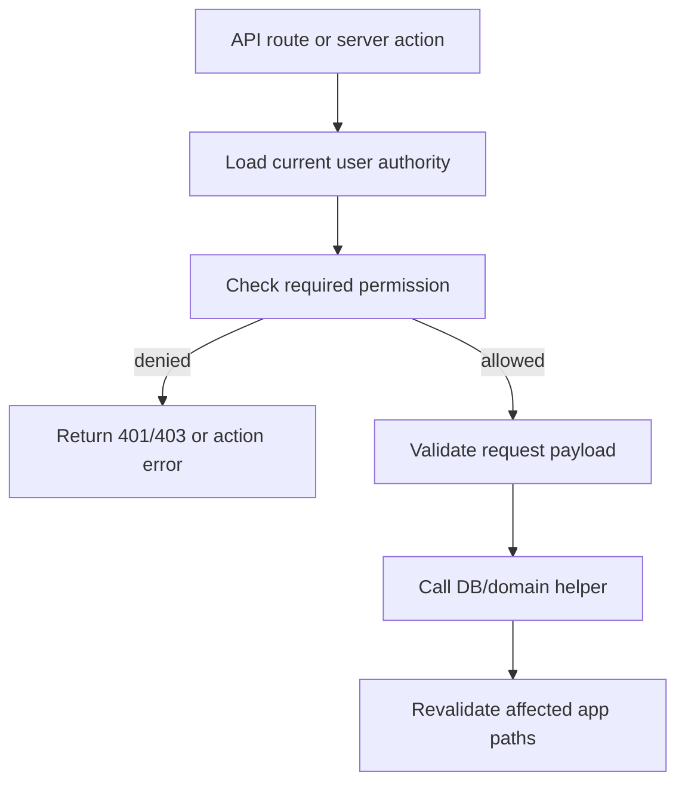
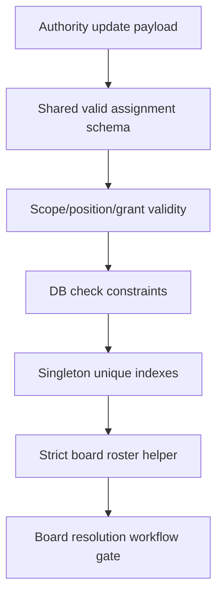

# Stage One Authority Hardening

## Overview

Fix the Stage 1 authority foundation before Stage 2 membership workflows build on it. The current authority direction is correct, but review surfaced three readiness blockers:

- Group API routes and server actions still rely on UI visibility or the authenticated app shell instead of backend authorization.
- Authority update input can persist semantically invalid scope/position/grant combinations.
- Board/officer authority can be ambiguous because singleton positions are not unique and the roster helper chooses the first matching officer.

This plan hardens the existing Stage 1 implementation rather than redesigning the authority model.

---

## Problem Frame

Stage 2 board-resolution workflows need reliable answers to "who may manage group membership?", "who is president?", "who is vice president?", "who is head of finance?", and "who are the three eligible board voters?". Those answers must come from server-enforced authority data, not from client-side hiding or best-effort lookup.

The review findings are security and data-integrity gates. If they remain open, later workflow code could snapshot invalid officers, expose member data through public API routes, or let unauthorized users mutate group membership and matching rules.

---

## Requirements Trace

- R1. All group member-management and matching-rule routes/actions enforce backend authorization before reading sensitive member data or mutating group state.
- R2. API routes under `src/app/api/**` must not depend on `proxy.ts` authentication because the matcher intentionally excludes `/api`.
- R3. Authority assignments must be valid by construction: legal officer positions only where global, department-head only where department-scoped, and admin only where global.
- R4. Singleton organizational positions must be unique where the domain requires uniqueness: one president, one vice president, one head of finance, and one department head per department.
- R5. The generic `board_member` position is removed because START Berlin has no non-officer legal board seats in V1.
- R6. Board roster setup must fail closed when officer data is incomplete, duplicated, or not represented by distinct eligible people.
- R7. Acceptance tests cover the permission and validation paths that Stage 2 depends on.

---

## Scope Boundaries

- This plan does not implement Stage 2 legal membership workflows.
- This plan does not introduce a general-purpose authorization middleware for all current and future API routes.
- This plan does not redesign group matching rules beyond protecting existing department/status/batch behavior.
- This plan does not remove legacy `user.roles`; it only ensures new authority state is valid and authoritative for the touched permissions.
- This plan does not enforce "exactly three legal officers" in the database because PostgreSQL row-count constraints are a poor fit here. The board roster helper remains the runtime gate for workflow creation.

---

## Context & Research

### Relevant Code and Patterns

- `src/proxy.ts` authenticates app pages but excludes `/api`, so API routes must authenticate and authorize themselves.
- `src/lib/permissions/server.ts` exposes `can(action, context?)` backed by current-user authority.
- `src/lib/permissions/index.ts` owns the central policy map and board roster helper.
- `src/app/(authenticated)/(app)/groups/[id]/actions.ts` contains group member server actions that currently call raw DB mutators.
- `src/app/api/groups/bulk-add-users/route.ts`, `src/app/api/users/search-by-criteria/route.ts`, `src/app/api/groups/criteria/route.ts`, `src/app/api/groups/criteria/[id]/route.ts`, `src/app/api/groups/[id]/route.ts`, and `src/app/api/groups/[id]/criteria/route.ts` expose group/member data or mutations outside the app proxy.
- `src/app/(authenticated)/(app)/people/[id]/update-authority-action.ts` currently owns authority update validation.
- `src/db/schema/authority.ts` defines authority tables and currently only prevents exact duplicate assignments for the same user.
- `drizzle/0010_careless_jack_murdock.sql` is the Stage 1 authority migration baseline.
- Existing tests use Node's built-in `node:test` runner, for example `src/lib/permissions/permissions.test.ts`.

### Institutional Learnings

- `docs/solutions/conventions/reusable-tone-of-voice-and-wording-decisions-2026-05-02.md` applies only if this work changes user-facing error copy. Any new admin-facing error text should describe the blocked outcome plainly and follow the shared retry/support pattern when shown in UI.

### External References

- No external research is needed for this hardening slice. The fix follows local Better Auth session lookup, `next-safe-action`, Drizzle, and permission-map patterns already present in the repo.

---

## Key Technical Decisions

- Enforce authorization at every backend entry point, even when the client is already wrapped in `<Can>`.
- Keep API routes for this fix if that is the smallest safe patch; replacing them with server actions can be deferred unless implementation shows that route-level auth is awkward.
- Use `groups.manage_members` for group membership mutations, bulk add, user search for adding members, and matching-rule create/delete.
- Use `groups.view_all` or existing group membership for group detail and criteria reads. This preserves the current product shape where ordinary members can view their own groups while elevated users can view all groups.
- Extract reusable authority assignment validation so UI schemas, server actions, tests, and DB expectations do not drift.
- Mirror domain validity in the database with check constraints or explicit migration SQL where Drizzle schema helpers are insufficient.
- Add partial unique indexes for all singleton positions.
- Treat only named officer positions as legal-board-eligible positions. Department heads keep operational leadership permissions but do not vote on legal resolutions.
- Require V1 board officer holders to be distinct people. If START later supports dual office holding, that should be a deliberate legal/product change before workflow snapshots depend on it.

---

## Open Questions

### Resolved During Planning

- Should `board_member` exist? No. V1 has no non-officer legal board seats.
- Should named officers need a duplicate board position? No. The three named officer positions are the legal board roster.
- Should `people_admin` exist in V1? No. Leave it out until a later HR/admin permission design introduces it deliberately.

### Deferred to Implementation

- Exact Drizzle syntax for check constraints and partial unique indexes. If Drizzle cannot express a constraint cleanly, use reviewed migration SQL while keeping schema comments/types aligned.
- Exact test harness shape for Next route handlers. Prefer extracting small reusable authorization/validation helpers when direct route tests are brittle.

---

## High-Level Technical Design

> *This illustrates the intended approach and is directional guidance for review, not implementation specification. The implementing agent should treat it as context, not code to reproduce.*

---

## Implementation Units

- U1. **Protect Group Backend Entry Points**

**Goal:** Close the P0/P1 authorization bypasses for group membership, group details, matching rules, and member search.

**Requirements:** R1, R2

**Dependencies:** None

**Files:**
- Modify: `src/app/(authenticated)/(app)/groups/[id]/actions.ts`
- Modify: `src/app/api/groups/bulk-add-users/route.ts`
- Modify: `src/app/api/users/search-by-criteria/route.ts`
- Modify: `src/app/api/groups/criteria/route.ts`
- Modify: `src/app/api/groups/criteria/[id]/route.ts`
- Modify: `src/app/api/groups/[id]/route.ts`
- Modify: `src/app/api/groups/[id]/criteria/route.ts`
- Modify: `src/db/groups.ts`
- Test: `src/lib/permissions/permissions.test.ts`
- Test: `src/db/groups.test.ts` or `src/app/api/groups/group-authorization.test.ts`

**Approach:**
- Add a small reusable server-side guard for group member management and group viewing, or colocate the checks if that remains clearer.
- Require `groups.manage_members` before:
  - searching users to add to a group,
  - adding/removing group members,
  - updating group-local roles,
  - bulk-adding users,
  - searching users by matching criteria,
  - creating/deleting group matching rules,
  - auto-adding users from matching rules.
- Require either `groups.view_all` or membership in the requested group before returning group details or criteria.
- Keep `users_to_groups.role` as group-local admin/member metadata; do not treat it as user authority.
- Return unauthorized responses before running member-data queries or group mutations.
- Preserve existing validation and conflict behavior after authorization succeeds.

**Execution note:** Start with characterization coverage around the current bypass paths where feasible, then make each backend entry point fail closed.

**Patterns to follow:**
- `src/lib/permissions/server.ts` for authority-backed `can`.
- Existing group raw helpers in `src/db/groups.ts`, but wrap them with authorization before use.
- `src/lib/action-client.ts` for authenticated server actions.

**Test scenarios:**
- Error path: unauthenticated request to bulk-add users receives an unauthorized response and inserts no rows.
- Error path: authenticated user without `groups.manage_members` cannot bulk-add users.
- Error path: authenticated user without `groups.manage_members` cannot search member data through criteria search.
- Error path: authenticated user without `groups.manage_members` cannot add, remove, or promote group members through server actions.
- Error path: authenticated user without `groups.manage_members` cannot create or delete group matching rules or trigger auto-add.
- Happy path: admin with global `admin` grant can perform each group management operation.
- Happy path: user who is a member of a group can read that group detail.
- Error path: user who is neither a group member nor allowed by `groups.view_all` cannot read group detail or criteria.
- Regression: group-local role updates still accept only `admin` or `member`.

**Verification:**
- All group data/mutation backend paths are protected server-side.
- Client-side `<Can>` remains a UX affordance only, not the authorization boundary.

---

- U2. **Make Authority Assignment Validity A Shared Contract**

**Goal:** Prevent invalid authority combinations from reaching the database through admin UI, direct server action calls, or future workflow code.

**Requirements:** R3, R7

**Dependencies:** None

**Files:**
- Create: `src/lib/permissions/authority-assignments.ts`
- Modify: `src/app/(authenticated)/(app)/people/[id]/update-authority-action.ts`
- Modify: `src/components/authority-editor.tsx`
- Modify: `src/db/authority.ts`
- Test: `src/lib/permissions/authority-assignments.test.ts`
- Test: `src/app/(authenticated)/(app)/people/[id]/update-authority-action.test.ts`

**Approach:**
- Define the valid assignment matrix once:
  - Global positions: `president`, `vice_president`, `head_of_finance`.
  - Department positions: `department_head`.
  - Global grants: `admin`.
- Validate and normalize authority update input through the shared contract before calling `replaceUserAuthority`.
- Normalize global assignments to `department = null`.
- Reject department-scoped assignments without a department.
- Reject duplicate assignments within one submitted payload before reaching the database.
- Keep the admin editor aligned with the valid matrix so it cannot generate invalid options.
- Keep `replaceUserAuthority` defensive by validating input as a domain boundary, not only trusting the action schema.

**Patterns to follow:**
- Existing pure helper style in `src/lib/membership-status.ts` and `src/lib/permissions/index.ts`.
- Current `zod` validation style in server actions.

**Test scenarios:**
- Happy path: global `president`, `vice_president`, and `head_of_finance` positions are accepted.
- Happy path: department-scoped `department_head` is accepted with a department.
- Happy path: global `admin` grant is accepted.
- Error path: department-scoped `president` is rejected.
- Error path: global `department_head` is rejected.
- Error path: department-scoped `admin` is rejected.
- Error path: department-scoped assignment without department is rejected.
- Error path: duplicate assignment in a single payload is rejected before DB insert.
- Integration: non-admin direct call to the authority update action remains denied.

**Verification:**
- Authority state cannot be persisted in combinations that the permission engine ignores or Stage 2 could misread.

---

- U3. **Add Singleton Position Constraints And Strict Board Roster Validation**

**Goal:** Make officer and department-head authority unambiguous for Stage 2 board resolutions.

**Requirements:** R4, R5, R6

**Dependencies:** U2

**Files:**
- Modify: `src/db/schema/authority.ts`
- Modify: `drizzle/0010_careless_jack_murdock.sql` or create a follow-up generated migration if Stage 1 migration has already been applied locally
- Modify: `src/lib/permissions/index.ts`
- Modify: `src/db/authority.ts`
- Test: `src/lib/permissions/permissions.test.ts`

**Approach:**
- Add database constraints for valid scope/department combinations:
  - Global rows must have `department IS NULL`.
  - Department rows must have `department IS NOT NULL`.
  - Position/grant values must match their allowed scope from U2.
- Add partial unique indexes or equivalent constraints:
  - At most one global `president`.
  - At most one global `vice_president`.
  - At most one global `head_of_finance`.
  - At most one `department_head` per department.
- Update `getBoardRosterSetup` to:
  - count unique eligible board people from global officer positions,
  - require exactly three eligible people,
  - require exactly one holder for each named officer function,
  - require officer holders to be distinct people for V1,
  - return typed setup errors instead of selecting the first matching user.
- Make `replaceUserAuthority` surface constraint violations as user-meaningful admin errors where possible.
- If a database already contains conflicting singleton rows, the migration should fail loudly or include a clearly reviewed cleanup precondition rather than silently choosing a winner.

**Execution note:** Treat this unit as data-integrity work. Add tests for the pure roster helper before changing its behavior, then add schema/migration constraints.

**Patterns to follow:**
- Current unique assignment constraints in `src/db/schema/authority.ts`.
- Existing board roster tests in `src/lib/permissions/permissions.test.ts`.
- Drizzle migration style in `drizzle/0010_careless_jack_murdock.sql`.

**Test scenarios:**
- Happy path: three eligible board people with one distinct president, vice president, and head of finance returns `ok: true`.
- Happy path: officer positions count as legal-board-eligible without requiring duplicate rows.
- Edge case: four eligible board people returns `invalid_board_member_count`.
- Edge case: two eligible board people returns `invalid_board_member_count`.
- Error path: two presidents returns a duplicate/ambiguous officer setup error.
- Error path: one user holding president and vice president fails the V1 distinct-officer rule.
- Error path: missing head of finance returns a missing officer setup error.
- Migration/data integrity: two department heads in the same department cannot both be persisted.
- Migration/data integrity: two users cannot both hold president.

**Verification:**
- Stage 2 can call board roster setup and either receive an unambiguous three-person board snapshot or a clear admin setup error.

---

- U4. **Add Stage One Acceptance Coverage And Readiness Checks**

**Goal:** Make the Stage 1 gate measurable so Stage 2 does not start on untested assumptions.

**Requirements:** R7

**Dependencies:** U1, U2, U3

**Files:**
- Modify: `src/lib/permissions/permissions.test.ts`
- Create: `src/lib/permissions/authority-assignments.test.ts`
- Create or modify: `src/app/(authenticated)/(app)/people/[id]/update-authority-action.test.ts`
- Create or modify: `src/app/api/groups/group-authorization.test.ts`
- Modify: `docs/plans/2026-05-02-001-feat-membership-lifecycle-workflows-plan.md`

**Approach:**
- Add coverage for the review findings directly so the same issues cannot regress silently.
- Add a short Stage 1 readiness note to the membership lifecycle plan explaining that Stage 2 depends on this hardening plan being complete.
- Keep tests focused on domain helpers, validation contracts, and authorization boundaries. Avoid brittle component-level tests unless implementation exposes a stable seam.
- If Next route-handler testing is awkward, extract route authorization decisions into small functions that can be tested with simple inputs while still being used by the routes.

**Patterns to follow:**
- Node `node:test` style used in existing tests.
- Pure helper tests in `src/lib/membership-status.test.ts`.

**Test scenarios:**
- Regression: each P0/P1 reviewed path denies unauthorized callers before data access or mutation.
- Regression: invalid authority payloads listed in U2 are rejected.
- Regression: singleton officer ambiguity listed in U3 fails closed.
- Regression: `member` legacy role maps to no authority assignment.
- Regression: `department_lead` without a department maps to no department-head assignment.
- Integration: server and client permission vocabulary still share the same action names and policy semantics.

**Verification:**
- Stage 1 readiness can be checked by tests and by a short manual app smoke pass: admin authority editing works, non-admin protected actions fail server-side, and board setup reports unambiguous officers.

---

## System-Wide Impact

- **Interaction graph:** Group pages, group dialogs, group API routes, authority editor, permission helpers, migrations, and future membership workflow creation all depend on this fix.
- **Error propagation:** Unauthorized API routes should return 401/403; server actions should fail with clear admin-facing errors. Constraint failures should not be swallowed or converted into misleading success toasts.
- **State lifecycle risks:** `replaceUserAuthority` deletes and reinserts assignment rows in one transaction. Validation must happen before destructive replacement, and database constraints must protect against invalid rows if future callers bypass the action.
- **API surface parity:** API routes, server actions, and UI controls must all enforce the same permissions. UI hiding alone is insufficient.
- **Integration coverage:** Tests should cover both pure policy behavior and at least one backend boundary per route/action category.
- **Unchanged invariants:** `user.status` remains separate from authority; `users_to_groups.role` remains group-local; Stage 2 workflows are still out of scope.

---

## Risks & Dependencies

| Risk | Mitigation |
|------|------------|
| Existing local data already has duplicate singleton positions | Add pre-migration detection or let the migration fail loudly with a documented cleanup query; do not silently pick a winner. |
| API route auth checks duplicate action auth checks | Prefer small shared guards for `groups.manage_members` and group-view authorization. |
| Constraint syntax differs between Drizzle schema and generated SQL | Keep schema intent and migration SQL reviewed together; add tests for runtime validation even if DB constraints are verified manually. |
| People-admin global access is later desired | Treat that as a future product decision and add it explicitly to the valid matrix then. |
| Full route-handler tests become brittle | Extract authorization decisions into pure helpers and keep route tests thin. |

---

## Documentation / Operational Notes

- Update `docs/plans/2026-05-02-001-feat-membership-lifecycle-workflows-plan.md` so Stage 2 explicitly waits for this hardening gate.
- Before applying the singleton migration to shared data, inspect existing authority rows for duplicate presidents, vice presidents, heads of finance, and department heads per department.
- Admins should correct officer assignments through the member detail Authority card before any Stage 2 board resolution workflow is created.

---

## Sources & References

- Origin plan: `docs/plans/2026-05-02-001-feat-membership-lifecycle-workflows-plan.md`
- Authority requirements: `docs/brainstorms/2026-04-28-user-authority-organization-model-requirements.md`
- Authority plan: `docs/plans/2026-04-28-002-feat-user-authority-organization-model-plan.md`
- Review findings: P0 group API/action authorization, P1 invalid authority assignments, P2 ambiguous board/officer setup
- Related code: `src/proxy.ts`
- Related code: `src/lib/permissions/index.ts`
- Related code: `src/lib/permissions/server.ts`
- Related code: `src/app/(authenticated)/(app)/groups/[id]/actions.ts`
- Related code: `src/app/api/groups/bulk-add-users/route.ts`
- Related code: `src/app/api/users/search-by-criteria/route.ts`
- Related code: `src/app/(authenticated)/(app)/people/[id]/update-authority-action.ts`
- Related code: `src/db/schema/authority.ts`
