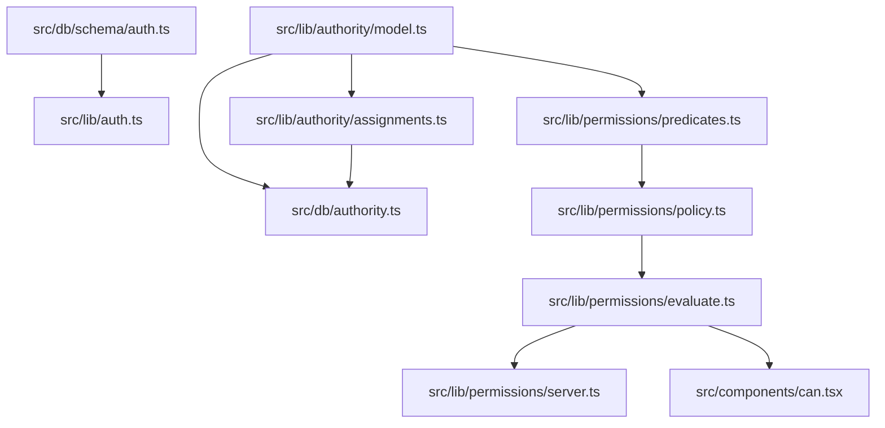
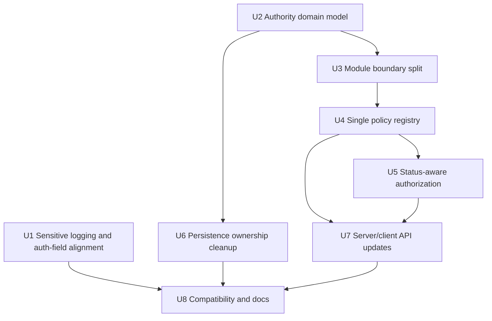
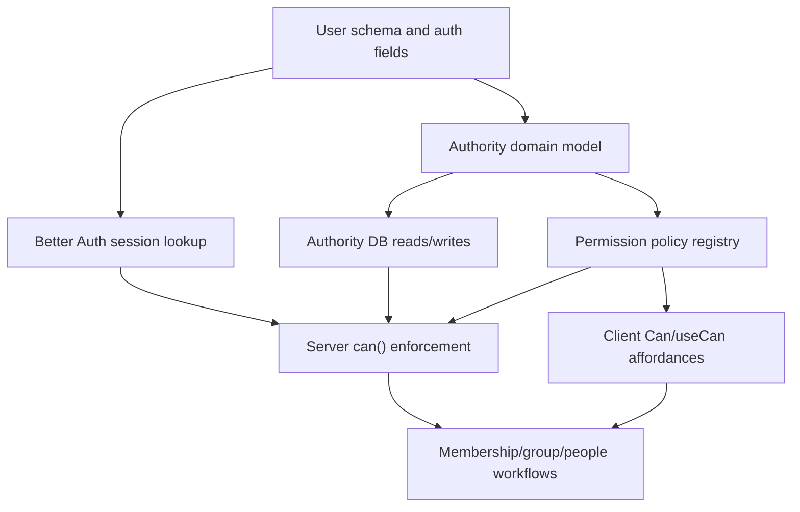

# Refactor Auth Permission Architecture

## Overview

Clean up the current auth and permission implementation so the authorization policy remains readable, harder to misuse, and easier to extend. The current predicate-based model works and is the right direction, but the code still spreads authority concepts across Better Auth config, Drizzle schema constraints, Zod validation, permission predicates, legacy migration helpers, and board roster helpers.

This plan keeps the product behavior mostly stable while addressing the review findings:

- remove sensitive auth-path logging,
- align Better Auth user-field config with the database-backed user model,
- introduce one authority-domain vocabulary for positions, grants, scopes, and active-member eligibility,
- split the overloaded permission `index.ts` into focused modules,
- reduce repeated permission action declarations and broad evaluator casts,
- move assignment validation out of the permission layer,
- add tests that protect the readability and safety contract.

---

## Problem Frame

START Cockpit separates lifecycle status, organization positions, explicit access grants, and effective authorization. The previous permission-policy refactor made rules read in business language, but the implementation still makes future changes harder than they should be.

The central issue is ownership. `src/lib/permissions/index.ts` currently acts as a domain model, policy DSL, policy table, evaluator, legacy-role mapper, and board-roster validator. Meanwhile, authority values and scope rules are repeated in `src/lib/permissions/authority-assignments.ts`, `src/db/schema/authority.ts`, and the predicate helpers. This creates a correctness risk because developers must remember several places whenever a position, grant, status rule, or permission action changes.

Because this is authorization code, readability is not cosmetic. OWASP's access-control guidance emphasizes deny-by-default checks, validating authorization on every request, and testing authorization logic. The local architecture should make those practices the easiest path.

---

## Requirements Trace

- R1. Remove full session/user object logging from routine auth lookup paths.
- R2. Better Auth additional user fields must be owned near, or checked against, the database-backed auth user schema so user-field changes do not drift silently.
- R3. Authority positions, access grants, scope rules, and board/officer categories must have one readable domain definition that other layers consume.
- R4. `src/lib/permissions/index.ts` must become a small public surface, not the implementation home for unrelated authority concerns.
- R5. Permission actions and context requirements must have one canonical declaration that derives `Action`, context argument types, and the policy table shape.
- R6. The evaluator must not expose broad `as unknown` style casts at the authorization boundary.
- R7. The policy API must distinguish global/context-free predicates from target-aware predicates strongly enough that broad predicates cannot be casually attached to scoped permissions without an explicit decision.
- R8. User lifecycle status must participate in centralized authorization decisions, with a deny-by-default posture and explicit exceptions for allowed onboarding/self-service flows.
- R9. Database authority persistence must not import validation from the permission policy layer; assignment validation belongs in a neutral domain or schema-adjacent module.
- R10. Existing policy behavior from the previous permission-policy refactor must remain intact unless this plan explicitly calls out a change.
- R11. Tests must cover runtime permission behavior, type-level policy misuse, assignment validation, and status gating.

**Origin actors:** A1 Admin or authorized member, A2 Frontend UI, A3 Server guard, A4 Implementer

**Origin acceptance examples:** AE1 same-department department-head access, AE2 any-department-head access, AE3 context mismatch rejected by TypeScript, AE4 missing context fails closed, AE5 client affordance plus server denial

---

## Scope Boundaries

- This plan is a readability and authorization-architecture refactor, not a redesign of START's product permissions.
- This plan does not add `people_admin` or arbitrary resource scopes.
- This plan does not add a visual permission editor or access audit page.
- This plan does not remove legacy `user.roles` from the database unless implementation confirms it is already fully unused and migration-safe; it should first be isolated from permission-facing code.
- This plan does not turn client-side checks into a security boundary.
- This plan should not change the current ability of admins, legal officers, and department heads unless called out in the status-gating unit.

### Deferred to Follow-Up Work

- Full API route wrapper coverage for all future route handlers: this plan can document and optionally introduce a pattern, but a full route-by-route audit may be a separate hardening pass.
- Removing `user.roles` from the database: plan separately if it requires migration/backfill cleanup.
- Dedicated directory/listing permissions such as `users.list` or `users.view_directory`: include only if implementation confirms current people-directory exposure should be corrected in this same refactor.

---

## Context & Research

### Relevant Code and Patterns

- `src/lib/auth.ts` configures Better Auth and repeats user additional-field definitions.
- `src/lib/auth-client.ts` uses Better Auth's `inferAdditionalFields<typeof auth>()` pattern.
- `src/db/schema/auth.ts` defines the Drizzle `user`, `session`, `account`, and `verification` tables.
- `src/db/user.ts` wraps `auth.api.getSession()` in a cached `getCurrentUser()`.
- `src/lib/permissions/index.ts` currently defines authority DTOs, permission contexts, predicates, `PERMISSIONS`, `evaluateAuth`, legacy role mapping, and board roster setup.
- `src/lib/permissions/server.ts` is the server-side enforcement wrapper around the evaluator.
- `src/components/can.tsx` and `src/lib/permissions/authority-context.tsx` provide client affordance checks from server-loaded authority.
- `src/lib/permissions/authority-assignments.ts` validates assignment input today, but it lives under the permission layer.
- `src/db/schema/authority.ts` owns persisted authority tables, enum values, scope checks, and uniqueness constraints.
- `src/db/authority.ts` maps database rows into `UserAuthority` and persists authority replacements.
- `src/lib/permissions/permissions.test.ts`, `src/lib/permissions/authority-assignments.test.ts`, and `src/lib/permissions/permissions.typecheck.ts` are the closest current coverage.

### Institutional Learnings

- `docs/solutions/conventions/reusable-permission-policy-api-2026-05-02.md` says permissions should read as business policy, server-side enforcement must use `can()`, client checks are affordances only, and adding permissions should include runtime plus type-level coverage.
- `docs/plans/2026-05-02-003-refactor-permission-policy-api-plan.md` established the named-predicate API and typed context goals this refactor must preserve.
- `docs/plans/2026-05-02-002-fix-stage-one-authority-hardening-plan.md` established the current valid authority matrix and board/officer constraints.

### External References

- Better Auth TypeScript docs: additional fields are inferred server/client-side, and additional fields are included in user input by default unless `input: false` is set for fields that should not be user-controlled.
- Better Auth options docs: `user.additionalFields` is the official hook for extending user fields.
- Next.js 16 Proxy docs: Proxy can do optimistic redirects, but is not intended as a full session-management or authorization solution.
- OWASP Authorization Cheat Sheet: access control should deny by default, validate permissions on every request, exit safely, and include unit/integration tests for authorization logic.

---

## Key Technical Decisions

- Make authority vocabulary a domain concern, not a permission concern: positions, grants, scopes, valid assignment combinations, board/officer categories, and status eligibility should live in a neutral module that both DB and permission code can consume.
- Keep policy rules readable first: the final policy table should still read as business language, even if the underlying type machinery becomes more structured.
- Prefer one canonical permission declaration: action keys, context requirements, and allowed predicates should be declared once and derive exported types from that declaration.
- Hide any unavoidable TypeScript correlation cast behind a tiny helper: the evaluator should read as evaluator plumbing, not as a pile of assertions at the auth boundary.
- Add lifecycle status as a central gate: authority assignments alone should not grant capabilities to onboarding, alumni, or inactive users unless a permission explicitly allows that status.
- Keep Better Auth additional fields non-user-input by default for server-owned fields: fields such as roles/status/authority-related data should not be writable through auth input unless deliberately intended.
- Keep the public import surface stable where possible: existing callers may continue importing from `@/lib/permissions`, but that file should re-export focused modules.

---

## Open Questions

### Resolved During Planning

- Should this update replace the completed predicate API plan? No. Create a new plan because this is a second-stage architecture/readability pass over the current implementation.
- Should external docs shape the plan? Yes, lightly. Better Auth docs matter for `additionalFields` ownership/input behavior, Next docs matter for not treating Proxy as authorization, and OWASP matters for deny-by-default/test posture.
- Should this plan include the session logging finding? Yes. It is small, high-signal, and belongs at the start of the refactor because it removes sensitive output without changing behavior.

### Deferred to Implementation

- Exact file names for the authority domain module: the plan proposes names, but implementation may choose clearer local names if the dependency graph demands it.
- Exact shape of the single permission registry: implementation should choose the simplest TypeScript form that preserves readability and type tests.
- Whether `user.roles` can be removed from non-test code immediately: implementation should verify actual production usage before deleting compatibility helpers or planning a migration.
- Whether people-directory access and metadata disclosure are handled in this PR or a follow-up hardening issue: implementation should decide based on blast radius after the auth architecture modules are separated.

---

## Output Structure

This illustrates the likely target layout. The per-unit file lists are authoritative; implementation may adjust names if a simpler boundary appears.

```text
src/lib/authority/
  model.ts
  assignments.ts
  legacy-roles.ts
  board-roster.ts
src/lib/permissions/
  index.ts
  contexts.ts
  predicates.ts
  policy.ts
  evaluate.ts
  server.ts
  authority-context.tsx
```

---

## High-Level Technical Design

> *This illustrates the intended approach and is directional guidance for review, not implementation specification. The implementing agent should treat it as context, not code to reproduce.*



The final permission registry should read roughly like this, without requiring implementers to duplicate the action string in several places:

```text
permission "users.view_details":
  context: targetDepartment
  activeUser: required
  allow:
    - global admin
    - head of target department

permission "groups.view_all":
  context: none
  activeUser: required
  allow:
    - global admin
    - legal officer
    - any department head
```

The important design property is that action, context, active-status eligibility, and predicate compatibility are visible in one policy row.

---

## Implementation Units



- U1. **Remove Sensitive Auth Logging And Align Better Auth Fields**

**Goal:** Eliminate routine session-object logging and make Better Auth additional fields intentionally mirror the server-owned user model.

**Requirements:** R1, R2

**Dependencies:** None

**Files:**
- Modify: `src/db/user.ts`
- Modify: `src/lib/auth.ts`
- Modify: `src/lib/auth-client.ts`
- Modify: `src/db/schema/auth.ts`
- Test: `src/lib/auth.test.ts` or `src/db/user.test.ts`

**Approach:**
- Remove `console.log(user)` from `getCurrentUser`.
- Move the Better Auth additional-field configuration into a schema-adjacent export or small auth-schema helper so `src/lib/auth.ts` is configuration assembly rather than field-definition ownership.
- Mark server-owned fields as not user-input where Better Auth supports it, especially fields representing roles, lifecycle status, or administrative data.
- Decide whether all existing `user` columns need to be exposed through Better Auth sessions. Fields that are required for session typing or onboarding can stay; fields not needed by Better Auth should not be mirrored just to match the table mechanically.
- Add a focused test or compile-time assertion that the exported additional-field config includes the intended field names and secure input behavior.

**Execution note:** Make the logging removal first because it is low-risk and security-sensitive.

**Patterns to follow:**
- `src/lib/auth-client.ts` already uses Better Auth's `inferAdditionalFields<typeof auth>()` plugin.
- `src/db/schema/auth.ts` is the source of truth for persisted user fields.

**Test scenarios:**
- Error path: `getCurrentUser` returns `null` when Better Auth returns no session and emits no full session log.
- Happy path: `getCurrentUser` still returns the session user when a session exists.
- Configuration: server-owned Better Auth additional fields are configured with user input disabled where applicable.
- Configuration: the auth client still infers additional fields from the server auth configuration.

**Verification:**
- Auth lookup paths no longer print session objects.
- Better Auth user-field configuration has one obvious ownership location and secure defaults for server-owned fields.

---

- U2. **Introduce A Shared Authority Domain Model**

**Goal:** Create one readable domain vocabulary for positions, grants, scopes, assignment validity, and board/officer categories.

**Requirements:** R3, R8, R9, R10

**Dependencies:** None

**Files:**
- Create: `src/lib/authority/model.ts`
- Move or modify: `src/lib/permissions/authority-assignments.ts`
- Modify: `src/db/schema/authority.ts`
- Modify: `src/lib/permissions/index.ts`
- Test: `src/lib/authority/model.test.ts`
- Test: `src/lib/authority/assignments.test.ts`

**Approach:**
- Define global organization positions, department organization positions, access grants, and supported scopes in one domain module.
- Include metadata that describes valid scope and department requirements for each assignment kind.
- Define legal-officer positions and department-head position categories from that same model.
- Keep the Drizzle enum declarations in `src/db/schema/authority.ts`, but make their value lists visibly checked against or imported from the domain model when feasible.
- Avoid over-deriving SQL constraints if it makes Drizzle schema unreadable; the key goal is one domain vocabulary and tests that catch drift.
- Move Zod assignment validation into `src/lib/authority/assignments.ts` or another neutral authority module, no longer under `src/lib/permissions`.

**Patterns to follow:**
- Existing `globalOrganizationPositions`, `departmentOrganizationPositions`, and `globalAccessGrants` in `src/lib/permissions/authority-assignments.ts`.
- Existing authority constraints in `src/db/schema/authority.ts`.

**Test scenarios:**
- Happy path: global officer positions are recognized as global-only positions.
- Happy path: `department_head` is recognized as department-scoped and department-required.
- Happy path: `admin` is recognized as a global-only access grant.
- Error path: a domain model change without corresponding validation coverage fails a targeted test.
- Error path: assignment validation rejects scope/department combinations not allowed by the shared model.

**Verification:**
- Adding a future position or grant has one primary domain location and clear downstream tests.

---

- U3. **Split Permission Implementation Into Focused Modules**

**Goal:** Make `src/lib/permissions/index.ts` a small barrel and move unrelated authority concerns into focused files.

**Requirements:** R4, R9, R10

**Dependencies:** U2

**Files:**
- Create: `src/lib/permissions/contexts.ts`
- Create: `src/lib/permissions/predicates.ts`
- Create: `src/lib/permissions/policy.ts`
- Create: `src/lib/permissions/evaluate.ts`
- Create: `src/lib/authority/legacy-roles.ts`
- Create: `src/lib/authority/board-roster.ts`
- Modify: `src/lib/permissions/index.ts`
- Modify: `src/lib/permissions/permissions.test.ts`
- Test: `src/lib/authority/legacy-roles.test.ts`
- Test: `src/lib/authority/board-roster.test.ts`

**Approach:**
- Move authority DTO types that are not specifically permission policy into `src/lib/authority/model.ts`.
- Move legacy role mapping out of the permission index. If it is still needed, keep it in `src/lib/authority/legacy-roles.ts` with a compatibility-oriented name.
- Move `getBoardRosterSetup` and related officer helpers into `src/lib/authority/board-roster.ts`.
- Move predicate definitions into `src/lib/permissions/predicates.ts`.
- Move policy rows into `src/lib/permissions/policy.ts`.
- Move the pure evaluator into `src/lib/permissions/evaluate.ts`.
- Keep `src/lib/permissions/index.ts` as a compatibility barrel that exports the public types/functions current callers need.

**Patterns to follow:**
- Current tests in `src/lib/permissions/permissions.test.ts` can be split by domain without changing behavior.
- Existing import style from `@/lib/permissions` can remain stable during the transition.

**Test scenarios:**
- Regression: all existing permission runtime tests still pass after module split.
- Regression: legacy `admin` roles map to global admin grants if the compatibility mapper remains.
- Regression: legacy `department_lead` with a department maps to a department-head position.
- Regression: legacy `member` maps to no authority assignment.
- Regression: board roster setup still handles missing, duplicate, and overlapping officer cases.

**Verification:**
- `src/lib/permissions/index.ts` is easy to scan and no longer owns board roster or legacy role behavior.

---

- U4. **Replace Repeated Action Declarations With A Single Policy Registry**

**Goal:** Declare each permission action, context requirement, status behavior, and allowed predicates once.

**Requirements:** R5, R6, R7, R10, R11

**Dependencies:** U3

**Files:**
- Modify: `src/lib/permissions/contexts.ts`
- Modify: `src/lib/permissions/predicates.ts`
- Modify: `src/lib/permissions/policy.ts`
- Modify: `src/lib/permissions/evaluate.ts`
- Modify: `src/lib/permissions/index.ts`
- Modify: `src/lib/permissions/permissions.typecheck.ts`
- Test: `src/lib/permissions/permissions.test.ts`
- Test: `src/lib/permissions/permissions.typecheck.ts`

**Approach:**
- Replace the separate `PermissionContexts` interface, object key, and repeated action string in `definePermission` with one canonical policy declaration.
- Keep the declaration readable: each row should show action key, context kind, status eligibility, and predicates.
- Derive `Action`, `PermissionContexts`, and `PermissionContextArg` from the policy registry.
- Separate predicate compatibility by intent. A target-aware predicate should only compose into target-context permissions. Broad context-free predicates should remain usable where explicitly allowed, but scoped actions should make broad grants visible and intentional.
- Hide any unavoidable TypeScript correlation cast in a helper such as a typed registry accessor. The evaluator should not need a visible `as unknown as PermissionRule<ActionName>` style assertion at its call boundary.
- Preserve runtime fail-closed behavior for malformed/missing context.

**Execution note:** Add type-level coverage before or alongside the registry change so the refactor cannot accidentally weaken context safety.

**Patterns to follow:**
- The current named predicates in `src/lib/permissions/index.ts`.
- `docs/solutions/conventions/reusable-permission-policy-api-2026-05-02.md` examples for target-department versus contextless permissions.

**Test scenarios:**
- Covers AE1. Happy path: department head can view details for a member in the same department.
- Covers AE1. Edge case: department head cannot view details for a member in another department.
- Covers AE2. Happy path: any department head can satisfy a permission that intentionally does not compare departments.
- Covers AE3. Type safety: a target-department-only predicate cannot be added to a contextless permission.
- Type safety: broad predicates on scoped permissions are either rejected or require an explicit policy marker that makes broadening visible.
- Covers AE4. Runtime: malformed or missing target context denies access.
- Regression: each current action keeps its existing allowed predicate set unless explicitly changed elsewhere in this plan.

**Verification:**
- Adding an action requires editing one policy row, not three disconnected declarations.
- Evaluator code reads as lookup plus predicate evaluation, not type-correlation recovery.

---

- U5. **Make Lifecycle Status Part Of Central Authorization**

**Goal:** Prevent retained authority assignments from granting capabilities to users whose lifecycle status should not be active for those actions.

**Requirements:** R8, R10, R11

**Dependencies:** U4

**Files:**
- Modify: `src/lib/permissions/policy.ts`
- Modify: `src/lib/permissions/evaluate.ts`
- Modify: `src/lib/permissions/server.ts`
- Modify: `src/lib/permissions/permissions.test.ts`
- Modify: `src/app/(authenticated)/(onboarding)/onboarding/[step]/page.tsx` if explicit onboarding exceptions require call-site changes
- Modify: `src/app/(authenticated)/(app)/membership/page.tsx` if membership self-service exceptions require call-site changes
- Test: `src/lib/permissions/permissions.test.ts`

**Approach:**
- Define a default status eligibility policy, likely active `member` plus any other statuses that should use normal app permissions.
- Add explicit per-action exceptions for flows that must work before full active membership, such as onboarding completion or membership self-service, if those actions use the same permission system.
- Keep lifecycle-status checks in the evaluator or policy registry so server and client affordance checks agree.
- Avoid hiding status logic inside individual predicates unless the predicate's business name includes status semantics.
- Treat unknown or missing status as denied.

**Patterns to follow:**
- `UserAuthority.status` is already loaded by `src/db/authority.ts`.
- Authenticated app layout already redirects incomplete onboarding users before most app pages.

**Test scenarios:**
- Error path: an onboarding user with global admin grant does not satisfy ordinary admin actions unless explicitly allowed.
- Error path: an alumni or supporting alumni user with stale authority does not satisfy ordinary admin actions unless explicitly allowed.
- Happy path: active member with global admin grant still satisfies admin-listed actions.
- Happy path: allowed onboarding/self-service exceptions still evaluate true for the intended statuses.
- Edge case: missing or malformed status denies access.

**Verification:**
- Status is no longer dead data inside `UserAuthority`; it participates in permission decisions consistently.

---

- U6. **Move Authority Persistence Validation Out Of The Permission Layer**

**Goal:** Clean up the dependency direction so database persistence does not import write validation from permission policy code.

**Requirements:** R3, R9

**Dependencies:** U2, U3

**Files:**
- Modify: `src/db/authority.ts`
- Modify: `src/lib/authority/assignments.ts`
- Modify: `src/db/schema/authority.ts`
- Modify: `src/lib/permissions/index.ts`
- Test: `src/lib/authority/assignments.test.ts`
- Test: `src/db/authority.test.ts`

**Approach:**
- Update `src/db/authority.ts` to import assignment validation from the authority domain module, not from `src/lib/permissions`.
- Extract repeated mapping from Drizzle query results to `UserAuthority` into one helper so `getUserAuthority`, `getUsersAuthority`, and `listUserAuthorities` cannot drift.
- Keep `replaceUserAuthority` validating normalized assignments defensively before the delete-and-reinsert transaction.
- Keep schema constraints in `src/db/schema/authority.ts` as the persistence backstop, but do not make the permission layer own those constraints.
- Check for any lingering imports from `src/db/**` into `src/lib/permissions/**` that create unnecessary cycles.

**Patterns to follow:**
- Current repeated mapper blocks in `src/db/authority.ts`.
- Current transaction shape in `replaceUserAuthority`.

**Test scenarios:**
- Happy path: `getUserAuthority`, `getUsersAuthority`, and `listUserAuthorities` all map positions/grants into identical `UserAuthority` shape.
- Edge case: `getUsersAuthority([])` still returns an empty array without querying.
- Error path: invalid assignment input is rejected before destructive replacement starts.
- Integration: valid replacement deletes old authority rows and inserts normalized new rows in one transaction.

**Verification:**
- Dependency direction is domain/schema -> DB/policy, not DB -> permission policy -> DB schema.

---

- U7. **Update Server And Client Permission Surfaces**

**Goal:** Preserve the public enforcement and affordance APIs while routing them through the new focused modules and status-aware registry.

**Requirements:** R5, R8, R10, R11

**Dependencies:** U4, U5

**Files:**
- Modify: `src/lib/permissions/server.ts`
- Modify: `src/components/can.tsx`
- Modify: `src/lib/permissions/authority-context.tsx`
- Modify: `src/app/(authenticated)/(app)/people/[id]/page.tsx`
- Modify: `src/components/people-table.tsx`
- Modify: `src/app/(authenticated)/(app)/groups/[id]/page-client.tsx`
- Test: `src/lib/permissions/permissions.test.ts`
- Test: `src/lib/permissions/permissions.typecheck.ts`

**Approach:**
- Keep server enforcement through `can(action, context?)`.
- Keep client affordances through `<Can>` and `useCan()`.
- Make sure the low-level evaluator remains clearly named and used only by wrappers/tests.
- Update imports to prefer public barrels where appropriate and avoid UI importing implementation internals.
- Re-check existing row-level client affordances so target-department context still flows cleanly.
- If implementation addresses adjacent review residuals, add a named permission for people-directory listing and generic metadata for unauthorized profile pages in this unit or a tightly scoped follow-up.

**Patterns to follow:**
- Existing `CanPropsWithContext` shape in `src/components/can.tsx`.
- Existing member-detail server check in `src/app/(authenticated)/(app)/people/[id]/page.tsx`.
- Existing people-table row affordance checks in `src/components/people-table.tsx`.

**Test scenarios:**
- Covers AE5. Client affordance: a user without profile-view permission gets no member-detail row affordance.
- Covers AE5. Server enforcement: opening a member detail URL directly still denies unauthorized access.
- Type safety: `can("groups.view_all")` compiles without context.
- Type safety: `can("users.view_details")` without context is rejected by TypeScript.
- Runtime: client `useCan()` returns false when authority context is missing.

**Verification:**
- Server and client permission surfaces remain ergonomic and share the same derived action/context vocabulary.

---

- U8. **Update Compatibility, Documentation, And Review Guardrails**

**Goal:** Leave future implementers with clear conventions and tests that prevent the architecture from collapsing back into a catch-all permission file.

**Requirements:** R4, R10, R11

**Dependencies:** U1, U3, U6, U7

**Files:**
- Modify: `docs/solutions/conventions/reusable-permission-policy-api-2026-05-02.md`
- Modify: `docs/plans/2026-05-02-003-refactor-permission-policy-api-plan.md` only if it needs a superseded/follow-up note
- Modify: `src/lib/permissions/permissions.test.ts`
- Modify: `src/lib/permissions/permissions.typecheck.ts`
- Test: `src/lib/permissions/permissions.test.ts`
- Test: `src/lib/permissions/permissions.typecheck.ts`

**Approach:**
- Update the convention doc with the new module layout and ownership boundaries.
- State where to add a new permission action, a new predicate, a new authority assignment kind, and a new server guard.
- Document that `src/lib/permissions/index.ts` is a public surface, not a dumping ground for new authority helpers.
- Add or preserve tests that make the module boundaries meaningful: runtime policy examples, type-level invalid policy examples, assignment validation, and status gating.
- If legacy role mapping remains, document it as compatibility/migration support and not the source of authorization truth.

**Patterns to follow:**
- Existing concise convention style in `docs/solutions/conventions/reusable-permission-policy-api-2026-05-02.md`.

**Test scenarios:**
- Test expectation: documentation itself has no runtime behavior, but this unit should keep or add regression tests for every reviewed architecture invariant before completing.

**Verification:**
- A future implementer can answer "where does this auth concept belong?" without reading the whole history of plans and reviews.

---

## System-Wide Impact



- **Interaction graph:** Better Auth session loading, DB authority mapping, server `can()`, client `<Can>`/`useCan()`, people pages, group pages, membership pages, and future workflows all depend on the permission vocabulary staying aligned.
- **Error propagation:** Evaluator-level denials stay boolean and fail closed. Server pages/actions decide whether to redirect, show an empty state, return an action error, or return 401/403 in route handlers.
- **State lifecycle risks:** `replaceUserAuthority` remains a delete-and-reinsert transaction, so validation must run before destructive work and DB constraints must continue to guard invalid rows.
- **API surface parity:** Server and client APIs must derive from the same action/context types so UI affordances and backend enforcement do not drift.
- **Integration coverage:** Unit tests prove pure policy behavior; type tests prove invalid compositions; server/client integration checks prove callers carry context correctly.
- **Unchanged invariants:** Client checks remain presentation-only. The permission policy remains the source of truth for effective authorization, not legacy roles or raw group-local membership roles.

---

## Risks & Dependencies

| Risk | Mitigation |
|------|------------|
| The refactor changes permission behavior while moving code | Add characterization tests for current policy rows before reshaping modules, then only change behavior in U5 status gating where explicitly planned. |
| Type-level registry becomes too clever to read | Prefer explicit context/status markers in each policy row over maximal inference. Readability is a requirement, not a nice-to-have. |
| Domain model and Drizzle enums still drift | Add focused tests or compile-time assertions comparing model value lists to schema enum values. |
| Status gating blocks legitimate onboarding or membership flows | Add explicit per-action exceptions and tests before enabling the default gate broadly. |
| `user.roles` removal creates migration risk | Treat roles as compatibility input first; remove persisted roles only in a separate migration plan if usage is gone. |
| Better Auth additional-field tightening breaks session typing | Keep `inferAdditionalFields<typeof auth>()` and add a small type/config test before changing client assumptions. |
| Large module split makes review noisy | Sequence units so behavior-preserving moves land before policy-shape changes; keep barrels temporarily stable. |

---

## Documentation / Operational Notes

- Update the permission policy convention doc once the module boundaries are final.
- Mention Better Auth additional-field input behavior near the auth field mapping so future server-owned fields default to non-user-input.
- Note that Next Proxy is an app-shell redirect aid, not a substitute for route/action authorization.
- No data migration is required for the core module split. Any `user.roles` removal or new people-directory permission should be planned separately if not handled during implementation.

---

## Alternative Approaches Considered

- Keep everything in `src/lib/permissions/index.ts` but add comments: rejected because the core problem is ownership and change locality, not lack of inline explanation.
- Move all authority concepts into `src/db/schema/authority.ts`: rejected because policy and UI validation need the same vocabulary without making the database schema module the domain API.
- Introduce a third-party authorization library: rejected for this pass because the local domain is small, existing tests/predicates work, and the problem is organization rather than missing authorization primitives.
- Make status gating only in app layouts: rejected because server actions, route handlers, and workflows also need deny-by-default behavior independent of page routing.

---

## Success Metrics

- `src/lib/permissions/index.ts` is a short public export file.
- A new permission action is added in one canonical policy row, with derived action/context types.
- A new authority position or grant has one obvious domain-model entry and drift tests.
- Existing permission behavior remains green except for planned status-gating changes.
- Type-level tests catch context mismatch and broad/scoped predicate misuse.
- Server-owned Better Auth additional fields are not accidentally user-input.
- Reviewers can read the policy table without jumping through assignment validation, board roster, or legacy role mapping code.

---

## Sources & References

- Origin document: [docs/brainstorms/2026-05-02-permission-policy-api-requirements.md](docs/brainstorms/2026-05-02-permission-policy-api-requirements.md)
- Related origin: [docs/brainstorms/2026-04-28-user-authority-organization-model-requirements.md](docs/brainstorms/2026-04-28-user-authority-organization-model-requirements.md)
- Prior plan: [docs/plans/2026-05-02-003-refactor-permission-policy-api-plan.md](docs/plans/2026-05-02-003-refactor-permission-policy-api-plan.md)
- Prior hardening plan: [docs/plans/2026-05-02-002-fix-stage-one-authority-hardening-plan.md](docs/plans/2026-05-02-002-fix-stage-one-authority-hardening-plan.md)
- Convention: [docs/solutions/conventions/reusable-permission-policy-api-2026-05-02.md](docs/solutions/conventions/reusable-permission-policy-api-2026-05-02.md)
- Related code: `src/lib/auth.ts`
- Related code: `src/db/user.ts`
- Related code: `src/db/schema/auth.ts`
- Related code: `src/db/schema/authority.ts`
- Related code: `src/db/authority.ts`
- Related code: `src/lib/permissions/index.ts`
- Related code: `src/lib/permissions/server.ts`
- Related code: `src/components/can.tsx`
- External docs: [Better Auth TypeScript docs](https://better-auth.com/docs/concepts/typescript)
- External docs: [Better Auth options docs](https://better-auth.com/docs/reference/options)
- External docs: [Next.js Proxy docs](https://nextjs.org/docs/app/getting-started/proxy)
- External docs: [OWASP Authorization Cheat Sheet](https://cheatsheetseries.owasp.org/cheatsheets/Authorization_Cheat_Sheet.html)
