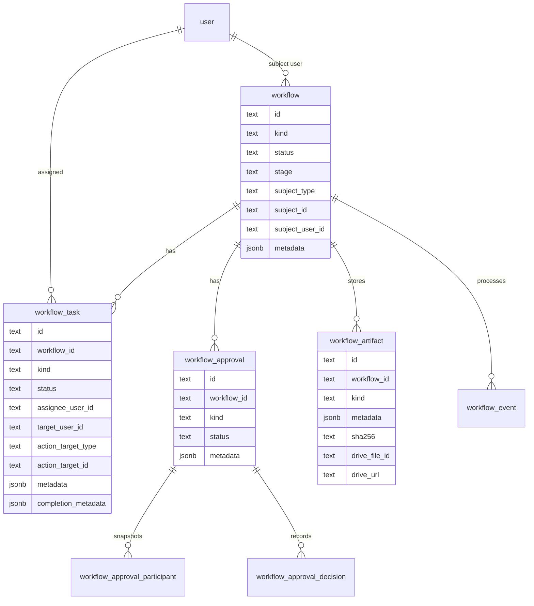
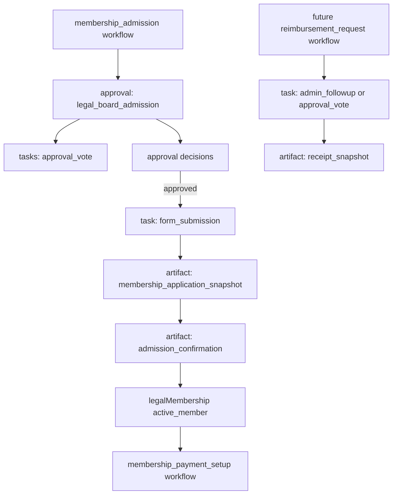

# Flexible Workflow Model

> Superseded by `docs/plans/2026-05-05-001-refactor-zod-workflow-simplification-plan.md`. This plan documents the earlier relational task/approval/artifact/event direction; the implemented direction keeps one workflow table and validates kind-specific metadata with Zod.

## Overview

Refactor the newly added Stage 2 workflow model from a membership-admission-shaped schema into a small reusable workflow core that still serves the membership lifecycle well. The goal is not to build a general workflow engine. The goal is to make admission, payment setup, future association-leaving workflows, and lightweight request flows such as reimbursements fit the same foundation without naming every root concept after membership admission.

The plan keeps the user's preferred direction: store kind-specific context in validated JSON metadata where possible. It keeps relational tables only where they provide real value: task assignment, approval/vote uniqueness, durable artifacts/documents, events, and auditability.

---

## Problem Frame

Stage 2 currently introduces useful primitives, but the root model is tightly shaped around admission: `memberWorkflow`, required `affectedUserId`, admission/payment-specific workflow statuses, and workflow-specific tables such as `boardResolution` and `membershipApplication`. That is fine for the immediate membership path, but it will make later workflows awkward. A resignation workflow would fit with friction; a reimbursement request would likely become a pile of forced user-centric fields and JSON side channels.

START Cockpit needs a reusable workflow core before Stage 3+ UI and actions start depending on the current table names and domain-specific statuses. This is still early enough to replace the generated Stage 2 schema and migration rather than carrying compatibility layers through the rest of the membership work.

---

## Requirements Trace

- R1. Provide a generic workflow root that is not named or shaped only around legal membership admission.
- R2. Preserve the membership lifecycle requirements from `docs/brainstorms/2026-05-02-membership-lifecycle-workflows-requirements.md`, especially R1-R5, R12, R18-R27, R37, and R40-R43.
- R3. Prefer validated metadata for kind-specific context instead of workflow-specific tables by default.
- R4. Keep relational data where the system needs queryability, assignment, idempotency, uniqueness, legal evidence, or auditability.
- R5. Keep the model simple enough that Stage 3+ implementation remains understandable and does not require a full workflow engine.
- R6. Make future workflows such as membership resignation and reimbursement requests possible without another root-table refactor.
- R7. Ensure invalid workflow kinds, stages, metadata shapes, task metadata, approval participants, and artifact snapshots cannot be silently persisted by app services.

**Origin actors:** A1 Onboarding user, A2 Existing operational Member or Supporting Alumni, A3 Legal Member or Supporting Alumni, A4 Alumni user, A5 Department Head, A6 Legal officer, A7 Admin, A8 START Cockpit

**Origin flows:** F2 Propose onboarding user for legal membership, F3 Import existing operational member with missing documents, F4 Finalize membership

**Origin acceptance examples:** AE1 legal state remains separate from workflow progress, AE4 proposal creates individual board-resolution work, AE5 missing-document import starts board task, AE6 board vote screen behavior, AE7 vote threshold/objection behavior, AE9 application flow snapshot, AE10 legal activation before payment continuation

---

## Scope Boundaries

- Do not implement resignation, reimbursement, procurement, IT, or other future workflows in this refactor.
- Do not introduce a universal top-level task inbox.
- Do not build a visual workflow designer, arbitrary transition DSL, or BPM-style engine.
- Do not make every field JSON. Common query axes such as workflow kind/status/stage, subject user, task assignee, task status, approval participant, artifact kind, and event idempotency remain relational.
- Do not remove the separate `legalMembership` state table. Durable legal membership state is domain state, not workflow metadata.
- Do not weaken legal evidence requirements from the membership lifecycle plan. Application submissions, approval outcomes, generated documents, hashes, and audit events must remain durable.

### Deferred to Follow-Up Work

- Add concrete resignation and reimbursement workflow builders after the generic model lands and the membership flow proves the shape.
- Consider broader task/inbox UX only after multiple workflow families exist.

---

## Context & Research

### Relevant Code and Patterns

- `src/db/schema/member-workflow.ts` currently defines `memberWorkflow`, `workflowTask`, `boardResolution`, `boardResolutionRosterMember`, `boardResolutionVote`, `membershipApplication`, `legalDocument`, and `workflowEvent`.
- `src/db/member-workflows.ts` currently creates admission and payment setup records, board roster vote tasks, application snapshots, legal documents, and workflow events.
- `src/db/member-workflows.test.ts` has useful pure-record tests that should be refactored rather than discarded.
- `src/db/schema/legal-membership.ts` cleanly separates durable legal state and should remain domain-specific.
- `src/db/audit-log.ts` and `src/db/schema/audit-log.ts` are already generic enough for workflow-related audit records.
- `src/lib/authority/board-roster.ts` remains the source for strict legal-officer roster setup; the workflow refactor should keep using it for admission approvals.
- `src/lib/permissions/server.ts`, `src/lib/permissions/evaluate.ts`, `src/lib/permissions/authority-context.tsx`, and `src/components/can.tsx` establish the current permission convention: server enforcement uses `can()`, client affordances use `<Can>`/`useCan()`.
- Existing tests use Node's built-in `node:test` runner and focused pure helper tests.

### Institutional Learnings

- `docs/solutions/conventions/reusable-permission-policy-api-2026-05-02.md` distinguishes contextless permissions from department-scoped checks. Workflow task visibility and action permissions should keep that clarity instead of hiding scope inside generic helpers.
- `docs/solutions/conventions/reusable-tone-of-voice-and-wording-decisions-2026-05-02.md` says admin copy should name user-visible outcomes, not internal mechanisms. Workflow `kind`, `stage`, and metadata labels may be technical, but UI labels should stay member-centered and outcome-oriented.

### External References

- No external research is needed for this plan. The design is constrained by existing Drizzle, Next.js, Inngest, permission, audit, and membership lifecycle patterns in this repo.

---

## Key Technical Decisions

- Rename the root concept to `workflow`: The reusable core should not encode membership in table, type, relation, or service names.
- Use generic root status plus kind-specific stage: `status` should be a small cross-workflow lifecycle such as `open`, `waiting`, `completed`, `cancelled`, and `manual_followup`. Admission-specific progress such as `board_voting`, `application_ready`, or `payment_required` belongs in a validated `stage` field for the workflow kind.
- Keep extensible kinds as text plus a typed registry: Workflow kind, workflow stage, task kind, approval kind, and artifact kind should be text columns validated by app services. This avoids a database migration for every future workflow family while still preventing invalid values through the application's write API.
- Keep common lifecycle statuses as database enums: Root workflow status, task status, approval status, decision value, artifact status, and event status are low-cardinality cross-workflow concepts and should remain database-constrained.
- Prefer metadata for kind-specific context: Admission resolution text/version/hash, application declarations, payment setup context, and future reimbursement details should live in validated metadata/artifacts unless they need relational constraints.
- Keep tasks relational: Tasks need assignee queries, status filters, completion timestamps, action target references, and one-task-per-assignee-target constraints.
- Use generic approvals rather than board-specific resolution tables: Board voting is an approval round with participant snapshots and decisions. Officer function, procedure rules, resolution text, and displayed text hash can be metadata on the approval, participant, and decision records.
- Use generic artifacts for immutable snapshots and generated files: Membership application snapshots, admission confirmations, board-resolution PDFs, and future reimbursement receipts can share one artifact table with kind, metadata, hashes, and storage references.
- Keep workflow events generic and idempotent: Inngest and future event handlers should continue to record idempotency keys and processing status without caring about the workflow family.
- Add metadata validators close to workflow code: The database can store JSON, but services should reject invalid metadata before insert/update. Tests should prove invalid combinations fail closed.
- Replace the Stage 2 migration before it lands: Since this branch has just generated the Stage 2 migration, implementation should prefer replacing `drizzle/0012_*` and its snapshot with the new generic schema. If the migration has already been applied in a shared environment, switch to a forward migration with table renames instead.

---

## Open Questions

### Resolved During Planning

- Should the model be metadata-first? Yes. Use metadata for kind-specific snapshots and context by default.
- Should everything become metadata? No. Tasks, approvals, participants, decisions, artifacts, events, and audit records need relational shape for constraints, visibility, and legal history.
- Should this refactor include future workflows? No. It should make them possible, not implement them.

### Deferred to Implementation

- Exact generated migration filename and whether implementation replaces `drizzle/0012_*` or creates a forward rename migration depends on whether the Stage 2 migration has been applied outside the local branch.
- Exact metadata schema names and helper names can be chosen during implementation as long as validation is centralized and tested.

---

## High-Level Technical Design

> *This illustrates the intended approach and is directional guidance for review, not implementation specification. The implementing agent should treat it as context, not code to reproduce.*

---

## Implementation Units

- U1. **Generic Workflow Schema**

**Goal:** Replace the admission-shaped workflow schema with a reusable core schema.

**Requirements:** R1, R2, R3, R4, R5, R6

**Dependencies:** None

**Files:**
- Create: `src/db/schema/workflow.ts`
- Delete or replace: `src/db/schema/member-workflow.ts`
- Modify: `src/db/schema/index.ts`
- Modify: `src/lib/id.ts`
- Modify or replace: `drizzle/0012_busy_captain_universe.sql`
- Modify or replace: `drizzle/meta/0012_snapshot.json`
- Modify: `drizzle/meta/_journal.json`
- Test: `src/db/workflows.test.ts`

**Approach:**
- Rename exported schema concepts from `memberWorkflow` to `workflow` and from `MemberWorkflow*` types to `Workflow*` types.
- Replace root `affectedUserId` with generic subject fields:
  - `subjectType` for the kind of thing the workflow is about.
  - `subjectId` for the specific subject.
  - optional `subjectUserId` for people/member workflows that need joins, profile cards, People action-required filters, and My membership lookups.
- Replace admission-specific root statuses with a small generic status vocabulary.
- Add `stage` as the kind-specific state marker. It is intentionally more flexible than root status, stored as text, and validated by workflow-kind registry code.
- Store workflow kind, task kind, approval kind, and artifact kind as text columns that app services validate through the registry. Keep cross-workflow status fields database-constrained.
- Add root `metadata` JSON for workflow-kind context.
- Keep `workflowTask`, but rename `payload` to `metadata` for consistency and keep `completionData` or rename it to `completionMetadata`.
- Add generic approval tables:
  - `workflowApproval` for approval rounds such as legal-board admission.
  - `workflowApprovalParticipant` for immutable participant snapshots such as officer function.
  - `workflowApprovalDecision` for one decision per participant per approval.
- Replace `legalDocument` and `membershipApplication` with a generic `workflowArtifact` table for immutable snapshots and generated documents.
- Keep `workflowEvent` with idempotency keys.
- Keep or add indexes for open workflows by `kind`, `status`, `stage`, `subjectUserId`, open tasks by assignee, approval decisions by approval/participant, and artifact uniqueness by workflow/kind where needed.

**Patterns to follow:**
- Existing `src/db/schema/member-workflow.ts` relation style.
- Existing `src/db/schema/legal-membership.ts` for small domain enums and relations.
- Existing `src/db/schema/membership.ts` for focused domain table exports.

**Test scenarios:**
- Happy path: a workflow can be represented with no `subjectUserId` for a future non-person workflow.
- Happy path: a membership admission workflow stores `subjectUserId` and admission metadata.
- Happy path: a workflow task stores assignee, target user, action target, metadata, and completion metadata.
- Happy path: an approval round stores three participants and one decision per participant.
- Edge case: duplicate approval decision for the same participant is rejected by constraints.
- Edge case: duplicate open admission workflow for the same subject user is prevented by the chosen uniqueness strategy.
- Edge case: artifact uniqueness prevents two finalized artifacts of the same kind for the same workflow unless explicit versioning metadata says otherwise.

**Verification:**
- Schema exports no longer force membership-specific root naming.
- Admission can still be represented with the same legal evidence as before.
- Future workflows can use the root table without pretending to have a membership application or board resolution.

---

- U2. **Workflow Kind And Metadata Registry**

**Goal:** Add a small typed registry that validates workflow kinds, allowed stages, task metadata, approval metadata, and artifact metadata before persistence.

**Requirements:** R3, R5, R7

**Dependencies:** U1

**Files:**
- Create: `src/lib/workflows/model.ts`
- Create: `src/lib/workflows/validation.ts`
- Create: `src/lib/workflows/metadata.ts`
- Test: `src/lib/workflows/validation.test.ts`

**Approach:**
- Define known workflow kinds for the current product surface, such as `membership_admission` and `membership_payment_setup`.
- Define allowed stages per workflow kind. For example, admission stages can include `board_voting`, `application_ready`, `submitted_processing`, and `payment_continuation_ready`, while payment setup can include `payment_required`.
- Define common root statuses separately from kind stages.
- Validate workflow metadata by kind. Admission metadata can include proposal reason, resolution text version/hash, and billing applicability. Payment setup metadata can include payment-related context without making payment the legal trigger.
- Validate task metadata by task kind. Approval vote tasks should require approval ID and participant snapshot context; form submission tasks should require the artifact/application target context.
- Validate approval metadata and participant metadata. Legal-board admission should require the two-of-three rule, no-silence-as-approval semantics, and officer-function snapshots.
- Validate artifact metadata by artifact kind. Membership application snapshots and rendered legal documents should carry version/hash/source information required by the lifecycle plan.
- Provide narrow helper functions for construction/validation. Feature code should not hand-build arbitrary workflow JSON.

**Patterns to follow:**
- `src/lib/authority/model.ts` for centralized vocabulary.
- `src/lib/authority/assignments.ts` for validation helpers that encode valid combinations.
- `src/lib/permissions/evaluate.ts` for explicit business-readable cases rather than hidden magic.

**Test scenarios:**
- Happy path: valid membership admission metadata passes.
- Happy path: valid legal-board approval participant metadata with president, vice president, and head of finance passes.
- Error path: admission workflow with a payment-only stage is rejected.
- Error path: approval vote task missing approval ID or participant ID is rejected.
- Error path: legal-board approval with duplicate officer functions is rejected before persistence.
- Error path: membership application artifact missing application version or fee text version is rejected.
- Edge case: a future non-person workflow kind can be added to the registry without changing the root table shape.

**Verification:**
- App services have one obvious validation layer for all workflow metadata writes.
- Invalid metadata combinations fail in unit tests before database writes.

---

- U3. **Membership Workflow Builders On Generic Core**

**Goal:** Rebuild the current admission and payment setup domain helpers on top of the generic workflow, approval, task, artifact, and event tables.

**Requirements:** R2, R4, R5, R7; origin R12, R18-R27, R37, R41-R43; AE1, AE4, AE5, AE7, AE9, AE10

**Dependencies:** U1, U2

**Files:**
- Create: `src/db/workflows.ts`
- Create: `src/db/membership-workflows.ts`
- Delete or replace: `src/db/member-workflows.ts`
- Modify: `src/db/audit-log.ts`
- Test: `src/db/workflows.test.ts`
- Test: `src/db/membership-workflows.test.ts`

**Approach:**
- Keep generic persistence helpers in `src/db/workflows.ts`: create workflow, create tasks, create approval, record approval decision, create artifact, record event once.
- Keep membership-specific orchestration in `src/db/membership-workflows.ts`: create admission workflow, create payment setup workflow, submit membership application snapshot, create finalized legal artifacts.
- Replace `admissionWorkflowRecords()` output with generic records:
  - workflow kind `membership_admission`
  - generic status `open` or `waiting`
  - stage `board_voting`
  - subject user set to the affected member
  - metadata carrying proposal and resolution context
  - approval kind `legal_board_admission`
  - approval participants with legal officer snapshots
  - approval vote tasks assigned to legal officers
- Replace `paymentSetupWorkflowRecords()` with workflow kind `membership_payment_setup`, stage `payment_required`, subject user, and one payment setup task.
- Replace `membershipApplication` rows with `workflowArtifact` rows using artifact kind `membership_application_snapshot`.
- Replace `legalDocument` rows with `workflowArtifact` rows using artifact kinds such as `board_resolution_document`, `membership_application_document`, and `admission_confirmation_document`.
- Preserve the strict board roster setup preflight from `src/lib/authority/board-roster.ts`.
- Preserve idempotent workflow event recording.

**Execution note:** Refactor existing pure-record tests first so the behavior stays visible while the table names change.

**Patterns to follow:**
- Existing `src/db/member-workflows.ts` transaction boundaries.
- Existing `src/db/member-workflows.test.ts` pure helper coverage.
- Existing `src/db/legal-membership.ts` separation between domain state and workflow progress.

**Test scenarios:**
- Happy path: creating admission workflow produces one generic workflow, one legal-board approval, three participant snapshots, and three approval vote tasks.
- Happy path: participant metadata preserves president, vice president, and head of finance snapshots.
- Happy path: payment setup workflow produces one workflow and one payment setup task without legal activation side effects.
- Happy path: application submission creates an immutable application artifact with address, declarations, fee acknowledgement, application version, and fee text version.
- Happy path: finalized legal document artifacts store snapshot metadata, hash, renderer, rendered timestamp, and storage references.
- Error path: board roster setup error prevents workflow creation.
- Error path: duplicate active membership admission workflow for the same subject user is reused or rejected according to the existing Stage 2 behavior.
- Integration: idempotent workflow event recording returns the existing event on repeated idempotency key.

**Verification:**
- Membership admission behavior remains equivalent to the Stage 2 intent, but no root table or root status is admission-specific.
- Payment setup remains a separate workflow and does not become the legal membership trigger.

---

- U4. **Call Site And Inngest Migration**

**Goal:** Update Stage 2 call sites, schema exports, tests, and the Inngest placeholder to use the generic workflow model.

**Requirements:** R1, R2, R5, R7

**Dependencies:** U1, U2, U3

**Files:**
- Modify: `src/db/schema/index.ts`
- Modify: `src/inngest/membership-lifecycle-workflow.ts`
- Modify: `src/inngest/index.ts`
- Modify: `src/lib/inngest.ts`
- Modify: `src/lib/id.ts`
- Modify or replace: `src/db/member-workflows.test.ts`
- Test: `src/db/workflows.test.ts`
- Test: `src/db/membership-workflows.test.ts`

**Approach:**
- Update schema exports and user relations to use `workflow` relation names such as `subjectWorkflows`, `createdWorkflows`, `assignedWorkflowTasks`, and `targetedWorkflowTasks`.
- Update Inngest event payload names only where necessary. The event can still include `workflowId`, `applicationId` or artifact ID, and `userId`, but naming should reflect artifacts if application rows are removed.
- Update ID prefixes to generic workflow prefixes such as `wfl`, `wft`, `wap`, `wpa`, `wad`, `war`, and `wev`.
- Remove imports of `memberWorkflow`, `boardResolution`, `membershipApplication`, and `legalDocument` from application code.
- Keep compatibility aliases only if they materially reduce churn in the immediate Stage 2 branch. Do not expose aliases as the long-term public API.

**Patterns to follow:**
- `src/inngest/new-user-workflow.ts` for event handler shape.
- Existing `src/lib/inngest.ts` event typing.

**Test scenarios:**
- Happy path: membership lifecycle Inngest handler records an event against the generic workflow ID.
- Error path: repeated Inngest event with the same idempotency key does not create duplicate workflow events.
- Type coverage: schema exports and service imports compile without old `memberWorkflow` names.

**Verification:**
- No source code outside migration snapshots references old workflow root names.
- Inngest placeholder still has enough data to process application-submitted events in later stages.

---

- U5. **Lifecycle Plan Alignment**

**Goal:** Update the existing membership lifecycle plan so Stage 3+ implementers build against the flexible workflow model instead of the admission-shaped Stage 2 model.

**Requirements:** R1, R2, R5, R6

**Dependencies:** U1-U4

**Files:**
- Modify: `docs/plans/2026-05-02-001-feat-membership-lifecycle-workflows-plan.md`
- Reference: `docs/plans/2026-05-04-001-refactor-flexible-workflow-model-plan.md`

**Approach:**
- Update Stage 2 language from "admission workflow/task/resolution/application/document schemas" to "generic workflow/task/approval/artifact/event schema plus legal membership state."
- Update high-level diagrams and implementation unit references so board resolutions are represented as legal-board approval rounds and application submissions as artifacts.
- Keep the product behavior unchanged: individual admission workflows, People action required, My membership task card, board voting, application submission, legal activation, payment continuation, document archival, and notifications.
- Add a note that future resignation and reimbursement workflows are now intended consumers of the generic model but remain follow-up work.

**Patterns to follow:**
- Existing plan wording and section structure.
- `docs/solutions/conventions/reusable-tone-of-voice-and-wording-decisions-2026-05-02.md` for any user-facing labels introduced in diagrams or examples.

**Test scenarios:**
- Test expectation: none -- documentation alignment only.

**Verification:**
- The main lifecycle plan no longer tells Stage 3+ implementers to depend on `memberWorkflow`, board-specific workflow root tables, or admission-specific root statuses.

---

## System-Wide Impact

- **Interaction graph:** The generic workflow core affects database schema exports, workflow domain services, Inngest workflow events, People action-required queries, My membership task card queries, future board voting screens, document generation, and audit logs.
- **Error propagation:** Metadata validation errors should fail before database writes and return domain-specific action errors at server boundaries. Database constraint errors should remain a backstop, not the main validation mechanism.
- **State lifecycle risks:** Workflow root status and kind-specific stage can drift if transitions are scattered. Keep stage transitions inside workflow service helpers.
- **API surface parity:** Server actions and route handlers must use `can()` for sensitive workflow reads/mutations. Client UI should use `<Can>`/`useCan()` only for affordances.
- **Integration coverage:** Pure helper tests should cover record shapes; integration-style tests should cover transaction helpers and idempotency where existing test infrastructure allows.
- **Unchanged invariants:** `legalMembership.state` remains the durable source of legal membership truth. Workflow progress must not be encoded into legal membership state.

---

## Alternative Approaches Considered

- Keep the current `memberWorkflow` model and add future types: rejected because future non-membership workflows would inherit required affected-user semantics and admission-specific statuses.
- Make one fully JSON `workflow` table with no relational tasks/approvals/artifacts: rejected because assignment visibility, voting uniqueness, idempotency, and legal evidence would become harder to query and easier to corrupt.
- Build a full workflow engine with transition definitions and generic step tables: rejected as too much machinery for the current product. The app needs a clean workflow foundation, not a process designer.
- Keep board resolution as a domain-specific table but genericize only the root workflow: acceptable if implementation discovers legal-document constraints that truly need it, but the preferred plan is a generic approval model because board voting and future approvals share the same core shape.

---

## Risks & Dependencies

| Risk | Mitigation |
|------|------------|
| Metadata becomes an untyped dumping ground | Add a workflow kind/stage/metadata registry with tests and require services to validate before persistence. |
| Generic names obscure membership behavior | Keep membership orchestration in `src/db/membership-workflows.ts` and use specific artifact/approval/task kinds. |
| Approval model becomes too abstract for legal board resolutions | Preserve legal-board approval metadata, participant officer-function snapshots, vote values, and two-of-three/no-objection rules in typed helpers and tests. |
| Migration churn grows if Stage 2 migration has already been applied | Prefer replacing the generated Stage 2 migration before merge; otherwise use a forward migration with explicit table renames and data preservation. |
| Future workflows need data that is expensive to query from JSON | Promote only proven query axes to relational columns later. Start with metadata for context and relational columns for assignment/status/subject/artifact lookup. |

---

## Documentation / Operational Notes

- The main membership lifecycle plan should be updated after implementation so Stage 3+ work references the generic model.
- Any admin/member-facing copy introduced later should avoid exposing internal workflow terms. UI should say things like "Finalize membership", "Vote on admission", or "Set up your yearly membership payment", not "workflow stage".
- If the Stage 2 migration has been run in a shared database, coordinate the migration path before applying this refactor.

---

## Sources & References

- **Origin document:** [docs/brainstorms/2026-05-02-membership-lifecycle-workflows-requirements.md](docs/brainstorms/2026-05-02-membership-lifecycle-workflows-requirements.md)
- Related plan: [docs/plans/2026-05-02-001-feat-membership-lifecycle-workflows-plan.md](docs/plans/2026-05-02-001-feat-membership-lifecycle-workflows-plan.md)
- Related convention: [docs/solutions/conventions/reusable-permission-policy-api-2026-05-02.md](docs/solutions/conventions/reusable-permission-policy-api-2026-05-02.md)
- Related convention: [docs/solutions/conventions/reusable-tone-of-voice-and-wording-decisions-2026-05-02.md](docs/solutions/conventions/reusable-tone-of-voice-and-wording-decisions-2026-05-02.md)
- Replaced code: `src/db/schema/member-workflow.ts`
- Replaced code: `src/db/member-workflows.ts`
- Replaced code: `src/db/member-workflows.test.ts`
- Related code: `src/db/schema/workflow.ts`
- Related code: `src/db/workflows.ts`
- Related code: `src/db/membership-workflows.ts`
- Related code: `src/db/membership-workflows.test.ts`
- Related code: `src/db/schema/legal-membership.ts`
- Related code: `src/lib/authority/board-roster.ts`
