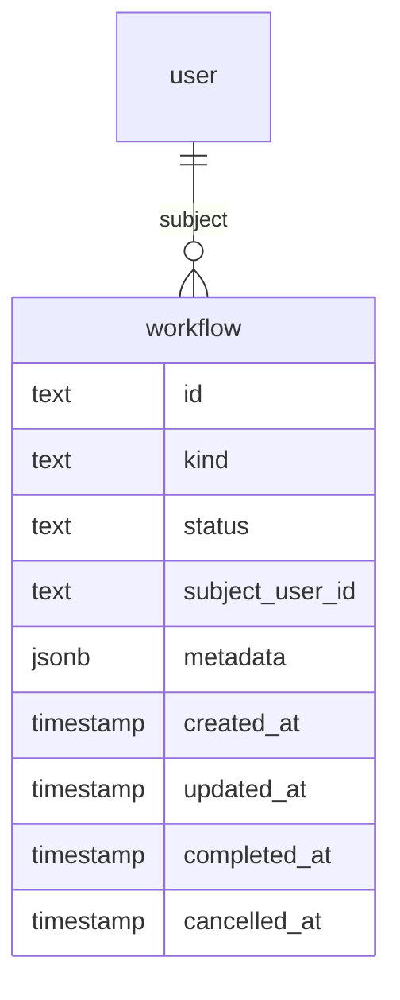
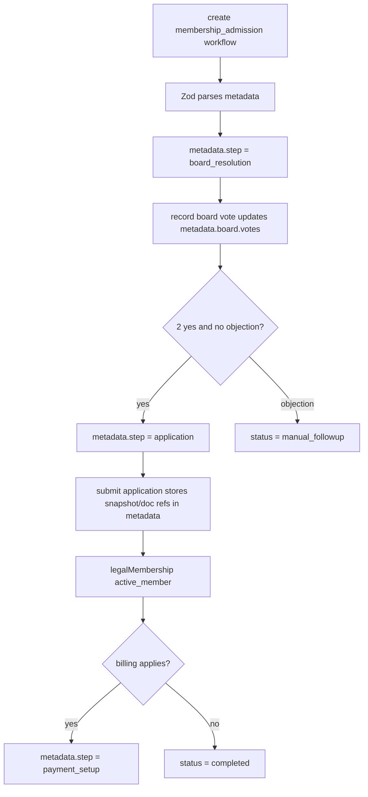

# Zod Workflow Simplification

## Overview

Replace the current generic workflow mini-engine with one simple workflow table and kind-specific Zod metadata schemas. The current `workflow` root table direction is good, but the surrounding generic tables for tasks, approvals, decisions, artifacts, and events make the system harder to understand before the product has proven it needs that generality.

The new direction keeps only the fields with known cross-workflow value: `kind`, generic `status`, `subjectUserId`, metadata, and timestamps. Workflow-specific state such as current step, board participants, board votes, application snapshots, payment context, document references, and generated hashes lives in metadata validated by the Zod schema for that workflow kind. Inngest owns async idempotency and retry observability, so the database does not keep a separate generic `workflowEvent` table.

---

## Problem Frame

The Stage 2 workflow code has drifted into an overly generic architecture. `src/db/schema/workflow.ts` now defines a generic workflow system with tasks, approvals, participants, decisions, artifacts, and events. `src/lib/workflows/membership.ts` is correspondingly overwhelming because it has to name every kind, task, approval, artifact, and metadata mapping up front. `src/lib/workflows/validation.ts` then manually reimplements schema validation that Zod can express more clearly.

This is the wrong carrying cost for V1. The membership lifecycle requirements need durable workflow state, legal evidence, board voting state, application data, document references, and clear queries for a user's own workflow. They do not yet require a reusable task engine or artifact engine. The simpler model should make the immediate membership workflow easier to build and leave room to add relational side tables only when a concrete query forces them.

---

## Requirements Trace

- R1. Store workflows in one durable `workflow` table with a minimal cross-workflow surface: `id`, `kind`, `status`, nullable `subjectUserId`, `metadata`, timestamps, `completedAt`, and `cancelledAt`.
- R2. Remove the generic workflow side tables for tasks, approvals, approval participants, approval decisions, artifacts, and events.
- R3. Validate workflow metadata with Zod schemas specific to each workflow kind. The inferred Zod types should replace hand-written metadata type buckets where practical.
- R4. Keep `subjectUserId` relational because the product needs direct user workflow queries for My membership and member-scoped admin views.
- R5. Move stage/progress into workflow metadata, for example as a kind-specific `step`, instead of keeping a generic `stage` column.
- R6. Store board vote assignments, vote state, application snapshots, document references, generated document hashes, and payment context inside the metadata schema for the owning workflow kind.
- R7. Use Inngest's idempotency/retry model for async workflow event processing instead of persisting a generic `workflowEvent` table.
- R8. Preserve the membership lifecycle intent from the origin requirements: individual admission workflows, contextual People/My membership work, board vote thresholds, application snapshots, payment continuation, durable legal history, and no generic top-level task inbox.
- R9. Keep the user deletion hardening decision: users cannot be deleted; legal/audit/workflow history must not null user identity.
- R10. Reduce the amount of workflow code a future implementer must read before adding or changing one workflow kind.

**Origin actors:** A1 Onboarding user, A2 Existing operational Member or Supporting Alumni, A3 Legal Member or Supporting Alumni, A5 Department Lead, A6 Board Member, A7 Admin, A8 START Cockpit

**Origin flows:** F2 Propose onboarding user for legal membership, F3 Import existing operational member with missing documents, F4 Finalize membership

**Origin acceptance examples:** AE1 pending workflow state stays separate from legal membership state, AE4 proposal creates one individual board workflow, AE5 missing-document import starts admission work, AE6 board vote screen shows current vote state, AE7 vote threshold/procedure objection behavior, AE9 application flow captures required declarations, AE10 legal activation precedes payment completion

---

## Scope Boundaries

- Do not implement the full board vote UI, member application UI, document rendering, emails, or payment continuation UI in this refactor.
- Do not introduce a generic task inbox or generic task table.
- Do not keep generic workflow approval/artifact abstractions just because future workflows might want them.
- Do not move `subjectUserId` into metadata; it supports known first-class product queries.
- Do not rely on the database to validate JSON metadata. The app write path validates metadata with Zod before persistence.
- Do not preserve compatibility for the just-created Stage 2 generic task/approval/artifact tables. This branch has not shipped; prefer replacing the Stage 2 migration over carrying forward compatibility code.

### Deferred to Follow-Up Work

- Add concrete People action-required queries and My membership cards against the simplified metadata once the UI stages begin.
- Add a relational assignment/index table later only if filtering workflows in app code becomes measurably painful or a global task surface becomes a real product requirement.

---

## Context & Research

### Relevant Code and Patterns

- `src/db/schema/workflow.ts` currently defines the root workflow table plus generic task, approval, participant, decision, artifact, and event tables.
- `src/lib/workflows/membership.ts` currently holds workflow kinds, stages, task kinds, approval kinds, artifact kinds, and metadata types in one large file.
- `src/lib/workflows/validation.ts` manually validates object shapes that are better expressed as Zod schemas.
- `src/lib/authority/assignments.ts` shows a local pattern for Zod schemas with inferred transformed types.
- `src/lib/gocardless/webhook.ts` shows a local pattern for Zod-validated external payloads.
- `src/inngest/membership-lifecycle-workflow.ts` currently writes to `workflowEvent`, but the Inngest function already declares idempotency.
- `src/db/membership-workflows.ts`, `src/db/membership-admission-workflows.ts`, `src/db/membership-payment-workflows.ts`, and `src/db/membership-workflow-artifacts.ts` are the main service files that should collapse around simpler metadata transitions.
- `src/db/schema/index.ts` currently exports workflow side table relations and user task relations that should be removed.

### Institutional Learnings

- `docs/solutions/conventions/reusable-tone-of-voice-and-wording-decisions-2026-05-02.md` says admin copy should name user-visible outcomes, not implementation mechanisms. This supports keeping internal workflow terms out of future UI even if metadata uses technical names.
- `docs/solutions/conventions/reusable-permission-policy-api-2026-05-02.md` keeps permission semantics explicit. Future workflow actions should continue to check specific permissions rather than hiding authorization inside a generic workflow runner.

### External References

- No external research is needed. Zod, Drizzle, and Inngest are already established dependencies in this repo, and this plan is primarily a local simplification.

---

## Key Technical Decisions

- Keep one workflow table: The durable database model should describe that a workflow exists, what kind it is, who it is primarily about when applicable, and its generic lifecycle status.
- Remove `stage`: A stage column looks reusable but immediately duplicates kind-specific state. Use `metadata.step` or a similar schema-owned field instead.
- Keep `subjectUserId`: This is not speculative generality. The app needs to show a user their own membership workflow and let member-scoped admin views find workflows for people directly.
- Remove `subjectType` and `subjectId`: Those are speculative generic subject modeling. If a future reimbursement workflow needs a receipt, budget, group, or external reference, it can define that in metadata.
- Remove task/approval/artifact/event tables: They model a generic engine we do not need yet. Membership board votes, assignments, application snapshots, and document references can be explicit metadata inside the admission workflow.
- Keep generic status small: Use a cross-workflow lifecycle such as `open`, `completed`, `manual_followup`, and `cancelled`. Waiting states such as board vote pending are workflow-specific metadata steps, not generic statuses.
- Use Zod as the registry: Each workflow kind exports a Zod metadata schema. A small helper selects the schema by `kind` and returns typed parsed metadata.
- Prefer explicit domain helper functions over framework abstractions: Helpers like "create admission workflow", "record board vote", and "submit membership application" should update metadata through the schema. Avoid a generic transition DSL.
- Use Inngest for async idempotency: Do not duplicate Inngest event state in `workflowEvent`. Inngest function and step IDs should be the retry/idempotency boundary.
- Store document references in metadata, not binary content: Metadata can hold generated document ids, Drive references, hashes, renderer/version, and timestamps. The readable archive remains external, while the workflow row stays the source of current workflow truth.

---

## Alternative Approaches Considered

- Keep `workflowArtifact` as the one relational side table: Rejected for now. It may become useful later for cross-workflow document search, but V1 only needs documents in the context of one membership workflow.
- Keep `workflowTask` as an assignment index: Rejected for now. Board resolution work is member-scoped and contextual to People; My membership work is scoped to the subject user. These can be driven from workflow metadata until a broader task surface exists.
- Move `subjectUserId` into metadata too: Rejected. The app has a known query for "this user's workflows", and relational lookup is simpler and clearer than JSON filtering.
- Keep `workflowEvent` for observability: Rejected because Inngest already provides idempotency/retry observability at the execution boundary.

---

## Open Questions

### Resolved During Planning

- Should Zod replace hand-written metadata validation? Yes. Zod should become the source of truth for metadata shape and inferred types.
- Should generic task/approval/artifact/event tables remain? No. They are the overwhelming part of the architecture and should be removed.
- Should `subjectUserId` remain relational? Yes. It serves a known user workflow query.
- Should Inngest or the DB own workflow event idempotency? Inngest.

### Deferred to Implementation

- Exact metadata field names can be adjusted while migrating tests, as long as the schema remains compact and readable.
- Whether `membership_payment_setup` remains a separate workflow kind or becomes only an admission workflow step can be finalized while updating existing service tests. The default plan is to keep it only if current verified-member payment setup needs a standalone workflow.
- Exact migration file replacement depends on whether implementation chooses to regenerate `drizzle/0012_*` or manually edit the current unshipped migration.

---

## Output Structure

    src/lib/workflows/
      core.ts
      membership-admission.ts
      membership-payment-setup.ts
      index.ts

The tree shows the intended shape. The implementer may collapse `membership-payment-setup.ts` into `membership-admission.ts` if payment setup becomes only an admission step during implementation.

---

## High-Level Technical Design

> *This illustrates the intended approach and is directional guidance for review, not implementation specification. The implementing agent should treat it as context, not code to reproduce.*





---

## Implementation Units

- U1. **Simplify Workflow Schema**

**Goal:** Replace the generic workflow schema with one minimal workflow table.

**Requirements:** R1, R2, R4, R5, R9

**Dependencies:** None

**Files:**
- Modify: `src/db/schema/workflow.ts`
- Modify: `src/db/schema/index.ts`
- Modify: `src/lib/id.ts`
- Modify: `drizzle/0012_curvy_blue_marvel.sql`
- Modify: `drizzle/meta/0012_snapshot.json`
- Modify: `drizzle/meta/_journal.json` if migration generation changes the entry
- Test: `src/db/schema/user-deletion.test.ts`
- Test: `src/db/workflows.test.ts`

**Approach:**
- Keep only `workflow`, `workflowStatus`, and `workflowRelations`.
- Remove `workflowTask`, `workflowApproval`, `workflowApprovalParticipant`, `workflowApprovalDecision`, `workflowArtifact`, and `workflowEvent` schema definitions and relations.
- Remove `stage`, `subjectType`, and `subjectId` from `workflow`.
- Keep nullable `subjectUserId` and `createdByUserId` as direct user references with restrictive user-delete behavior.
- Remove the partial unique index for active admission workflows; enforce duplicate prevention in the service layer for now.
- Remove obsolete ID prefixes for deleted workflow side tables.
- Preserve the database trigger that blocks user deletion.

**Patterns to follow:**
- `src/db/schema/legal-membership.ts` for a focused domain table with clear relations.
- `src/db/schema/audit-log.ts` for restrictive user references after the deletion hardening.

**Test scenarios:**
- Happy path: a workflow row can be represented with kind, status, subject user, and metadata only.
- Happy path: user deletion migration guard remains present.
- Error path: migration no longer contains workflow task/approval/artifact/event table creation.
- Error path: migration no longer contains the active admission partial unique index.
- Integration: `src/db/schema/index.ts` no longer exports deleted side tables or user task relations.

**Verification:**
- The schema exposes only the simplified workflow surface and user deletion hardening still holds.

- U2. **Replace Workflow Validation With Zod Schemas**

**Goal:** Make Zod the source of truth for workflow metadata validity and inferred types.

**Requirements:** R3, R5, R6, R10

**Dependencies:** U1

**Files:**
- Create: `src/lib/workflows/core.ts`
- Create: `src/lib/workflows/membership-admission.ts`
- Create: `src/lib/workflows/membership-payment-setup.ts` if standalone payment workflows remain
- Create: `src/lib/workflows/index.ts`
- Delete or replace: `src/lib/workflows/model.ts`
- Delete or replace: `src/lib/workflows/membership.ts`
- Delete or replace: `src/lib/workflows/metadata.ts`
- Delete or replace: `src/lib/workflows/validation.ts`
- Test: `src/lib/workflows/validation.test.ts`

**Approach:**
- Define generic status and workflow-row helpers in `core.ts`.
- Define each workflow kind's metadata schema in its own small domain file.
- Use Zod inferred types instead of hand-written metadata mapping types where possible.
- Add a small schema lookup helper, conceptually "parse metadata for this kind", that dispatches to the right Zod schema.
- Model progress as a schema-owned field such as `metadata.step`.
- Model board participants, votes, application snapshot, payment context, and document references inside the admission metadata schema.
- Keep helper names domain-oriented and obvious. Avoid another large registry file.

**Technical design:** Directional shape only:

```text
core:
  workflowStatusSchema
  parseWorkflowMetadata(kind, metadata)
  buildWorkflowValues(kind, metadata, options)

membership-admission:
  membershipAdmissionMetadataSchema
  createAdmissionMetadata(...)
  recordBoardVoteInMetadata(...)
  submitApplicationInMetadata(...)
```

**Patterns to follow:**
- `src/lib/authority/assignments.ts` for Zod schemas plus inferred transformed types.
- `src/lib/gocardless/webhook.ts` for concise Zod payload validation.

**Test scenarios:**
- Happy path: membership admission metadata parses with subject user, proposer, board participants, board step, and resolution text.
- Happy path: board vote metadata parses with yes/no/abstain/procedure objection values.
- Happy path: application metadata parses with address, declarations, fee acknowledgement, snapshot version, document references, and hashes.
- Happy path: payment setup metadata parses when billing applies.
- Error path: unknown workflow kind is rejected by the schema lookup helper.
- Error path: invalid board vote value is rejected by Zod.
- Error path: missing subject user in admission metadata is rejected even though `workflow.subjectUserId` is separately stored for lookup.
- Error path: document references without a hash or storage reference are rejected.

**Verification:**
- Hand-written `requireString`/`requireRecord` style validation is gone from workflow code.
- A reader can understand one workflow kind by opening one schema file.

- U3. **Rewrite Membership Workflow Services Around Metadata Transitions**

**Goal:** Replace side-table record builders with simple workflow creation and metadata transition helpers.

**Requirements:** R2, R4, R6, R8, R10

**Dependencies:** U1, U2

**Files:**
- Modify: `src/db/membership-workflows.ts`
- Modify or delete: `src/db/membership-admission-workflows.ts`
- Modify or delete: `src/db/membership-payment-workflows.ts`
- Delete: `src/db/membership-workflow-artifacts.ts`
- Modify: `src/db/workflows.ts`
- Test: `src/db/membership-workflows.test.ts`
- Test: `src/db/workflows.test.ts`

**Approach:**
- Make `createAdmissionWorkflow` insert one workflow row with `kind = membership_admission`, `subjectUserId`, `createdByUserId`, generic `status`, and parsed metadata.
- Store board roster snapshots in metadata when the workflow is created.
- Store board votes in metadata through a transition helper rather than inserting approval decision rows.
- Store application snapshots and legal document references in metadata rather than `workflowArtifact` rows.
- Store payment continuation state in metadata or in a standalone `membership_payment_setup` workflow only if the current verified-member payment setup path needs it outside admission.
- Keep `findActiveAdmissionWorkflow` as a simple query by `kind`, `subjectUserId`, and open/manual-followup statuses.
- Keep duplicate prevention in the service: if an active admission workflow exists for a subject user, reuse it.

**Patterns to follow:**
- Existing `src/db/membership-workflows.test.ts` pure value tests, but rewrite expected records around one workflow row.
- Existing `src/db/legal-membership.ts` for small domain helper functions.

**Test scenarios:**
- Happy path: admission workflow creation returns one workflow value with board participants embedded in metadata.
- Happy path: invalid board roster setup fails before creating workflow metadata.
- Happy path: recording a yes vote updates only the matching board participant's vote entry in metadata.
- Happy path: two yes votes and no procedure objection advance metadata to application-ready state.
- Edge case: duplicate vote from the same board participant replaces or rejects according to the chosen V1 contract, and the test locks that contract.
- Error path: a vote from a user who is not in the stored board roster is rejected.
- Happy path: application submission stores application snapshot and generated document references in metadata.
- Happy path: billing-required application submission advances to payment setup while legal membership activation remains separate.
- Error path: application submission without fee acknowledgement is rejected by Zod.

**Verification:**
- Membership workflow service no longer imports or inserts deleted workflow side tables.
- Existing membership lifecycle behavior is represented through one workflow row plus legal membership state.

- U4. **Remove Workflow Event Persistence And Lean On Inngest**

**Goal:** Remove `workflowEvent` and make Inngest the only async idempotency/retry boundary.

**Requirements:** R2, R7, R10

**Dependencies:** U1, U3

**Files:**
- Modify: `src/inngest/membership-lifecycle-workflow.ts`
- Modify: `src/lib/inngest.ts`
- Modify: `src/db/workflows.ts`
- Delete event-related tests from: `src/db/workflows.test.ts`

**Approach:**
- Remove `recordWorkflowEventOnce` and `workflowEventValues`.
- Keep or adjust Inngest function `idempotency` configuration so repeated event deliveries do not duplicate side effects.
- Replace the current placeholder "record event" step with either no-op processing or the real simplified workflow transition if that transition already exists after U3.
- Keep event payloads focused on workflow id and user id. Do not carry artifact ids if artifacts are no longer separate rows.

**Patterns to follow:**
- Existing Inngest functions in `src/inngest/` that use `step.run()` for idempotent side effects.
- `src/lib/inngest.ts` typed event schema pattern.

**Test scenarios:**
- Happy path: typed Inngest event payload matches simplified workflow metadata concepts.
- Error path: no application artifact id is required after artifact table removal.
- Test expectation: no database idempotency test remains for `workflowEvent` because Inngest owns that concern.

**Verification:**
- No application code imports `recordWorkflowEventOnce`.
- No schema or migration creates `workflow_event`.

- U5. **Update Documentation And Supersede Previous Workflow Architecture Plans**

**Goal:** Keep project documentation aligned with the simpler Zod-first workflow architecture.

**Requirements:** R8, R10

**Dependencies:** U1, U2, U3, U4

**Files:**
- Modify: `docs/plans/2026-05-02-001-feat-membership-lifecycle-workflows-plan.md`
- Modify: `docs/plans/2026-05-04-001-refactor-flexible-workflow-model-plan.md`
- Modify: `docs/plans/2026-05-04-002-refactor-workflow-readability-hardening-plan.md`
- Potentially create: `docs/solutions/conventions/zod-workflow-metadata-2026-05-05.md`

**Approach:**
- Update the membership lifecycle plan's data model section to describe one workflow table plus Zod metadata.
- Mark the prior flexible workflow and readability hardening plans as superseded by this simplification, or add a short supersession note near the top.
- Add a concise convention doc only if implementation lands a reusable helper pattern worth preserving.

**Patterns to follow:**
- Existing plan frontmatter and status/supersession style in `docs/plans/`.
- Existing concise convention docs in `docs/solutions/conventions/`.

**Test scenarios:**
- Test expectation: none -- documentation-only unit.

**Verification:**
- Future readers are not sent toward the obsolete generic task/approval/artifact model.

---

## System-Wide Impact

- **Interaction graph:** Workflow services, Inngest typed events, schema exports, ID generation, membership lifecycle tests, and future People/My membership queries all touch this model.
- **Error propagation:** Metadata validation errors should surface as domain validation errors before database writes, not as JSON shape surprises after persistence.
- **State lifecycle risks:** Since metadata stores more state, transitions must parse the existing metadata, update one intended slice, parse the result, then persist. Avoid ad hoc object mutation outside workflow helpers.
- **API surface parity:** Server actions and Inngest functions should use the same metadata transition helpers so sync and async paths cannot diverge.
- **Integration coverage:** Pure helper tests cover schema/transition behavior; membership service tests should prove one workflow row is written for creation and updated for transitions.
- **Unchanged invariants:** Legal membership state remains separate from workflow progress. User deletion remains blocked. Payment completion remains separate from legal activation.

---

## Risks & Dependencies

| Risk | Mitigation |
|------|------------|
| JSON metadata becomes an unstructured dumping ground | Zod schemas live next to each workflow kind, and every write path parses before persistence. |
| People action-required queries become inefficient | V1 can query open admission workflows and filter parsed metadata in app code; add a small assignment index later only if real usage needs it. |
| Legal evidence feels less durable without artifact tables | Store immutable application snapshots, document refs, hashes, renderer/version, and timestamps inside metadata. Keep corrections as explicit replacement versions. |
| Inngest idempotency is misconfigured after removing `workflowEvent` | Keep typed event schemas and explicit function idempotency keys; test that payloads no longer depend on deleted DB artifacts. |
| Migration churn is noisy | This branch has not shipped the Stage 2 migration; prefer replacing the unshipped migration and snapshot rather than adding forward compatibility migrations. |

---

## Documentation / Operational Notes

- The existing full `npm run lint` may still fail on unrelated `src/components/ui/*` Biome diagnostics. Focused checks on touched files should be clean.
- If a real database already has the Stage 2 generic workflow migration applied, implementation must switch from replacing `drizzle/0012_*` to a forward migration that drops/renames the generic side tables. The expected local branch path is replacement because the migration is still unshipped.

---

## Sources & References

- **Origin document:** [docs/brainstorms/2026-05-02-membership-lifecycle-workflows-requirements.md](docs/brainstorms/2026-05-02-membership-lifecycle-workflows-requirements.md)
- Related plan: [docs/plans/2026-05-04-001-refactor-flexible-workflow-model-plan.md](docs/plans/2026-05-04-001-refactor-flexible-workflow-model-plan.md)
- Related plan: [docs/plans/2026-05-04-002-refactor-workflow-readability-hardening-plan.md](docs/plans/2026-05-04-002-refactor-workflow-readability-hardening-plan.md)
- Related code: `src/db/schema/workflow.ts`
- Related code: `src/lib/workflows/membership.ts`
- Related code: `src/lib/workflows/validation.ts`
- Related code: `src/inngest/membership-lifecycle-workflow.ts`
