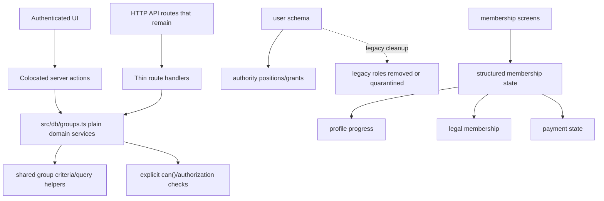

# App Simplification Refactors

## Overview

Simplify several parts of the app that have accumulated parallel abstractions or leftover compatibility concepts. The goal is similar to the workflow simplification: keep the concepts that are proven useful, remove generic or duplicated surfaces that make the code harder to reason about, and choose one clear boundary for each domain.

This plan covers six review findings:

- group domain action surfaces
- duplicated group criteria matching
- legacy user roles competing with the authority model
- blended membership view state
- duplicated Better Auth user field configuration
- unused UI catalog/lint noise

The plan intentionally avoids a broad rewrite. Each unit is small enough to land independently, but the order matters: simplify group services before removing duplicated criteria queries; quarantine or remove roles before deriving auth fields; split membership state before future legal-membership UI builds on the old blended enum.

Document review on 2026-05-07 found that the original plan targeted the right problems but was not execution-ready in the riskiest areas. This revision makes the missing contracts explicit: API routes get an inventory before reshaping, criteria matching semantics are defined up front, legacy-role removal has concrete go/no-go gates, and the lower-priority cleanup units are separated from the authorization-sensitive group work.

Supersession note: `docs/plans/2026-05-07-001-refactor-remove-legacy-patterns-plan.md` replaces the compatibility guidance in this completed plan. Legacy roles are removed rather than quarantined, and membership view-state compatibility is deleted rather than retained.

---

## Problem Frame

The app has grown through practical feature work, so several domains now expose multiple equally plausible ways to do the same thing. That is the main source of complexity. The code is not fundamentally over-engineered, but a future implementer has to keep too many boundaries in their head:

- `src/db/groups.ts` contains raw persistence helpers, authorization wrappers, next-safe-action actions, and criteria orchestration.
- group criteria matching exists both in an API route and in a domain helper.
- the new authority model is the real permissions source, but legacy `roles` still live on user and group criteria schema.
- `getMembershipViewState()` encodes profile, operational, payment, and legacy full-member behavior in one enum.
- Better Auth additional fields repeat user schema fields by hand.
- the `src/components/ui` catalog includes many unused components that still participate in lint.

The resulting risk is not just readability. Parallel action surfaces make authorization harder to audit; duplicated query logic drifts; leftover role vocabulary can accidentally become policy again; blended state strings become fragile once legal membership workflows land.

---

## Requirements Trace

- R1. Group membership and criteria mutations should have one domain service boundary and one app-facing boundary per actual caller type.
- R2. Group criteria user matching should be implemented once and reused by preview, auto-add, and bulk-add paths.
- R3. Legacy user roles should no longer look like an active authority source. Either remove them or explicitly quarantine them as compatibility-only data.
- R4. Membership UI state should expose separate profile, legal, payment, and operational concerns instead of hiding them inside one string enum.
- R5. Better Auth additional fields should be derived from one canonical server-owned user-field list, not maintained as a second manual schema.
- R6. UI component catalog policy should be explicit: either curated app code with unused components removed, or generated/vendor-like code excluded from unrelated lint noise.
- R7. The changes should stay modest and avoid replacing local conventions with a large app framework.
- R8. Existing HTTP routes that remain must preserve explicit request/response and authorization contracts, with route-level tests for retained compatibility surfaces.
- R9. Criteria matching must define multi-value and multi-dimension semantics unambiguously so preview and auto-add cannot drift again.
- R10. Schema-removal work must have concrete preflight gates for migration history, persisted data, Better Auth/session compatibility, and rollback/quarantine fallback.

---

## Scope Boundaries

- Do not redesign permissions. The authority model and `can()` policy API remain the source of authorization.
- Do not remove `users_to_groups.role`; that is group-local admin/member metadata, not legacy user authority.
- Do not remove Better Auth `session`, `account`, or `verification` schema behavior.
- Do not implement new legal membership UI flows in this refactor. This plan only prepares state boundaries for those flows.
- Do not turn API routes and server actions into a generic routing framework.
- Do not rewrite the shadcn UI components that are actively used.

### Deferred to Follow-Up Work

- Full data migration/backfill for removing legacy `user.roles` may require production data inspection before deciding whether to drop the column in the same PR or a follow-up migration.
- Replacing existing membership copy with legal-membership-aware copy belongs with the Stage 3+ membership lifecycle UI work after structured state is available.

---

## Context & Research

### Relevant Code and Patterns

- `src/db/groups.ts` already contains the important group domain operations and authorization helpers, but it also exports next-safe-action actions.
- `src/app/(authenticated)/(app)/groups/[id]/actions.ts` shows a better app-facing shape for authenticated UI: small colocated server actions that call domain services and revalidate paths.
- `src/app/api/groups/*` routes are thin HTTP wrappers, but several currently call next-safe-action actions or repeat persistence logic.
- Current group HTTP routes are:
  - `src/app/api/groups/[id]/route.ts`: GET group detail, currently consumed by client refresh logic in `src/app/(authenticated)/(app)/groups/[id]/page-client.tsx`.
  - `src/app/api/groups/[id]/criteria/route.ts`: GET group criteria, currently consumed by client refresh logic in `src/app/(authenticated)/(app)/groups/[id]/page-client.tsx`.
  - `src/app/api/groups/criteria/route.ts`: POST criteria creation and auto-add.
  - `src/app/api/groups/criteria/[id]/route.ts`: DELETE criteria.
  - `src/app/api/groups/bulk-add-users/route.ts`: POST bulk membership insertion, currently consumed by `src/components/bulk-add-users-dialog.tsx`.
  - `src/app/api/users/search-by-criteria/route.ts`: POST criteria preview, currently consumed by `src/components/bulk-add-users-dialog.tsx`.
- `src/lib/permissions/server.ts` and `docs/solutions/conventions/reusable-permission-policy-api-2026-05-02.md` establish the policy convention: server boundaries call `can()`, and UI affordances are not security.
- `src/lib/authority/model.ts`, `src/lib/authority/assignments.ts`, and `src/db/schema/authority.ts` define the active authority vocabulary.
- `src/db/schema/auth.ts` still defines legacy `role` and `user.roles`.
- `src/db/schema/group.ts` still defines `groupCriteria.roles`, but new criteria writes set it to `null`.
- `src/lib/membership-status.ts`, `src/schema/onboarding-progress.ts`, and membership route components are the current membership UI state callers.
- `src/components/ui/*` appears to be a broad copied component catalog; many files have no imports outside the catalog.

### Institutional Learnings

- `docs/solutions/conventions/reusable-permission-policy-api-2026-05-02.md` reinforces that permission checks should stay explicit at server boundaries. The group simplification should make those boundaries fewer and clearer, not hide authorization inside a generic runner.
- `docs/solutions/conventions/reusable-tone-of-voice-and-wording-decisions-2026-05-02.md` matters for membership state copy follow-up: UI labels should describe user-visible outcomes, not internal state names.

### External References

- No external research is needed. These are local architecture simplifications with strong existing repo patterns.

---

## Key Technical Decisions

- Keep `src/db/*` as domain service modules, not app action modules: Database/domain files should expose plain async functions and pure builders. `next-safe-action` belongs in route- or feature-facing action files.
- Keep API routes only where HTTP is actually useful: Existing client components can generally use colocated server actions. API routes should remain for browser fetch needs that are not ergonomic as server actions or for external integration surfaces.
- Inventory HTTP routes before replacing them: Any route that is still called by client components or external integrations must either stay as a thin route with contract tests or have its caller migrated in the same unit. Do not infer route safety from TypeScript imports alone.
- Normalize group criteria input as arrays with explicit match semantics: Arrays are OR within one dimension. `match: "all"` combines non-empty dimensions with AND. `match: "any"` combines non-empty dimensions with OR. Empty criteria match no users and should be rejected for newly saved criteria.
- Prefer removing legacy roles only after concrete gates pass: The authority model is now mature enough that active code should not keep `user.roles` as a first-class concept, but column removal requires migration/data/session checks. If any gate fails, quarantine the fields as legacy-only and document the removal path.
- Return structured membership state in parallel before deleting the old enum: Add a structured selector and adapt callers incrementally, then remove or deprecate the string enum when no longer needed. Legal state must declare whether it was loaded, so new callers do not make decisions from placeholder data.
- Treat `src/components/ui` as curated app code only after a catalog preflight: The default is still to reduce lint noise, but deletion requires checking `components.json`, generator expectations, and local customization. Hidden lint exceptions should be avoided.

---

## Alternatives Considered

| Problem | Options Considered | Chosen Direction | Why |
| --- | --- | --- | --- |
| Group action surfaces | Keep raw + safe actions + API routes; move everything to API routes; move everything to server actions; domain services plus thin app-facing wrappers | Domain services plus one app-facing wrapper per caller type | Preserves Next/App Router ergonomics, keeps authorization explicit, and avoids another generic framework. |
| Criteria matching | Keep route-specific query and helper-specific query; create a generic query builder DSL; one typed criteria matcher helper | One typed helper with normalized arrays | Removes duplication without inventing a search framework. |
| Legacy roles | Leave as-is; remove immediately; quarantine first, remove after production inspection | Prefer remove if migration is still unshipped or data proves unused; otherwise quarantine with a removal migration plan | The active authority model should not compete with legacy vocabulary, but production data safety matters. |
| Membership state | Keep current enum; replace with a very generic state machine; add structured state object | Structured state object with small derived UI helpers | Clearer domain boundaries without overbuilding a workflow/state engine. |
| Better Auth fields | Keep manual map; derive from Drizzle schema dynamically; derive from a canonical field list | Canonical server-owned field list | Dynamic schema introspection would be clever; a small list is clearer and testable. |
| UI catalog | Ignore lint; exclude all UI components; prune unused components; mark catalog as generated | Prune unused components or explicitly mark generated/vendor leftovers | Avoids permanent lint noise while preserving used shadcn components. |

---

## Open Questions

### Resolved During Planning

- Should this plan use one huge simplification PR? No. The plan is one document, but the implementation units can land independently. Group services and criteria matching are the most connected pair.
- Should `users_to_groups.role` be removed with legacy roles? No. It is group-local membership role and remains useful.
- Should API routes disappear entirely? No. They should be justified per route. The simplification is fewer surfaces, not dogmatic deletion.
- How should criteria arrays combine? Arrays OR within a dimension; `match: "all"` ANDs dimensions; `match: "any"` ORs dimensions. New empty criteria rows should be invalid, while existing empty rows should be cleaned up or made inert.

### Deferred to Implementation

- Whether `user.roles` can be dropped immediately depends on concrete preflight gates: migration history, existing row data, Better Auth/session compatibility, role-writing imports/backfills, and rollback/quarantine fallback.
- The exact set of unused UI components to prune depends on import scanning after current branch changes settle.
- The final structured membership state field names can be adjusted during implementation, as long as the object keeps profile, legal, payment, and operational concerns separate and marks legal state authority as loaded/not loaded.

---

## High-Level Technical Design

> *This illustrates the intended approach and is directional guidance for review, not implementation specification. The implementing agent should treat it as context, not code to reproduce.*

---

## Phased Delivery

### Tier 1: Group Boundaries And Criteria Correctness

- U1 and U2 are the highest-priority work because they touch authorization-sensitive group membership surfaces and duplicated query behavior.
- U7 is a required preflight for U1/U2. Do not remove, replace, or reshape group HTTP routes until this inventory exists.

### Tier 2: Domain Vocabulary Cleanup

- U3 and U4 remove confusing state vocabulary that will otherwise keep leaking into future authority and membership lifecycle work.
- U3 should run before U5 if legacy roles are removed from the active schema or Better Auth additional fields.

### Tier 3: Maintenance Noise Reduction

- U5 and U6 improve drift resistance and lint signal quality, but they should not block the group authorization/criteria cleanup unless they become necessary for CI.

---

## Implementation Units

- U7. **Inventory Group API Contracts**

**Problem Restated:** The original group-boundary simplification assumed HTTP routes could be retained or replaced based mostly on local convenience. That is not enough: several routes are actively consumed through browser `fetch()`, and external or compatibility callers would not show up in TypeScript imports.

**Goal:** Produce a concrete route inventory that classifies each group and criteria API route as retained, migrated, or removed, and records its request/response and authorization contract before U1/U2 reshape the implementation.

**Requirements:** R1, R2, R8, R9

**Dependencies:** None

**Files:**
- Modify: `docs/plans/2026-05-05-002-refactor-app-simplification-plan.md` if implementation discovers route contracts that materially change sequencing
- Modify or create: `src/app/api/groups/api-contracts.test.ts`
- Modify or create: `src/app/api/users/search-by-criteria/route.test.ts`
- Inspect: `src/app/api/groups/[id]/route.ts`
- Inspect: `src/app/api/groups/[id]/criteria/route.ts`
- Inspect: `src/app/api/groups/criteria/route.ts`
- Inspect: `src/app/api/groups/criteria/[id]/route.ts`
- Inspect: `src/app/api/groups/bulk-add-users/route.ts`
- Inspect: `src/app/api/users/search-by-criteria/route.ts`
- Inspect: `src/app/(authenticated)/(app)/groups/[id]/page-client.tsx`
- Inspect: `src/components/group-criteria-manager.tsx`
- Inspect: `src/components/bulk-add-users-dialog.tsx`

**Approach:**
- Build an inventory table during implementation with one row per route:
  - route path and HTTP method
  - known consumers
  - whether the route is retained, migrated to server action, or removed
  - required permission check
  - request schema
  - response shape
  - compatibility expectation during the refactor
- Current expected classification:
  - Retain initially: `GET /api/groups/[id]` and `GET /api/groups/[id]/criteria`, because `page-client.tsx` refreshes data through browser fetches.
  - Retain initially: `POST /api/users/search-by-criteria` and `POST /api/groups/bulk-add-users`, because `bulk-add-users-dialog.tsx` currently uses client-side fetches.
  - Candidate for server-action migration: `POST /api/groups/criteria` and `DELETE /api/groups/criteria/[id]`, because `group-criteria-manager.tsx` can likely use colocated server actions if the UI shape remains ergonomic.
  - Keep or remove only after confirming there are no non-app HTTP callers.
- Add route-level contract tests for retained routes before changing their internals. These should cover status codes and response shapes, not only domain helper behavior.
- Keep the inventory in the plan or in a focused code comment/test fixture only if it remains valuable after implementation; the important deliverable is that U1/U2 do not change route contracts by accident.

**Execution note:** Start with contract tests for retained routes, because they pin the behavior that U1/U2 are allowed to preserve while simplifying internals.

**Patterns to follow:**
- Existing route handlers under `src/app/api/groups/*` for response shape.
- `src/db/group-authorization.ts` and `src/lib/permissions/server.ts` for explicit authorization expectations.

**Test scenarios:**
- Happy path: `GET /api/groups/[id]` returns the current group detail shape for an authorized viewer.
- Happy path: `GET /api/groups/[id]/criteria` returns `{ criteria }` for an authorized viewer.
- Happy path: criteria preview route returns a user array for an authorized group member manager.
- Error path: every retained group/criteria route returns 401 or 403 for unauthenticated or unauthorized callers before reading or mutating group data.
- Error path: retained mutation/preview routes return 400 for invalid request bodies.
- Regression: retained routes keep their current response envelope while their internals move to plain domain services.

**Verification:**
- Every route under `src/app/api/groups/*` and `src/app/api/users/search-by-criteria/route.ts` has a recorded retain/migrate/remove decision.
- U1 and U2 can proceed without guessing which HTTP contracts matter.

---

- U1. **Simplify Group Domain Boundaries**

**Problem Restated:** `src/db/groups.ts` currently mixes plain DB helpers, authorization, next-safe-action actions, and group criteria orchestration. The same operations are then wrapped by colocated server actions and API route handlers, producing several valid mutation paths.

**Goal:** Make `src/db/groups.ts` a plain group domain service module and move app-facing next-safe-action/server-action wrappers out to route or feature files.

**Requirements:** R1, R7

**Dependencies:** U7

**Files:**
- Modify: `src/db/groups.ts`
- Modify: `src/app/(authenticated)/(app)/groups/[id]/actions.ts`
- Modify: `src/app/(authenticated)/(app)/groups/page.tsx`
- Modify: `src/app/(authenticated)/(app)/groups/page-client.tsx`
- Modify: `src/app/(authenticated)/(app)/groups/[id]/page.tsx`
- Modify: `src/app/(authenticated)/(app)/groups/[id]/page-client.tsx`
- Modify: `src/app/(authenticated)/(app)/groups/check-slug-action.ts`
- Modify: `src/app/(authenticated)/(app)/groups/create-group-action.ts`
- Modify as needed: `src/app/api/groups/*`
- Test: `src/db/groups.test.ts`
- Test: `src/app/api/groups/api-contracts.test.ts`

**Approach:**
- Remove `actionClient` exports from `src/db/groups.ts`. Keep plain functions such as list groups, get group detail, search users, add/remove/update group members, add/remove criteria, and add matching users.
- Keep authorization helpers in or near the group domain only where they are pure boundary checks: `requireGroupMemberManagement`, `requireGroupView`, and `canViewGroup` can remain exported because multiple surfaces need them.
- Make read contracts explicit instead of relying on implicit authenticated `ctx.user.id` from `actionClient`. For example, group list/detail helpers should accept the viewer context they need, such as a `viewerId` or precomputed permission decision, and page/server-action boundaries should load the authenticated user before calling them.
- For authenticated UI, prefer colocated server actions under `src/app/(authenticated)/(app)/groups/**`. These actions should call `requireGroupMemberManagement()` or `requireGroupView()` once, then call plain services and revalidate.
- For API routes retained by U7, keep them thin: parse request body with Zod, call the same plain services, map `GroupAuthorizationError` to HTTP status, and avoid direct Drizzle writes in the route.
- Do not add a generic route/action adapter. Repeated error mapping can be a tiny helper only if it removes clear duplication without hiding behavior.

**Execution note:** Add or update characterization tests around group authorization before deleting old action wrappers, because this area has had bypass regressions.

**Patterns to follow:**
- `src/app/(authenticated)/(app)/groups/[id]/actions.ts` for colocated server action shape.
- `src/db/group-authorization.ts` for small pure authorization helpers.
- `src/lib/permissions/server.ts` for explicit permission checks.

**Test scenarios:**
- Happy path: authorized group manager can add, remove, and change a group member through the server action wrapper.
- Happy path: authorized viewer can fetch group detail, and non-member without `groups.view_all` cannot.
- Error path: unauthenticated or unauthorized group member mutation returns/throws the same denial before any persistence helper runs.
- Regression: API route and server action both call the same domain mutation helper for adding a member; no direct `db.insert(usersToGroups)` remains in route handlers.
- Regression: group list `isMember` or viewer-specific fields are computed from an explicit viewer input, not from an action-client context hidden inside the DB module.
- Edge case: duplicate add behavior remains consistent with current UI/API expectations.

**Verification:**
- `src/db/groups.ts` no longer imports `actionClient`.
- Group mutations have one persistence implementation each.
- Existing group UI and API tests still pass.

---

- U2. **Unify Group Criteria Matching**

**Problem Restated:** Criteria matching exists twice: `addUsersMatchingCriteria()` builds single-value filters in `src/db/groups.ts`, while `src/app/api/users/search-by-criteria/route.ts` builds array filters and repeats the same users-not-in-group join.

**Goal:** Create one reusable criteria matching helper that supports both previewing matching users and adding them to a group.

**Requirements:** R2, R7, R8, R9

**Dependencies:** U7, U1

**Files:**
- Modify: `src/db/groups.ts`
- Modify: `src/app/api/users/search-by-criteria/route.ts`
- Modify: `src/app/api/groups/criteria/route.ts`
- Modify: `src/components/group-criteria-manager.tsx`
- Test: `src/db/groups.test.ts`
- Test: `src/app/api/users/search-by-criteria/route.test.ts`

**Approach:**
- Define a normalized group criteria input shape in the group domain using arrays:
  - departments: `Department[]`
  - statuses: `UserStatus[]`
  - batchNumbers: `number[]`
- Include explicit match mode: `match: "all" | "any"`.
- Semantics are fixed for all callers:
  - arrays OR within one dimension via `IN`
  - `match: "all"` ANDs non-empty dimensions
  - `match: "any"` ORs non-empty dimensions
  - empty criteria arrays match no users
- Add a plain domain helper that returns users not already in a group for the normalized criteria.
- Add a second helper that calls the matcher and inserts returned users as group members. It should not rebuild criteria SQL itself.
- Normalize single saved criteria rows into arrays at call sites. For example, one saved `department` becomes `departments: [department]`.
- Keep request parsing in the route with Zod, but delegate all matching SQL to the helper.
- Preserve current behavior intentionally:
  - preview requests use `match: "any"` unless the UI explicitly adds a mode selector later
  - saved criteria auto-add uses `match: "all"` because each saved row represents one rule with all populated fields required
- New saved criteria must include at least one criterion field. Existing empty/name-only rows should be deleted in migration/cleanup if they are accidental, or made inert if production data cannot be deleted safely.
- The preview route must enforce the same management permission as bulk add and saved criteria mutation. This is a read of member data, not a public search endpoint.

**Patterns to follow:**
- Existing `searchUsersNotInGroupRaw()` projection for public user fields.
- Existing `addUsersMatchingCriteria()` return shape of added count.

**Test scenarios:**
- Happy path: preview with departments `[operations]` returns users in Operations who are not already in the group.
- Happy path: saved criteria with department and status in `"all"` mode only adds users matching both.
- Happy path: preview with departments `[operations, finance]` uses OR within the department dimension.
- Happy path: preview with departments `[operations]` and statuses `[active]` in `"any"` mode returns users matching either department or status.
- Happy path: saved criteria with department `[operations]` and statuses `[active]` in `"all"` mode returns only users matching both dimensions.
- Edge case: empty criteria arrays return no users for preview and add zero users for auto-add.
- Edge case: newly saved criteria with no department, status, or batch number is rejected with validation copy.
- Edge case: users already in the group are excluded from both preview and auto-add.
- Error path: unauthorized preview request returns 401 or 403 before running criteria SQL.
- Error path: invalid criteria request body returns 400 from the API route without touching the helper.
- Regression: preview route and auto-add route produce consistent results when passed equivalent normalized criteria and match mode.

**Verification:**
- The only users-not-in-group criteria SQL lives in one helper.
- `src/app/api/users/search-by-criteria/route.ts` no longer imports `db`, `user`, or `usersToGroups` directly.

---

- U3. **Remove Or Quarantine Legacy User Roles**

**Problem Restated:** The old `role` enum and `user.roles` column remain in the primary user schema even though authority positions and grants now define permissions. `groupCriteria.roles` also exists but new writes set it to `null`, making legacy roles look active when they are not.

**Goal:** Stop exposing legacy user roles as part of the active domain model, using immediate removal only when concrete data and migration gates prove it is safe.

**Requirements:** R3, R5, R7, R10

**Dependencies:** U1 is helpful but not strictly required; do before U5 if removing `roles` from Better Auth fields.

**Files:**
- Modify: `src/db/schema/auth.ts`
- Modify: `src/db/schema/group.ts`
- Modify: `src/db/schema/auth-fields.ts`
- Modify: `src/db/people.ts`
- Modify: `src/components/group-criteria-manager.tsx`
- Modify: `src/app/(authenticated)/(app)/people/[id]/authority-card.tsx`
- Modify: `src/components/authority-editor.tsx`
- Modify or generate: `drizzle/*`
- Test: `src/lib/authority/model.test.ts`
- Test: `src/db/groups.test.ts`
- Test: `src/lib/auth.test.ts`

**Approach:**
- First inspect whether any active code depends on `user.roles` or `groupCriteria.roles` for behavior. Current scan shows only display/copy and criteria rendering references, not permission decisions.
- Run the removal gates before choosing direct removal:
  - migration gate: confirm the role columns are unshipped, or that a forward migration can safely alter already-applied databases
  - data gate: inspect persisted `user.roles` and `groupCriteria.roles` values and confirm they are null/empty or intentionally disposable
  - Better Auth/session gate: verify existing users/sessions that still have roles can be decoded after roles are removed or ignored
  - writer gate: scan imports, seeders, import jobs, tests, and backfills for writes to `roles`
  - rollback gate: define the fallback path to quarantine the fields if any direct removal gate fails
- Preferred implementation if safe:
  - Remove `role` enum and `user.roles` from `src/db/schema/auth.ts`.
  - Remove `groupCriteria.roles` from `src/db/schema/group.ts`.
  - Update migrations/snapshot accordingly.
  - Remove roles from Better Auth additional fields.
  - Update People queries and tests that still select or build `roles`.
  - Update UI labels from "START roles" to "START authority" or "Positions and permissions" where the data is authority assignments.
- Compatibility implementation if production data or migration history makes immediate removal too risky:
  - Move role-related exports to an explicitly named compatibility module, for example `src/db/schema/legacy-roles.ts`.
  - Stop selecting roles in normal People/group queries.
  - Add comments and tests that roles are not used for permission evaluation.
  - Create a follow-up migration plan to drop them after data inspection.

**Chosen direction:** Prefer immediate removal if the Stage 1/Stage 2 migration chain is still unshipped or production inspection shows no needed data. Otherwise quarantine first. The key requirement is that active code no longer presents roles as authority.

**Patterns to follow:**
- `src/lib/authority/model.ts` for active authority names.
- `src/lib/authority/assignments.ts` for valid authority payloads.
- `docs/plans/2026-05-02-002-fix-stage-one-authority-hardening-plan.md` explicitly says legacy roles are not new authority.

**Test scenarios:**
- Regression: permission tests still grant/deny from authority positions and grants, not from legacy roles.
- Regression: group criteria creation still works without `roles`.
- Regression: Better Auth additional field tests no longer expect `roles` as an active additional user field if removed.
- Regression: existing user/session fixtures that include legacy roles do not break auth initialization when the quarantine path is chosen.
- Data safety: non-empty legacy role rows force the compatibility/quarantine path unless the implementer has an explicit migration decision for that data.
- Migration: schema snapshot no longer creates removed role columns, or compatibility migration leaves them clearly named/documented if quarantined.
- UI smoke expectation: authority cards still show positions/grants after role labels are removed.

**Verification:**
- `rg "roles"` shows only compatibility/docs/copy references that are intentional.
- New authority data remains the only permission source.

---

- U4. **Split Membership View State Into Structured Selectors**

**Problem Restated:** `getMembershipViewState()` folds profile onboarding, operational status, payment setup, and legacy full-member behavior into one string enum. Legal membership workflows will make that enum more misleading and harder to extend.

**Goal:** Introduce a structured membership state object that keeps profile, legal, operational, and payment state separate while preserving current UI behavior during migration and avoiding decisions from unloaded legal data.

**Requirements:** R4, R7

**Dependencies:** None, but should happen before more legal membership UI work.

**Files:**
- Modify: `src/lib/membership-status.ts`
- Modify: `src/schema/onboarding-progress.ts`
- Modify: `src/db/people.ts`
- Modify: `src/app/(authenticated)/(app)/membership/page.tsx`
- Modify: `src/app/(authenticated)/(app)/membership/billing-copy.ts`
- Modify: `src/app/(authenticated)/(app)/membership/onboarding.tsx`
- Modify: `src/app/(authenticated)/(app)/membership/start-payment-action.ts`
- Modify: `src/app/(authenticated)/(app)/people/complete-onboarding-action.ts`
- Modify as needed: `src/app/(authenticated)/(redirect)/membership/payment-return/*`
- Test: `src/lib/membership-status.test.ts`
- Test: `src/app/(authenticated)/(app)/membership/billing-copy.test.ts`

**Approach:**
- Add a structured selector that returns independent fields, for example:
  - profile: `incomplete | complete`
  - operational: current `UserStatus`
  - legal: `{ status: not_applicable | not_member | active_member | former_member | unknown; source: not_loaded | loaded | not_applicable }`
  - payment: `not_required | not_started | pending | processing | active | failed | covered_until_date`
  - nextAction: optional derived UI action such as `complete_profile`, `set_up_payment`, or `none`
- Initially derive legal state as `{ status: unknown, source: not_loaded }` or accept loaded legal membership as an optional input, so existing callers do not need to join legal membership immediately.
- Payment-start authorization must not depend on `legal.source: not_loaded`. If legal membership becomes required for payment setup later, the caller must pass loaded legal data and tests must cover the denial path explicitly.
- Add a small decision table in the helper tests for profile x legal source/status x payment x operational status, covering primary copy/action and whether payment setup is allowed. The table should describe current behavior first; future legal-membership UI can extend it deliberately.
- Keep `getMembershipViewState()` temporarily as a compatibility adapter that derives the old enum from structured state. This keeps the refactor behavior-preserving.
- Move UI copy to consume structured state where it becomes clearer, starting with membership billing copy and payment action guards.
- Remove the compatibility enum only when all callers have moved, or leave it as a clearly named `getLegacyMembershipViewState()` bridge if a large UI migration would distract from the current refactor.

**Patterns to follow:**
- Current pure helper tests in `src/lib/membership-status.test.ts`.
- Copy decisions in `src/app/(authenticated)/(app)/membership/billing-copy.ts`.
- Stage 2 workflow simplification pattern: domain-specific metadata/state stays explicit rather than hidden behind a generic engine.

**Test scenarios:**
- Happy path: completed profile with active GoCardless subscription returns profile complete, payment active, no next action.
- Happy path: imported member with future `paidThroughAt` and no subscription returns payment pending or covered state matching current copy expectations.
- Edge case: incomplete profile with an existing payment row can continue billing without being forced into profile onboarding.
- Edge case: operational member without a payment row preserves current legacy full-member behavior until legal/payment migration changes it deliberately.
- Error path: start-payment action denies users whose structured state has no payment setup action available.
- Error path: payment-start behavior is stable when legal state is not loaded and has a separate test when legal state is loaded and denies payment.
- Regression: old `getMembershipViewState()` compatibility output matches existing tests while callers are being migrated.

**Verification:**
- New legal membership UI can ask for legal state without decoding payment/profile strings.
- New legal membership UI must pass loaded legal membership data before making legal-state decisions.
- Existing membership page behavior and billing copy remain unchanged unless a test explicitly updates expected copy.

---

- U5. **Derive Better Auth Additional Fields From A Canonical List**

**Problem Restated:** `src/db/schema/auth-fields.ts` manually repeats user fields and can drift from `src/db/schema/auth.ts`. It also includes legacy `roles`, which should disappear or become compatibility-only.

**Goal:** Define one canonical list of server-owned Better Auth user fields and derive the Better Auth additional field map from it, with tests that detect drift from the user schema.

**Requirements:** R5, R7

**Dependencies:** U3 if removing or quarantining `roles`.

**Files:**
- Modify: `src/db/schema/auth-fields.ts`
- Modify: `src/db/schema/auth.ts`
- Modify: `src/lib/auth.ts`
- Test: `src/lib/auth.test.ts`

**Approach:**
- Define a typed list of server-owned user field names and their Better Auth field type once, near `auth-fields.ts` or next to the user schema.
- Generate `betterAuthUserAdditionalFields` from that list so every entry gets `input: false`.
- Keep the list intentionally explicit. Do not introspect Drizzle column metadata dynamically; that would make the mapping harder to read.
- Mechanically bind the list to the schema:
  - every listed field must be a key of the Drizzle `user` table at compile time or test time
  - the generated Better Auth field map must contain exactly the canonical list
  - the test should name the expected server-owned field set so adding/removing a user column requires an intentional decision
- Remove `roles` from the list if U3 removes roles. If U3 quarantines roles, name it explicitly as legacy and still avoid treating it as an active auth field unless Better Auth requires it for existing session decoding.
- Add a test that every additional field has `input: false` and that the expected field names match the canonical list.

**Patterns to follow:**
- Existing `src/lib/auth.test.ts` checks server-owned additional fields.
- Existing `as const` vocabulary style in `src/lib/authority/model.ts`.

**Test scenarios:**
- Happy path: generated Better Auth additional fields include expected server-owned fields with `input: false`.
- Regression: removed/quarantined legacy `roles` is not exposed as an active Better Auth additional field.
- Regression: every canonical field name is a real `user` schema field.
- Regression: generated Better Auth fields contain no keys outside the canonical list.
- Edge case: adding a new field to the canonical list updates the generated map without manually editing object shape in two places.

**Verification:**
- The canonical list is the only manually maintained Better Auth field list, and tests detect drift from the user schema and generated map.
- Auth tests describe the intended server-owned field contract.

---

- U6. **Prune Or Formalize The UI Component Catalog**

**Problem Restated:** Many `src/components/ui/*` files appear unused, and full lint currently reports diagnostics in unused catalog files. It is unclear whether this directory is curated app code or a copied/generated shadcn catalog.

**Goal:** Make the UI component catalog policy explicit so unused components do not create ambient lint and maintenance noise without deleting intentional shadcn baseline customizations.

**Requirements:** R6, R7

**Dependencies:** None

**Files:**
- Modify or delete unused files under: `src/components/ui/*`
- Modify if needed: `biome.json` or `biome.jsonc`
- Modify or create: `src/components/ui/README.md`
- Test expectation: none for deleted unused components; run typecheck/lint as verification.

**Approach:**
- First generate an import usage inventory for `src/components/ui/*.tsx`, excluding imports from inside the same directory.
- Before deleting any component, inspect:
  - `components.json` and any shadcn generator assumptions
  - whether the file is locally customized versus untouched copied baseline
  - whether app docs/tests/story-like examples reference it outside static imports
  - whether near-term active work in the current branch expects it
- Pick one of two explicit policies:
  - Curated app code: delete unused UI components and keep only components imported by the app or clearly needed imminently.
  - Catalog policy: keep the copied catalog but document it and configure lint formatting intentionally so generated/vendor-like code does not block unrelated work.
- Chosen default: curated app code if the pre-delete gate passes. This repo is an app, not a component library, and unused UI files currently create noise. Delete unused components only when they are unused outside `src/components/ui`, not generator-required, and not materially customized.
- If deleting a component would cause churn because shadcn commands expect the catalog shape, use a README plus scoped lint configuration instead. The plan should avoid silent ignore rules.
- Keep actively used primitives such as `button`, `input`, `dialog`, `card`, `badge`, `field`, and `tooltip`.

**Patterns to follow:**
- Existing imports from app/component files determine what is active.
- Biome diagnostics from full lint identify catalog files that currently create noise.

**Test scenarios:**
- Test expectation: none -- this unit removes unused code or documents lint policy. Behavior is verified through imports, typecheck, and lint.

**Verification:**
- Full lint no longer fails on unused UI catalog components.
- Import scan shows deleted components were not used outside `src/components/ui`.
- `src/components/ui/README.md` or equivalent config explains whether this directory is curated or generated.

---

## Testing Mechanics

- Group route contract tests should exercise route handlers at the HTTP boundary where practical, not only plain helpers. The goal is to prove request parsing, authorization mapping, response envelopes, and domain delegation stay aligned.
- DB-backed group tests need isolated fixtures. Prefer per-test group/user records with cleanup or transactional rollback, and avoid relying on broad seed state that hides authorization edge cases.
- Criteria tests should cover both pure matcher behavior and the retained route contract. The matcher tests prove SQL semantics; the route tests prove auth and validation.
- Role-removal tests should include schema/auth behavior and compatibility fixtures. A successful typecheck is not enough if Better Auth session/user decoding still expects a removed field.
- Membership-state tests should be table-driven because the value is in making state combinations obvious: profile, operational status, legal source/status, payment state, primary action, and payment-start eligibility.
- UI catalog cleanup is verified through import scanning, typecheck, and lint. It should not add behavioral tests unless a retained component is changed.

---

## System-Wide Impact

- **Interaction graph:** Group UI, group API routes, People import, membership page, auth/session shape, Drizzle migrations, and lint all touch these simplifications.
- **Error propagation:** Group API routes should keep consistent HTTP status mapping for authorization and validation errors. Server actions can continue throwing user-facing errors through next-safe-action.
- **State lifecycle risks:** Removing legacy roles may require migration care. Membership state splitting must preserve current payment/onboarding behavior while exposing clearer structure for future legal state.
- **API surface parity:** Group server actions and API routes must enforce the same permissions and call the same domain services. Retained HTTP routes must preserve the U7 contract inventory unless the caller is migrated in the same unit.
- **Integration coverage:** Group criteria route behavior and membership payment-start behavior need cross-layer tests or focused action tests because they combine parsing, authorization, and persistence/state decisions.
- **Unchanged invariants:** `users_to_groups.role` remains group-local; `can()` remains the permission API; GoCardless payment provider fields remain in `membership_payment`; the simplified workflow table remains unchanged by this plan.

---

## Risks & Dependencies

| Risk | Mitigation |
| --- | --- |
| Removing actionClient exports from `src/db/groups.ts` breaks callers silently | Use `rg` to migrate all imports and keep tests around group UI/server action behavior. |
| HTTP API routes are accidentally removed or their envelopes change | U7 inventory and route-level contract tests must land before U1/U2 route reshaping. |
| Criteria matching behavior changes from OR to AND or vice versa | Make match mode explicit in helper inputs and test both preview and saved-criteria paths. |
| Empty/name-only criteria rows become accidental match-all rows | Reject new empty criteria and clean up or make existing empty rows inert. |
| Legacy role removal conflicts with existing production data or Better Auth sessions | Inspect migration/data state; quarantine first if immediate drop is unsafe. |
| Legacy role removal proceeds on vague confidence instead of evidence | Require migration, data, session, writer, and rollback gates before direct removal. |
| Structured membership state causes broad UI churn | Add it in parallel and keep compatibility adapter until callers migrate. |
| New membership callers make legal/payment decisions from unloaded legal state | Include legal `source` in structured state and test payment behavior for unloaded versus loaded legal data. |
| UI catalog pruning deletes a component used dynamically or planned imminently | Use import scan, typecheck, and keep a documented escape hatch for catalog policy. |
| Lint config hides real UI issues | Prefer deleting unused files over broad ignores; if excluding, scope narrowly and document why. |

---

## Documentation / Operational Notes

- Update any plan or README language that still calls legacy `user.roles` active authority.
- If legacy role columns are dropped, include migration notes for data inspection and rollback.
- If UI catalog policy is documented, keep it short and close to `src/components/ui`.

---

## Sources & References

- Review findings from 2026-05-05 app simplification review.
- Related code: `src/db/groups.ts`
- Related code: `src/app/api/users/search-by-criteria/route.ts`
- Related code: `src/db/schema/auth.ts`
- Related code: `src/lib/membership-status.ts`
- Related code: `src/db/schema/auth-fields.ts`
- Related code: `src/components/ui`
- Related solution: `docs/solutions/conventions/reusable-permission-policy-api-2026-05-02.md`
- Related solution: `docs/solutions/conventions/reusable-tone-of-voice-and-wording-decisions-2026-05-02.md`
