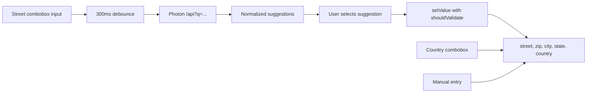

# feat: Improve address form UX

## Summary

Implement the address form improvements by keeping the existing database fields stable, adding small shared helper modules for country options and Photon suggestion normalization, and updating both address step components independently to use the existing Base UI combobox pattern.

---

## Problem Frame

The onboarding and membership application address steps currently expose the same plain stacked text fields in an order that does not match German address entry conventions. The origin requirements define the UX change: German-style ordering, optional State, searchable normalized Country, and Photon-assisted Street entry without changing persisted field names.

---

## Requirements

- R1. Fields are presented in German address convention order: Street -> PLZ + City inline -> Bundesland / State -> Country (see origin: `docs/brainstorms/2026-05-09-address-form-ux-requirements.md`).
- R2. PLZ and City share a row, with PLZ narrow and City taking the remaining width.
- R3. Street has a placeholder showing street name and house number on one line.
- R4. PLZ and City have German example placeholders.
- R5. State / Bundesland is optional.
- R6. State is labelled "Bundesland / State".
- R7. Country is a searchable combobox backed by a full ISO country list.
- R8. Country can be searched/filtered by typing.
- R9. Germany is the default Country when no saved country exists.
- R10. Photon autocomplete can override the Country default with the selected suggestion's country.
- R11. Street queries Photon as the user types, with debounce.
- R12. Photon is queried without a country filter.
- R13. Selecting a Photon suggestion auto-populates PLZ, City, State, Country, and the full street + house number value.
- R14. Autocomplete is additive; users may ignore suggestions and type manually.
- R15. Photon unavailable or no-result states fall back gracefully to manual entry with no user-facing error.
- R16. Both address step components are updated: onboarding and membership application.
- R17. No database schema changes; underlying field names remain `street`, `zip`, `city`, `state`, `country`.

**Origin flows:** F1 Autocomplete-assisted address entry; F2 Manual address entry.
**Origin acceptance examples:** AE1, AE2, AE3, AE4.

---

## Scope Boundaries

- No database schema changes and no removal of the State column or field.
- No submit-time address validation or requirement that Photon recognize the address.
- No paid geocoding service and no self-hosted Photon instance in this iteration.
- No country filtering for Photon suggestions.
- No locale switching or broader internationalization of labels.
- No broad form-system refactor or shared address form component extraction.

### Deferred to Follow-Up Work

- Rate limiting or proxying Photon through an internal API route can be revisited if public endpoint usage or availability becomes a production concern.
- Browser/component test infrastructure for interactive combobox behavior is not introduced by this plan; use focused helper/schema tests plus manual browser verification for the UI interaction.

---

## Context & Research

### Relevant Code and Patterns

- `src/app/(authenticated)/(onboarding)/onboarding/[step]/(steps)/step-address.tsx` and `src/app/(authenticated)/(app)/membership/application/[step]/(steps)/step-address.tsx` currently contain parallel address form structures and should be updated separately.
- `src/components/ui/combobox.tsx` already provides the project combobox based on `@base-ui/react`; this plan should use it instead of introducing a Command + Popover combobox.
- `src/app/(authenticated)/(app)/groups/create-group-dialog.tsx` establishes the `useDebounce` + `useQuery` pattern and demonstrates `form.setValue(..., { shouldValidate: true })` for programmatic form updates.
- `src/app/(authenticated)/(onboarding)/onboarding/[step]/(steps)/step-master-data.tsx` shows the existing inline `div.flex.gap-4` field layout pattern to mirror for PLZ + City.
- `src/lib/permissions/authority-context.tsx` currently owns the only `QueryClientProvider`; onboarding is outside that provider, so address autocomplete needs a provider that covers onboarding too.
- `src/app/(authenticated)/(app)/membership/application/application-validation.test.ts` already tests membership application address validation and should be extended for optional State.

### Institutional Learnings

- `docs/solutions/conventions/reusable-tone-of-voice-and-wording-decisions-2026-05-02.md` says address explanations should remain administrative and specific. This plan keeps existing explanatory copy intact and limits visible text changes to field labels/placeholders from the origin.

### External References

- Photon's public demo server is available at `https://photon.komoot.io`, but the upstream README warns that extensive usage may be throttled or banned and provides no availability guarantee.
- Photon `/api` accepts a required `q` search parameter and optional `limit`, `lang`, `layer`, and `countrycode` filters. This plan intentionally omits `countrycode` and should keep limits modest.
- Photon search results are GeoJSON features whose `properties` may include `street`, `housenumber`, `postcode`, `city`, `state`, `country`, and `countrycode`; helper code should tolerate missing properties.

---

## Key Technical Decisions

- Use a static country data module rather than adding an ISO country package: no country dependency is installed, country names change rarely, and a small local list keeps runtime behavior predictable.
- Use the existing Base UI combobox exports for Country and Street suggestions: it matches the local component stack and avoids adding another combobox implementation.
- Keep address step components separate: the two routes are similar but live in different flow contexts, and the origin asks for both to be updated rather than a form abstraction.
- Normalize Photon result handling in a shared helper: both flows need the same street display and field-fill behavior, and helper tests can cover parsing without adding browser test infrastructure.
- Ensure React Query is available outside the authority provider: the onboarding route needs Photon querying even though it is not under `AuthorityProvider`.
- Use `form.setValue(field, value, { shouldValidate: true })` for autocomplete fills and defaults: validation state controls the disabled submit buttons in both flows.

---

## Open Questions

### Resolved During Planning

- Should the Country list come from a package? Resolved as a static local module because no ISO country package exists in the repo and adding one is not necessary for this scope.
- Which combobox should be used? Resolved as `src/components/ui/combobox.tsx`, the existing Base UI component, not a new shadcn Command + Popover pattern.
- Should Photon be country-filtered? Resolved as no filter, matching the origin requirements.

### Deferred to Implementation

- Exact Photon suggestion display format: choose the shortest readable combination from available properties while preserving AE1 behavior for street, PLZ, city, state, and country fills.
- Exact country list source text: implementation may use a vetted ISO 3166 country-name list, but the resulting module should expose stable display names matching submitted `country` values.

---

## High-Level Technical Design

> *This illustrates the intended approach and is directional guidance for review, not implementation specification. The implementing agent should treat it as context, not code to reproduce.*

---

## Implementation Units

### U1. Add Country Data and Photon Normalization Helpers

**Goal:** Provide reusable, testable data and transformation helpers for country options and Photon address suggestions.

**Requirements:** R7, R8, R9, R10, R11, R12, R13, R15, R17; supports F1, F2, AE1, AE3.

**Dependencies:** None.

**Files:**
- Create: `src/lib/countries.ts`
- Create: `src/lib/countries.test.ts`
- Create: `src/lib/photon-address.ts`
- Create: `src/lib/photon-address.test.ts`

**Approach:**
- Add a local country list with stable display names and enough metadata for combobox values and filtering.
- Expose Germany as the default country value for forms with no saved country.
- Define Photon response and suggestion helper types in a UI-agnostic module.
- Normalize Photon features into display labels and form-fill values, joining street and house number when both are present.
- Treat missing Photon properties as partial suggestions rather than hard failures.

**Patterns to follow:**
- Node test style from `src/lib/membership-status.test.ts`.
- Existing field names and address shape from `src/app/(authenticated)/(app)/membership/application/[step]/application-validation.ts`.

**Test scenarios:**
- Happy path: a Photon feature with `street`, `housenumber`, `postcode`, `city`, `state`, and `country` normalizes to a Street value containing street + house number and fill values for PLZ, City, State, and Country.
- Happy path: a Photon feature with a `name` but no `street` still produces a usable suggestion label and does not crash.
- Edge case: missing `housenumber` keeps the Street value to the available street/name without adding stray whitespace.
- Edge case: missing optional address properties return empty fill values only for those properties.
- Happy path: Germany is present in the country options and is exposed as the default country.
- Happy path: filtering/searching country options can find Germany and Austria by display name.
- Edge case: country options contain no duplicate submitted values.

**Verification:**
- Helper tests prove country defaults and Photon normalization independent of UI rendering.
- Helper outputs preserve the underlying persisted field names unchanged.

---

### U2. Make State Optional in Address Validation

**Goal:** Align both address schemas with the UX requirement that State is present but optional.

**Requirements:** R5, R14, R17; covers AE2, AE4.

**Dependencies:** None.

**Files:**
- Modify: `src/app/(authenticated)/(onboarding)/onboarding/[step]/onboarding-validation.tsx`
- Create: `src/app/(authenticated)/(onboarding)/onboarding/onboarding-validation.test.ts`
- Modify: `src/app/(authenticated)/(app)/membership/application/[step]/application-validation.ts`
- Modify: `src/app/(authenticated)/(app)/membership/application/application-validation.test.ts`

**Approach:**
- Update both Zod address schemas so `state` can be blank while Street, City, Zip, and Country remain required.
- Keep the `state` property in parsed output so existing server actions and persisted field names continue to work.
- Add or update schema tests before UI changes so manual-entry validity is locked down.

**Execution note:** Implement the schema change test-first because it directly gates submit-button validity and AE4.

**Patterns to follow:**
- Existing schema tests in `src/app/(authenticated)/(app)/membership/application/application-validation.test.ts`.
- Existing onboarding schema shape in `src/app/(authenticated)/(onboarding)/onboarding/[step]/onboarding-validation.tsx`.

**Test scenarios:**
- Covers AE4. Happy path: an address with Street, City, Zip, Country, and blank State passes validation in both schemas.
- Happy path: an address with a non-empty State still passes validation.
- Edge case: State omitted or normalized to an empty string does not block form validity if the implementation chooses to accept both shapes.
- Error path: empty Street still fails in both schemas.
- Error path: empty Zip still fails in both schemas.
- Error path: empty Country still fails in both schemas.

**Verification:**
- Both schema test suites confirm State is optional and all other required address fields remain required.
- Server action inputs remain compatible because field names are unchanged.

---

### U3. Provide React Query Coverage for Address Autocomplete

**Goal:** Ensure both onboarding and membership application address steps can use `useQuery` safely.

**Requirements:** R11, R15, R16.

**Dependencies:** None.

**Files:**
- Modify: `src/app/layout.tsx`
- Modify: `src/lib/permissions/authority-context.tsx`
- Create: `src/components/query-provider.tsx`

**Approach:**
- Introduce a small client provider that owns a `QueryClient` with conservative defaults matching existing local usage.
- Place it at the app root so onboarding and authenticated app routes share query support.
- Remove or avoid duplicating the React Query provider in `AuthorityProvider` only if that cleanup stays small and preserves authority-context behavior.

**Patterns to follow:**
- `src/lib/permissions/authority-context.tsx` for local `QueryClient` construction.
- Existing root providers in `src/app/layout.tsx`.

**Test scenarios:**
- Test expectation: none -- this is provider wiring with no domain behavior. Runtime verification in U4 and U5 proves the provider covers the address routes.

**Verification:**
- Address steps render without React Query provider errors.
- Existing authority-context behavior remains unchanged for authenticated app pages.

---

### U4. Update Onboarding Address Step UI

**Goal:** Implement the improved address UI in the onboarding flow.

**Requirements:** R1, R2, R3, R4, R5, R6, R7, R8, R9, R10, R11, R12, R13, R14, R15, R16, R17; covers F1, F2, AE1, AE2, AE3, AE4.

**Dependencies:** U1, U2, U3.

**Files:**
- Modify: `src/app/(authenticated)/(onboarding)/onboarding/[step]/(steps)/step-address.tsx`
- Test: `src/lib/photon-address.test.ts`
- Test: `src/lib/countries.test.ts`
- Test: `src/app/(authenticated)/(onboarding)/onboarding/onboarding-validation.test.ts`

**Approach:**
- Reorder fields to Street, inline PLZ + City, Bundesland / State, Country.
- Add placeholders for Street, PLZ, and City using the German examples from the origin.
- Use the existing combobox primitives for Country and Street suggestions.
- Default Country to Germany only when `user.country` is empty; preserve saved country values.
- Use `useDebounce` and `useQuery` for Photon suggestions when the street input has enough text to search, using the existing 300ms debounce pattern and a minimum query length such as more than two characters.
- Keep Photon failures and empty results quiet so manual entry remains the fallback.
- On suggestion selection, fill Street, Zip, City, State, and Country using `shouldValidate: true`.

**Patterns to follow:**
- `src/app/(authenticated)/(app)/groups/create-group-dialog.tsx` for `useDebounce`, `useQuery`, and `form.setValue(..., { shouldValidate: true })`.
- `src/app/(authenticated)/(onboarding)/onboarding/[step]/(steps)/step-master-data.tsx` for inline form row layout.
- `src/components/ui/combobox.tsx` for combobox composition.

**Test scenarios:**
- Covers AE1. Happy path: selecting a normalized Photon suggestion fills Street, PLZ, City, State, and Country with validation triggered.
- Covers AE2. Happy path: manual entry with Street, PLZ, City, and Country submits with blank State according to schema tests.
- Covers AE3. Happy path: a user with no saved country sees Germany as the form default; selecting an Austrian suggestion changes Country to Austria.
- Happy path: typing in the Country combobox filters the full country list and selecting a country updates the form value with validation triggered.
- Edge case: a user with an existing saved country keeps that value instead of being overwritten by the Germany default on initial render.
- Error path: Photon returns no results or rejects; no form error is shown and manual fields remain editable.
- Integration: submit button can become enabled after autocomplete fills required fields because programmatic updates trigger validation.

**Verification:**
- Onboarding address step visually matches the required field order and inline PLZ + City layout.
- Manual entry and autocomplete-assisted entry both leave the form submit path intact.

---

### U5. Update Membership Application Address Step UI

**Goal:** Apply the same UX and autocomplete behavior to the membership application address flow.

**Requirements:** R1, R2, R3, R4, R5, R6, R7, R8, R9, R10, R11, R12, R13, R14, R15, R16, R17; covers F1, F2, AE1, AE2, AE3, AE4.

**Dependencies:** U1, U2, U3.

**Files:**
- Modify: `src/app/(authenticated)/(app)/membership/application/[step]/(steps)/step-address.tsx`
- Test: `src/lib/photon-address.test.ts`
- Test: `src/lib/countries.test.ts`
- Test: `src/app/(authenticated)/(app)/membership/application/application-validation.test.ts`

**Approach:**
- Mirror the onboarding field order, placeholders, State label, Country combobox, and Photon suggestion behavior.
- Keep the existing membership-specific route transition and explanatory copy unchanged.
- Preserve any existing user address defaults, with Germany only filling empty Country.
- Use the same helper modules as U4 so parsing and country behavior remain consistent across both flows.

**Patterns to follow:**
- U4 implementation decisions for parity.
- Existing membership application validation and action files for field names and submit behavior.

**Test scenarios:**
- Covers AE1. Happy path: selecting a Photon suggestion fills all address fields in the membership application form with validation triggered.
- Covers AE2 / AE4. Happy path: manual entry with blank State remains valid by schema and can proceed.
- Covers AE3. Happy path: Germany is the default country only for empty saved country; selecting an international suggestion updates Country.
- Happy path: typing in the Country combobox filters countries and updates the form value after selection.
- Edge case: form remains editable when Photon is unavailable or returns no useful address properties.
- Integration: the existing Next navigation to `/membership/application/declarations` still occurs after a successful save.

**Verification:**
- Membership application address step has parity with onboarding for the shared address UX.
- Existing submit action and navigation behavior are not changed beyond accepting blank State.

---

## System-Wide Impact

- **Interaction graph:** Address entry now includes client-side Photon calls from two form components, plus shared helper modules for country data and suggestion normalization.
- **Error propagation:** Photon network errors should terminate at the autocomplete UI layer and must not create form-level errors or block manual submission.
- **State lifecycle risks:** Programmatic field updates must trigger validation or the submit buttons may remain disabled after autocomplete fills required fields.
- **API surface parity:** Both address steps must expose the same address behavior despite living in different route groups.
- **Integration coverage:** Helper/schema tests cover deterministic behavior; final confidence requires browser verification for dropdown interaction, selection, and submit-button state.
- **Unchanged invariants:** Persisted field names, server action shapes, and database schema remain unchanged.

---

## Risks & Dependencies

| Risk | Mitigation |
|------|------------|
| Photon public endpoint throttles, changes, or becomes unavailable | Keep autocomplete additive, use debounce and modest limits, and fail silently back to manual entry. |
| Country names from Photon do not match the static country list exactly | Accept the Photon country value when selected and keep country helper tests focused on default/options consistency; implementation can map common ISO codes when present. |
| QueryClient provider placement changes existing React Query behavior | Keep provider small, match existing defaults, and verify app and onboarding pages render without provider errors. |
| Duplicating UI logic across two step components drifts over time | Share only deterministic helpers now and verify both flows against the same acceptance examples. |
| Component-level autocomplete behavior is hard to cover with the current Node test setup | Cover normalization and validation with tests, then perform browser verification for interactive UI behavior. |

---

## Documentation / Operational Notes

- No user-facing documentation changes are required.
- PR notes should mention the new client-side dependency on Photon's public endpoint and the graceful manual-entry fallback.

---

## Sources & References

- **Origin document:** `docs/brainstorms/2026-05-09-address-form-ux-requirements.md`
- Related code: `src/app/(authenticated)/(onboarding)/onboarding/[step]/(steps)/step-address.tsx`
- Related code: `src/app/(authenticated)/(app)/membership/application/[step]/(steps)/step-address.tsx`
- Related code: `src/components/ui/combobox.tsx`
- Related code: `src/app/(authenticated)/(app)/groups/create-group-dialog.tsx`
- Related learning: `docs/solutions/conventions/reusable-tone-of-voice-and-wording-decisions-2026-05-02.md`
- External docs: `https://github.com/komoot/photon`
- External docs: `https://raw.githubusercontent.com/komoot/photon/master/docs/api-v1.md`
