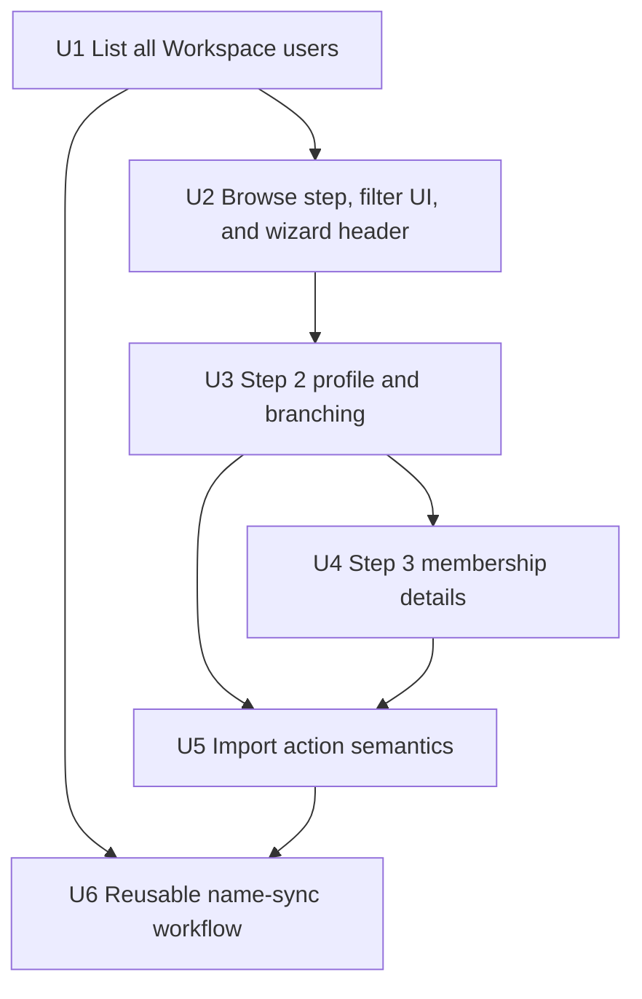

# feat: Redesign Google Workspace Import as a Wizard

## Summary

Refactor the existing Google Workspace import dialog into a status-aware, browse-first wizard. Step 1 loads all Workspace users on open and filters client-side with debounced inputs; the dialog header uses the onboarding Breadcrumb component for step progress. Steps 2 and 3 handle START profile details and membership, unchanged from the prior design. The implementation extends the existing Directory API wrapper, Inngest event, and membership import patterns without adding new routes or DB migrations.

---

## Problem Frame

The current import surface combines Workspace search and membership data entry in one long dialog, making the selected Google account easy to miss and the header visually cluttered. The prior wizard plan used a search-then-select approach; the requirements in `docs/brainstorms/2026-05-09-import-google-workspace-wizard-requirements.md` pivot Step 1 to a browse-all model that removes the search friction and replaces the cramped inline stepper with the onboarding-style Breadcrumb component. All other requirements (onboarding imports, name sync, synchronous DB insert) carry forward unchanged.

---

## Requirements

- R1. On dialog open, all Workspace users are fetched (all pages collected server-side) and displayed in a paginated table without requiring any search input.
- R2. While users are loading, a skeleton placeholder is shown; if the fetch fails, an error alert with retry is shown.
- R3. Two vertically-stacked filter inputs (First name, Last name) apply debounced (300 ms) client-side filtering via TanStack Table's `getFilteredRowModel`. No Search button, no email filter.
- R4. The table uses TanStack Table with client-side pagination (10 rows/page). Columns: Name, Email, Status badge. Already-linked and suspended rows are shown at 60% opacity and are not selectable.
- R5. The "Next" button is enabled only after a selectable (importable) user row is chosen.
- R6. The dialog header uses the existing `Breadcrumb` / `BreadcrumbList` / `BreadcrumbItem` / `BreadcrumbPage` / `BreadcrumbSeparator` components matching the onboarding breadcrumb visual pattern.
- R7. `DialogTitle` stays "Import from Google Workspace". `DialogDescription` is shortened to one line. Title and description use `gap-4` spacing.
- R8. Step 2 shows selected Workspace first name, last name, and email with the existing `InputGroup` + lock visual pattern.
- R9. First and last name can be unlocked independently with a pencil action; email remains locked.
- R10. Step 2 collects batch, importable status, and department only when status is `member`.
- R11. Back navigation works between loaded wizard steps without re-fetching Workspace users.
- R12. Status drives wizard branching: `alumni` and `onboarding` submit from Step 2; `member` and `supporting_alumni` continue to Step 3.
- R13. Step 3 contains paid-through date and documents-verified controls for `member` and `supporting_alumni`.
- R14. Step 3 submits the import.
- R15. The local user insert remains synchronous so the people table can refresh immediately after success.
- R16. The documents-verified helper text is: "Check this if you've received and verified the person's membership documents. Leave unchecked if documents are missing or you're unsure — the board will be asked to vote on formal admission."
- R17. `onboarding` is added to importable statuses.
- R18. Onboarding imports create only the local onboarding user, with no legal membership row and no membership payment row.
- R19. Successful imports emit `cockpit/user.updated` with the local user ID.
- R20. A reusable Inngest workflow listens for `cockpit/user.updated`, compares DB and Workspace names, and updates Google Workspace when they differ.
- R21. The name-sync workflow is generic and reusable by future profile-editing surfaces.

**Origin actors:** Admin; Inngest workflow; Google Workspace Admin API

**Origin flows:** F1 Admin browses/selects GWS user, F2 Admin completes profile/org details, F3 Admin enters membership details, F4 GWS name is synced after import

**Origin acceptance examples:** AE1 alumni skips Step 3, AE2 member advances to Step 3, AE3 onboarding import avoids legal/payment rows, AE4 import-time name correction syncs to GWS, AE5 future name edit reuses sync, AE6 filter narrows table without Search button, AE7 skeleton shown on slow connection

---

## Scope Boundaries

- No durable Google Workspace identity field is added; local `user.email` remains the correlation key.
- No email editing during import.
- No sync of status, email, department, payment, legal membership, or other profile fields to Google Workspace.
- No URL persistence for wizard step state.
- No change to the normal create-user flow.
- No switch away from the existing Google Admin SDK Directory API wrapper.
- Back navigation uses already-loaded client state and does not re-fetch Workspace users.
- Server-side filtering or debounced Admin SDK calls — all filtering is client-side on the preloaded list.
- Email filter field in Step 1 — dropped.
- `searchGoogleWorkspaceUsersAction` and `searchGoogleWorkspaceUsersSchema` are removed.

### Deferred to Follow-Up Work

- Future people profile editing can emit the same `cockpit/user.updated` event, but this plan does not add a profile edit surface.
- Rich React/browser component test infrastructure for the wizard is deferred; this plan uses focused schema, pure helper, server action, and workflow tests plus manual browser verification.
- `buildWorkspaceUsersQuery` in `src/lib/google-workspace/directory-query.ts` becomes dead code after U1; removal is included in U1's verification checklist.

---

## Context & Research

### Relevant Code and Patterns

- `src/app/(authenticated)/(app)/people/import-google-user-dialog.tsx` — current single-dialog import surface; uses `useAction`, `useHookFormAction`, `react-hook-form`, shadcn-style fields, and status-driven conditional fields.
- `src/app/(authenticated)/(app)/people/import-google-user-action.ts` — owns import business logic: duplicate detection, submit-time verification, synchronous DB insert, admission workflow emission, notification email. The `searchGoogleWorkspaceUsersAction` DB enrichment logic (find local users by candidate emails, attach `linkedUser`) is the template for the new `listAllWorkspaceUsersAction`.
- `src/app/(authenticated)/(app)/people/import-google-user-schema.ts` — defines importable statuses and validation; `searchGoogleWorkspaceUsersSchema` will be removed.
- `src/lib/google-workspace/directory.ts` — isolates Google Directory reads behind `server-only`; existing `toCandidate` helper normalizes candidates and will be reused by `listAllWorkspaceUsers`.
- `src/lib/inngest.ts` — already defines `cockpit/user.updated` with `{ id: string }`. In code this event is accessed as `events.cockpitUserUpdated` (a TypeScript constant); plan prose uses the string identifier `cockpit/user.updated` for readability — they refer to the same event.
- `src/db/membership.ts` — already has `requiresMembershipBilling("onboarding") === false`.
- `src/app/(authenticated)/(onboarding)/onboarding/[step]/(steps)/step-master-data.tsx` — provides `InputGroup` + `LockIcon` locked field pattern.
- `src/app/(authenticated)/(onboarding)/onboarding/[step]/onboarding-breadcrumbs.tsx` — provides the Breadcrumb stepper pattern: active step gets `bg-muted rounded-md px-[6px] py-[2px]` on `BreadcrumbItem`; completed step gets `CircleCheck` icon prefix on `BreadcrumbPage`; future steps get `text-muted-foreground`.
- `src/components/people-table.tsx` — canonical TanStack Table pattern in this repo: `@tanstack/react-table ^8.21.3`, uses `getCoreRowModel`, `getFilteredRowModel`, `getPaginationRowModel`, `getSortedRowModel`, four state variables (`sorting`, `columnFilters`, `columnVisibility`, `rowSelection`).
- `use-debounce ^10.1.0` is already installed; `useDebounce(value, 300)` is the established call pattern (named import from `"use-debounce"`).
- `src/components/ui/breadcrumb.tsx` — exports `Breadcrumb`, `BreadcrumbList`, `BreadcrumbItem`, `BreadcrumbLink`, `BreadcrumbPage`, `BreadcrumbSeparator`, `BreadcrumbEllipsis`.

### Institutional Learnings

- `docs/solutions/conventions/reusable-tone-of-voice-and-wording-decisions-2026-05-02.md` says admin copy should be precise and outcome-oriented. Apply to the documents-verified helper copy and import errors.
- No `docs/solutions/` entry exists for Google Workspace Directory pagination, TanStack Table, or debounce patterns.

### External References

- Google Workspace Admin Directory `users.list` supports `pageToken` for multi-page traversal and `maxResults` up to 500. Without a `query` parameter, it returns all users in the domain. See: https://developers.google.com/workspace/admin/directory/reference/rest/v1/users/list
- Google Workspace Admin Directory `users.update` updates a user by primary email, alias, or unique ID and requires `https://www.googleapis.com/auth/admin.directory.user`. See: https://developers.google.com/workspace/admin/directory/reference/rest/v1/users/update

---

## Key Technical Decisions

- **Browse-all over search-first.** Loading all GWS users on open removes "what do I search for?" friction. Client-side filtering via TanStack Table `getFilteredRowModel` is sufficient because the org's Workspace headcount is small enough to fit in one payload. Server-side filtering would add round-trip latency and complexity for no benefit at this scale.
- **Two separate hidden filter columns (givenName, familyName) rather than one combined name column.** This gives AND-semantics — first name and last name narrow independently — without a custom filter function. Each debounced input sets its own column filter value.
- **Onboarding Breadcrumb component for step indicator.** The existing `Breadcrumb` component already carries the visual language and spacing the dialog header needs. No new component is required; the onboarding pattern is adopted directly.
- **Keep the wizard inside `ImportGoogleUserDialog`.** The existing modal entry point and people-page refresh behavior already match the requirement. A dedicated route would add navigation/state surface without a product need.
- **Extend `src/lib/google-workspace/directory.ts` for bulk fetch.** This keeps all Google API concerns behind one server-only boundary.
- **Remove `searchGoogleWorkspaceUsersAction` and `searchGoogleWorkspaceUsersSchema`.** They are superseded by the list-all approach. `buildWorkspaceUsersQuery` in `directory-query.ts` becomes dead code; cleanup is deferred.
- **Emit `cockpit/user.updated` after every successful import.** The reusable workflow owns the compare/no-op decision; future callers reuse the same event contract without import-specific payload.
- **No DB schema or migration work.** `user.status` already supports `onboarding`; `cockpit/user.updated` already exists.

---

## Open Questions

### Resolved During Planning

- Should the plan introduce a durable Workspace user ID? No. `user.email` plus submit-time Workspace re-fetching remains the approach.
- Does onboarding import need a schema migration? No. `src/db/schema/auth.ts` already includes `onboarding` in `userStatus`.
- Should name sync happen inline in the import action? No. The requirement asks for a reusable Inngest workflow and the existing `cockpit/user.updated` event is sufficient.
- Should filtering be client-side or server-side? Client-side. The org's Workspace headcount fits in one payload; no debounced Admin SDK calls needed.
- Should two separate column filters or a single combined name filter be used? Two separate column filters (`givenName`, `familyName`) so each input narrows independently with AND-semantics.

### Deferred to Implementation

- Exact UI helper extraction boundaries in `ImportGoogleUserDialog`: implementation may keep step subcomponents local or extract small pure helpers if the file grows hard to maintain.
- Exact workflow error policy for persistent Google API failures: the workflow should let Inngest retry provider failures, but implementation should choose the local logging/error shape that matches existing workflow conventions.
- Whether to show total page count alongside prev/next controls: a "Page X of Y" label is expected, but exact phrasing and component choice are left to implementation.

---

## High-Level Technical Design

> *This illustrates the intended approach and is directional guidance for review, not implementation specification. The implementing agent should treat it as context, not code to reproduce.*

```mermaid
sequenceDiagram
    participant Admin
    participant Dialog as Import dialog
    participant Action as Server actions
    participant DB as Postgres
    participant Google as Google Directory
    participant Inngest

    Admin->>Dialog: Open dialog
    Dialog->>Action: listAllWorkspaceUsersAction (no input)
    Action->>Google: users.list — loop pageToken until exhausted
    Action->>DB: Find local users by candidate emails
    Action-->>Dialog: Flat list with linked/suspended status
    Dialog-->>Admin: Paginated table + filter inputs (skeleton while loading)
    Admin->>Dialog: Type in filter inputs (debounced 300 ms)
    Dialog-->>Admin: Table narrows client-side, no server call
    Admin->>Dialog: Select importable user, complete Steps 2–3
    Dialog->>Action: Submit selected ID and START import fields
    Action->>Google: Re-fetch selected user by ID
    Action->>DB: Insert local user and membership/legal rows if required
    Action->>Inngest: Send cockpit/user.updated
    Action-->>Dialog: Import success; refresh people table
    Inngest->>DB: Fetch local user by ID
    Inngest->>Google: Fetch Workspace user by email
    Inngest->>Google: Update first/last name only when different
```

---

## Implementation Units



### U1. List All Workspace Users

**Goal:** Add a server-side function that fetches all GWS users via `pageToken` loop and a server action that returns the enriched list. Remove the search-based action and schema.

**Requirements:** R1, R2; supports F1, AE7

**Dependencies:** None

**Files:**
- Modify: `src/lib/google-workspace/directory.ts`
- Test: `src/lib/google-workspace/directory.test.ts`
- Modify: `src/app/(authenticated)/(app)/people/import-google-user-action.ts`
- Modify: `src/app/(authenticated)/(app)/people/import-google-user-schema.ts`

**Approach:**
- Add `listAllWorkspaceUsers()` to `directory.ts`: calls `admin.users.list` with `customer: "my_customer"`, no `query`, `maxResults: 500`, `orderBy: "email"`, `projection: "basic"`. Loops `nextPageToken` until absent, accumulating candidates through the existing private `toCandidate` helper.
- Add `listAllWorkspaceUsersAction` to `import-google-user-action.ts`: no input schema; permission-checked via `can("users.import")`; calls `listAllWorkspaceUsers()`; cross-references local DB with the same enrichment pattern already in `searchGoogleWorkspaceUsersAction` (find local users by candidate emails, attach `linkedUser` or `null`).
- Remove `searchGoogleWorkspaceUsersAction` from `import-google-user-action.ts`.
- Remove `searchGoogleWorkspaceUsersSchema` from `import-google-user-schema.ts`. Also update `src/app/(authenticated)/(app)/people/import-google-user-schema.test.ts` to remove the `searchGoogleWorkspaceUsersSchema` describe block — deleting the export without updating the test file breaks the test suite.

**Execution note:** Test the `pageToken` loop first with a mock that returns two pages, then verify the single-page and empty cases.

**Patterns to follow:**
- Private `toCandidate` helper already in `src/lib/google-workspace/directory.ts`.
- DB enrichment logic in the existing `searchGoogleWorkspaceUsersAction` in `src/app/(authenticated)/(app)/people/import-google-user-action.ts`.
- `can("users.import")` permission guard pattern in all existing people actions.

**Test scenarios:**
- Happy path: `listAllWorkspaceUsers` with no `nextPageToken` in response returns the first-page candidates as a flat array.
- Happy path: `listAllWorkspaceUsers` receives a `nextPageToken` on the first response, loops, and returns candidates from both pages combined.
- Edge case: Workspace domain has zero users — response has no `users` array; returns empty array without error.
- Error path: transient Google API error propagates out of `listAllWorkspaceUsers` and is not swallowed.
- Integration: `listAllWorkspaceUsersAction` marks candidates whose `primaryEmail` matches a local user's email as `linkedUser: { id, name, email }`.

**Verification:**
- `listAllWorkspaceUsersAction` is callable with no input and returns the enriched flat list.
- `searchGoogleWorkspaceUsersAction` and `searchGoogleWorkspaceUsersSchema` no longer exist in the codebase.
- The `searchGoogleWorkspaceUsersSchema` describe block is removed from `import-google-user-schema.test.ts`.
- The action still enforces `users.import` permission before any Directory call.
- `src/lib/google-workspace/directory-query.ts` (`buildWorkspaceUsersQuery`) is removed or confirmed dead — its removal is small enough to include here rather than defer to a follow-up.

---

### U2. Browse Step, Filter UI, and Wizard Header

**Goal:** Replace the Step 1 search form with a TanStack Table that loads all Workspace users on dialog open, add debounced filter inputs and pagination controls, and replace the inline stepper with the onboarding Breadcrumb component.

**Requirements:** R1, R2, R3, R4, R5, R6, R7, R11; supports F1, AE6, AE7

**Dependencies:** U1

**Files:**
- Modify: `src/app/(authenticated)/(app)/people/import-google-user-dialog.tsx`

**Approach:**
- On `open` prop transitioning to `true`: fire `listAllWorkspaceUsersAction` via `useAction`; store result as the table's data source. Reset workspace user list, filter state, and selected candidate on dialog close using the existing `useEffect` cleanup pattern.
- While the action is executing (`status === "executing"`): render skeleton rows in the table area. On error: show an error alert with a retry button that re-fires the action. The retry button must be disabled (and show a loading indicator) while the retry is in-flight to prevent double-submits.
- The `WorkspaceSearchResult` type (currently derived from the removed `searchGoogleWorkspaceUsersAction`) must be re-derived from `listAllWorkspaceUsersAction` (e.g., `NonNullable<InferSafeActionFnResult<typeof listAllWorkspaceUsersAction>['data']>[number]`) or typed directly from `WorkspaceUserCandidate` extended with `{ linkedUser: { id: string; name: string; email: string } | null }`. Without this, the TypeScript build fails immediately on U1 completion.
- TanStack Table: `getCoreRowModel`, `getFilteredRowModel`, `getPaginationRowModel`. Register two hidden filter columns with `accessorKey: "givenName"` and `accessorKey: "familyName"` (not displayed). Display columns: combined name (`accessorFn: row => row.name`), `primaryEmail`, status badge. `initialState: { pagination: { pageSize: 10 }, columnVisibility: { givenName: false, familyName: false } }` — without the `columnVisibility` initialState, TanStack Table v8 renders blank column headers for the two filter columns.
- Filter inputs: two stacked `<Input>` fields (First name, Last name). Wrap each raw value in `useDebounce(value, 300)` from `"use-debounce"`. Wire each debounced value to the matching column's `setFilterValue` inside a `useEffect` on the debounced values.
- Pagination controls below the table: prev/next `<Button>` elements gated on `table.getCanPreviousPage()` / `table.getCanNextPage()`; a page indicator (e.g., "Page X of Y").
- Row selection: clicking a selectable row (or its radio button) calls `selectWorkspaceUser`; already-linked and suspended rows get `opacity-60` styling and a disabled radio.
- Replace the inline step indicator (`div` + `React.Fragment` loop over `stepLabels`) with `<Breadcrumb>` + `<BreadcrumbList>`. Each step becomes a `<BreadcrumbItem className={cn("rounded-md px-[6px] py-[2px]", isActive && "bg-muted")}>` wrapping a `<BreadcrumbPage>`. Completed steps get a `CircleCheck` icon before the label; future steps get `text-muted-foreground`. `<BreadcrumbSeparator />` between items.
- `DialogDescription` shortened to one line; `DialogHeader` wraps children with `gap-4` so title and description have breathing room.

**Patterns to follow:**
- `src/components/people-table.tsx` for TanStack Table boilerplate (state variables, row model getters, filter wiring).
- `src/app/(authenticated)/(onboarding)/onboarding/[step]/onboarding-breadcrumbs.tsx` for Breadcrumb step styling.
- `src/components/ui/breadcrumb.tsx` for exported component names.
- Existing `useAction` usage in the current dialog for firing the action; existing `useEffect` on `open` for cleanup.
- `useDebounce` from `"use-debounce"` at 300 ms.

**Test scenarios:**
- Test expectation: none for the React component — no component test harness in this repo; cover the list action and enrichment in U1; verify Step 1 UI behavior manually in browser.

**Verification:**
- Dialog opens showing all Workspace users without any filter input required.
- Typing in either filter input narrows the table after 300 ms without a Search button click.
- Pagination controls appear and navigate correctly at 10 rows per page.
- The stepper uses Breadcrumb components and visually matches the onboarding rhythm.
- Linked/suspended rows are visible but not selectable.
- Cannot advance to Step 2 without selecting an importable row.
- Closing and reopening the dialog resets the filter inputs and clears the selection.

---

### U3. Step 2 Profile, Organization, and Branching

**Goal:** Implement Step 2 with locked Workspace identity fields, controlled name unlocks, org fields, onboarding status, and status-driven footer behavior.

**Requirements:** R8, R9, R10, R11, R12, R17; supports F2, AE1, AE2, AE3

**Dependencies:** U2

**Files:**
- Modify: `src/app/(authenticated)/(app)/people/import-google-user-dialog.tsx`
- Modify: `src/app/(authenticated)/(app)/people/import-google-user-schema.ts`
- Test: `src/app/(authenticated)/(app)/people/import-google-user-schema.test.ts`
- Modify: `src/app/(authenticated)/(app)/people/import-google-user-email.ts`
- Test: `src/app/(authenticated)/(app)/people/import-google-user-action.test.ts`

**Approach:**
- Prefill first name, last name, and email from the selected Workspace candidate.
- Use `InputGroup`, `InputGroupInput`, `InputGroupAddon`, `InputGroupButton`, `Tooltip`, and `LockIcon` from the onboarding master-data pattern.
- Add independent pencil unlock controls for first and last name only; email remains disabled/locked.
- Verify `onboarding` is already present in `importableUserStatus` (confirmed in `import-google-user-schema.ts`) and that `normalizeImportedDepartment` returns `null` for every non-member status — no schema change is expected.
- Keep department visible and required only for `member`.
- Make Step 2 submit directly for `alumni` and `onboarding`; show Next only for `member` and `supporting_alumni`.
- Extend import notification email status handling if it currently only accepts `member`, `supporting_alumni`, and `alumni`.

**Patterns to follow:**
- Locked field pattern in `src/app/(authenticated)/(onboarding)/onboarding/[step]/(steps)/step-master-data.tsx`.
- `USER_STATUS_INFO` labels in `src/lib/user-status.ts`.
- Existing status-driven field clearing in `src/app/(authenticated)/(app)/people/import-google-user-dialog.tsx`.

**Test scenarios:**
- Happy path: schema accepts `onboarding` without department or `documentsVerified`.
- Happy path: schema accepts `alumni` without department or `documentsVerified`.
- Happy path: schema accepts `member` only when department and `documentsVerified` are present.
- Happy path: schema accepts `supporting_alumni` with `documentsVerified` and no department.
- Covers AE1. Status `alumni` is classified as a Step 2 submit path, not a Step 3 path.
- Covers AE2. Status `member` is classified as requiring Step 3.
- Covers AE3. Status `onboarding` is classified as a Step 2 submit path.
- Edge case: stale department values are normalized away for `onboarding`, `alumni`, and `supporting_alumni`.

**Verification:**
- Locked fields visually match the onboarding pattern.
- First and last names can be edited only after an explicit pencil unlock.
- Onboarding appears in the status select and branches like alumni.

---

### U4. Step 3 Membership Details and Copy

**Goal:** Move membership timing and documents verification into Step 3 for statuses that require it, with updated helper copy.

**Requirements:** R12, R13, R14, R16; supports F3, AE2

**Dependencies:** U3

**Files:**
- Modify: `src/app/(authenticated)/(app)/people/import-google-user-dialog.tsx`
- Test: `src/app/(authenticated)/(app)/people/import-google-user-schema.test.ts`

**Approach:**
- Show Step 3 only when status is `member` or `supporting_alumni`.
- Keep the paid-through date behavior from the current form.
- Keep the documents-verified checkbox behavior, but replace the helper copy with: "Check this if you've received and verified the person's membership documents. Leave unchecked if documents are missing or you're unsure — the board will be asked to vote on formal admission."
- Provide Back to Step 2 and Import submit controls.
- Ensure changing status back to `alumni` or `onboarding` clears Step 3-only values before submit validation.

**Patterns to follow:**
- Existing membership field behavior in `src/app/(authenticated)/(app)/people/import-google-user-dialog.tsx`.
- Admin copy guidance in `docs/solutions/conventions/reusable-tone-of-voice-and-wording-decisions-2026-05-02.md`.

**Test scenarios:**
- Happy path: `member` with a future paid-through date and documents verified passes schema validation.
- Happy path: `supporting_alumni` with no paid-through date and documents not verified passes schema validation.
- Edge case: `onboarding` with stale paid-through date and documents flag is normalized or ignored at submit time.
- Error path: `member` or `supporting_alumni` without `documentsVerified` fails validation.

**Verification:**
- Step 3 is unreachable for `alumni` and `onboarding`.
- The documents helper text exactly matches R16.
- Import submit remains disabled until the form state is valid.

---

### U5. Import Action Semantics and Event Emission

**Goal:** Update the import server action to support onboarding imports, import-time name corrections, synchronous DB insert semantics, and `cockpit/user.updated` emission.

**Requirements:** R15, R17, R18, R19; supports F2, F3, F4, AE3, AE4

**Dependencies:** U3, U4

**Files:**
- Modify: `src/app/(authenticated)/(app)/people/import-google-user-action.ts`
- Test: `src/app/(authenticated)/(app)/people/import-google-user-action.test.ts`
- Modify: `src/app/(authenticated)/(app)/people/import-google-user-email.ts`
- Modify: `src/lib/inngest.ts`

**Approach:**
- Preserve permission checks, Workspace re-fetch by selected ID, suspended-user rejection, and duplicate local-user rejection.
- Remove any submit-time rejection for first/last-name differences; those differences are now expected when admins unlock and correct names.
- Insert `onboarding` users with `status = onboarding`, `legalMembershipState = not_member`, no legal membership row, and no membership payment row.
- Keep existing member/supporting-alumni legal membership, admission workflow, and payment behavior.
- Keep alumni imports as no legal membership and no payment.
- Emit `events.cockpitUserUpdated` after the transaction commits for every successful import.
- Keep admission-workflow event emission for document-missing member/supporting-alumni cases.
- Keep notification email failure non-fatal (catch and log, do not surface to caller).

**Execution note:** Add characterization coverage around the existing member/supporting-alumni/alumni import paths before changing the branching logic, because this action owns several durable writes and event side effects.

**Patterns to follow:**
- Transaction boundary and post-commit event emission already in `src/app/(authenticated)/(app)/people/import-google-user-action.ts`.
- `requiresMembershipBilling` in `src/db/membership.ts`.
- Existing action-level authorization via `can("users.import")`.

**Test scenarios:**
- Covers AE3. Onboarding import creates a user with `status = onboarding`, no legal membership row, and no membership payment row.
- Covers AE4. Name-corrected import no longer fails submit-time Workspace-name comparison and still emits `cockpit/user.updated`.
- Happy path: member import with documents verified creates active legal membership and pending membership payment.
- Happy path: supporting alumni import with documents not verified starts admission workflow and emits the admission event after commit.
- Happy path: alumni import creates local user without legal membership or payment.
- Error path: suspended Workspace user is rejected before any local insert.
- Error path: already-imported Workspace email is rejected before any local insert.
- Error path: past paid-through date is rejected.
- Integration: successful import returns an ID and the people page can refresh immediately after action success.

**Verification:**
- Local DB insert still happens synchronously.
- `cockpit/user.updated` is emitted exactly once after successful import commits.
- Onboarding imports do not accidentally create legal or payment state.

---

### U6. Reusable Google Workspace Name-Sync Workflow

**Goal:** Add a generic Inngest workflow that syncs local first/last-name changes to Google Workspace when `cockpit/user.updated` fires.

**Requirements:** R19, R20, R21; supports F4, AE4, AE5

**Dependencies:** U1, U5

**Files:**
- Modify: `src/lib/google-workspace/directory.ts`
- Test: `src/lib/google-workspace/directory.test.ts`
- Create: `src/inngest/sync-google-workspace-user-name.ts`
- Modify: `src/inngest/index.ts`
- Test: `src/inngest/sync-google-workspace-user-name.test.ts`

**Approach:**
- Add a narrow Directory wrapper function for updating first and last name only.
- Create an Inngest function subscribed to `events.cockpitUserUpdated`.
- Fetch the local user by event ID; stop cleanly if the user no longer exists.
- Fetch the Workspace user by local email; stop cleanly if the Workspace account no longer exists.
- Compare local `firstName`/`lastName` to Workspace `givenName`/`familyName`; call the update wrapper only when a difference exists.
- Register the function in `src/inngest/index.ts`.
- Let transient Google API failures throw so Inngest retry behavior handles them.

**Patterns to follow:**
- Workflow structure in `src/inngest/create-group.ts` and `src/inngest/membership-admission-workflow.ts`.
- Event typing in `src/lib/inngest.ts`.
- Directory auth scope and candidate mapping in `src/lib/google-workspace/directory.ts`.

**Test scenarios:**
- Covers AE4. Local first name differs from Workspace `givenName`; workflow updates Workspace to the local first/last name.
- Covers AE5. A later `cockpit/user.updated` event from any caller triggers the same compare/update behavior.
- Happy path: local and Workspace names already match; workflow does not call update.
- Edge case: local user ID from the event no longer exists; workflow exits without provider call.
- Edge case: Workspace user cannot be found by local email; workflow exits without update.
- Error path: Google update throws a transient error; workflow propagates it for Inngest retry.
- Integration: workflow uses only `{ id }` from `cockpit/user.updated`, proving no import-specific payload is required.

**Verification:**
- The workflow is registered and visible to the Inngest dev server.
- Import-time corrected names eventually match Google Workspace.
- The workflow contains no import-specific branching.

---

## System-Wide Impact

- **Interaction graph:** People page opens `ImportGoogleUserDialog`; dialog calls `listAllWorkspaceUsersAction` on open and `importGoogleWorkspaceUserAction` on submit; import action writes DB rows and emits Inngest events; the name-sync workflow reads DB and calls Google Directory update.
- **Error propagation:** List-fetch errors surface through an in-dialog error alert with retry; import validation errors surface through existing `handleError` behavior; name-sync failures happen asynchronously and retry through Inngest without blocking import success.
- **State lifecycle risks:** Workspace user list, filter inputs, selected candidate, and downstream form values must all reset on dialog close. Submit-time re-fetch and duplicate checks remain required because the list was fetched at open time and may be stale by submit time.
- **API surface parity:** `cockpit/user.updated` remains `{ id: string }`, so future profile-editing surfaces can reuse the name-sync workflow without contract changes.
- **Integration coverage:** Unit tests cover Directory pagination, server action enrichment, workflow helpers, and import action branches; manual browser verification covers the wizard interaction because there is no React component test harness.
- **Unchanged invariants:** `user.email` remains the durable Workspace correlation key; create-user behavior remains separate; import success continues to refresh the people table immediately.

---

## Risks & Dependencies

| Risk | Mitigation |
|------|------------|
| `listAllWorkspaceUsers` is slow for large domains | `maxResults: 500` minimizes round-trips; org headcount is small enough that a single page is expected in practice. Skeleton loading state prevents dialog from appearing blocked. |
| Stale list at submit time | Continue re-fetching the selected Workspace user by ID at submit time and checking suspended/duplicate state — same as today. |
| Onboarding import accidentally creates legal/payment rows via existing fallback branches | Make onboarding an explicit branch in the import action and cover absence of legal/payment rows in server action tests. |
| Asynchronous name sync fails after a successful import | Failures throw inside the workflow so Inngest retries; import remains successful because the local user was created synchronously. |
| Wizard dialog grows into a hard-to-maintain component | Extract local step helpers/subcomponents only when needed; keep state ownership centralized in the dialog. |

---

## Documentation / Operational Notes

- No database migration is expected.
- Ensure the Google service account still has `https://www.googleapis.com/auth/admin.directory.user`; required for both user list and name updates.
- Manual verification should include a real or mocked Inngest dev run where an imported name correction triggers the new workflow.
- `buildWorkspaceUsersQuery` in `src/lib/google-workspace/directory-query.ts` will be dead code after U1; removal is included in U1's verification checklist.

---

## Sources & References

- **Origin document:** `docs/brainstorms/2026-05-09-import-google-workspace-wizard-requirements.md`
- Prior related plan: `docs/plans/2026-04-28-002-feat-google-workspace-user-import-plan.md`
- Current import UI: `src/app/(authenticated)/(app)/people/import-google-user-dialog.tsx`
- Current import action: `src/app/(authenticated)/(app)/people/import-google-user-action.ts`
- Current import schema/tests: `src/app/(authenticated)/(app)/people/import-google-user-schema.ts`
- Google Directory wrapper: `src/lib/google-workspace/directory.ts`
- TanStack Table pattern: `src/components/people-table.tsx`
- Breadcrumb components: `src/components/ui/breadcrumb.tsx`
- Onboarding breadcrumb pattern: `src/app/(authenticated)/(onboarding)/onboarding/[step]/onboarding-breadcrumbs.tsx`
- Inngest event registry: `src/lib/inngest.ts`, `src/inngest/index.ts`
- Locked input pattern: `src/app/(authenticated)/(onboarding)/onboarding/[step]/(steps)/step-master-data.tsx`
- Copy convention: `docs/solutions/conventions/reusable-tone-of-voice-and-wording-decisions-2026-05-02.md`
- Google Workspace Directory list docs: https://developers.google.com/workspace/admin/directory/reference/rest/v1/users/list
- Google Workspace Directory user update docs: https://developers.google.com/workspace/admin/directory/reference/rest/v1/users/update
