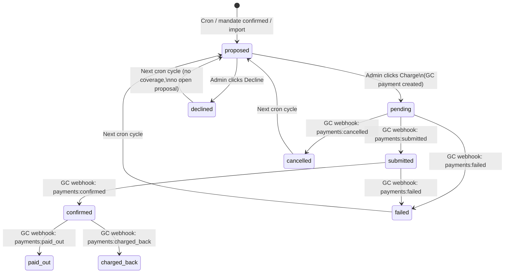
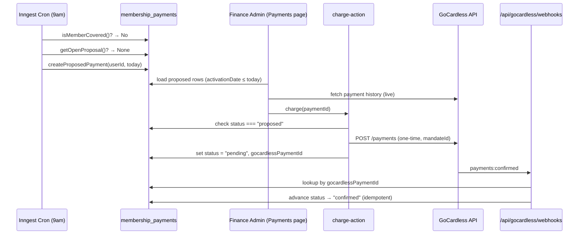

# feat: Safer Payments — Per-Cycle Manual Approval Queue

## Summary

This plan replaces the automatic GoCardless subscription model with a fully manual, per-cycle approval queue. It introduces a new `membership_payments` table, a daily Inngest cron job that creates `proposed` rows for uncovered members, charge/decline server actions gated behind a new `finance_admin` permission, and a Payments page with shadcn stat cards and a table/detail drawer — all while cleaning up the legacy `paidThroughAt`, `gocardlessSubscriptionId`, and mandate/customer ID columns from the old `membership_payment` table. Nine implementation units, sequenced database-schema-first.

---

## Problem Frame

The current flow auto-charges members via GoCardless subscriptions with no human in the loop, creating operational risk for edge cases (members who have left, hardship arrangements, amount changes). The fix removes subscriptions entirely and gates every charge behind an explicit finance admin action.

See origin document for full problem narrative: `docs/brainstorms/2026-05-11-safer-payments-manual-approval-requirements.md`

---

## Requirements

- R1. Replace subscription-based `membership_payment` model with per-cycle `membership_payments` table
- R2. Each row has: `id`, `userId`, `status`, `activationDate`, `amount` (4000 EUR-cents), `gocardlessPaymentId`, `createdAt`, `updatedAt`
- R3. Status values: `proposed → declined | pending → submitted → confirmed → paid_out | failed | cancelled | charged_back`
- R4. GoCardless mandate ID and customer ID stored at user level
- R5. Remove `paidThroughAt` and `gocardlessSubscriptionId` from the active data model
- R6. A member is "paid up" when their most recent `confirmed` or `paid_out` row has `activationDate + 1 year > today`
- R7. `activationDate` of a new cycle = previous cycle's `activationDate + 1 year`; first charge uses `activationDate = today`
- R8. Inngest cron runs daily at 9am
- R9. Cron creates `proposed` row if member has no current coverage AND no open (`proposed`, `pending`, `submitted`) row
- R10. One open proposal per member at a time
- R11. Cron is idempotent
- R12. Payments page accessible only to `head_of_finance` or `finance_admin` grant holders
- R13. Page shows rows with `activationDate <= today`; future-dated rows hidden
- R14. All statuses visible with correct labels; no real-time polling needed
- R15. Each row shows member name, activation date, amount, and live GoCardless payment history
- R16. Each `proposed` row has a "Charge" action — creates GC payment, advances to `pending`
- R17. Each `proposed` row has a "Decline" action — advances to `declined`
- R18. Charge and decline are idempotent server actions
- R19. New `finance_admin` app-level grant added to the permission system
- R20. `finance_admin` can be assigned without requiring a formal org position
- R21. `head_of_finance` OR `finance_admin` can access Payments page and actions; Payments nav item hidden for others
- R22. No GoCardless subscription created at any point in the new flow
- R23. Admin approval creates a GoCardless one-time payment against the stored mandate (4000 EUR-cents)
- R24. Webhook handler maps `payments:submitted/confirmed/paid_out/failed/cancelled/charged_back` to local status; all handlers idempotent
- R25. Failed payments: GoCardless `POST /payments/{id}/actions/retry` is available but a Retry button in the UI is out of scope for this plan
- R26. Imported member with paid-through date: create `proposed` row with `activationDate = paidThroughDate + 1 day`
- R27. Import-created rows with `activationDate > today` are hidden on the Payments page until that date arrives

**Origin actors:** A1 (Finance admin), A2 (Member subject of charge), A3 (START Cockpit), A4 (GoCardless), A5 (Inngest cron)
**Origin flows:** F1 (admin reviews/approves), F2 (admin declines), F3 (cron creates proposal), F4 (import with paid-through date), F5 (mandate onboarding)
**Origin acceptance examples:** AE1 (covers R6, R13, R15), AE2 (covers R16, R18, R24), AE3 (covers R10, R11), AE4 (covers R17), AE5 (covers R26, R27), AE6 (covers R7), AE7 (covers R19–R21)

> **Status label note:** AE1 in the origin doc refers to an "executed" payment; AE2 refers to status "accepted". Neither term appears in R3's status enum. Map as: "executed" → `confirmed` or `paid_out`; "accepted" → `pending`. Use the R3 names when implementing against these acceptance examples.

---

## Scope Boundaries

- No Retry button in the Payments page UI for failed payments (R25 notes GoCardless supports it; deferred)
- No member-facing notification email when a charge is executed
- Custom per-member amounts are out of scope — all charges are 40 EUR
- No refund or charge reversal workflow
- Cancelling existing active GoCardless subscriptions is an operational step, not in code (documented in Operational Notes)

### Deferred to Follow-Up Work

- Retry UI button for failed payments: separate PR once the core approval queue is stable
- GoCardless mandate status check before charge (currently the charge action calls GC API directly; a cancelled mandate returns a GC API error that the action surfaces to the admin — a dedicated mandate-status pre-check can be added later)

---

## Context & Research

### Relevant Code and Patterns

- Existing schema: `src/db/schema/membership.ts` — current `membership_payment` table; columns to remove (`paidThroughAt`, `gocardlessSubscriptionId`, `gocardlessMandateId`, `gocardlessCustomerId`)
- User additional fields: `src/db/schema/auth-fields.ts` — `betterAuthUserAdditionalFields` pattern; new mandate columns must be declared here to be session-accessible
- Permission model: `src/lib/authority/model.ts` — `globalAccessGrants` array; `globalOrganizationPositions` includes `head_of_finance`
- Permission evaluator: `src/lib/permissions/evaluate.ts` — `globalActions` tuple + `evaluateGlobalAction()` switch
- Existing permission test: `src/lib/permissions/permissions.test.ts` — test shape to follow
- GoCardless client: `src/lib/gocardless/client.ts` — `goCardlessRequest<T>()` helper + `requireGoCardlessConfig()`
- Existing GC helpers: `src/lib/gocardless/membership-flow.ts` — `createMembershipSubscription()` becomes dead code after U9
- Webhook handler: `src/app/api/gocardless/webhooks/route.ts` + `src/db/gocardless-events.ts` + `src/lib/gocardless/webhook.ts`
- Inngest patterns: `src/inngest/membership-admission-workflow.ts` — `step.run()` idempotency, event-trigger shape; `src/inngest/index.ts` — function registration array
- Server action pattern: `src/lib/action-client.ts` + any existing action file (e.g., `src/app/(authenticated)/(app)/people/batches/create-batch-action.ts`)
- Page pattern: `src/app/(authenticated)/(app)/people/batches/page.tsx` + `page-client.tsx` — server/client split
- Nav: `src/components/nav-main.tsx` — `NAV_ITEMS` array; `SubItem` already has `permission` field; `NavItem` (top-level) does not yet
- Breadcrumb labels: `src/components/nav-breadcrumb.tsx` — `SEGMENT_LABELS` lookup map
- Import action: `src/app/(authenticated)/(app)/people/import-google-user-action.ts` — `paidThroughAt` write site
- Coverage check: `src/lib/membership-status.ts` — `getStructuredMembershipState()` reads `paidThroughAt`
- Profile card: `src/app/(authenticated)/(app)/people/directory/[id]/profile-card.tsx` — displays `paidThroughAt`
- Reconciliation: `src/lib/gocardless/membership-reconciliation.ts` — calls `createMembershipSubscription()`
- ID prefixes: `src/lib/id.ts` — `prefixes` object; new `membershipPaymentCycle` key needed

### Institutional Learnings

- Four-file authority layer change required: `model.ts`, `assignments.ts`, `src/db/schema/authority.ts`, `evaluate.ts` — see `docs/solutions/conventions/reusable-permission-policy-api-2026-05-02.md`
- `betterAuthUserAdditionalFields` must declare new user-level GC columns or they'll be silently `undefined` in session — see `docs/solutions/architecture-patterns/member-lifecycle-entry-points-and-application-flow-2026-05-10.md`
- `paidThroughAt` is read in `getStructuredMembershipState`, `membershipSubscriptionStartDate`, and the import action — all three must be updated in U9
- The bootstrap sentinel `paid_through_at = '2099-12-31'` currently suppresses payment prompts for seed users; the new system achieves this naturally (cron only creates proposals for members who have a stored mandate ID)

### External References

- GoCardless `POST /payments` API: creates a one-time Direct Debit payment against an existing mandate
- GoCardless `POST /payments/{id}/actions/retry`: retry up to 3 times on active mandate
- Inngest cron syntax: `{ cron: "0 9 * * *" }` (9am UTC daily)

---

## Key Technical Decisions

- **Mandate/customer IDs on `user` table, not a satellite record**: two nullable columns added via `betterAuthUserAdditionalFields`; no join overhead in cron or charge actions; the existing `membership_payment` columns are removed in the same migration
- **Cron scope limited to members with a stored mandate ID**: naturally excludes seed/admin accounts and members mid-onboarding before mandate confirmation
- **Idempotency via status precondition**: webhook updates and the charge action only advance a row's status if the current DB status is the expected predecessor — duplicate events are no-ops
- **Coverage predicate extracted as a shared helper** (`isMemberCovered` in `src/db/membership-payments.ts`): both the cron job and the Payments page filter call the same function; the definitions cannot drift
- **NavItem extended with optional `permission` field**: wraps the top-level Payments `<SidebarMenuItem>` in `<Can>` when `permission` is set; minimal touch to `nav-main.tsx`
- **Detail surface is a shadcn `Sheet`** (right-side drawer): matches the reference design's drawer pattern; no custom drawer code
- **Stat card stages**: Proposed = `proposed` rows; Approved = `pending` + `submitted` (in-flight); Confirmed = `confirmed` + `paid_out`
- **`paidThroughAt` removed in this plan**: no production data, so the column is dropped cleanly; all read sites in `getStructuredMembershipState`, import action, and profile card updated in U9
- **Import field renamed `paidThroughDate`** (ISO date string → `activationDate = paidThroughDate + 1 day`): creates a `proposed` membership_payments row instead of writing to the old column

---

## Open Questions

### Resolved During Planning

- **Where to store mandate/customer IDs**: on `user` table via `betterAuthUserAdditionalFields` — simplest, no join, session-accessible
- **Old `membership_payment` table fate**: kept for billing request flow tracking (mandate setup UX still needs it), but `paidThroughAt`, `gocardlessSubscriptionId`, `gocardlessMandateId`, `gocardlessCustomerId` columns dropped
- **Cron UTC timezone**: 9am UTC is ~11am Berlin (summer) / 10am (winter) — acceptable for a daily review queue
- **First-cycle `activationDate`**: today at mandate confirmation (F5); subsequent cycles `= previous activationDate + 1 year` (R7)
- **Navigation placement**: top-level "Payments" item in the sidebar, permission-gated — not nested under People

### Deferred to Implementation

- Exact GoCardless `POST /payments` request body field names (confirm against current GoCardless v2 API spec at implementation time)
- Whether `src/db/schema/index.ts` needs explicit relation entries for `membership_payments` ↔ `user` or whether the inline relation in the new schema file is sufficient

---

## High-Level Technical Design

> *This illustrates the intended approach and is directional guidance for review, not implementation specification. The implementing agent should treat it as context, not code to reproduce.*

### Payment lifecycle state machine



### Component interaction



---

## Output Structure

```
src/
  db/
    schema/
      membership-payments.ts         (new — membership_payments table + enum)
    membership-payments.ts           (new — query helpers: isMemberCovered, getOpenProposal, createProposedPayment, getAllPaymentsForPage)
  lib/
    gocardless/
      payments.ts                    (new — createOneTimePayment helper)
  inngest/
    membership-payment-proposals.ts  (new — daily cron job)
  app/
    (authenticated)/
      (app)/
        payments/
          page.tsx                   (new — server component, auth guard)
          page-client.tsx            (new — stat cards, table, Sheet drawer)
          charge-action.ts           (new — server action)
          decline-action.ts          (new — server action)
```

---

## Implementation Units

### U1. Permission layer — `finance_admin` grant and `payments.manage` action

**Goal:** Add the `finance_admin` global access grant to the authority model and wire it to a new `payments.manage` permission action.

**Requirements:** R19, R20, R21

**Dependencies:** None

**Files:**
- Modify: `src/lib/authority/model.ts`
- Modify: `src/lib/permissions/evaluate.ts`
- Modify: `src/lib/authority/assignments.ts` (add `finance_admin` to grant validation)
- Modify: `src/db/schema/authority.ts` (update DB CHECK constraint on `userAccessGrant` table)
- Test: `src/lib/permissions/permissions.test.ts`
- Test: `src/lib/authority/assignments.test.ts`

**Approach:**
- Add `"finance_admin"` to the `globalAccessGrants` tuple in `model.ts` — the `accessGrant` pgEnum in `src/db/schema/authority.ts` derives from this tuple, so the migration auto-generates when `db:generate` runs in U2
- **Update the CHECK constraint in `src/db/schema/authority.ts`**: the `userAccessGrant` table has a hard-coded CHECK: `grant = 'admin' AND scope = 'global' AND department IS NULL`. Expand it to permit `finance_admin`: `grant IN ('admin', 'finance_admin') AND scope = 'global' AND department IS NULL`. The migration for this constraint change is generated together with the enum change in U2's `db:generate` run
- Add `"payments.manage"` to the `globalActions` tuple in `evaluate.ts`
- Add a case in `evaluateGlobalAction()` that returns `true` when authority has `head_of_finance` position OR `finance_admin` grant (global scope)
- `assignments.ts`: no new scope rules needed — `finance_admin` is global-only, same pattern as the existing `admin` grant

**Patterns to follow:**
- Existing `"admin"` grant in `globalAccessGrants` and its case in `evaluateGlobalAction()` — `finance_admin` mirrors the same shape
- `batches.manage` case (allows single grant) is the closest existing pattern; `payments.manage` allows position OR grant

**Test scenarios:**
- Happy path: authority with `head_of_finance` position → `evaluateAuth(authority, "payments.manage")` returns `true`
- Happy path: authority with `finance_admin` grant (no position) → returns `true`
- Happy path: authority with `admin` grant → returns `false` (admin grant does not imply payments access)
- Edge case: authority with both `head_of_finance` and `finance_admin` → returns `true`
- Edge case: authority with `vice_president` position but not `head_of_finance` → returns `false`
- Error path: authority status is not `"member"` → returns `false` regardless of positions/grants

**Verification:**
- `npm run lint` passes with the new action string in the global actions tuple
- All existing permission tests still pass
- New tests for `payments.manage` allow/deny cases pass

---

### U2. Database schema — `membership_payments` table and user-level mandate storage

**Goal:** Create the new per-cycle `membership_payments` table, add GoCardless mandate/customer columns to the user record, and drop the legacy columns from `membership_payment`.

**Requirements:** R1, R2, R3, R4, R5

**Dependencies:** None (can run in parallel with U1; migration runs after both schema files are updated)

**Files:**
- Create: `src/db/schema/membership-payments.ts`
- Modify: `src/db/schema/membership.ts` (drop `paidThroughAt`, `gocardlessSubscriptionId`, `gocardlessMandateId`, `gocardlessCustomerId`)
- Modify: `src/db/schema/auth-fields.ts` (add `gocardlessMandateId`, `gocardlessCustomerId` to `betterAuthUserAdditionalFields`)
- Modify: `src/db/schema/index.ts` (export new table + relations)
- Modify: `src/lib/id.ts` (add `membershipPaymentCycle` → `"mc"` to `prefixes`)
- Run: `npm run db:generate` then `npm run db:migrate`

**Approach:**
- New `membership_payment_cycle_status` pgEnum with all 9 values from R3
- New `membership_payments` table: `id` (text PK, `mc_` prefix), `userId` (FK → user, cascade delete), `status` (enum, default `proposed`), `activationDate` (date — use Drizzle `date()` type, stored as ISO string), `amount` (integer, default 4000), `gocardlessPaymentId` (text, nullable, unique), `createdAt`, `updatedAt`
- `activationDate` stored as Drizzle `date()` (text in DB, treated as ISO date string in TS) — not a `timestamp` — to avoid timezone ambiguity when comparing against today
- Add a **partial unique index**: `UNIQUE (userId) WHERE status IN ('proposed', 'pending', 'submitted')` — enforces at the DB level that only one in-flight row per member can exist at a time. Terminal states (`declined`, `failed`, `cancelled`, `charged_back`, `confirmed`, `paid_out`) are unrestricted and accumulate as historical records. `createProposedPayment` catches a unique-constraint violation and treats it as a no-op (idempotent by construction, covers R10 and R11 for concurrent cron runs)
- Relation: `membership_payments` → `user` (many-to-one); add to `src/db/schema/index.ts` alongside existing `usersRelations`
- `betterAuthUserAdditionalFields`: add `gocardlessMandateId` and `gocardlessCustomerId` as `{ type: "string", input: false }` — this ensures they surface in the Better Auth user session type

**Technical design:**
> Directional guidance only.

```
// membership-payments.ts shape (pseudo-code — not implementation specification)
enum membershipPaymentCycleStatus {
  proposed, declined,
  pending, submitted, confirmed, paid_out,
  failed, cancelled, charged_back
}

table membership_payments {
  id: text PK                  // mc_<nanoid>
  userId: text FK→user         // cascade delete
  status: enum default proposed
  activationDate: date         // ISO date string, not timestamp
  amount: integer default 4000 // EUR-cents
  gocardlessPaymentId: text?   // populated on charge
  createdAt: timestamp
  updatedAt: timestamp
}
```

**Patterns to follow:**
- `src/db/schema/membership.ts` — pgEnum, pgTable, timestamp, FK pattern
- `src/db/schema/auth-fields.ts` — `betterAuthUserAdditionalFields` entry shape
- `src/lib/id.ts` — prefix addition pattern

**Test scenarios:**
- Test expectation: none — schema and migration changes are structural; verified by `db:migrate` succeeding and the Drizzle type-checking in U3/U7 at compile time

**Verification:**
- `npm run db:generate` produces a migration that adds `membership_payments` table and drops the four columns from `membership_payment`
- `npm run db:migrate` completes without error
- TypeScript compiler resolves `gocardlessMandateId` on the user type after auth-fields update

---

### U3. DB query helpers for `membership_payments`

**Goal:** Build the shared coverage-check and proposal-management helpers that the cron job, server actions, and page server component all call.

**Requirements:** R6, R9, R10, R13, R27

**Dependencies:** U2

**Files:**
- Create: `src/db/membership-payments.ts`
- Test: `src/db/membership-payments.test.ts`

**Approach:**
- `isMemberCovered(userId: string): Promise<boolean>` — queries `membership_payments` for a row where `userId` matches, `status IN ('confirmed', 'paid_out')`, and `activationDate + interval '1 year' > today`
- `hasInFlightPayment(userId: string): Promise<boolean>` — checks for any row with `status IN ('proposed', 'pending', 'submitted')`; mirrors the partial unique index constraint
- `createProposedPayment(userId: string, activationDate: string, tx?: DrizzleTransaction): Promise<MembershipPaymentCycle>` — inserts a new row with `status = 'proposed'`, uses `newId("membershipPaymentCycle")`; accepts an optional Drizzle transaction instance so call sites that need transactional consistency can pass their `tx` (e.g., `reconcileMembershipPayment` can pass its transaction so the proposed row rolls back if mandate storage fails)
- `getAllPaymentsForPage(): Promise<MembershipPaymentCycleWithUser[]>` — selects all rows where `activationDate <= today`, joined with user (name, email, `gocardlessMandateId`), ordered by `activationDate` asc
- `getPaymentById(id: string)` — used by server actions to fetch a row for status precondition check
- `getLastActivationDate(userId: string): Promise<string | null>` — returns the `activationDate` of the most recent row for this user regardless of status (or `null` if no rows exist); used by the cron to compute the next cycle's `activationDate`
- `advancePaymentStatus(id: string, from: Status | Status[], to: Status, extra?: Partial<MembershipPaymentCycle>): Promise<boolean>` — updates only if current status matches `from` (single value or array); atomically sets `status = to` AND any fields in `extra` in a single UPDATE; returns `true` if update happened. The `extra` parameter is used by the charge action to co-write `gocardlessPaymentId` in the same query — all other callers pass no `extra`

**Patterns to follow:**
- `src/db/membership.ts` — how existing DB helpers are structured (typed parameters, explicit return types)
- `src/db/people.ts` — join pattern for user data alongside a related table

**Test scenarios:**
- Happy path: `isMemberCovered` returns `true` when there is a `confirmed` row with `activationDate = (today - 6 months)`
- Happy path: `isMemberCovered` returns `false` when the most recent `confirmed` row has `activationDate = (today - 13 months)`
- Edge case: `isMemberCovered` returns `false` when the only row is in `proposed` status
- Happy path: `hasInFlightPayment` returns `true` when a `pending` row exists; returns `false` when only `confirmed` rows exist
- Happy path: `createProposedPayment` inserts row and returns it with generated `mc_` ID
- Happy path: `advancePaymentStatus` updates row when `from` matches current status; returns `true`
- Edge case: `advancePaymentStatus` does not update and returns `false` when current status does not match `from` (idempotency guard)
- Integration: `isMemberCovered` + `hasInFlightPayment` together reproduce the cron skip-condition (covered member → skip; uncovered with open proposal → skip; uncovered without proposal → create)

**Verification:**
- All helper functions pass type-checking with the schema types from U2
- Test scenarios above pass against a test DB instance

---

### U4. Inngest daily cron job — create `proposed` rows for uncovered members

**Goal:** Run daily at 9am UTC, check every active member with a stored mandate, and create a `proposed` row for anyone without current coverage or an open proposal.

**Requirements:** R8, R9, R10, R11 — Covers AE3

**Dependencies:** U2, U3

**Files:**
- Create: `src/inngest/membership-payment-proposals.ts`
- Modify: `src/inngest/index.ts`

**Approach:**
- `cron: "0 9 * * *"` Inngest function trigger
- Inside a single `step.run("check-and-propose")`: fetch all users with `status = 'member'` AND `gocardlessMandateId IS NOT NULL`; for each, call `isMemberCovered()` and `hasInFlightPayment()`; for those needing a new proposal, call `getLastActivationDate(userId)` to determine the next cycle's `activationDate`:
  - If a previous row exists: `activationDate = addYears(lastActivationDate, 1)` (R7 — preserves cycle anchor)
  - If no previous row exists (first-time member): `activationDate = today`
  - Call `createProposedPayment(userId, activationDate)` with the computed date
- Do the per-member checks sequentially inside the step (not parallel fan-out) — the member set is small and the DB calls are cheap; avoids Inngest step-count complexity
- `step.run()` re-reads from DB on replay, so the function is naturally idempotent across Inngest retries

**Patterns to follow:**
- `src/inngest/membership-admission-workflow.ts` — `step.run()` pattern, `inngest.createFunction()` shape
- `src/inngest/index.ts` — registration array

**Test scenarios:**
- Happy path: first-time member with no coverage and no prior rows → `createProposedPayment` called with `activationDate = today`
- Happy path: lapsed member with a previous `confirmed` row (`activationDate = 2025-03-01`) → `createProposedPayment` called with `activationDate = 2026-03-01` (Covers AE1, AE6)
- Happy path: member with current coverage (`confirmed` row, activationDate 6 months ago) → `createProposedPayment` not called
- Happy path: member with existing `proposed` row → `createProposedPayment` not called (Covers AE3)
- Edge case: member with existing `pending` row (admin charged, GC processing) → `createProposedPayment` not called
- Edge case: member with no stored mandate ID (`gocardlessMandateId = null`) → skipped entirely
- Integration: running the cron function twice on the same day produces the same set of rows (idempotency — Covers AE3)

**Verification:**
- Function appears in Inngest dev UI under the registered functions list
- Triggering it manually via Inngest dev server creates `proposed` rows for the expected members and skips covered/in-progress ones

---

### U5. GoCardless one-time payment helper

**Goal:** Create a typed helper that calls the GoCardless `POST /payments` endpoint to execute a Direct Debit against a stored mandate.

**Requirements:** R23

**Dependencies:** U2 (uses mandate ID from user record)

**Files:**
- Create: `src/lib/gocardless/payments.ts`

**Approach:**
- `createOneTimePayment({ mandateId, amount, idempotencyKey }): Promise<{ id: string }>` — calls `goCardlessRequest("POST", "/payments", ...)` with `{ payments: { amount, currency: "EUR", links: { mandate: mandateId } } }` and an `Idempotency-Key` header set to the local `membership_payments` row ID
- Returns the GoCardless payment ID (`payments.id` from the response)
- Throws on GC API error (the charge server action catches and surfaces to the UI)
- No retry logic here — retries are a separate GoCardless endpoint handled later

**Patterns to follow:**
- `src/lib/gocardless/client.ts` — `goCardlessRequest()` usage, `requireGoCardlessConfig()`, error handling shape
- `src/lib/gocardless/membership-flow.ts` — how existing GC API calls are structured

**Test scenarios:**
- Test expectation: none for unit tests — the helper is a thin wrapper over `goCardlessRequest`; tested integration-style via the charge action tests (U7) against the GoCardless sandbox

**Verification:**
- TypeScript compiles cleanly; no implicit `any` in the response type
- Manual test via the charge server action in the sandbox creates a real GC payment

---

### U6. GoCardless webhook extension — `payments:*` status tracking

**Goal:** Extend the webhook event handler to advance `membership_payments` row status when GoCardless payment lifecycle events arrive.

**Requirements:** R24 — Covers AE2

**Dependencies:** U2, U3

**Files:**
- Modify: `src/db/gocardless-events.ts`
- Modify: `src/lib/gocardless/webhook.ts` (add payment event type predicates)
- Test: `src/lib/gocardless/webhook.test.ts`

**Approach:**
- In `recordAndProcessGoCardlessEvent()`, add a new `case` for `resource_type === "payments"`
- For each payment event, extract `links.payment` (the GC payment ID) from the event data; look up the `membership_payments` row by `gocardlessPaymentId`; call `advancePaymentStatus(id, expectedFrom, newStatus)` — the idempotency guard in U3 ensures duplicate deliveries are no-ops
- Status map (from R24):

  | GC event | `from` precondition | `to` status |
  |---|---|---|
  | `payments:submitted` | `pending` | `submitted` |
  | `payments:confirmed` | `submitted` | `confirmed` |
  | `payments:paid_out` | `confirmed` | `paid_out` |
  | `payments:failed` | `pending` or `submitted` | `failed` |
  | `payments:cancelled` | `pending` | `cancelled` |
  | `payments:charged_back` | `confirmed` or `paid_out` | `charged_back` |

- For `failed` and `charged_back`, the `from` check accepts multiple predecessor states — `advancePaymentStatus` may need to handle an array of valid `from` states
- If no matching row is found (GC payment ID unknown), log and return 200 — this is an intentional skip for old subscription payments or unrelated GC events; GoCardless should not retry these
- If a matching row is found but processing fails (DB error, unexpected state), let the error propagate — the webhook route's top-level error handler should return 500 so GoCardless retries delivery. Do not catch and swallow errors from `advancePaymentStatus` for known rows

**Patterns to follow:**
- Existing `billing_requests:fulfilled` case in `gocardless-events.ts` — pattern for looking up a row and performing a conditional update
- `src/lib/gocardless/webhook.ts` — existing predicate functions

**Test scenarios:**
- Happy path: `payments:submitted` event with known GC payment ID → row status advances from `pending` to `submitted`
- Happy path: `payments:confirmed` event → `submitted` → `confirmed` (Covers AE2)
- Edge case: `payments:confirmed` received twice → second delivery is a no-op (idempotency — Covers AE2)
- Edge case: `payments:failed` event when row is `pending` → advances to `failed`
- Edge case: unknown GC payment ID in event → logged and skipped, no error thrown
- Error path: DB error during status update → let error propagate (GoCardless retries the webhook)

**Verification:**
- Triggering test events via GoCardless Scenario Simulators advances local row status correctly
- Duplicate event delivery (simulated by calling the handler twice) leaves row status unchanged on the second call

---

### U7. Charge and decline server actions

**Goal:** Implement idempotent server actions for charging and declining a proposed payment row.

**Requirements:** R16, R17, R18, R21 — Covers AE2, AE4

**Dependencies:** U1, U2, U3, U5

**Files:**
- Create: `src/app/(authenticated)/(app)/payments/charge-action.ts`
- Create: `src/app/(authenticated)/(app)/payments/decline-action.ts`
- Test: `src/app/(authenticated)/(app)/payments/charge-action.test.ts`

**Approach:**
- Both actions use `actionClient.inputSchema(z.object({ id: z.string() })).action(async ...)`
- **Charge action**:
  1. Check `can("payments.manage")` — throw if not authorized
  2. Fetch row by ID; throw if not found
  3. If `status !== "proposed"` → return `{ alreadyProcessed: true }` (idempotency — no second GC payment)
  4. Fetch user to get `gocardlessMandateId`; throw if mandate not set
  5. Call `createOneTimePayment({ mandateId, amount: row.amount, idempotencyKey: row.id })`
  6. Call `advancePaymentStatus(id, "proposed", "pending", { gocardlessPaymentId: gcPaymentId })` — atomically advances status AND stores the GC payment ID in a single UPDATE; if this write fails, the row stays `proposed` and the action can be safely retried (GC Idempotency-Key prevents double-charging)
  7. `revalidatePath("/payments")`
- **Decline action**:
  1. Check `can("payments.manage")`
  2. Fetch row; throw if not found
  3. If `status !== "proposed"` → return `{ alreadyProcessed: true }` (idempotent)
  4. Call `advancePaymentStatus(id, "proposed", "declined")`
  5. `revalidatePath("/payments")`
- The GoCardless `Idempotency-Key` set to the row ID means even if the status update fails after the GC call, re-invoking the charge action will detect `status !== "proposed"` and not issue a second payment (GC idempotency + local idempotency work together)

**Patterns to follow:**
- `src/app/(authenticated)/(app)/people/batches/create-batch-action.ts` — `actionClient` usage, `revalidatePath` call
- `src/lib/action-client.ts` — `actionClient` shape

**Test scenarios:**
- Happy path: charge action on a `proposed` row → GC payment created, row advances to `pending` (Covers AE2)
- Happy path: decline action on a `proposed` row → row advances to `declined` (Covers AE4)
- Idempotency: charge action called twice on the same row — second call returns `{ alreadyProcessed: true }`, no second GC payment created (Covers AE2)
- Idempotency: decline action called twice → second call is a no-op (Covers AE4)
- Error path: user has no stored mandate ID → charge action throws with a clear error message
- Error path: GoCardless API call fails → charge action throws; row stays `proposed`
- Authorization: action called by a user without `payments.manage` → throws "Not authorized"

**Verification:**
- Charge action in sandbox creates a visible GC payment resource
- Decline action sets row to `declined` in DB
- Both actions are safe to invoke twice

---

### U8. Payments page — stat cards, table, and detail drawer

**Goal:** Build the finance admin Payments page with three stage callout cards, a filterable table defaulting to proposed rows, and a Sheet drawer for per-member detail with charge/decline actions.

**Requirements:** R12, R13, R14, R15, R16, R17, R21 — Covers AE1, AE2, AE4, AE7

**Dependencies:** U1, U2, U3, U7

**Files:**
- Create: `src/app/(authenticated)/(app)/payments/page.tsx`
- Create: `src/app/(authenticated)/(app)/payments/page-client.tsx`
- Modify: `src/lib/gocardless/payments.ts` (add `getGcPaymentHistoryForMember(gcCustomerId: string)` — wraps `GET /payments?customer=<id>`)
- Modify: `src/components/nav-main.tsx`
- Modify: `src/components/nav-breadcrumb.tsx`

**Approach:**

**`page.tsx`** (server component):
- Guards with `can("payments.manage")` → redirects to `/people/directory` if not authorized (Covers AE7)
- Fetches all `membership_payments` rows with `activationDate <= today` (via `getAllPaymentsForPage()`) joined with user name, email, and `gocardlessCustomerId`
- For each row that has a `gocardlessCustomerId`, calls `getGcPaymentHistoryForMember(gcCustomerId)` to fetch live GC payment history server-side (satisfies R15; member set is small so sequential GC calls at page load are acceptable)
- Passes rows + GC history map to `<PaymentsPageClient />`

**`page-client.tsx`** (client component):
- Page heading pattern: `<h1 className="text-xl font-semibold">Payments</h1>` + subtitle — no custom `PageHeader` component (consistent with existing pages)
- **Stat cards** — three shadcn Cards in a responsive grid (`grid-cols-3 gap-4`):
  - Each card uses `CardHeader` / `CardTitle` (stage name) / `CardDescription` (count, large) / `CardAction` / `Badge variant="outline"` (total € amount)
  - Card 1 — Proposed: rows with status `proposed`
  - Card 2 — Approved: rows with status `pending` or `submitted`
  - Card 3 — Confirmed: rows with status `confirmed` or `paid_out`
  - The Badge in `CardAction` shows the € sum (count × €40.00 formatted)
- **Filter toggle**: shadcn `Switch` (or `Toggle`) labeled "Show all statuses" — when off (default), table shows only `proposed` rows; when on, shows all rows sorted by `activationDate`
- **Table**: shadcn `Table` / `TableHeader` / `TableBody` / `TableRow` / `TableCell`
  - Columns: Member (avatar initials + name + email), Coverage period (`activationDate` to `activationDate + 1 year - 1 day`), Amount (€40.00), Status badge, Activation date
  - Clicking a row opens the Sheet drawer
  - Empty state: "No proposed payments." (or "No payments match current filter.")
- **Sheet drawer** (shadcn `Sheet`, `SheetContent side="right"`):
  - Drawer open state driven by URL: use `nuqs` `useQueryState` with key `"selected"` storing the `membership_payments` row ID. Opening a row pushes `?selected=mc_xxx` to the URL; closing clears it. This makes the selection shareable and avoids client-side `useState` for drawer open/close
  - Member header: name, email, status badge
  - Coverage period + amount block
  - "GoCardless payment history" section: data pre-fetched server-side in `page.tsx` at page load for all visible members; passed as part of props to `<PaymentsPageClient />`. States: (a) empty — show "No payment history yet." if the member has zero prior GC payments; (b) populated — list payments with date, amount, and status
  - Actions (for proposed rows only): "Decline" (outline) + "Charge €40.00" (primary) buttons
  - Uses `useAction` from `next-safe-action/hooks` for charge/decline. Button states: while any action is pending, both buttons are `disabled`; the triggered button shows a spinner icon in place of its label. On success: clear `"selected"` URL param (closes sheet) then `router.refresh()`. On error: re-enable both buttons and show an inline error message below the action buttons

**`nav-main.tsx`**:
- Add optional `permission?: GlobalAction` to the `NavItem` type
- In the render loop: if `item.permission` is set, wrap the rendered `<SidebarMenuItem>` in `<Can permission={item.permission}>`; if `item.permission` is absent, render the `<SidebarMenuItem>` directly with no wrapper — existing items are unaffected
- Add new nav item: `{ href: "/payments", label: "Payments", icon: CreditCard, permission: "payments.manage", isActive: (p) => p.startsWith("/payments") }`

**`nav-breadcrumb.tsx`**:
- Add `"payments": "Payments"` to `SEGMENT_LABELS`

**Patterns to follow:**
- `src/app/(authenticated)/(app)/people/batches/page-client.tsx` — heading, table, dialog pattern
- `src/components/ui/card.tsx` — `Card`, `CardHeader`, `CardTitle`, `CardDescription`, `CardAction` composition
- `src/components/nav-main.tsx` — existing `SubItem` permission pattern extended to top-level `NavItem`
- `src/components/can.tsx` — `<Can permission="">` usage

**Test scenarios:**
- Happy path: page renders three stat cards with correct counts and € totals for a known set of rows
- Happy path: table shows only proposed rows by default; toggling "Show all statuses" reveals confirmed/pending rows
- Edge case: no proposed rows → table shows empty state message; stat cards show "0" and "€0.00"
- Edge case: a row with `activationDate > today` is not shown in the table (Covers AE5)
- Authorization: user without `payments.manage` permission is redirected from `page.tsx` (Covers AE7)
- Authorization: Payments nav item is hidden for users without `payments.manage` (Covers AE7)
- Integration: clicking "Charge" in the drawer calls the charge action, shows loading, refreshes the page, updates the stat cards

**Verification:**
- Page renders without TypeScript errors
- Stat card totals match the rows returned by `getAllPaymentsForPage()`
- Toggling the filter shows/hides non-proposed rows correctly
- Sheet opens on row click; GoCardless history section shows a loading state then populates
- Charge and decline buttons invoke the correct server actions

---

### U9. Onboarding + import flow update and legacy cleanup

**Goal:** Remove subscription creation from the onboarding flow, store mandate/customer IDs on the user record, create the first `proposed` payment row at mandate confirmation, update the import action to use `activationDate` offset, remove all code that reads `paidThroughAt`, and delete `createMembershipSubscription` dead code.

**Requirements:** R5, R7, R22, R26, R27, F5 — Covers AE5, AE6

**Dependencies:** U2, U3

**Files:**
- Modify: `src/inngest/membership-admission-workflow.ts`
- Modify: `src/inngest/membership-reconfirmation-workflow.ts` (writes `paidThroughAt` on line 208–216; must be removed when column is dropped)
- Modify: `src/lib/gocardless/membership-reconciliation.ts`
- Modify: `src/lib/gocardless/membership-flow.ts` (remove `createMembershipSubscription`)
- Modify: `src/lib/membership-status.ts` (update `getStructuredMembershipState` coverage check)
- Modify: `src/db/membership.ts` (remove helpers that referenced dropped columns)
- Modify: `src/app/(authenticated)/(app)/people/complete-onboarding-action.ts` (await getStructuredMembershipState)
- Modify: `src/app/(authenticated)/(app)/membership/start-payment-action.ts` (await getStructuredMembershipState)
- Modify: `src/app/(authenticated)/(app)/people/import-google-user-action.ts`
- Modify: `src/app/(authenticated)/(app)/people/import-google-user-schema.ts` (rename `paidThroughAt` → `paidThroughDate`)
- Modify: `src/app/(authenticated)/(app)/people/import-google-user-dialog.tsx`
- Modify: `src/app/(authenticated)/(app)/people/directory/[id]/profile-card.tsx`
- Modify: `src/app/(authenticated)/(app)/membership/billing-copy.ts` (reads `paidThroughAt` for copy strings)
- Modify: `src/app/(authenticated)/(app)/membership/task-card.tsx` (displays `paidThroughAt`)
- Modify: `src/app/(authenticated)/(app)/membership/onboarding.tsx` (reads `paidThroughAt`)
- Modify: `src/app/(authenticated)/(app)/membership/page.tsx` (reads `paidThroughAt`)
- Modify: `src/db/people.ts` (line 51: `paidThroughAt: Date | null` in `UserDetail`; line 183: sourced from `membershipPayment?.paidThroughAt`)
- Test: `src/app/(authenticated)/(app)/membership/billing-copy.test.ts` (update coverage tests)
- Test: `src/lib/membership-status.test.ts` (update coverage tests)
- Test: `src/app/(authenticated)/(app)/people/import-google-user-action.test.ts` (update)
- Test: `src/app/(authenticated)/(app)/people/import-google-user-schema.test.ts` (update)

**Approach:**

**Onboarding workflow** (`membership-admission-workflow.ts`):
- No changes to the `"activate-legal-membership"` step beyond removing any direct subscription calls that may exist there — the mandate ID is not available at this point in the workflow

**Reconciliation** (`membership-reconciliation.ts`):
- This is where `mandateId` and `customerId` are already resolved — this is the correct place to make the new writes
- Replace the `createMembershipSubscription()` call with: (1) write `gocardlessMandateId` and `gocardlessCustomerId` to the user record (DB update on `user` table), and (2) call `createProposedPayment(userId, today)` (from U3) — creates the first `proposed` row with `activationDate = today`
- Remove the `gocardlessSubscriptionId` write path

**`membership-flow.ts`**:
- Remove `createMembershipSubscription()` function entirely (dead code)

**Coverage check** (`membership-status.ts`):
- Change `getStructuredMembershipState()` to `async` — replace `paidThroughAt`-based coverage logic with `await isMemberCovered(userId)` from U3
- Remove `membershipSubscriptionStartDate` helper if it depended on `paidThroughAt`
- The "payment setup prompt" shown to members who haven't completed GoCardless setup now checks for `gocardlessMandateId` on the user record rather than `membership_payment.status`
- **All callers become async** — enumerate and update in this unit:
  - `src/app/(authenticated)/(app)/people/complete-onboarding-action.ts` — server action; add `await` before `getStructuredMembershipState` call (already async context)
  - `src/app/(authenticated)/(app)/membership/start-payment-action.ts` — server action; same
  - `src/app/(authenticated)/(app)/membership/page.tsx` — server component; same (already in file list)
  - `src/db/people.ts` — DB helper calls `getStructuredMembershipState` inline in a query transform; extract the call to an async wrapper or make the containing function async
  - `src/lib/membership-status.test.ts` — all test calls must be `await`-ed

**Import action** (`import-google-user-action.ts`):
- Rename input field `paidThroughAt` → `paidThroughDate` (ISO date string, optional)
- If `paidThroughDate` is provided: call `createProposedPayment(userId, addDays(paidThroughDate, 1))` — creates a future-dated `proposed` row (Covers AE5)
- Remove the write of `paidThroughAt` to `membership_payment`

**Profile card** (`profile-card.tsx`):
- Remove the `paidThroughAt` display block; coverage is now inferred from `membership_payments` rows — the profile card can show whether the user has a stored mandate and whether they are covered

**Patterns to follow:**
- `src/inngest/membership-admission-workflow.ts` — `step.run()` pattern for the mandate storage + row creation steps
- `src/db/membership-payments.ts` (U3) — `createProposedPayment()` call shape

**Test scenarios:**
- Happy path: `membership-status.ts` coverage check returns `true` when `isMemberCovered` would return `true` (Covers AE1 baseline)
- Happy path: `membership-status.ts` coverage check returns `false` when no `confirmed` or `paid_out` row exists
- Happy path: import action with `paidThroughDate = "2026-12-31"` creates a `proposed` row with `activationDate = "2027-01-01"` (Covers AE5)
- Happy path: import action with no `paidThroughDate` creates no `membership_payments` row
- Error path: `paidThroughDate` in the past → validation rejects the import (the member is lapsed; the cron will create a proposed row for them naturally — no need to create one from import)
- Integration: after onboarding workflow completes, the user has `gocardlessMandateId` set and a `proposed` row with `activationDate = today`

**Verification:**
- `npm run lint` passes with no references to the dropped `paidThroughAt` or `gocardlessSubscriptionId` columns
- `npm run db:generate` produces no new migration (all schema changes are in U2's migration)
- All existing `membership-status.test.ts` tests pass with updated coverage logic
- Import action test with `paidThroughDate` creates the expected `proposed` row

---

## System-Wide Impact

- **Interaction graph**: `membershipAdmissionWorkflow` now writes mandate IDs to the `user` table and creates a `membership_payments` row instead of a GC subscription. The daily cron adds a new daily write load against `membership_payments`. The GoCardless webhook handler gains six new event branches. The Payments page is a new read surface with live GoCardless API calls in the Sheet drawer.
- **Error propagation**: Charge action GC API failure → throws; row stays `proposed`; admin can retry. Webhook status advance failure → let propagate; GoCardless retries webhook delivery. Cron step failure → Inngest retries the step; idempotency guard prevents duplicate rows.
- **State lifecycle risks**: The primary risk is a GC payment being created but the local status not advancing to `pending` (network failure between GC call and DB write in the charge action). Mitigated by: the GC Idempotency-Key on the charge call prevents a second GC payment even if the action is retried; the status precondition check (`status === "proposed"`) prevents duplicate rows.
- **API surface parity**: `getAllPaymentsForPage()` is the canonical data source for the Payments page; the cron and server actions write to the same table. Both must agree on the coverage predicate — enforced by sharing `isMemberCovered` from `src/db/membership-payments.ts`.
- **Integration coverage**: The full flow (cron → proposed → admin charges → GC confirms → covered → cron skips) requires end-to-end testing in the GoCardless sandbox; unit tests alone cannot prove the webhook event → status advance chain.
- **Unchanged invariants**: The `membership_payment` table (singular) continues to own the mandate setup flow state (`pending`, `checkout_started`, `active`). The GoCardless hosted billing request flow is unchanged. The onboarding UX steps are unchanged — only the post-mandate step changes.

---

## Risks & Dependencies

| Risk | Mitigation |
|------|------------|
| Existing GC subscriptions continue auto-charging after launch | Cancel all active GC subscriptions via GoCardless dashboard before going live (documented in Operational Notes below) |
| GC payment created but status not stored (partial write in charge action) | GC Idempotency-Key on charge call + `status === "proposed"` precondition prevents double-charging on retry |
| `paidThroughAt` read site missed during cleanup | `npm run lint` will fail on any reference to the dropped column after migration; TypeScript compiler catches remaining references |
| Webhook delivered before charge action completes its DB write | `advancePaymentStatus` `from` precondition is `pending`; if `gocardlessPaymentId` write hasn't completed, the webhook lookup by `gocardlessPaymentId` finds nothing and skips silently; GoCardless will re-deliver |
| `getStructuredMembershipState` callers affected by coverage check change | U9 updates all call sites; `membership-status.test.ts` regression coverage confirms behavior is preserved |
| Members without a mandate appear in the cron's work queue | Cron filters to members with `gocardlessMandateId IS NOT NULL` — mandate-less members are naturally excluded |

---

## Documentation / Operational Notes

**Pre-launch required step:** Cancel all active GoCardless subscriptions for the organization via the GoCardless dashboard or API before deploying. If any subscriptions are left active, members will be charged twice (once by GC subscription, once by admin approval). This is an operational action, not covered by this code plan.

**GoCardless sandbox testing:** Use the Scenario Simulators in the GoCardless dashboard (Developers → Scenario Simulators) to trigger `payments:submitted`, `payments:confirmed`, and `payments:paid_out` events against sandbox payments. Verify each status transition in the local DB before deploying.

**Inngest cron monitoring:** After deploying, verify the cron job fires at 9am UTC on the first day. Check Inngest dashboard for function run history and any failures.

---

## Sources & References

- **Origin document:** [docs/brainstorms/2026-05-11-safer-payments-manual-approval-requirements.md](docs/brainstorms/2026-05-11-safer-payments-manual-approval-requirements.md)
- Related code: `src/db/schema/membership.ts`, `src/lib/gocardless/membership-flow.ts`, `src/lib/membership-status.ts`
- Related learnings: `docs/solutions/conventions/reusable-permission-policy-api-2026-05-02.md`, `docs/solutions/architecture-patterns/member-lifecycle-entry-points-and-application-flow-2026-05-10.md`
- Reference design: `START Cockpit New Nav (2)/payments-page.jsx` (layout and field structure reference)
