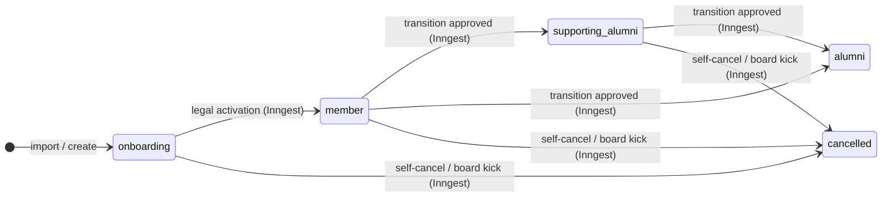

# feat: Membership lifecycle transitions — cancelled, alumni, and supporting-alumni flows

## Summary

Thirteen implementation units across schema, infrastructure helpers, two Inngest workflows, server actions, and UI — delivering the full suite of member exit and graduation transitions (cancelled, alumni, supporting-alumni). The implementation extends existing patterns throughout: `cancelOn` config on admission workflows, `step.waitForEvent` for approval steps, `archiveLegalDocument` for PDF archival, and `EmailShell` for all new emails. A dedicated null-safety unit addresses the TypeScript implications of making `user.email` and `user.personalEmail` nullable.

---

## Problem Frame

The cockpit handles entry into membership but has no supported path for leaving or graduating. Alumni, supporting-alumni, and cancellation transitions currently require manual off-system steps, leave GoCardless mandates open, leave Google Workspace accounts active, and produce no audit PDF. This plan implements the full exit and graduation lifecycle. See origin document for full context.

---

## Requirements

Carried from origin (`docs/brainstorms/2026-05-21-membership-transitions-requirements.md`):

- R1–R5. Self-cancellation with personal email collection, 7-day acknowledgement step, pending card on membership page, self-retraction
- R6–R7. Board-initiated removal (immediate, no pending state), reason recorded
- R8–R15. Cancellation execution: GoCardless mandate cancelled, Google account suspended then hard-deleted after 7 days, sessions revoked, status transition atomic, PDF generated + archived, data erasure (name kept), cancelled users hidden from non-admin views
- R16–R26. Alumni/supporting-alumni request flow: self-service with dept head/board approval, request flow with options + "stay connected?" step, alumni execution (Google + mandate + erasure), supporting-alumni execution (dept + status only)
- R27–R31. All new emails use `EmailShell`; 8 new member-facing and approver-facing templates; all export `PreviewProps`
- R32–R33. Schema: `cancelled` added to `user_status` enum; `user.email` and `user.personalEmail` made nullable

**Origin actors:** A1 (Member), A2 (Department head), A3 (Legal board member), A4 (Admin)
**Origin flows:** F1 (Self-cancellation), F2 (Board-initiated removal), F3 (Alumni/supporting-alumni request)
**Origin acceptance examples:** AE1 (R3, R4 — 7-day acknowledgement timeout), AE2 (R5 — self-retraction), AE3 (R21, R22 — rejection + re-request), AE4 (R19, R23 — opt-out of stay-connected), AE5 (R6, R15 — board kick), AE6 (R26, R24 — supporting-alumni execution)

---

## Scope Boundaries

- GoCardless subscription lookup or cancellation — not needed; charges are manual/cron-driven, mandate cancellation is sufficient
- GoCardless customer deletion — mandate cancellation sufficient; customer record preserved for audit trail
- `syncGoogleWorkspaceUserNameWorkflow` cancellation awareness — name changes don't occur during cancellation
- Historical `membershipPayments` cycle records — preserved after cancellation as audit trail
- Re-admission / reversal paths
- Automated enforcement of 1-year alumni eligibility

### Deferred to Follow-Up Work

- `supporting_alumni → member` re-promotion path — separate future feature
- Alumni-community newsletter/contact tooling — out of scope; personalEmail retention is the foundation

---

## Context & Research

### Relevant Code and Patterns

- Inngest admission workflow pattern: `src/inngest/membership-admission-workflow.ts` — `step.run`, `step.waitForEvent` with timeout, `step.sendEvent`; `cancelOn` config for declarative run cancellation
- Inngest function registry: `src/inngest/index.ts` — all new workflows must be added here
- Inngest event definitions: `src/lib/inngest.ts` — all new event names must be registered here
- Atomic legal-membership activation pattern: `activate-legal-membership` step in admission workflow — single transaction updating `legalMembership`, `user.legalMembershipState`, and `user.status`
- PDF generation: `src/lib/legal-documents/templates/` — React PDF components; `archiveLegalDocument` in `src/lib/legal-documents/drive-archive.ts`; `@react-pdf/renderer` dynamically imported inside `step.run`
- Drive archival idempotency: `archiveLegalDocument` checks for existing file by name before uploading — safe to replay
- Email sending: `src/lib/email.ts` — `sendEmail({ from, to, subject, react, attachments? })`; `EmailShell` in `src/emails/components/email-shell.tsx`
- Google Workspace helpers: `src/lib/google-workspace/directory.ts` — `getDirectoryClient()` + `DISABLE_GOOGLE_WORKSPACE` guard pattern used in all existing functions
- GoCardless client: `src/lib/gocardless/client.ts` — `gocardless.mandates.cancel(mandateId)` available in SDK v8.1.0; handles already-cancelled mandates by checking status before calling
- Authority lookup: `src/db/authority.ts` — `getPositionAssignments()` returns president/VP/head-of-finance; `src/db/people.ts` — `getDepartmentHeadForDepartment(dept)` returns dept head or null
- Permission evaluation: `src/lib/permissions/evaluate.ts` — `evaluateGlobalAction`; `isLegalOfficer(authority)` checks for president/VP/head-of-finance
- Membership page state: `src/app/(authenticated)/(app)/membership/membership-hero-state.ts`, `membership-notice-state.ts` — driven by `StructuredMembershipState` from `src/lib/membership-status.ts`; existing `"cancelled"` hero variant fires on `legalMembership.status === "cancelled"`
- Session revocation: `session` table in `src/db/schema/auth.ts` has `userId` FK — direct Drizzle delete is the only available mechanism (Better Auth exposes no bulk session revocation API)
- Null-safety concern: `src/schema/onboarding-progress.ts` uses `NonNullable<User["personalEmail"]>`; `src/db/people.ts` types `personalEmail: string` in return shapes; `src/lib/membership-status.ts` picks `personalEmail` from `User`

### Institutional Learnings

- `docs/solutions/architecture-patterns/member-lifecycle-entry-points-and-application-flow-2026-05-10.md` — two-field model (`legalMembershipState` vs `user.status`) is load-bearing; cancellation must transition both fields atomically; `betterAuthUserAdditionalFields` must be updated when adding new status values or they are silently stripped from sessions
- `docs/solutions/architecture-patterns/membership-journey-vs-payment-journey-2026-05-12.md` — GoCardless operations are payment-side, not membership-side; keep in separate `step.run` blocks; GoCardless cancellation must not drive `user.status` changes
- `docs/solutions/conventions/reusable-permission-policy-api-2026-05-02.md` — two distinct `GlobalAction` entries needed (cancel own vs. cancel member); legal membership decisions restricted to legal officers; never rely on client-side permission checks for mutations
- `docs/solutions/conventions/reusable-tone-of-voice-and-wording-decisions-2026-05-02.md` — explain user-visible outcome before system mechanism; never surface GoCardless or Google Workspace in member-facing copy

---

## Key Technical Decisions

- **`cancelOn` for in-flight admission runs**: The Inngest SDK has no imperative `cancelRun()` API. Cancellation works by adding a `cancelOn` config block that fires when a named cancel event arrives with a matching `legalMembershipId`. The `inngestRunId` field on `legalMembership` is available for logging but is not used for cancellation.
- **Single cancellation workflow, `requiresAcknowledgement` flag**: Board-kick and self-cancellation use the same Inngest function. The event payload carries a boolean that controls whether the acknowledgement `step.waitForEvent` fires. This avoids duplicating the heavy execution steps.
- **Session revocation split by initiator**: Board-kick revokes sessions synchronously in the server action (immediate access cutoff). Self-cancellation revokes inside the Inngest execution step (member retains access during the pending period).
- **Personal email cached in workflow before erasure**: The first `step.run` in the cancellation workflow reads and caches `personalEmail` and `firstName`. Data erasure (which nulls `personalEmail`) runs later, after PDF generation and email delivery have consumed the cached values.
- **Data erasure before the 7-day sleep, `user.email` nulled after**: PII fields (`personalEmail`, `phone`, address, `birthDate`) are erased in the execution step. The start email (`user.email`) remains set during the 7-day suspension window and is nulled in the final step, after the Google Workspace account is hard-deleted.
- **GoCardless: cancel mandate only, no subscription lookup**: Charges are manual (cron-driven proposals), not subscription-based. Cancelling the mandate prevents any future billing. `gocardless.mandates.cancel` is idempotent when the mandate is already cancelled.
- **`membershipTransitionRequest` table for pending state**: Pending cancellation and alumni requests are tracked here, not as new `legalMembership.status` values. This keeps the legal membership state machine clean and provides a simple FK query for the membership page pending card.
- **Type narrowing utilities, not `!` or `as`**: Making `email`/`personalEmail` nullable will produce type errors across active-member flows. A dedicated unit adds narrowing helpers (e.g., `assertActiveMemberEmail(user)` returning a narrowed type) so downstream code compiles without unsafe assertions.

---

## Open Questions

### Resolved During Planning

- **Inngest run cancellation mechanism**: Use `cancelOn` config — no imperative cancel API exists in Inngest SDK 4.4.0
- **GoCardless subscription handling**: No lookup needed — charges are manual/cron; cancel mandate directly
- **Session revocation API**: Direct Drizzle delete on `session` table by `userId` — Better Auth exposes no bulk revocation endpoint
- **Dept head / board fallback**: `getDepartmentHeadForDepartment(user.department)` → null → `getPositionAssignments().president` as canonical fallback
- **Acknowledgement timeout behaviour**: Inngest returns `null` on `step.waitForEvent` timeout (same as admission workflow). The cancellation workflow treats `null` and an explicit acknowledgement identically — both proceed to execution.
- **Alumni request timeout handling**: 30-day timeout marks the transition request as `"expired"` and sends a `MembershipTransitionRejectedEmail` (or a dedicated expiry variant) to the member. No status change occurs.
- **`personalEmail` update timing**: The server action must update `user.personalEmail` in the DB before calling `inngest.send()`. Verified against `submit-application-action.ts` (lines 104–155) — the existing convention always commits the DB transaction before firing Inngest. The request actions in U11 must follow the same order.

### Deferred to Implementation

*(none — all resolved)*

---

## High-Level Technical Design

> *This illustrates the intended approach and is directional guidance for review, not implementation specification.*

### User status state machine (new transitions in bold)



### Cancellation workflow (shared for self-service + board-kick)

```
Event: membership/cancellation.requested
  │
  ├─ [requiresAcknowledgement = true]
  │   step: send acknowledgement notification to dept head / board
  │   step.waitForEvent("acknowledgement", timeout: 7d) ──► proceed on timeout or ack
  │
  ├─ [requiresAcknowledgement = false] ──────────────────────► proceed immediately
  │
  ▼
step: read + cache user data (personalEmail, name, mandateId)
step: DB transaction — status transition + session revocation
step: suspend Google Workspace account
step: cancel GoCardless mandate (if mandateId present)
step: generate + archive transition PDF
step: send cancellation confirmation to cached personalEmail
step: fire cockpitUserUpdated (group reconciliation)
step: erase personal data (personalEmail, phone, address, birthDate, department, GoCardless IDs)
step.sleep("7d")
step: hard-delete Google Workspace account
step: null user.email (start email)
```

### Alumni transition workflow

```
Event: membership/transition.requested
  │
  step: send approval request to dept head / board
  step.waitForEvent("decision", timeout: 30d)
  │
  ├─ timeout / rejected ──► mark request; notify member; end
  │
  └─ approved
      ├─ [supporting_alumni_request]
      │   step: DB — status → supporting_alumni, department → null
      │   step: send supporting-alumni confirmed email
      │   step: fire cockpitUserUpdated
      │
      └─ [alumni_request]
          (same execution steps as cancellation workflow, alumni variant)
```

---

## Implementation Units

### U1. Schema — enum, nullable fields, transition request table

**Goal:** Lay the DB foundation all other units depend on.

**Requirements:** R32, R33

**Dependencies:** None

**Files:**
- Modify: `src/db/schema/auth.ts` — add `cancelled` to `user_status` enum; make `email` and `personalEmail` nullable
- Create: `src/db/schema/membership-transition-request.ts` — new table with `id`, `userId` FK, `type` enum (`cancellation | alumni_request | supporting_alumni_request`), `status` enum (`pending | acknowledged | retracted | expired | executed`), `reason` enum (`resigned | removed_by_board`), `keepPersonalEmail` boolean nullable, `personalEmailForNotification` text nullable, `requestedAt`, `decidedAt`, `decidedByUserId` nullable FK
- Modify: `src/db/schema/index.ts` — add relations for new table
- Modify: `src/db/schema/auth-fields.ts` — add `cancelled` to the `status` field declaration so Better Auth includes it in session data
- Modify: `src/lib/user-status.ts` — add `cancelled` entry to `USER_STATUS_INFO`
- Generated: `src/db/migrations/` — via `npm run db:generate` then `npm run db:migrate`

**Approach:**
- The `cancelled` enum value in `user_status` must be added via Drizzle schema change → `db:generate` → `db:migrate`. Never manually edit the migration file.
- `user.email` and `user.personalEmail` become `text("...").nullable()` — remove `.notNull()`. Both are currently typed as non-null strings in all Drizzle `InferSelectModel` derived types; this change cascades to all callers (handled in U2).
- The `membershipTransitionRequest.status` enum uses `executed` rather than `approved` as the terminal state: a request can be approved (decision made) but fail during execution; `executed` signals the Inngest workflow completed successfully.
- The `betterAuthUserAdditionalFields` update is critical — omitting it causes the new `cancelled` status to be silently stripped from the session at runtime (see institutional learning).

**Patterns to follow:**
- `src/db/schema/legal-membership.ts` — pg enum + table structure
- `src/db/schema/auth-fields.ts` — existing field declarations pattern

**Test scenarios:**
- Happy path: `UserStatus` TypeScript type includes `"cancelled"` after schema change
- Edge case: Drizzle migration runs cleanly with no data loss on existing rows (all existing users have non-null email/personalEmail; migration is backward-safe)
- Happy path: `USER_STATUS_INFO` map has an entry for `"cancelled"`

**Verification:**
- `npm run db:migrate` succeeds with no errors
- `npm run lint` passes on all modified schema files
- TypeScript type `UserStatus` includes `"cancelled"`

---

### U2. TypeScript null-safety for nullable email fields

**Goal:** Fix all type errors and runtime assumptions that break when `user.email` and `user.personalEmail` become nullable.

**Requirements:** R32, R33 (implementation consequence)

**Dependencies:** U1

**Files:**
- Create: `src/lib/user-assertions.ts` — type narrowing utilities
- Modify: `src/schema/onboarding-progress.ts` — `NonNullable<User["personalEmail"]>` usage
- Modify: `src/db/people.ts` — return type shapes that assert `personalEmail: string`
- Modify: `src/lib/membership-status.ts` — `MembershipStatusUser` pick includes `personalEmail`
- Modify: `src/lib/gocardless/membership-flow-helpers.ts` — if `personalEmail` is used for GoCardless prefill
- Modify: any other callers identified by TypeScript compiler errors after U1

**Approach:**
- Create narrowing utilities such as `assertHasEmail(user)` and `assertHasPersonalEmail(user)` that perform runtime checks and narrow the type — returning a typed object where those fields are `string`, not `string | null`. These functions throw (with a descriptive message) if called on a cancelled/alumni user where the field is null, making misuse loud.
- Active-member flows (onboarding progress, GoCardless prefill, email sending) call these utilities at the boundary rather than adding `!` to every access.
- Admin-facing queries that return lists of users (including potentially cancelled ones) must reflect `personalEmail: string | null` in their return types — no false narrowing.
- `onboarding-progress.ts` uses a custom `NonNullable<User["personalEmail"]>` input type — this can stay as a narrowed input constraint, meaning callers must ensure non-null before passing in. Update the caller in `getStructuredMembershipState` to guard before calling.

**Patterns to follow:**
- TypeScript discriminated unions or predicate functions rather than type casts

**Test scenarios:**
- Happy path: `assertHasEmail(activeUser)` returns the user with `email: string` (narrowed)
- Error path: `assertHasEmail(cancelledUser)` where `email` is null throws with a descriptive message
- Happy path: `npm run lint` produces no TypeScript errors after U1 + U2 applied together
- Edge case: admin directory query that fetches cancelled users types `personalEmail` as `string | null` throughout

**Verification:**
- `npm run lint` passes with zero TypeScript errors
- No `!` or `as` assertions added to any file touched by this unit

---

### U3. Inngest event registration + `cancelOn` config

**Goal:** Register all new Inngest events and wire `cancelOn` so in-flight admission runs are automatically cancelled when a cancellation is requested.

**Requirements:** R12 (in-flight workflow cancellation)

**Dependencies:** U1

**Files:**
- Modify: `src/lib/inngest.ts` — register 6 new events
- Modify: `src/inngest/membership-admission-workflow.ts` — add `cancelOn` config
- Modify: `src/inngest/membership-reconfirmation-workflow.ts` — add `cancelOn` config

**Approach:**
- New events to register: `membership/cancellation.requested`, `membership/cancellation.retracted`, `membership/cancellation.acknowledged`, `membership/transition.requested`, `membership/transition.retracted`, `membership/transition.decided`
- `cancelOn` on both admission workflows: match on `userId` carried in the cancel event. The cancel event payload must include the `userId` so the `if` expression can match the running workflow's subject. Using `userId` (vs. `legalMembershipId`) is safer here because the cancellation workflow is user-scoped, not tenure-scoped.
- The cancellation Inngest workflow (U9) also carries its own `cancelOn` for retractions — that is defined in U9.

**Patterns to follow:**
- Existing `step.waitForEvent` `if` expression pattern in `membership-admission-workflow.ts`

**Test scenarios:**
- Integration: admission workflow in `admission_pending` state receives `membership/cancellation.requested` event with matching `userId` → workflow is cancelled (Inngest `cancelOn` fires)
- Edge case: admission workflow receives cancellation event with a different `userId` → workflow continues unaffected

**Verification:**
- Inngest dev server shows both admission + reconfirmation workflows with `cancelOn` configuration visible

---

### U4. Permission actions for cancellation and transitions

**Goal:** Add new `GlobalAction` entries so server actions can gate on the correct authority.

**Requirements:** R1, R6, R16 (authorization gates)

**Dependencies:** None

**Files:**
- Modify: `src/lib/permissions/evaluate.ts` — add 4 new `GlobalAction` cases
- Modify: `src/lib/permissions/permissions.test.ts` — add allow/deny test cases for each new action

**Approach:**
- Four new actions:
  - `"membership.cancel_own"` — any active member (any status) can cancel their own membership; checked in self-cancellation server action
  - `"membership.cancel_member"` — legal officers only (president / VP / head of finance); checked in board-kick server action
  - `"membership.cancellation.acknowledge"` — legal officers AND department heads; checked in the acknowledgement server action
- All new evaluations follow the existing `isLegalOfficer(authority)` and `isActiveAuthorityStatus(authority.status)` guards.
- `"membership.cancel_own"` must check `authority.userId === targetUserId` — a member can only cancel themselves.

**Patterns to follow:**
- `src/lib/permissions/evaluate.ts` — existing `evaluateGlobalAction` switch structure
- `src/lib/permissions/permissions.test.ts` — existing allow/deny test matrix

**Test scenarios:**
- Happy path: president calling `"membership.cancel_member"` → allowed
- Error path: a regular member calling `"membership.cancel_member"` → denied
- Happy path: member calling `"membership.cancel_own"` with `targetUserId === self` → allowed
- Error path: member calling `"membership.cancel_own"` with `targetUserId !== self` → denied
- Happy path: dept head calling `"membership.transition.decide"` for a member in their department → allowed
- Error path: dept head calling `"membership.transition.decide"` for a member in a different department → denied

**Verification:**
- All new test cases pass with `npm run lint`

---

### U5. Google Workspace suspension + deletion helpers

**Goal:** Expose `suspendWorkspaceUser` and `deleteWorkspaceUser` from the existing directory helper module.

**Requirements:** R9 (Google account suspension then hard-delete)

**Dependencies:** None

**Files:**
- Modify: `src/lib/google-workspace/directory.ts` — add two exported functions

**Approach:**
- `suspendWorkspaceUser(email)`: calls `admin.users.update({ userKey: email, requestBody: { suspended: true } })`. Apply the `DISABLE_GOOGLE_WORKSPACE` guard with a `console.warn` log. Returns void. If the account is already suspended, the Admin SDK call is a no-op.
- `deleteWorkspaceUser(email)`: calls `admin.users.delete({ userKey: email })`. Apply the `DISABLE_GOOGLE_WORKSPACE` guard. Handle the 404 case gracefully (account already deleted) — same pattern as `getWorkspaceUser`.
- Both functions use `getDirectoryClient()` (already in scope in the file) and `DIRECTORY_SCOPE` (already provisioned).

**Patterns to follow:**
- `updateWorkspaceUserName` in `src/lib/google-workspace/directory.ts` — `DISABLE_GOOGLE_WORKSPACE` guard, `getDirectoryClient()`, error handling pattern

**Test scenarios:**
- Happy path: `suspendWorkspaceUser` calls Admin SDK with `suspended: true` when `DISABLE_GOOGLE_WORKSPACE` is false
- Happy path: `DISABLE_GOOGLE_WORKSPACE = true` → logs warning, returns without calling SDK
- Edge case: `deleteWorkspaceUser` called when account already deleted (404 from Google) → resolves without throwing
- Edge case: `suspendWorkspaceUser` called on an already-suspended account → resolves without throwing

**Verification:**
- Functions are exported and callable; `DISABLE_GOOGLE_WORKSPACE = true` path logs and returns cleanly

---

### U6. GoCardless mandate cancellation helper

**Goal:** Add an idempotent mandate cancellation function to the GoCardless module.

**Requirements:** R8 (GoCardless mandate cancelled)

**Dependencies:** None

**Files:**
- Create: `src/lib/gocardless/membership-cancellation.ts`

**Approach:**
- `cancelMembershipMandate(mandateId)`: calls `gocardless.mandates.cancel(mandateId)`. Check the mandate's current status before calling: if already `"cancelled"`, `"failed"`, `"expired"`, or `"blocked"`, return early without calling the API. This makes the step idempotent — safe on Inngest replay.
- Returns void. Does not touch `user` table — GoCardless IDs are nulled in the DB erasure step of the cancellation workflow (U9), not here.

**Patterns to follow:**
- `src/lib/gocardless/membership-flow.ts` — GoCardless client usage, error handling

**Test scenarios:**
- Happy path: calls `gocardless.mandates.cancel` when mandate is in `"active"` status
- Edge case: mandate already in `"cancelled"` status → returns early, no SDK call
- Edge case: mandate not found (null `mandateId`) — caller is responsible for null check before calling

**Verification:**
- Function exported and callable; already-cancelled mandate does not trigger an API call

---

### U7. PDF template for membership transitions

**Goal:** Create the React PDF template used for both cancellation and alumni transition confirmation documents.

**Requirements:** R14, R23 (PDF generated + archived)

**Dependencies:** None

**Files:**
- Create: `src/lib/legal-documents/templates/membership-transition.tsx`

**Approach:**
- React PDF component (`@react-pdf/renderer`) following the structure of `admission-confirmation.tsx`.
- Props: `{ firstName, lastName, transitionType: "cancelled" | "alumni" | "supporting_alumni", transitionDate, reason?: "resigned" | "removed_by_board" }`.
- Content: member name, transition type in human-readable form, legally formatted date, association details from `brand.ts`, note that this document serves as the official record of membership end.
- The `archiveLegalDocument` function from `src/lib/legal-documents/drive-archive.ts` is called by the Inngest workflow steps (U9, U10) to save the rendered PDF to Drive — not inside this template file.

**Patterns to follow:**
- `src/lib/legal-documents/templates/admission-confirmation.tsx` — React PDF structure, `brand.ts` usage, `shared.tsx` helpers

**Test scenarios:**
- Happy path: template renders to a non-empty buffer for `transitionType = "cancelled"` with valid props
- Happy path: template renders for `transitionType = "alumni"` without errors
- Edge case: `reason` is undefined → renders without a reason line (not all transitions have an explicit reason)

**Verification:**
- `renderToBuffer(renderMembershipTransitionTemplate({ ... }))` produces a valid PDF buffer

---

### U8. Email templates

**Goal:** Add 8 new email templates for all transition notification paths.

**Requirements:** R27–R31

**Dependencies:** None

**Files:**
- Create: `src/emails/membership-cancellation-requested.tsx`
- Create: `src/emails/membership-cancellation-acknowledgement-needed.tsx`
- Create: `src/emails/membership-cancelled.tsx`
- Create: `src/emails/membership-transition-requested.tsx`
- Create: `src/emails/membership-transition-approval-needed.tsx`
- Create: `src/emails/membership-transition-rejected.tsx`
- Create: `src/emails/membership-alumni-confirmed.tsx`
- Create: `src/emails/membership-supporting-alumni-confirmed.tsx`

**Approach:**
- All 8 templates wrap content in `EmailShell` with an appropriate `eyebrow` (e.g., `"Membership"`) and `footerAudience` (`"board"` for the two approver-facing templates, `"member"` for the rest).
- Member-facing templates sent to personal email (the workflow passes `personalEmailForNotification`, not the start email).
- Approver-facing templates (`membership-cancellation-acknowledgement-needed`, `membership-transition-approval-needed`) include an `EmailCta` linking to the relevant admin page and a brief `EmailDetailBlock` showing the member's name and request date.
- Copy follows the tone-of-voice convention: outcome before mechanism; no GoCardless or Google Workspace terminology; warm-but-direct voice.
- All 8 templates export `PreviewProps` with realistic dummy data.

**Approver templates**:
- `membership-cancellation-acknowledgement-needed`: "X has requested to cancel their START Berlin membership. Please acknowledge this request in START Cockpit so we can process the transition." + CTA to the person's admin page.
- `membership-transition-approval-needed`: "X has requested to become a [supporting alumni / alumni]. Please review and approve or decline in START Cockpit." + CTA.

**Member templates** (representative copy intent — exact wording to be finalized during implementation):
- `membership-cancellation-requested`: "We received your request to end your START Berlin membership. Your request is being reviewed. You can cancel this request in START Cockpit."
- `membership-cancelled`: "Your START Berlin membership has ended. [For alumni opt-in path: we'll stay in touch at this email.]"
- `membership-transition-requested`: "We received your request to [become a supporting alumni / leave as alumni]."
- `membership-transition-rejected`: "Your transition request was not approved at this time. You can submit a new request when you're ready."
- `membership-alumni-confirmed`: "Your START Berlin membership has ended. [Stay-connected variant: we'll be in touch at this email for alumni news.]"
- `membership-supporting-alumni-confirmed`: "You're now a Supporting Alumni of START Berlin. You'll still be invited to events and community activities."

**Patterns to follow:**
- `src/emails/membership-admission-confirmed.tsx` — `EmailShell`, `EmailCta`, `EmailStatusBadge`, `PreviewProps` pattern
- `src/emails/board-resolution-task-assigned.tsx` — `footerAudience="board"` pattern

**Test scenarios:**
- Happy path: all 8 templates render without error via `npm run email:dev`
- Happy path: approver templates render with `footerAudience="board"` footer copy
- Edge case: `membership-alumni-confirmed` renders correctly for both stay-connected and fully-deleted variants (either via a prop or two separate renders)

**Verification:**
- `npm run email:dev` shows all templates without errors; `PreviewProps` are realistic

---

### U9. Cancellation Inngest workflow

**Goal:** Implement the Inngest workflow that executes membership cancellation for both self-service (with acknowledgement step) and board-kick (immediate) paths.

**Requirements:** R3, R4, R8–R15 (cancellation execution)

**Dependencies:** U1, U3, U5, U6, U7, U8

**Files:**
- Create: `src/inngest/membership-cancellation-workflow.ts`
- Modify: `src/inngest/index.ts` — register new workflow

**Approach:**
- Triggered by `membership/cancellation.requested`. Event payload includes: `userId`, `legalMembershipId` (nullable — for `cancelOn` in admission workflow), `transitionRequestId` (for self-service flows), `requiresAcknowledgement` boolean, `reason` (`"resigned" | "removed_by_board"`).
- `cancelOn: [{ event: "membership/cancellation.retracted", if: "async.data.transitionRequestId == event.data.transitionRequestId" }]` — fires when member retracts a self-service request.
- Step sequence:
  1. `"read-user-data"`: read `userId` → cache `personalEmail`, `name`, `gocardlessMandateId`, `startEmail` for use after erasure. Also read transition request row.
  2. Conditional: if `requiresAcknowledgement` → `"send-acknowledgement-notification"` (email to dept head/board) → `step.waitForEvent("wait-for-acknowledgement", { timeout: "7d" })`. Proceed whether acknowledged or timed out (timeout = automatic proceeding per R4).
  3. `"execute-cancellation-transaction"`: single DB transaction — `legalMembership.status → "cancelled"`, `legalMembership.endedAt = now`, `user.legalMembershipState → "former_member"`, `user.status → "cancelled"`. Also `db.delete(session).where(userId)` within the same transaction scope.
  4. `"suspend-google-account"`: call `suspendWorkspaceUser(cachedStartEmail)`.
  5. `"cancel-gocardless-mandate"`: if `cachedMandateId` — call `cancelMembershipMandate`. Then null `user.gocardlessMandateId`, `user.gocardlessCustomerId`, `user.gocardlessSetupSessionId`.
  6. `"generate-and-archive-pdf"`: dynamic import `@react-pdf/renderer`, render `MembershipTransitionTemplate`, call `archiveLegalDocument`. Cache returned `driveFileId`.
  7. `"send-cancellation-email"`: `sendEmail` to cached `personalEmail` using `MembershipCancelledEmail`.
  8. `"fire-group-reconciliation"`: `step.sendEvent` for `cockpitUserUpdated`.
  9. `"erase-personal-data"`: null `user.personalEmail`, `user.phone`, `user.street`, `user.city`, `user.state`, `user.zip`, `user.country`, `user.birthDate`, `user.department`, `user.memberSinceDate`. Update transition request status to `"executed"`.
  10. `step.sleep("7d")`.
  11. `"hard-delete-google-account"`: call `deleteWorkspaceUser(cachedStartEmail)`.
  12. `"null-start-email"`: set `user.email = null`.

**Execution note:** Each external call (Google, GoCardless, Drive, email) lives in its own `step.run` block for independent retry isolation. DB mutations that must be atomic are co-located in a single transaction within one `step.run`.

**Patterns to follow:**
- `src/inngest/membership-admission-workflow.ts` — `step.run`, `step.waitForEvent`, `step.sendEvent`, `cancelOn` pattern
- `activate-legal-membership` transaction pattern from the same file

**Test scenarios:**
- Happy path: `requiresAcknowledgement = false` — workflow executes all steps without waiting; user ends with `status = "cancelled"`, `legalMembershipState = "former_member"`, no active sessions, mandate cancelled, personal data erased
- Happy path: `requiresAcknowledgement = true`, dept head acknowledges → workflow proceeds to execution after ack
- Edge case: `requiresAcknowledgement = true`, 7-day timeout → workflow proceeds automatically (R4)
- Edge case: `requiresAcknowledgement = true`, member retracts before ack → `cancelOn` fires, workflow is cancelled, no execution steps run (Covers AE2)
- Edge case: `gocardlessMandateId` is null (member never set up payment) → mandate cancellation step is skipped cleanly
- Edge case: Google account already suspended when step runs → `suspendWorkspaceUser` is idempotent, no error
- Integration: after workflow completes, `cockpitUserUpdated` event fires → group reconciliation removes user from all groups

**Verification:**
- User in `cancelled` state has no active sessions, no GoCardless IDs, no personal data (name preserved), `user.email` null after day-7 step, `legalMembership.status = "cancelled"` with `endedAt` set

---

### U10. Alumni / supporting-alumni transition Inngest workflow

**Goal:** Implement the Inngest workflow for dept-head-approved alumni and supporting-alumni transitions.

**Requirements:** R20–R26 (transition execution and approval flow)

**Dependencies:** U1, U3, U5, U6, U7, U8

**Files:**
- Create: `src/inngest/membership-transition-workflow.ts`
- Modify: `src/inngest/index.ts` — register new workflow

**Approach:**
- Triggered by `membership/transition.requested`. Payload: `userId`, `transitionRequestId`, `type` (`"alumni_request" | "supporting_alumni_request"`), `keepPersonalEmail` boolean.
- `cancelOn: [{ event: "membership/transition.retracted", if: "async.data.transitionRequestId == event.data.transitionRequestId" }]`.
- Step sequence:
  1. `"read-request-data"`: read transition request + user data; determine approver (dept head or president fallback).
  2. `"send-approval-request"`: email to approver using `MembershipTransitionApprovalNeededEmail`.
  3. `step.waitForEvent("wait-for-decision", { event: "membership/transition.decided", timeout: "30d", if: "async.data.transitionRequestId == event.data.transitionRequestId" })`.
  4. If timeout → update transition request to `"expired"`, send expiry notification to member, end.
  5. If `decision = "rejected"` → update request to `"rejected"`, send `MembershipTransitionRejectedEmail`, end.
  6. If `decision = "approved"` and type is `"supporting_alumni_request"`:
     - `"execute-supporting-alumni-transition"`: DB transaction — `user.status → "supporting_alumni"`, `user.department → null`; update transition request to `"executed"`.
     - `"send-supporting-alumni-email"`.
     - `"fire-group-reconciliation"`.
  7. If `decision = "approved"` and type is `"alumni_request"`:
     - Same execution steps as U9 (steps 1–12), using alumni variants of the email and PDF template. `keepPersonalEmail` controls whether `personalEmail` is erased in step 9.

**Patterns to follow:**
- `src/inngest/membership-admission-workflow.ts` — board vote loop pattern with `step.waitForEvent`

**Test scenarios:**
- Happy path: supporting-alumni request approved → `user.status = "supporting_alumni"`, `user.department = null`, email sent, group reconciliation fired; Google account unchanged; GoCardless mandate unchanged (Covers AE6)
- Happy path: alumni request approved with `keepPersonalEmail = true` → `user.personalEmail` preserved; confirmation email sent; Google account suspended then deleted; mandate cancelled (Covers AE4 partial)
- Happy path: alumni request approved with `keepPersonalEmail = false` → `user.personalEmail` nulled after email sent (Covers AE4)
- Error path: dept head rejects request → `transition_request.status = "rejected"`, rejection email sent to member, no status change (Covers AE3)
- Edge case: 30-day timeout → transition request marked `"expired"`, member receives notification email, workflow ends cleanly with no status change
- Edge case: member retracts before dept head decides → `cancelOn` fires, no transition executed (Covers AE2 pattern)

**Verification:**
- Alumni user: `legalMembershipState = "former_member"`, `status = "alumni"`, Google suspended, mandate cancelled, PDF archived
- Supporting alumni user: `status = "supporting_alumni"`, `department = null`, Google account and mandate untouched

---

### U11. Server actions and transition request DB queries

**Goal:** Implement the application layer — DB queries for transition requests, and server actions for all initiators (member self-service, board-kick, approver decisions).

**Requirements:** R1, R2, R3, R5, R6, R16, R17, R20, R21

**Dependencies:** U1, U3, U4

**Files:**
- Create: `src/db/membership-transitions.ts` — DB query layer
- Create: `src/app/(authenticated)/(app)/membership/request-cancellation-action.ts`
- Create: `src/app/(authenticated)/(app)/membership/retract-cancellation-action.ts`
- Create: `src/app/(authenticated)/(app)/membership/request-transition-action.ts`
- Create: `src/app/(authenticated)/(app)/membership/retract-transition-action.ts`
- Create: `src/app/(authenticated)/(app)/admin/people/directory/[id]/board-kick-action.ts`
- Create: `src/app/(authenticated)/(app)/admin/people/directory/[id]/acknowledge-cancellation-action.ts`
- Create: `src/app/(authenticated)/(app)/admin/people/directory/[id]/decide-transition-action.ts`

**Approach:**

DB queries (`src/db/membership-transitions.ts`):
- `createTransitionRequest(...)` — inserts a row; idempotent guard prevents duplicate pending requests for the same user
- `getActiveMembershipTransitionRequest(userId)` — returns the first row with `status IN ("pending", "acknowledged")`; used by the membership page to show the pending card
- `updateTransitionRequestStatus(id, status, decidedByUserId?)` — used by server actions and Inngest callback handlers
- `retractTransitionRequest(id)` — sets `status = "retracted"`; called by retraction server actions

Server actions:
- `requestCancellationAction`: validates `membership.cancel_own`, confirms `personalEmail` updated if provided, creates transition request row, fires `membership/cancellation.requested` with `{ requiresAcknowledgement: true, ... }`.
- `retractCancellationAction`: validates ownership of request, calls `retractTransitionRequest`, fires `membership/cancellation.retracted` (triggers Inngest `cancelOn`).
- `requestTransitionAction`: creates transition request (with `keepPersonalEmail`, `personalEmailForNotification`), updates `user.personalEmail` if provided, fires `membership/transition.requested`.
- `retractTransitionAction`: validates ownership, retracts, fires `membership/transition.retracted`.
- `boardKickAction` (admin path): validates `membership.cancel_member`, **synchronously** revokes sessions via `db.delete(session).where(eq(session.userId, targetUserId))`, creates transition request with `reason = "removed_by_board"`, fires `membership/cancellation.requested` with `{ requiresAcknowledgement: false }`.
- `acknowledgeCancellationAction` (admin path): validates `membership.cancellation.acknowledge`, updates transition request to `"acknowledged"`, fires `membership/cancellation.acknowledged`.
- `decideTransitionAction` (admin path): validates `membership.transition.decide`, fires `membership/transition.decided` with decision payload; if rejected, also calls `updateTransitionRequestStatus`.

All server actions use `next-safe-action` and Zod schemas. Errors follow the shared error pattern from the tone-of-voice convention.

**Patterns to follow:**
- `src/app/(authenticated)/(app)/membership/start-payment-action.ts` — `next-safe-action` pattern
- `src/app/(authenticated)/(app)/admin/people/directory/[id]/impersonate-action.ts` — admin action pattern

**Test scenarios:**
- Happy path: `requestCancellationAction` creates a transition request row with `status = "pending"` and fires the correct Inngest event
- Error path: `requestCancellationAction` called when user already has a pending request → returns validation error
- Happy path: `retractCancellationAction` sets request to `"retracted"` and fires retract event
- Error path: `retractCancellationAction` called on a request owned by a different user → permission denied
- Happy path: `boardKickAction` deletes all sessions for target user synchronously, then fires immediate cancellation event
- Error path: `boardKickAction` called by a non-board-member → permission denied

**Verification:**
- After `requestCancellationAction`, a row exists in `membershipTransitionRequest` with `status = "pending"`
- After `boardKickAction`, all `session` rows for the target user are deleted before the action returns

---

### U12. Membership state and page UI

**Goal:** Update `getStructuredMembershipState`, hero/notice state derivation, and the membership page to handle cancelled/alumni users and show pending transition request cards.

**Requirements:** R5, R15, R20 (membership page pending card + cancel button), R16 (request flow UI)

**Dependencies:** U1, U2, U11

**Files:**
- Modify: `src/lib/membership-status.ts` — extend `StructuredMembershipState` and `getStructuredMembershipState`
- Modify: `src/app/(authenticated)/(app)/membership/membership-hero-state.ts` — add pending-request variants
- Modify: `src/app/(authenticated)/(app)/membership/membership-notice-state.ts` — add pending-request notice types
- Modify: `src/app/(authenticated)/(app)/membership/page.tsx` — fetch + pass transition request state
- Modify: `src/app/(authenticated)/(app)/membership/onboarding.tsx` — render pending-request card
- Create: `src/app/(authenticated)/(app)/membership/transition-request-card.tsx` — pending request card component
- Create: `src/app/(authenticated)/(app)/membership/request-cancellation-dialog.tsx` — self-cancellation request flow (personal email step + confirmation)
- Create: `src/app/(authenticated)/(app)/membership/request-transition-dialog.tsx` — alumni/supporting-alumni request flow (options step + "stay connected?" step)
- Modify: `src/app/(authenticated)/(app)/membership/loading.tsx` — update skeleton if structure changes

**Approach:**
- `getStructuredMembershipState`: add `pendingTransition: MembershipTransitionRequest | null` to the return type. The page server component queries `getActiveMembershipTransitionRequest(userId)` alongside the membership state and passes it to client components.
- `MembershipTransitionRequestCard`: renders "Your [cancellation / alumni] request is being processed." with a "Cancel request" button that calls the appropriate retraction server action. Shown above the notice block when `pendingTransition` is not null.
- Self-cancellation dialog (multi-step): Step 1 — confirm/update personal email (form with current value pre-filled). Step 2 — confirmation summary ("This will end your START Berlin membership..."). Submit calls `requestCancellationAction`.
- Transition dialog (multi-step): Step 1 — supporting-alumni vs. alumni choice with pros/cons (only shown for `member` → X). Step 2 — for alumni: "Stay connected?" with personal email pre-filled. Step 3 — confirmation. Submit calls `requestTransitionAction`.
- The `cancelled` hero variant already exists in `membership-hero-state.ts` and fires on `legalMembership.status === "cancelled"` — no change needed there. Add a `"transition_pending"` notice type that displays the request-in-progress message.
- `getStructuredMembershipState` should return `paymentSetupAllowed = false` for `cancelled` and `alumni` users (both have `status !== "member"` and `status !== "supporting_alumni"`); existing `isNotAlumni` guard already handles alumni. Add `status !== "cancelled"` check similarly.

**Patterns to follow:**
- `src/app/(authenticated)/(app)/membership/membership-notice-block.tsx` — existing notice type rendering
- Multi-step application flow in `src/app/(authenticated)/(app)/membership/application/[step]/` — step pattern

**Test scenarios:**
- Happy path: member with `pendingTransition.type = "cancellation"` → `TransitionRequestCard` renders with "Cancel request" button
- Happy path: member with no pending request → `TransitionRequestCard` not rendered
- Happy path: cancelled user (`status = "cancelled"`) → `paymentSetupAllowed = false`, hero shows `"cancelled"` variant
- Happy path: alumni user → `paymentSetupAllowed = false`, `payment = "not_required"`, hero shows `"alumni"` variant
- Edge case: cancellation dialog with empty personal email field → form validation prevents submission
- Integration: "Cancel request" button calls retraction action → pending card disappears on reload

**Verification:**
- Member with a pending transition sees the request card on `/membership`
- Cancelled user: membership hero shows "membership ended" variant; payment section hidden; tools section hidden

---

### U13. Admin directory: board-kick UI + cancelled-user visibility

**Goal:** Add the board-kick action to the admin person detail page and ensure cancelled users are handled correctly across people queries.

**Requirements:** R6, R15 (cancelled users hidden from non-admin views; admin can initiate kick)

**Dependencies:** U1, U2, U4, U11

**Files:**
- Modify: `src/app/(authenticated)/(app)/admin/people/directory/[id]/page.tsx` — add "Remove member" action (gated on `membership.cancel_member`)
- Modify: `src/db/people.ts` — exclude `cancelled` users from default directory queries; add `includeFormer` option for admin views
- Modify: any non-admin people queries / route-level filters that currently don't handle `cancelled`

**Approach:**
- The "Remove member" UI: a destructive action button in the person detail page, visible only to legal board members (`membership.cancel_member`). Clicking opens a confirmation dialog asking for a reason (resigned / removed by board), then calls `boardKickAction`.
- `src/db/people.ts`: wherever `status` is not explicitly filtered, add `ne(user.status, "cancelled")` as a default filter. Provide an `includeFormer?: boolean` option on admin-specific queries that bypasses this filter.
- The admin directory (`/admin/people/directory`) should show cancelled users (filter `includeFormer: true`). The public-facing people directory should not.
- Cancelled users shown in admin directory should display a visual indicator (e.g., "Cancelled" status badge) so they are clearly distinguished from active users.

**Patterns to follow:**
- `src/app/(authenticated)/(app)/admin/people/directory/[id]/impersonate-action.ts` — admin action gate pattern

**Test scenarios:**
- Happy path: legal board member visits person detail page → "Remove member" button visible
- Error path: non-board-member visits person detail page → "Remove member" button not visible
- Happy path: public people directory query (`includeFormer: false`) does not return users with `status = "cancelled"`
- Happy path: admin directory query (`includeFormer: true`) returns cancelled users
- Integration: after `boardKickAction` completes, the person no longer appears in the public people directory

**Verification:**
- Cancelled users absent from `/people` and `/groups` member lists; present in admin directory with status indicator

---

## System-Wide Impact

- **Auth session invalidation:** `db.delete(session).where(userId)` must be imported from `src/db/schema/auth` — confirm the `session` table is exported from the schema index and accessible in server actions / Inngest steps
- **Group reconciliation:** `cockpitUserUpdated` must fire after any status change; the existing `reconcileUserGroupMembershipWorkflow` handles removing cancelled/alumni users from groups whose criteria include only active statuses — but only if the group's criteria are configured accordingly. Groups that use no criteria (manually managed) will not auto-remove the user.
- **`betterAuthUserAdditionalFields`:** The `cancelled` status value must be declared here before any active user can have that status — failing to do so silently strips it from the session, breaking the `user.status` check everywhere it's used client-side.
- **Nullable `user.email`:** The Better Auth session currently always has a non-null email. After U1, the session schema should still carry the start email while it's active (pre-null), but once nulled (day 7), any session lookup returning this user will have `email = null`. Confirm this doesn't break Better Auth's session serialization.
- **Error propagation in Inngest:** Each step is independently retried. Steps 4–12 in the cancellation workflow must be idempotent — suspending an already-suspended account, cancelling an already-cancelled mandate, uploading an already-archived PDF must all be no-ops. `archiveLegalDocument` is already idempotent by filename check.
- **Unchanged invariants:** `legalMembershipState !== "active_member"` continues to gate `paymentSetupAllowed`. Alumni and cancelled users will naturally fall through this check. No change needed in `getStructuredMembershipState` for the payment gate — only the UI sections and hero state need explicit cancelled handling.

---

## Risks & Dependencies

| Risk | Mitigation |
|------|------------|
| `cancelOn` event not matching in-flight admission workflow | Use `userId` in the cancel event payload matching the admission workflow's event data; verify in Inngest dev server |
| Better Auth session remains valid after `session` table delete | Better Auth reads sessions from DB on each request — row deletion is immediate; no in-memory cache to invalidate |
| `user.email = null` breaks Better Auth session serialization at day 7 | The session row is already deleted before day 7; no active session will encounter a null email. Verify in testing. |
| Inngest replay executes data erasure twice | `step.run` result is cached after first success; erasure step is idempotent (setting null fields to null again is a no-op) |
| Dept head lookup returns null and no board fallback exists | `getPositionAssignments()` fallback to `president` — if president is also unset, log a warning and skip the notification; cancellation still proceeds |
| GoCardless mandate cancellation fails with transient error | Inside `step.run` — Inngest retries automatically; `cancelMembershipMandate` handles already-cancelled state |

---

## Sources & References

- **Origin document:** `docs/brainstorms/2026-05-21-membership-transitions-requirements.md`
- Lifecycle architecture: `docs/solutions/architecture-patterns/member-lifecycle-entry-points-and-application-flow-2026-05-10.md`
- Payment/membership independence: `docs/solutions/architecture-patterns/membership-journey-vs-payment-journey-2026-05-12.md`
- Permission convention: `docs/solutions/conventions/reusable-permission-policy-api-2026-05-02.md`
- Tone of voice: `docs/solutions/conventions/reusable-tone-of-voice-and-wording-decisions-2026-05-02.md`
- Admission workflow pattern: `src/inngest/membership-admission-workflow.ts`
- PDF generation + archival: `src/lib/legal-documents/`
- Google Workspace helpers: `src/lib/google-workspace/directory.ts`
- GoCardless client: `src/lib/gocardless/client.ts`, `src/lib/gocardless/membership-flow.ts`
- Permission evaluator: `src/lib/permissions/evaluate.ts`
- Membership page state: `src/app/(authenticated)/(app)/membership/membership-hero-state.ts`, `membership-notice-state.ts`
